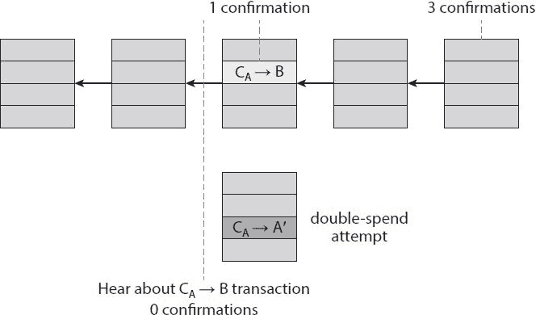
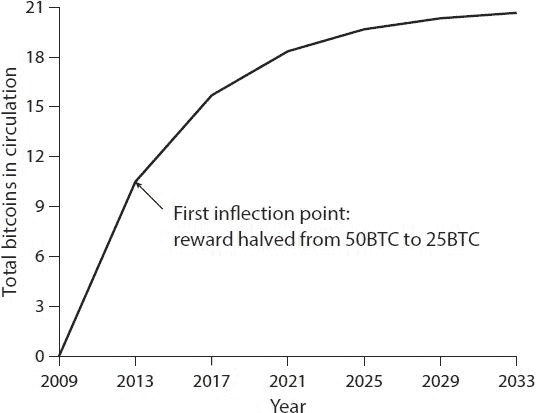
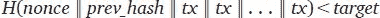
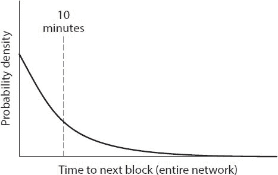

# 二、比特币如何实现去中心化

在这一章中，我们讨论比特币的去中心化。在第一章的[中，我们看了比特币背后的加密基础知识，并以一种叫做 Scroogecoin 的简单货币的描述结束。Scroogecoin 实现了我们在基于分类账的加密货币中想要的很多东西，但它有一个突出的问题——它依赖于一个集中的权威机构(Scrooge)。我们以如何去中心化或去吝啬鬼化这种货币的问题作为结束。回答这个问题是本章的重点。](part0007.html#6LJU0-ea268daff50b4c55a00d858ef79f4a6c)

当你通读本章时，请注意比特币实现去中心化的机制并不纯粹是技术性的——它是技术方法和聪明的激励工程的结合。到本章结束时，你应该对这种去中心化是如何实现的，以及更一般地说，比特币是如何工作的，为什么它是安全的，有了真正的理解。

**2.1。集权与分权**

去中心化是一个重要的概念，并不是比特币独有的。集中化与去中心化的竞争范例的概念出现在各种不同的数字技术中。为了更好地理解它在比特币中的表现，理解在各种其他背景下的核心冲突——这两种范式之间的紧张关系——是有用的。

一方面，我们有互联网，这是一个著名的去中心化系统，历史上它与“围墙花园”的替代品如 AOL 和 CompuServe 的信息服务竞争并获胜。然后是电子邮件，它的核心是一个基于简单邮件传输协议(SMTP)的分散系统，SMTP 是一个开放标准。尽管它确实有来自脸书或 LinkedIn mail 等专有信息系统的竞争，但电子邮件仍然是在线人际交流的默认方式。在即时消息和文本消息的情况下，我们有一个混合模型，不能被明确地描述为集中式或分散式。最后是社交网络:尽管爱好者、开发者和企业家做出了无数协同努力来创造主导的集中式模型的替代品，但像脸书和 LinkedIn 这样的集中式系统仍然主导着这个领域。事实上，这种冲突早在数字时代之前就存在了——在电话、广播、电视和电影的历史上，我们看到了这两种模式之间类似的斗争。

权力下放不是全有或全无；几乎没有一个系统是完全分散或完全集中的。例如，电子邮件基本上是一个基于标准协议 SMTP 的分散系统，任何人都可以操作自己的电子邮件服务器。然而，市场上发生的情况是，少数集中的网络邮件提供商已经成为主导。类似地，即使比特币协议是去中心化的，但像比特币交易所(你可以在那里将比特币转换成其他货币)和钱包软件(允许人们管理自己的比特币的软件)这样的服务可能会在不同程度上被集中或去中心化。

考虑到这一点，让我们将比特币协议如何实现去中心化的问题分解为五个更具体的问题:

1.谁维护交易分类账？

2.谁有权决定哪些交易是有效的？

3.谁创造了新的比特币？

4.谁来决定系统的规则如何变化？

5.比特币是如何获得交换价值的？

前三个问题反映了比特币协议的技术细节——这三个问题是本章的重点。

比特币的不同方面落在集中/分散光谱的不同点上。首先，点对点网络几乎是完全去中心化的，因为任何人都可以运行一个比特币节点，而且准入门槛相当低。你可以上网轻松下载比特币客户端，在笔记本电脑或台式机上运行一个节点。目前有几千个这样的节点。第二，我们在[2.4 节](part0008.html#sec2_4)研究的比特币*挖矿*，技术上也是对任何人开放的，但是需要很高的资金成本。因此，比特币挖矿生态系统具有高度的集权或权力集中。比特币社区的许多人认为这是非常不可取的。第三，比特币节点运行软件更新，这关系到系统规则如何以及何时改变。可以想象，该协议有许多可互操作的实现，就像电子邮件一样。但实际上，大多数节点运行的是参考实现，其开发人员受到社区的信任，拥有很大的权力。

2.2**。分布式共识**

我们已经一般性地讨论了集权和分权。现在让我们从更技术性的层面来研究比特币的去中心化。在整个讨论中出现的一个关键术语是*共识*，特别是*分布式共识*。构建分布式电子现金系统要解决的关键技术问题是实现分布式共识。直觉上，你可以认为我们的目标是去中心化 Scroogecoin，在第 1 章中讨论的假想货币。

分布式共识具有各种应用，并且在计算机科学中已经研究了几十年。传统的激励应用是分布式系统中的可靠性。假设你负责一家大型社交网络公司的后端，比如脸书。这种类型的系统通常有数千甚至数百万台服务器，它们共同构成一个巨大的分布式数据库，记录系统中发生的所有行为。每条信息都必须记录在这个后端的几个不同的节点上，并且这些节点必须对系统的整体状态保持同步。

拥有分布式共识协议的意义远远超出了这种传统的应用。如果我们有这样一个协议，我们可以用它来构建一个大规模的分布式键值存储，将任意键或名称映射到任意值。反过来，分布式键值存储将支持许多应用程序。例如，我们可以用它来构建一个分布式域名系统，它只是人类可以理解的域名和 IP 地址之间的映射。我们可以构建一个公钥目录，它是电子邮件地址(或者其他形式的真实身份)和公钥之间的映射。

这是什么是分布式共识的直觉，但提供一个技术定义是有用的，因为这将帮助我们确定一个给定的协议是否满足要求。

*分布式共识协议*。有 *n* 个节点，每个节点都有一个输入值。这些节点中的一些是有缺陷的或恶意的。分布式共识协议具有以下两个属性:

它必须在所有诚实节点都同意该值的情况下终止。

该值必须由诚实的节点生成。

在比特币的背景下，这意味着什么？要了解分布式共识在比特币中的工作原理，请记住比特币是一个点对点系统。当 Alice 要向 Bob 付款时，她实际做的是向组成对等网络的所有比特币节点广播一次交易([图 2.1](part0008.html#fig2_1) )。

顺便说一句，你可能已经注意到，Alice 向所有比特币对等节点广播交易，但 Bob 的计算机不在此图中。当然有可能 Bob 正在运行对等网络中的一个节点。事实上，如果他想被告知交易确实发生了，并且他已经得到了付款，那么运行一个节点可能是一个好主意。然而，不要求 Bob 在网络上监听；Bob 并不需要运行一个节点来接收资金。无论他是否在网络上操作一个节点，比特币都将是他的。


图 2.1。广播交易。为了支付鲍勃，爱丽丝将交易广播到整个比特币对等网络。

比特币网络中的节点究竟想要达成什么共识？假设各种用户正在向网络广播这些事务，则节点必须就广播了哪些事务以及这些事务发生的顺序达成一致。这将为系统生成一个单一的全局分类账。回想一下，在 Scroogecoin 中，为了优化，我们将事务放入块中(参见[第 1.5 节](part0007.html#sec1_5))。类似地，在比特币中，共识是逐块形成的。

因此，在任何给定的时间点，对等网络中的所有节点都有一个由一系列块组成的分类帐，每个块都包含一个它们已经达成共识的交易列表。此外，每个节点都有一个已听说但尚未包括在区块链中的未完成事务池。对于这些事务，还没有达成一致，因此根据定义，每个节点可能有一个稍微不同的未完成事务池版本。实际上，这是因为对等网络并不完美，所以一些节点可能已经听说了其他节点还没有听说的事务。

节点究竟是如何在一个块上达成一致的？一种方法如下。以规则的间隔(例如，每 10 分钟)，系统中的每个节点提议将其自己的未完成事务池包括在下一个块中。然后，节点执行某种共识协议，其中每个节点的输入都是它自己提出的块。现在，一些节点可能是恶意的，将无效的事务放入它们的块中，但是我们可以假设其他节点是诚实的。如果共识协议成功，将选择有效的块作为输出。即使选定的块仅由一个节点提出，只要该块有效，它就是有效的输出。现在可能有一些有效的未完成事务没有包含在块中，但这不是问题。如果某个事务由于某种原因没有进入这个特定的块，它可以等待并进入下一个块。

这种方法与比特币的工作方式有些相似，但并不完全如此。这种方法有几个技术问题。首先，共识通常是一个困难的问题，因为节点可能会崩溃或完全是恶意的。其次，特别是在比特币的背景下，网络是高度不完善的。这是一个对等系统，并非所有节点对都相互连接。例如，由于较差的互联网连接，网络中可能存在故障，因此运行所有节点都必须参与的一致协议实际上是不可能的。最后，系统中有很多延迟，因为它分布在互联网上。

**延迟和全局时间**

比特币协议必须在两种障碍面前达成共识:网络的不完善(如延迟和节点崩溃)和一些节点故意试图颠覆这一过程。

这种高延迟的一个特殊后果是没有全局时间的概念。因此，并不是所有的节点都可以简单地根据观察时间戳就事件的共同顺序达成一致。因此，共识协议不能包含以下形式的指令:“在步骤 1 中发送第一条消息的节点必须在步骤 2 中执行 *x* 这是行不通的，因为不是所有的节点都同意在协议的第一步先发送哪条消息。

不可能的结果

全局时间的缺乏严重限制了可用于共识协议的算法集。事实上，由于这些限制，许多关于分布式共识的文献都有些悲观，许多不可能的结果已经被证明。一个著名的不可能结果与拜占庭将军问题有关。在这个经典问题中，拜占庭军队被分成几个师，每个师由一名将军指挥。将军们通过信使沟通以制定联合行动计划。一些将军可能是叛徒，并可能故意试图颠覆这一进程，使忠诚的将军们无法达成统一的计划。这个问题的目标是让所有忠诚的将军达成相同的计划，而卖国的将军不能导致他们采用一个糟糕的计划。事实证明，如果三分之一或更多的将军是叛徒，这是不可能实现的。

一个更加微妙的不可能性结果，是 Fischer-Lynch-Paterson 的不可能性结果。在某些条件下，包括节点以确定的方式行动，他们证明了即使只有一个错误的过程也不可能达成一致。

尽管有这些不可能的结果，文献中还是有一些一致的协议。这些协议中最著名的一个是 Paxos。Paxos 做出了某些妥协。一方面，它不会产生不一致的结果。另一方面，它接受在某些情况下——尽管是罕见的情况——该议定书可能无法取得任何进展的权衡。

打破传统假设

但是有一个好消息:这些不可能的结果被一个特定的模型所证明。他们的目的是研究分布式数据库，这个模型并不能很好地适用于比特币环境，因为比特币违反了模型中的许多假设。在某种程度上，这些结果告诉我们更多的是关于这个模型，而不是分布式共识的问题。

具有讽刺意味的是，在目前的研究状态下，比特币的共识在实践中比在理论上更有效。也就是说，我们观察到共识在起作用，但还没有发展出理论来完全解释它为什么起作用。但发展这样一个理论是重要的，因为它可以帮助我们预测不可预见的攻击和问题，只有当我们对比特币共识如何工作有了强有力的理论理解，我们才能对比特币的安全和稳定有强有力的保证。

比特币违背了传统共识模型中的哪些假设？首先，它引入了激励的概念，这对于分布式共识协议来说是新颖的。这只有在比特币中才有可能，因为它是一种货币，因此有一种天然的机制来激励参与者诚实行事。所以比特币并没有完全解决一般意义上的分布式共识问题，但它在一个货币体系的特定背景下解决了这个问题。

其次，比特币包含了随机性的概念。正如我们将在接下来的两节中看到的，比特币的共识算法在很大程度上依赖于随机化。此外，它摒弃了共识的具体起点和终点的概念。相反，达成一致需要很长时间，在实际系统中大约一个小时。但即使在这段时间结束时，节点也不能确定任何特定的交易或块已经进入分类账。相反，随着时间的推移，你对任何一个板块的看法与最终的一致看法相吻合的可能性会增加，而意见分歧的可能性会呈指数下降。模型中的这些差异是比特币如何绕过分布式共识协议的传统不可能性结果的关键。

**2.3。没有身份认同的共识使用区块链**

在本节中，我们将研究比特币共识算法的技术细节。回想一下，比特币节点没有持久、长期的身份。这是与传统分布式共识算法的另一个区别。缺乏持久身份的一个原因是，在对等系统中，没有一个中央机构来为参与者分配身份，并验证他们没有随意创建新节点。专业术语称之为*茜玻病毒攻击*。Sybils 只是节点的副本，恶意对手可以创建这些节点，使其看起来好像有许多不同的参与者，而实际上所有这些伪参与者都是由同一个对手控制的。另一个原因是，假名本来就是比特币的一个目标。即使为所有节点或所有参与者建立身份是可能的或容易的，我们也不一定想要这样做。虽然比特币没有强大的匿名保证，因为人们进行的不同交易往往可以联系在一起，但它确实具有这样的属性，即没有人被迫透露他们的真实身份(例如，他们的姓名或 IP 地址)来参与。这是比特币设计的一个重要属性和核心特征。

如果节点有标识，设计会更容易。首先，身份将允许我们输入协议指令的形式，“现在，具有最小数字 ID 的节点应该采取一些步骤。”如果没有身份，可能的指令集会受到更多的限制。但是第二个更严重的原因是，节点拥有身份是为了安全。如果节点被识别，并且创建新的节点标识并不容易，那么我们可以假设恶意节点的数量，并且我们可以基于这些数量推导出安全属性。出于这两个原因，身份的缺乏给比特币的共识协议带来了困难。

我们可以通过做一个更弱的假设来弥补身份的缺失。假设有某种能力在系统中选择一个随机的节点。一个很好的激励类比是彩票或抽彩，或任何数量的现实生活中的系统，其中很难跟踪人们，给他们身份，并验证这些身份。在这种情况下，我们会发放代币、门票或类似的东西。这使我们能够在以后选择一个随机的令牌 ID，并访问该 ID 的所有者。因此，目前来说，不妨大胆假设一下，以这种方式从比特币网络中随机挑选一个节点是可能的。现在进一步假设，这种用于令牌生成和分发的算法足够智能，使得如果对手试图创建许多 Sybil 节点，所有这些 Sybil 一起将只获得一个令牌。因此，对手不能通过创建新的节点来增加他的力量。如果你认为这是一个很大的假设，不要担心。在[第 2.4 节](part0008.html#sec2_4)中，我们去除了这些假设，详细展示了等价于这些的属性是如何在比特币中实现的。

隐性共识

这种随机节点选择的假设使得我们称之为*隐性共识*的东西成为可能。在我们的协议中有多个回合，每个回合对应于区块链中的不同区块。在每一轮中，随机选择一个节点，这个节点可以提出链中的下一个块。没有选择区块的一致算法，也没有任何形式的投票。被选择的节点单方面提议区块链中的下一个块将是什么。但是如果那个节点是恶意的呢？嗯，有一个处理这个问题的过程，但这是一个隐含的过程。其他节点将通过选择是否在其上构建来隐含地接受或拒绝该块。如果它们接受该块，它们将通过扩展区块链并包括被接受的块来发出它们接受的信号。相反，如果他们拒绝那个区块，他们会通过忽略那个区块并建立在他们接受的前一个区块上来扩展链。回想一下，每个块都包含它所扩展的块的散列。这是一种技术机制，允许节点用信号通知它们正在扩展哪个块。

*比特币共识算法(简体*)。该算法被简化，因为它假设能够以不容易受到 Sybil 攻击的方式选择随机节点。

1.新事务被广播到所有节点。

2。每个节点将新事务收集到一个块中。

3.在每一轮中，一个*随机*节点开始广播它的块。

4.只有当块中的所有事务都有效(未用完的有效签名)时，其他节点才接受该块。

5.节点通过在它们创建的下一个块中包含该块的散列来表示它们接受该块。

现在我们来分析一下为什么这个共识算法有效。要做到这一点，考虑一个恶意的对手——叫她爱丽丝——如何能够颠覆这个过程。

盗取比特币

爱丽丝可以在她不控制的地址简单地窃取属于另一个用户的比特币吗？不会。即使轮到爱丽丝提出链中的下一个区块，她也不能窃取其他用户的比特币。这样做需要 Alice 创建一个有效的交易来花费硬币。这将要求 Alice 伪造所有者的签名，如果使用安全的数字签名方案，她就不能这样做。因此，只要底层加密技术是可靠的，她就不能简单地窃取比特币。

拒绝服务攻击

让我们考虑另一次攻击。假设 Alice 确实不喜欢某个其他用户 Bob。然后，Alice 可以决定，在她打算放入区块链的任何块中，她将不包括源自 Bob 地址的任何事务。换句话说，她拒绝为鲍勃服务。尽管这是 Alice 可以尝试发起的有效攻击，幸运的是这只是一个小麻烦。如果 Bob 的事务没有进入 Alice 建议的下一个块，他将一直等到一个诚实的节点有机会提出一个块，然后他的事务将进入该块。所以这也不是一个好的攻击。

双重花费攻击

Alice 可能会尝试发起一次双花费攻击。为了理解这是如何工作的，让我们假设 Alice 是 Bob 经营的一些在线商家或网站的客户，Bob 提供一些在线服务以换取比特币支付。假设 Bob 的服务允许下载一些软件。这就是双重消费攻击的工作原理。Alice 在 Bob 网站的购物车中添加了一件商品，服务器要求付款。然后，Alice 从她的地址到 Bob 的地址创建了一个比特币交易，并将其广播到网络。假设某个诚实的节点创建了下一个块，并将该事务包含在该块中。因此，现在有一个由诚实节点创建的块，它包含一个代表从 Alice 到商家 Bob 的付款的事务。

回想一下，事务是一个数据结构，它包含 Alice 的签名、支付 Bob 公钥的指令和一个散列。这个散列表示一个指针，指向 Alice 收到并正在花费的前一个事务输出。该指针必须引用共识链中某个先前块中包含的事务。

顺便说一下，注意这里有两种不同类型的散列指针很容易混淆。块包括指向它们正在扩展的前一个块的散列指针。交易包括一个或多个指向正在兑换的先前交易输出的散列指针。

让我们回到爱丽丝如何发动双花攻击。最新的块由诚实的节点生成，并且包括 Alice 为软件下载向 Bob 付款的交易。在看到区块链中包含的交易时，Bob 断定 Alice 已经向他付款，并允许 Alice 下载软件。假设在下一轮中选择的下一个随机节点恰好由 Alice 控制。因为 Alice 可以提议下一个块，所以她可以提议忽略包含向 Bob 付款的块，而是包含指向前一个块的指针。此外，在她提议的块中，Alice 包括一个事务，该事务将她发送给 Bob 的硬币转移到她自己控制的不同地址。这是典型的双重消费模式。由于这两笔交易花费相同的硬币，因此只有其中一笔可以计入区块链。如果 Alice 成功地将付款包含到她自己在区块链的地址中，那么她向 Bob 付款的交易是无用的，因为它永远不会包含在以后的区块链中([图 2.2](part0008.html#fig2_2) )。


图 2.2。双重花费的尝试。Alice 创建了两个交易:一个是她向 Bob 发送比特币，另一个是她通过将这些比特币发送到她控制的另一个地址来进行双倍消费。由于他们花的是同样的比特币，这些交易中只有一笔可以纳入区块链。块之间的箭头是从一个块到前一个块的指针，它通过在其自己的内容中包括前一个块的散列来扩展该指针。C [A] 用来表示爱丽丝拥有的硬币。

我们如何知道这种双重花费的尝试是否会成功？嗯，这取决于哪个块将最终出现在长期共识链上——具有 Alice → Bob 事务的块还是具有 Alice → Alice 事务的块。是什么决定了将包括哪个块？诚实节点遵循延长最长有效分支的策略，那么它们会延长哪个分支呢？没有正确答案！在这一点上，两个分支的长度是相同的——它们只是在最后一个块上不同，这两个块都是有效的。选择下一个块的节点可能会决定在其中任何一个块上进行构建，这一选择将在很大程度上决定双花费攻击是否成功。

微妙的一点:从道德的角度来看，包含支付 Bob 的交易的块和包含 Alice double 花费这些硬币到她自己的地址的交易的块之间有明显的区别。但是这种区别仅仅是基于我们对爱丽丝先付钱给鲍勃，然后试图双倍消费的故事的了解。然而，从技术的角度来看，这两个交易是相同的，并且两个区块同样有效。看到这个的节点真的没有办法分辨哪个是道德上合法的交易。

实际上，节点通常遵循扩展它们首先在对等网络上检测到的块的试探。但这不是一个固定的规则。在任何情况下，由于网络延迟，节点首先检测到的数据块很可能就是第二个创建的数据块。因此，至少有一些机会，被选择来提出块的下一个节点将扩展包含双重花费的块。Alice 可以通过贿赂下一个节点来进一步尝试增加这种情况发生的可能性。如果下一个节点由于某种原因建立在双花费块上，那么这个链将比包含 Bob 事务的链更长。在这一点上，下一个诚实的节点更有可能继续建立在这个链上，因为它更长。这一过程将继续下去，包含双重支出的部分将越来越有可能成为长期共识链的一部分。相比之下，包含 Bob 的事务的块完全被网络忽略——它现在被称为陈旧块或*孤儿块*。

现在让我们从商人鲍勃的角度重新考虑这种情况([图 2.3](part0008.html#fig2_3) )。理解 Bob 如何保护自己免受这种双重消费攻击是理解比特币安全性的关键部分。当 Alice 向 Bob 广播代表其付款的事务时，Bob 正在网络上监听，甚至在创建下一个块之前就听到了该事务。如果 Bob 比我们之前描述的更有勇无谋，他可以在网站上完成结帐过程，并允许 Alice 在那一刻下载软件。这叫做*零确认交易*。这导致了比之前描述的更基本的双重花费攻击。以前，对于发生的双重花费攻击，我们必须假设恶意参与者控制了提出下一个块的节点。但是如果 Bob 允许 Alice 在交易在区块链上接收到甚至一个确认之前下载软件，那么 Alice 可以立即广播一个双花费交易，并且一个诚实的节点可以将其包括在下一个块中，而不是支付 Bob 的交易中。



图 2.3。鲍勃商人的观点。从鲍勃的角度来看，这就是爱丽丝的双重消费企图。为了保护自己免受这种攻击，Bob 应该等到 Alice 向他付款的交易包含在区块链中并有若干确认后再释放商品。

然而，一个谨慎的商人不会将软件发布给爱丽丝，即使在交易被包括在一个块中之后；他会继续等待。如果 Bob 看到 Alice 成功地发起了双花费攻击，他意识到包含 Alice 对他的付款的块已经被孤立了。他应该放弃交易，不让爱丽丝下载软件。相反，如果尽管进行了双重花费尝试，但接下来的几个节点仍在具有 Alice → Bob 事务的块上构建，那么 Bob 会确信该事务将在长期共识链上。

一般来说，一笔交易得到的确认越多，它最终进入长期共识链的可能性就越大。回想一下，诚实节点总是扩展它们找到的最长的有效分支。随着较长分支比任何其他分支都长，具有双重支出的较短分支赶上较长分支的机会变得越来越小。如果只有少数节点是恶意的，这种情况尤其如此——对于一个较短的分支来说，必须连续挑选几个恶意节点。

事实上，重复消费的概率随着确认次数的增加而呈指数下降。因此，如果你感兴趣的交易已经收到了 *k* 个确认，那么一个双重花费交易最终出现在长期共识链上的概率会随着 *k* 的变化而呈指数下降。比特币生态系统中最常用的启发式方法是等待六次确认。数字 6 没有什么特别的。这只是在你必须等待的时间和你保证你感兴趣的交易最终在区块链共识上的一个很好的权衡。

概括地说，针对无效交易的保护完全是加密的。但它是由共识强制执行的，这意味着如果节点确实试图包括密码无效的事务，则该事务不会在长期共识链中结束的唯一原因是因为大多数节点是诚实的，不会在区块链中包括无效事务。相比之下，防止双重支出纯粹是一致同意的。密码学对此无话可说，从密码学的角度来看，两个代表双重花费企图的交易都是有效的。但是是共识决定了哪一个会在长期的共识链上结束。最后，您永远无法百分之百确定您感兴趣的事务在共识分支上。但这种指数概率保证相当不错。在大约六次交易之后，你几乎没有被欺骗的可能。

2.4**。奖励和工作证明**

在上一节中，我们基本了解了比特币的共识算法，并对我们为什么相信它是安全的有了一个很好的直觉。但回想一下本章开头的内容，比特币的去中心化部分是技术机制，部分是巧妙的激励工程。到目前为止，我们主要着眼于技术机制。现在我们来谈谈比特币内置的激励工程。

我们之前要求你大胆假设我们能够随机选择一个节点，也许更有问题的是，至少有 50%的情况下，这个过程会选择一个诚实的节点。如果参与者有财务激励来颠覆过程，这种诚实的假设就特别有问题，在这种情况下，我们不能真正假设一个节点会诚实。那么问题就变成了:我们能给节点一个诚实行为的激励吗？

再次考虑一次确认后的双重花费尝试(参见[图 2.2](part0008.html#fig2_2) )。我们能以某种方式惩罚创建了双花费事务块的节点吗？不完全是。如前所述，很难知道哪个是道德上合法的交易。但即使我们做到了，仍然很难惩罚节点，因为它们没有身份。因此，让我们把问题反过来问:我们能奖励每一个创造了最终出现在长期共识链上的模块的节点吗？好吧，再说一遍，因为这些节点不会暴露他们的真实身份，我们不能把现金邮寄到他们的家庭地址。如果有某种我们可以使用的数字货币就好了…你可能会明白它的发展趋势。我们将使用比特币来激励创建这些区块的节点。

让我们暂停一下。到目前为止，所描述的一切都只是实现分布式共识的抽象算法，并不特定于应用程序。现在，我们将利用这样一个事实，即我们通过这种分布式共识过程构建的应用程序实际上是一种货币。具体来说，我们将通过以这种货币为单位向节点支付报酬来激励节点诚实行事。

街区奖励

这是怎么做到的？比特币使用两种独立的激励机制。首先是*格挡奖励*。根据比特币的规则，创建区块的节点可以在该区块中包含特殊交易。该事务是一个硬币创建事务，类似于 Scroogecoin 中的 CreateCoins，节点还可以选择该事务的接收方地址。当然，该节点通常会选择属于自己的地址。你可以认为这是对节点的一种支付，以换取在共识链上创建一个区块的服务。

截至 2015 年，区块奖励值固定为 25 个比特币。但实际上每创建 210，000 个块，它就会减半。根据块创建的速率，该速率大约每四年减半。我们现在处于第二阶段。比特币存在的前四年，区块奖励是 50 个比特币；现在是 25。而且还会继续减半。这产生了一些有趣的结果，我们将在下面讨论。

你可能想知道为什么街区奖励激励诚实的行为。根据我们到目前为止所说的，这个节点可能会得到块奖励，而不管它是提出一个有效的块还是恶意行为。但这不是真的！想一想——这个节点将如何收集它的奖励？这种情况只会发生在有问题的区块最终出现在长期共识分支上的情况下，因为就像所有其他事务一样，创造硬币的事务只有在最终出现在共识链上时才会被其他节点接受。这是这个激励机制背后的关键思想。这是一个微妙但强大的技巧。它激励节点以他们认为会让其他节点扩展其块的任何方式来行为。因此，如果网络的大部分都遵循最长有效分支规则，它会激励所有节点继续遵循该规则。那是比特币的第一个激励机制。

我们提到，每 210，000 个区块(或大约四年)，区块奖励减半。在[图 2.4](part0008.html#fig2_4) 中，这条曲线的斜率将保持减半。这是一个几何级数，你可能知道这意味着这种机制创造的比特币数量是有限的。总共有 2100 万个比特币。

请注意，这是创造新比特币的唯一方式。没有其他的硬币生成机制，这就是为什么 2100 万是一个最终的总数(至少按照目前的规则),可以有多少比特币。就目前的情况来看，这种集体奖励将在 2140 年用完。这是否意味着系统将在 2140 年停止工作，变得不安全，因为节点不再有诚实行为的激励？不完全是。区块奖励只是比特币两种激励机制中的第一种。

交易费用

第二个激励机制是*交易费*。任何交易的创建者可以选择使交易输出的总价值小于其输入的总价值。无论是谁创建的区块，首先将该交易放入区块链，都可以收取差价，这相当于一笔交易费。因此，如果您是一个节点，正在创建一个包含 200 笔交易的块，那么这 200 笔交易费用的总和将支付到您放入该块的地址。交易费完全是自愿的，但是我们希望，基于我们对系统的理解，随着块奖励开始用完，用户包括交易费以保持合理的服务质量将变得越来越重要，几乎是强制性的。在某种程度上，这种情况现在已经开始发生了。但目前还不清楚该系统将如何发展；这真的取决于很多博弈论，还没有完全研究出来。这是比特币开放研究的一个有趣领域。



图 2.4。比特币随时间的总供给。块奖励每 4 年减半，将比特币的总供应量限制在 2100 万。这是一个简化的模型，实际曲线看起来略有不同，但它具有相同的 2100 万限制。

这里描述的共识机制仍然存在一些问题。第一个主要的是我们要求你们采取的信念的飞跃，我们可以选择一个随机的节点。第二，我们通过给节点这些参与的激励创造了一个新的问题。这个系统可能会变得不稳定，因为激励措施导致了一场混战，每个人都想经营一个比特币节点，希望获得一些回报。第三个是这个问题的一个更加棘手的版本:一个对手可能会创建大量的 Sybil 节点，试图破坏共识过程。

挖矿和工作证明

这些问题都是有联系的，都有相同的解决方法，叫做*工作证明*。工作证明背后的关键思想是，我们通过按比例选择节点来近似选择随机节点，我们希望没有人可以垄断资源。例如，如果这种资源是计算能力，那么它就是一个工作验证系统。或者，它可以与货币的所有权成比例，，这就是所谓的*股权证明*。虽然没有在比特币中使用，但股权证明是一种合法的替代模型，用于其他加密货币。我们将在第 8 章的[中看到更多关于股权证明和其他工作证明的变体。](part0014.html#DB7S0-ea268daff50b4c55a00d858ef79f4a6c)

但是回到工作证明。让我们来澄清一下按计算能力比例选择节点是什么意思。这可以被认为是允许节点通过使用它们的计算能力来彼此竞争，这将导致节点被自动地按该能力的比例挑选。对工作证明的另一种看法是，我们正在使创造新的身份变得相当困难。这是一种身份创造税，因此也是 Sybil 攻击税。这可能看起来有点模糊，所以让我们看看比特币中使用的工作证明系统的细节，这应该可以澄清这个概念。

比特币利用*哈希难题*实现工作证明。为了创建一个块，提出该块的节点需要找到一个数(nonce 参见[第 1.1 节](part0007.html#sec1_1))，这样，当您将 nonce、之前的 hash 和组成块的事务列表连接起来，然后获取整个字符串的 hash 时，那么 hash 输出应该是一个落在目标空间中的数字，该目标空间相对于该 hash 函数的大得多的输出空间而言非常小。我们可以将这样的目标空间定义为低于某个目标值的任何值。在这种情况下，随机数必须满足以下不等式:



正如我们已经看到的，通常一个块包含一系列节点正在提议的事务。此外，一个块还包含指向前一个块的散列指针。(我们不严格地使用术语“散列指针”。在这个上下文中，指针只是一个字符串，因为它不需要告诉我们在哪里可以找到这个块。我们可以通过向网络上的其他对等体请求来找到该块。重要的部分是散列，它既可以在向其他对等方请求块时充当 ID，也可以让我们在获得块后对其进行验证。)此外，我们现在要求一个块还包含一个 nonce。我们的想法是，让找到满足这一要求的 nonce 变得相当困难，也就是说，将整个块散列在一起，包括那个 nonce，将产生特定类型的输出。如果哈希函数满足第一章中的难题友好性，那么成功解决这个哈希难题的唯一方法就是一个接一个地尝试足够多的随机数，直到你走运。因此，具体来说，如果这个目标空间只是总输出空间的 1 %,那么在你有可能幸运之前，你将不得不尝试大约 100 个随机数。实际上，这个目标空间的大小远没有输出空间的 1%大。它比那个要小得多，我们很快就会看到。

哈希难题和工作证明的概念完全消除了魔术般地选择随机节点的需求。相反，节点只是一直在独立地竞争解决这些哈希难题。偶尔，他们中的一个会找到满足这个属性的随机随机数。然后那个幸运的节点开始提议下一个街区。通过这种方式，系统是完全分散的。没有人决定哪个节点可以提议下一个块。

难以计算

哈希难题有三个重要的特性。首先，它们需要很难计算。我们说中度困难，但是你会看到为什么这实际上随着时间而变化。截至 2015 年，难度级别超过每块 10 ^(20) 哈希。换句话说，目标空间的大小小于哈希函数输出空间大小的 1/10 ^(20) 。因此，搜索输出空间涉及大量的计算——例如，对于商用笔记本电脑来说，这是不可能的。正因为如此，只有一些节点甚至懒得在这个块创建过程中竞争。这个反复尝试并解决这些哈希难题的过程被称为*比特币挖掘*，参与的节点被称为*矿工*。尽管从技术上讲，任何人都可以成为矿工，但由于挖矿的高成本，权力已经集中在挖矿生态系统中。

可参数化成本

我们想要的第二个属性是成本应该是可参数化的，而不是永远固定的。这是通过让比特币对等网络中的所有节点每 2016 个块自动重新计算目标(即，目标空间的大小作为输出空间的一部分)来实现的。他们以这样一种方式重新计算目标，即比特币网络中连续产生的区块之间的平均时间约为 10 分钟。块之间的平均时间为 10 分钟，2，016 块相当于两周。换句话说，目标的重新计算大约每两周进行一次。

想想这意味着什么。假设你是一名矿工，你在比特币挖矿上投入了一定数量的硬件。但整体矿业生态系统正在增长，更多的矿工正在进入，或者他们正在部署越来越快的硬件，这意味着在两周内，将会发现比预期略多的区块。因此，节点将自动重新调整目标，并且您为找到一个块所做的工作量将会增加。因此，如果你在硬件上投资固定金额，你找到区块的速度实际上取决于其他矿商在做什么。一个非常好的公式抓住了这一点:任何给定的矿工 Alice 赢得下一个区块的概率相当于她控制的全局散列能力的一部分。因此，如果 Alice 的挖掘硬件约占总哈希能力的 0.1%，她将在每 1000 个块中找到大约一个。

这次调整的目的是什么？为什么我们要保持这 10 分钟不变呢？原因很简单。如果块靠得很近，那么效率会很低，我们会失去将许多事务放在一个块中的优化优势。数字 10 没有什么神奇的，如果你把 10 分钟变成 5 分钟，这个系统可能会工作得很好。关于替代硬币(替代加密货币)应该具有的理想阻塞延迟(T0)有很多讨论。但是，尽管对理想的延迟有一些分歧，每个人都同意它应该是一个固定的量。不能让它无限制地下降。这就是为什么比特币具有自动目标重新计算的功能。

**矿工行为的两种模式**

在分布式系统和计算机安全的研究领域中，通常假设一定比例的节点是诚实的，并且表明即使其他节点任意行为，系统也能按预期工作。这基本上就是我们在这里采用的方法，除了在计算多数时，我们通过散列能力对节点进行加权。最初的比特币白皮书也包含这种类型的分析。

但是博弈论领域提供了一种完全不同的——也可以说是更加复杂和现实的——方法来决定一个系统的行为。在这种情况下，我们不会将节点分为诚实节点和恶意节点。相反，我们假设*每个*节点根据它的激励行动。考虑到其他节点的潜在策略，每个节点选择一个(随机)策略来最大化其收益。如果协议和激励机制设计得好，那么大多数节点在大多数时间都会遵守规则。“诚实”的行为只是众多策略中的一种，我们并不特别重视它的道德重要性。

从博弈论的角度来看，最大的问题是默认的矿工行为是否是一个*纳什均衡*，也就是说，它是否代表了一种稳定的情况，在这种情况下，没有矿工可以通过偏离诚实的行为实现更高的回报。这个问题仍然有争议，是一个活跃的研究领域。

建立成本函数和工作证明的方式允许我们重新制定我们的安全假设。这就是我们最终离开我们之前要求你们采取的最后一次信心飞跃的地方。在节点甚至没有身份并且不清楚“诚实”是什么意思的情况下，我们现在可以明确地说，如果大多数矿工(通过哈希力量加权)遵守协议，即对比特币的许多攻击是不可行的，而不是假设大多数节点是诚实的。这是真的，因为如果通过散列功率加权的大多数挖掘者是诚实的，那么提议下一个块的竞争将自动确保至少 50%的机会，即在任何点上提议的下一个块来自诚实的节点。

解决哈希难题是概率性的，因为没有人能预测哪个随机数将解决哈希难题。解决这个难题的唯一方法是一个接一个地尝试随机数，并希望有一个成功。数学上，这个过程被称为伯努利试验。伯努利试验是一个有两种可能结果的实验，并且每种结果发生的概率在连续试验之间是固定的。这里，两个结果是(1)散列落在目标中，和(2)它没有。假设散列函数的行为类似于随机函数，那么这两种结果的概率是固定的。通常，节点尝试如此多的随机数，以至于伯努利试验(一个离散的概率过程)可以由称为*泊松过程*、的连续概率过程很好地近似，其中事件以恒定的平均速率独立发生。最终结果是，显示找到下一个块的时间的相对可能性的概率密度函数看起来像图 2.5 中的图表。



图 2.5。直到找到下一个块的时间的概率密度函数。

这被称为*指数分布*。如果现在已经找到了一个块，那么很快就会找到下一个块，比如说，在几秒钟或一分钟之内。也有一些小概率需要很长时间，比如说一个小时，才能找到下一个块。但总的来说，网络会自动调整难度，以便块间时间长期保持在 10 分钟的平均水平。注意[图 2.5](part0008.html#fig2_5) 显示了整个网络创建块的频率，而不管哪个矿工实际上找到了块。

如果你是一名矿工，你可能会对找到一个矿块需要多长时间感兴趣。这个概率密度函数是什么样子的？它将具有相同的形状，但在 *x* 轴上的比例不同。同样，它可以用一个很好的等式来表示。

对于特定矿工:


如果您拥有总网络哈希能力的 0.1%，该等式表明您将每 10，000 分钟(大约一周)发现一次数据块。不仅你的块间平均时间会很高，而且你发现的块间时间的方差也会很高。这会产生一些重要的后果，这些后果将在第 5 章中讨论。

核实起来很简单

现在我们转向这个工作证明函数的第三个重要属性:验证一个节点已经正确地计算了工作证明是微不足道的。即使它平均需要一个节点，10 ^(20) 试图找到一个使块散列低于目标的随机数，该随机数必须作为块的一部分发布。因此，对于任何其他节点来说，查看块内容、将它们全部散列在一起并验证输出小于目标值都是微不足道的。这是一个非常重要的特性，因为，它又一次让我们摆脱了集权。我们不需要任何中央权威机构来验证矿工们是否正确地完成了他们的工作。任何节点或任何挖掘器都可以立即验证由另一个挖掘器找到的块满足这个工作证明属性。

2.5**。将所有这些放在一起**

挖矿成本

现在让我们看看挖矿经济学。我们提到，作为一名矿工，运营成本相当高。在目前的难度水平下，找到一个单独的区块需要计算大约 10 个 ^(20 个)哈希，区块奖励大约是 25 个比特币，在目前的汇率下这是一笔相当大的金额。这些数字可以很容易地计算出挖矿是否有利可图，我们可以用一句简单的话来说明这个决定:

如果

*挖矿奖励>挖矿成本*

然后矿工就获利了

在哪里

*挖矿奖励=区块奖励+ tx 费用*

*开采成本=硬件成本+运营成本(电力、冷却等。)*

从根本上说，挖矿者从大宗报酬和交易费中获得挖矿报酬。矿工问自己，这些回报与总支出相比如何，总支出是硬件和电力成本。

但是这个简单的等式有一些复杂之处。首先，正如您可能已经注意到的，硬件成本是固定成本，而电力是随着时间推移而产生的可变成本。另一个复杂的问题是，矿工获得的奖励取决于他们找到块的速度，这不仅取决于他们硬件的能力，还取决于他们的散列率与总全局散列率的比率。第三个复杂因素是，矿工发生的成本通常以美元或其他传统货币计价，但他们的回报以比特币计价。因此，这个等式隐藏着对比特币在任何给定时间的汇率的依赖。最后，到目前为止，我们假设矿工对诚实地遵守协议感兴趣。但是挖掘者可能会选择使用其他挖掘策略，而不是总是试图扩展最长的有效分支。因此，这个等式并没有捕捉到矿工可以采用的不同策略的所有细微差别。实际上，分析它对我来说是否有意义是一个复杂的博弈论问题，不容易回答。

**没有一个比特币**

比特币不像美钞那样有固定的面额，特别是没有特别指定的“1 比特币”。比特币只是交易输出，在目前的规则下，可以有任意值到小数点后八位的精度。最小可能值是 0.00000001 BTC(比特币)，称为 1 *satoshi* 。

在这一点上，我们对比特币如何实现去中心化有了一个相当好的了解。为了更好地理解，我们现在回顾一下要点，并把它们放在一起。

先说身份。正如我们所知，现实世界的身份并不需要参与比特币协议。任何用户都可以在任何时候创建任意数量的假名密钥对。当爱丽丝想用比特币支付鲍勃时，比特币协议没有规定爱丽丝如何得知鲍勃的地址。鉴于这些假名密钥对是身份，交易基本上是广播到比特币对等网络的消息，这些消息是将硬币从一个地址转移到另一个地址的指令。比特币只是交易输出，我们将在[第三章](part0009.html#8IL20-ea268daff50b4c55a00d858ef79f4a6c)中更详细地讨论这一点。

比特币对等网络的目标是将所有新交易和新区块传播到所有比特币对等节点。但是网络是非常不完善的，并且尽最大努力传递这些信息。系统的安全性并不来自对等网络的完善。相反，安全性来自区块链和共识协议，这是我们在本章中花了很多时间研究的内容。

当我们说一笔交易包含在区块链中时，我们真正的意思是该交易已经实现了多次确认。在我们充分确信交易的包含性之前，确认的固定次数是不必要的，但是六次是常用的试探。交易收到的确认越多，您就越能确定该交易是共识链的一部分。孤儿块(没有进入共识链的块)经常出现。各种原因都可能导致块成为孤立块。该块可能包含无效的交易，或双重消费企图。孤儿也可能只是网络延迟的结果。也就是说，两个矿工可能仅仅在几秒钟之内就找到了新的区块。所以这两个块几乎同时在网络上广播，其中一个将不可避免地成为孤儿。

我们接下来看了哈希难题和挖掘。矿工是特殊类型的节点，它们决定在创建新区块的游戏中竞争。他们的努力会得到奖励，包括新铸造的比特币(区块奖励)和现有的比特币(交易费)，前提是其他矿工在他们的区块上建立。一个微妙但至关重要的点:假设爱丽丝和鲍勃是两个不同的矿工，爱丽丝的计算能力是鲍勃的 100 倍。这并不意味着 Alice 将永远赢得与 Bob 寻找下一个块的比赛。相反，Alice 和 Bob 找到下一个块的概率比为 100 比 1。从长远来看，Bob 平均会找到 Alice 找到的块数的 1%。

我们预计，矿商通常会接近经济均衡，因为他们在硬件和电力方面的支出将大致等于他们获得的回报。原因是如果一个矿工持续亏损，她可能会停止挖矿。相比之下，如果给定典型的硬件和电力成本，挖矿非常有利可图，那么更多的挖矿硬件将进入网络。增加的散列率会导致难度增加，每个矿工的预期奖励会下降。

这种分布式共识的概念弥漫在比特币中。在传统(法定)货币中，共识确实在一定程度上发挥了作用。具体来说，共识过程决定了货币的汇率。比特币当然也是如此。我们需要对比特币的价值达成共识。但是在比特币中，我们需要对账本的状态达成共识，这正是区块链所做的。换句话说，即使是计算你拥有多少比特币也需要一致同意。当我们说爱丽丝拥有一定数量或数目的比特币时，我们实际上的意思是，根据区块链的记录，比特币对等网络认为爱丽丝所有地址的总和拥有该数量的比特币。这就是比特币真理的终极本质:比特币的所有权无非是其他节点同意给定的一方拥有那些比特币。

最后，我们需要就系统的规则达成共识，因为这些规则有时不得不改变。比特币的规则有两种变化，分别被称为*软分叉*和*硬分叉*。我们将差异的详细讨论推迟到[第 3 章](part0009.html#8IL20-ea268daff50b4c55a00d858ef79f4a6c)和[第 7 章](part0013.html#CCNA0-ea268daff50b4c55a00d858ef79f4a6c)。

让加密货币落地

另一个微妙的概念是*自举*。比特币的三个不同概念之间发生了微妙的相互作用:区块链的安全、矿业生态系统的健康以及货币的价值。显然，我们希望区块链是安全的，这样比特币才能成为一种可行的货币。为了区块链的安全，对手不能压倒共识进程。这反过来意味着对手不能创建大量挖掘节点并承担 50%或更多的新数据块创建。

但是这些条件什么时候才能满足呢？一个先决条件是拥有一个健康的挖矿生态系统，这个生态系统由大部分诚实的、遵守协议的节点组成。但前提是什么——我们什么时候能确定很多矿工会投入大量的计算能力来参加这个哈希难题解决竞赛？只有当比特币的汇率相当高时，他们才会做出努力，因为矿工获得的奖励是以比特币计价的，而他们的支出是以美元计价的。因此，货币价值越高，这些矿商的积极性就越高。

但是，什么能确保货币的高而稳定的价值呢？只有用户普遍信任区块链的安全，这种情况才会发生。如果他们认为网络随时可能被攻击者摧毁，那么比特币作为货币就没有多少价值。因此，区块链的安全、健康的矿业生态系统和汇率之间存在着环环相扣的相互依存关系。

由于这种三向依赖的循环性质，其中每一方的存在都取决于其他方的存在。比特币刚产生的时候，这三个条件都不满足。当时除了中本聪本人没有矿工在运行挖矿软件(见前言)。比特币作为一种货币没有太多价值。事实上，区块链是不安全的，因为没有太多的挖矿在进行，任何人都可以轻易地压倒这一进程。

没有简单的解释可以解释比特币是如何从没有上述任何一种属性变成拥有所有三种属性的。媒体的关注是故事的一部分——人们对比特币了解得越多，他们对挖矿就越感兴趣。他们对挖矿越感兴趣，人们对区块链的安全就越有信心，因为那时会有更多的挖矿活动在进行，等等。顺便说一句，每一个想要成功的新 altcoin 都必须以某种方式解决这个问题。

51%的攻击

最后，让我们考虑一下，如果共识失败，事实上有一个*51%的攻击者*(控制比特币网络中大多数挖矿力量的人)会发生什么。我们将考虑各种可能的攻击，看看哪些攻击实际上可以由这样的攻击者实施。

首先，这个攻击者能从一个现有的地址偷硬币吗？正如您可能已经猜到的，答案是否定的，因为从现有地址窃取是不可能的，除非您颠覆了加密技术。颠覆共识过程还不够。这不是完全显而易见的。假设 51%的攻击者创建了一个包含无效交易的无效块，该无效交易试图从攻击者不控制的现有地址窃取比特币，并将其转移到自己的地址。攻击者可以假装这是一个有效的交易，并继续在此基础上构建。他甚至可能成功地使这个木块成为最长树枝的一部分。但是其他诚实的节点根本不会接受这个具有无效事务的块，而是会基于它们在网络中找到的最后一个有效块来继续挖掘。因此，链条中会出现一个分叉。

现在从攻击者的角度来想象一下，攻击者试图花费这些无效硬币，并将它们发送给某个商人 Bob，作为对商品或服务的支付。鲍勃自己大概也在运营一个比特币节点，而且会是一个诚实的节点。Bob 的节点将拒绝该分支，因为它包含无效的事务。它已被确定为无效，因为签名未经核实。因此 Bob 的节点将简单地忽略最长的分支，因为它是一个无效的分支。正因为如此，颠覆共识是不够的。你要颠覆密码学才能偷到比特币。因此我们得出结论，这种攻击对于 51%的攻击者来说是不可能的。

注意，这只是一个思想实验。事实上，如果有 51%攻击的实际迹象，可能发生的情况是开发人员会注意到它并做出反应。他们会更新比特币软件，我们可能会预计系统的规则，包括点对点网络，可能会发生变化，使这种攻击更难成功。但是我们不能完全预测。因此，我们在一个简化的模型中工作，其中发生了 51%的攻击，但没有对系统规则进行任何更改或调整。

让我们考虑另一次攻击。51%的攻击者能抑制一些交易吗？假设攻击者非常不喜欢某个用户 Carol。攻击者知道 Carol 的一些地址，并且想要确保属于这些地址中任何一个地址的硬币都不能被花费。这可能吗？由于攻击者控制了区块链的一致同意过程，他可以简单地拒绝创建任何包含来自 Carol 地址之一的事务的新块。攻击者可以进一步拒绝在包含此类事务的块上进行构建。然而，他不能阻止这些交易被广播到对等网络，因为网络不依赖于区块链或共识，并且我们假设攻击者不完全控制网络。攻击者无法阻止事务到达大多数节点，因此即使攻击成功，至少也很明显攻击正在发生。

攻击者可以改变格挡奖励吗？也就是说，攻击者可以开始假装块奖励是，而不是 25 个比特币，比如说，100 个比特币吗？这是对系统规则的改变，因为攻击者不控制所有诚实节点正在运行的比特币软件的副本，所以这也是不可能的。原因类似于解释为什么攻击者不能包括无效的事务。其他节点根本不会意识到块奖励的增加，因此攻击者将无法使用它们。

最后，攻击者能否以某种方式摧毁人们对比特币的信心？好吧，让我们想象一下会发生什么。如果有各种重复花费的尝试，节点没有扩展最长有效分支的情况，以及其他尝试的攻击，那么人们可能会决定比特币不再充当他们可以信任的分散账本。他们会对比特币失去信心，我们可能会预计比特币的汇率会暴跌。事实上，如果知道一方控制了 51%的哈希力量，那么人们可能会对比特币失去信心，即使攻击者不一定试图发动任何攻击。因此，51%的攻击者以任何方式摧毁对货币的信心不仅是可能的，而且事实上是可能的。事实上，如果 51%的攻击成为现实，这是主要的实际威胁。考虑到对手攻击比特币并获得 51%的多数席位所需的支出，我们描述的其他攻击从金融角度来看都没有意义。

希望在这一点上，你理解了去中心化是如何在比特币中实现的。你应该很好地掌握身份在比特币中是如何工作的，交易是如何传播和验证的，点对点网络在比特币中的作用，区块链是如何用于达成共识的，以及哈希谜题和挖掘是如何工作的。这些概念为理解比特币的许多更微妙的细节和细微差别提供了坚实的基础和良好的切入点，我们将在后续章节中看到。

**延伸阅读**

比特币白皮书是:

```
Nakamoto, Satoshi. “Bitcoin: A Peer-to-Peer Electronic Cash System.” 2008\. Available at https://bitcoin.org/bitcoin.pdf.
```

工作证明的最初应用是:

```
Back, Adam. “Hashcash—A Denial of Service Counter-measure.” 2002\. Available at http://www.hashcash.org/papers/hashcash.pdf.
```

共识的 Paxos 算法是:

```
Lamport, Leslie. “Paxos Made Simple.” *ACM Sigact News* 32(4), 2001: 18–25.
```