# 六、比特币和匿名

比特币是一种安全匿名的数字货币。
*—维基解密捐款页面*

比特币不会让你躲过美国国家安全局的窥探。
*—有线英国*

比特币最有争议的一点是其所谓的匿名性。第一，比特币匿名吗？正如你从上面相互矛盾的引用中所看到的，这里有一些混乱。其次，我们*想要*一种真正匿名的加密货币吗？匿名有利有弊，这引出了更基本的问题:拥有一种匿名的加密货币对利益相关者有利吗？对社会有好处吗？有没有一种方法可以隔离匿名的积极面，同时去除消极面？

这些问题很难回答，因为它们部分取决于一个人的伦理价值观。在这一章中，我们不会回答这些问题，尽管我们会研究支持和反对匿名的论点。大多数情况下，我们坚持研究各种旨在提高比特币匿名性的技术——有些已经出现在比特币中，有些则被提议作为补充。我们还研究了匿名性不同于比特币的替代加密货币的提议。这些技术提出了新的问题:它们的效果如何？收养他们会有多难？采用它们需要做哪些权衡？

6.1**。匿名基础知识**

定义匿名

在我们能够恰当地讨论比特币是否匿名(或者匿名到什么程度)之前，我们需要定义一下匿名。我们必须了解匿名的确切含义，以及匿名与隐私等类似术语的关系。

**匿名对假名**

匿名和单纯的假名之间的区别出现在各种其他情况下。一个很好的例子是在线论坛。在 Reddit 这样的论坛上，你选择一个长期的笔名，用这个笔名互动一段时间。你可以创建多个笔名，或者甚至为每个评论创建一个新的笔名，但这将是乏味和烦人的，大多数人不会这样做。所以在 Reddit 上互动通常是假名，但不完全匿名。相比之下，4Chan 是一个在线论坛，用户通常匿名发帖——没有任何署名。

从字面上看， *anonymous* 的意思是“没有名字”将这一定义应用于比特币时，会产生两种可能的解释:不使用真实姓名进行互动，或者根本不使用任何姓名进行互动。对于比特币是否匿名，这两种解读得出了截然不同的结论。比特币地址是公钥的散列。您不需要使用您的真实姓名来与系统交互，但是您确实使用您的公钥散列作为您的身份。因此，根据第一种解释，比特币是匿名的。然而，通过第二种解释，它不是；你用的地址是假身份。在计算机科学的语言中，这种使用非真名身份的中间地带被称为*假名*。

回想一下，您可以随意创建任意多个比特币地址。考虑到这一点，你可能想知道比特币地址是否真的是伪身份。正如我们将看到的，这仍然没有使比特币匿名。

在计算机科学中，匿名是指假名和*不可链接性*。不可链接性是根据特定对手的能力定义的属性。直觉上，不可链接性意味着如果用户重复地与系统交互，这些不同的交互不应该被所讨论的对手彼此联系起来。

比特币是假名，但如果你的目标是实现隐私，假名是不够的。回想一下，区块链是公开的，任何人都可以查询涉及给定地址的所有比特币交易。如果有人能够将你的比特币地址与你的真实身份联系起来，那么你的所有交易——过去、现在和未来——都将与你的身份联系起来。

更糟糕的是，将比特币地址与现实世界的身份联系起来往往很容易。如果你与比特币业务互动——无论是在线钱包服务、交易所还是其他类型的商家——他们通常想要你的真实身份来与他们交易。例如，交易可能需要您的信用卡信息，或者商家需要您的送货地址。

或者你可能会去咖啡店，用比特币支付你的咖啡。因为你亲自出现在店里，所以咖啡师知道很多关于你的身份，即使她没有问你的真实姓名。因此，你的物理身份与你的一次比特币交易绑定在一起，使得所有其他涉及该地址的交易都与你相关联。这显然不是匿名的。

侧声道

即使没有发生直接联系，你的假名资料也可以通过利用*旁门左道*或间接信息泄露*去匿名化*。例如，有人可能会查看匿名比特币交易的个人资料，并记录用户活跃的时间。他们可以将这些信息与其他公开信息联系起来。也许他们会注意到一些 Twitter 用户在大致相同的时间间隔内活跃，从而在假名比特币个人资料和现实世界身份(或至少是 Twitter 身份)之间建立了联系。显然，假名不能保证隐私或匿名。为了实现这些，我们还需要更强的不可链接性。

不可链接性

为了更具体地理解比特币环境中的不可链接性，让我们列举一些比特币活动不可链接所需的关键属性:

1.应该很难将同一用户的不同地址链接在一起。

2.应该很难将同一用户进行的不同交易联系在一起。

3.应该很难将汇款人与收款人联系起来。

前两个属性很直观，但第三个有点棘手。如果把“a 支付”理解为比特币交易，那么第三个属性显然是假的。每一笔交易都有输入和输出，这些输入和输出不可避免地出现在区块链中，并公开链接在一起。然而，我们所说的“支付”并不是单一的比特币交易，而是任何具有将比特币从发送者转移到接收者的效果的交易。它可能涉及一系列迂回的交易。我们想要确保的是，通过查看区块链来联系付款的发送者和最终接收者是不可行的。

匿名集

即使使用我们更广泛的支付定义，第三个属性似乎也很难实现。假设你为一件商品支付了一定数量的比特币，然后你通过迂回的交易路线支付这笔款项。查看区块链的人仍然能够从以下事实中推断出一些东西:一定数量的比特币离开了一个地址，而大致相同数量的比特币(或许减去交易费)最终出现在了其他地址。此外，尽管路线迂回，但最初的发送和最终的接收将在大致相同的时间段内发生，因为商家希望在没有太多延迟的情况下接收付款。

由于这种困难，我们通常不会试图在系统中所有可能的事务或地址之间实现完全的不可链接性，而是一些更有限的东西。给定一个特定的对手，你的交易的*匿名集合*是对手无法从你的交易中区分出来的交易集合。即使对手知道你做了一笔交易，他们也只能知道这是集合中的一笔交易，而不能知道是哪一笔。我们试图最大化匿名集合的规模——我们可以隐藏其中的其他地址或交易的集合。

计算匿名集很棘手。因为匿名集合是针对某个对手或一组对手定义的，所以您必须首先具体定义您的对手模型是什么。你必须仔细推理对手知道什么，他们不知道什么，以及我们试图对对手隐瞒什么——也就是说，对手*不能*知道什么以使交易被视为匿名。没有定义这个集合的通用公式。它需要在个案的基础上仔细分析每个协议和系统。

污点分析

在比特币社区，人们经常在没有严格定义的情况下对匿名服务进行直观分析。*污点分析*特别流行:这是一种计算两个地址“相关”程度的方法。如果一个地址 *S* 发送的比特币总是以另一个地址 *R* 结束，无论是直接还是经过一些中间地址，那么 *S* 和 *R* 都会有很高的污点分数。该公式考虑了具有多个输入和/或输出的事务，并指定了如何分配污点。

不幸的是，污点分析不是衡量比特币匿名性的好方法。它隐含地假设对手使用相同的机械计算来链接地址对。稍微聪明一点的对手可能会使用其他技术，如观察交易时间，甚至利用钱包软件的特性，如第 6.2 节所述。所以污点分析可能暗示你在某种情况下有高度的匿名性，但事实上你可能没有。

为什么需要匿名

在了解了匿名的含义之后，让我们先回答一些关于这个概念的元问题，然后再继续:为什么人们想要匿名？拥有匿名货币有什么道德含义？

在基于区块链的货币中，所有交易都记录在分类账中，这意味着它们可以公开且永久地追溯到相关地址。因此，与传统银行相比，比特币交易的隐私可能会大大降低。如果你的真实身份与一个比特币地址相关联，那么你就失去了与该地址相关的所有交易的隐私——过去、现在和未来。由于区块链是公开的，几乎任何人都可以执行这种去匿名化，而你甚至不会意识到你已经被识别了。

考虑到这一点，我们可以确定拥有匿名加密货币的两种不同动机。第一个简单的方法是实现我们已经习惯的传统银行业的隐私水平，并降低公共区块链带来的去匿名化风险。第二是超越传统银行业的隐私级别，开发出技术上不可行的货币，让任何人都无法追踪参与者。

匿名伦理

对于传统货币来说，匿名有许多我们认为理所当然的重要原因(尽管经常被忽视)。大多数人不愿意与朋友和同事分享他们的薪水。但是，如果一个人在区块链的地址很容易识别，并且他们以比特币领取工资，那么通过寻找一大笔定期的月付款就可以很容易地推断出他们的工资。组织也有重要的财务隐私问题。例如，如果在区块链观察到一家视频游戏控制台制造商向制造虚拟现实眼镜的分包商付款，这可能会向公众(和竞争对手)透露该控制台制造商准备推出的新产品。

然而，人们有理由担心真正匿名的加密货币可能被用于洗钱或其他非法活动。好消息是，虽然加密货币交易本身可能是假名或匿名的，但数字现金和法定货币之间的接口不是。事实上，这些流动受到高度管制，正如第 7 章中所讨论的。因此，加密货币不是洗钱或其他金融犯罪的灵丹妙药。

然而，有人可能会问:这项技术能否被设计成只允许匿名的好的用途，而坏的用途却被禁止？事实上，这是计算机安全和隐私研究人员反复提出的请求。不幸的是，这永远不可能。原因是我们从道德角度分类为好或坏的用例在技术上是相同的。在比特币领域，我们不清楚如何让矿商做出道德决定，决定包括哪些交易。

我们的观点是，匿名加密货币带来的潜在好处保证了它们的存在，我们应该将系统的技术匿名属性与使用货币时适用的法律原则分开。这种解决方案并不完全令人满意，但它可能是实现有利权衡的最佳方式。

匿名化与去中心化

贯穿本章的一个反复出现的主题是，匿名化和去中心化的设计标准经常相互冲突。如果你还记得在前言中讨论的 Chaum 的 ecash，它在某种意义上实现了完美的匿名，但是通过与中央权威机构(银行)的交互式盲签名协议。可以想象，这样的协议很难去中心化。此外，权力下放要求我们有一个机制来跟踪交易和防止重复支出。这种交易的公开可追溯性是对匿名的威胁。

**Tor**

如何处理一种既有好用途又有坏用途的技术的道德困境绝不是比特币独有的。另一个匿名有争议的系统是 Tor，一个匿名通信网络。

一方面，Tor 被普通人使用，他们想保护自己不被网上跟踪。它被记者、活动家和持不同政见者用来在网上自由发表言论，而不用担心受到暴虐政权的报复。它还被希望在线监控嫌疑人而不暴露其 IP 地址的执法机构使用(毕竟，分配给不同组织(包括执法机构)的 IP 地址范围或块往往是众所周知的)。显然，Tor 有许多我们可能在道德上认可的应用。另一方面，它也有明显的不良用途:僵尸网络的操作员用它向他们控制下的受感染机器发出命令，它还被用来分发儿童性虐待的图像。

在技术层面上区分这些用途基本上是不可能的。Tor 开发者和 Tor 社区已经广泛地解决了这个难题。整个社会在某种程度上也在努力解决这个问题。我们似乎已经得出结论，总的来说，这项技术的存在对世界更好。事实上，Tor 项目的主要资金来源之一是美国国务院。他们对 Tor 感兴趣，因为它让暴虐政权中的持不同政见者能够在网上自由发表言论。与此同时，执法机构似乎勉强接受了 Tor 的存在，并找到了解决办法。美国联邦调查局经常设法打击“暗网”上散布儿童性虐待图片的网站，尽管这些网站隐藏在 Tor 的后面。这通常是因为操作员出错了。技术只是一种工具，犯罪的实施者生活在现实世界中，在与技术互动时，他们可能会留下物证或犯下人为错误。

在[第 6.5 节](part0012.html#sec6_5)中，我们讨论了 Zerocoin 和 Zerocash，这两种匿名分散加密货币与 Chaum 的 ecash 有一些相似之处，但由于这两种限制，它们必须应对棘手的加密挑战。

6.2**。如何解除比特币的匿名化**

如前所述，比特币只是假名，所以你所有的交易或地址都有可能联系在一起。让我们仔细看看这实际上是如何发生的。

[图 6.1](part0012.html#fig6_1) 显示了维基解密捐赠页面的一个片段(包括本章开头的引文)。注意捐赠地址旁边的刷新按钮。正如您所料，点击按钮将会用一个全新的、新生成的地址替换捐赠地址。同样，如果您刷新页面或关闭页面并稍后访问它，它将有另一个以前从未见过的地址。这是因为维基解密希望确保他们收到的每一笔捐款都进入他们专门为此创建的新公钥。维基解密最大限度地利用了创造新假名的能力。事实上，这是比特币钱包匿名的最佳实践。


图 6.1。维基解密捐赠页面的片段。请注意比特币地址旁边的刷新图标。维基解密遵循比特币的最佳实践，为每笔捐款生成一个新的接收地址。

您可能认为这些不同的地址一定是不可链接的。维基解密分别接收每一笔捐款，想必它也可以分别花费每一笔捐款。但是正如我们现在所讨论的，这些活动有潜在的联系。

连接

假设爱丽丝想买一个价值 8 BTC 的茶壶(按照 2015 年的汇率，更有可能是 0.08 BTC)。进一步假设她的比特币在不同地址的三个单独的未用输出中，其数量分别为 3、5 和 6 BTC。Alice 实际上没有一个包含 8 个 BTC 的地址，因此她必须将她的两个输出合并为一个交易的输入，并支付给商店([图 6.2](part0012.html#fig6_2) )。

**隐藏地址**

假设 Bob 除了在他的网站上做广告之外，还想在广告牌上宣传他的捐款地址。现在没有办法向每个用户显示不同的地址，网站在这个地址收到的捐款似乎不可避免地会很容易链接到 Bob 的网站。

这个问题的一个巧妙解决方案是使用*隐藏地址*。它允许收件人 Bob 发送一个静态的“永久”地址，任何发件人 Alice 都可以从该地址获得新地址，只有 Bob 知道该地址的私钥。

这是怎么做到的？回想一下 ECDSA 公钥的形式是 *g* ^(*x*) ，其中 *x* 是私钥，地址是*H*(*g*^(*x*))。为了启用隐藏地址，Bob 必须公布公钥本身，而不是更短的哈希值。然后 Alice 可以挑选一个随机值 *r* ，compute(*g*^(*x*))^(*r*)=*g*^(*xr*)，向这个公钥寄钱。如果 Alice 能够单独将值 *r* 发送给 Bob，他可以计算出正确的私钥 *xr* 来花费发送给*g^(xr)的钱。*

这种方法并不理想，因为爱丽丝必须将 *r* 发送给鲍勃，即使鲍勃离线，比特币交易也应该可以进行。为了解决这个问题，有更复杂的协议允许 Alice 在比特币交易本身中有效地嵌入 *r* 。然后，Bob 可以稍后扫描区块链，检测针对他的交易，并恢复私钥。这种方法被用于旨在增加隐私的钱包 Dark Wallet，类似的概念也被用于 altcoin CryptoNote。

T47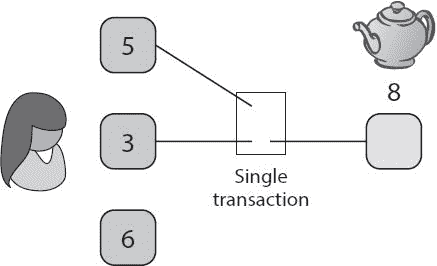

图 6.2。多输入交易。为了支付茶壶的费用，Alice 必须创建一个输入位于两个不同地址的事务。通过这样做，Alice 揭示了这两个地址是由单个实体控制的。

但这笔交易揭示了一些东西。它被永久记录在区块链中，任何看到它的人都可以推断出交易的两个输入很可能受同一用户的控制。换句话说，*共享支出是不同输入地址的联合控制*的证据。当然，也可能有例外。也许 Alice 和 Bob 是室友，并且同意通过各自提供一个交易输入来共同购买茶壶。但总的来说，联合投入意味着联合控制。

但不止于此。对手可以重复这一过程，并将整个交易群作为属于单个实体来传递链接。如果另一个地址以这种方式链接到 Alice 的任何一个地址，那么对手知道所有三个地址属于同一个实体，并且他可以使用这种观察来聚集地址。一般而言，如果新地址的输出与来自集群中任何地址的输出一起被消耗，则该新地址也可以被添加到集群中。

在[第 6.4 节](part0012.html#sec6_4)中，我们讨论了一种叫做“CoinJoin”的匿名技术，它通过违反这一假设来工作。但就目前而言，如果你假设人们正在使用常规的比特币钱包软件，而没有任何特殊的匿名技术，那么这种通过聚类来链接地址的方法往往会非常强大。我们还没有看到如何将这些集群与现实世界的身份联系起来，但我们很快就会看到这一点。

**改变地址随机化**

比特币-Qt 库(现在称为比特币核心)的早期版本有一个 bug，总是将更改地址作为两个输出的事务中的第一个输出。因此，在许多事务中识别变更地址是很容易的。这个 bug 在 2012 年得到了修复，但它强调了重要的一点:钱包软件在保护匿名性方面有着重要的作用。如果你正在开发钱包软件，有许多陷阱你应该知道；特别是，你应该总是随机选择改变地址的位置，以避免给对手太多的机会！

T56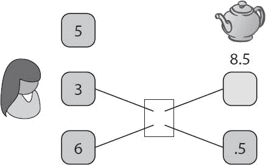

图 6.3。更改地址。为了支付茶壶的费用，Alice 必须创建一个事务，一个输出发送给商家，另一个输出将零钱发送回她自己。

回到我们的例子，假设茶壶的价格从 8 BTC 涨到了 8.5 BTC。Alice 再也找不到一组未用完的输出，她可以组合这些输出来产生茶壶所需的确切变化。相反，她利用了事务可以有多个输出的事实，如图 6.3 所示。一个输出是商店的付款地址，另一个是 Alice 拥有的“更改”地址。

现在从对手的角度来考虑这个交易。他们可以推断出这两个输入地址属于同一个用户。他们可能会进一步怀疑其中一个输出地址也属于同一个用户，但是他们没有办法确定是哪个用户。0.5 输出变小不代表就是变地址。爱丽丝可能在交易中有 10，000 BTC，她可能在茶壶上花了 8.5 BTC，并将剩余的 9，991.5 BTC 寄回给自己。在这种情况下，更大的输出实际上是更改地址。

一个更好的猜测是，如果茶壶只值 0.5 BTC，那么爱丽丝就不必用两个不同的输入来创建事务，因为 3 BTC 或 6 BTC 的输入本身就足够了。但这种启发式的有效性完全取决于常用钱包软件的实现细节。没有什么能阻止钱包(或用户)合并交易，即使不是绝对必要的。

习惯用法

这种实现细节被称为*习惯用法*。2013 年，由 Sarah Meiklejohn 领导的一组研究人员发现了一个适用于大多数钱包软件的习语，并为识别变更地址带来了一个强大的启发。具体来说，他们发现当需要更改地址时，钱包通常会生成一个新地址。由于这种使用习语，更改地址通常是以前从未在区块链中出现过的地址。相比之下，非变更输出通常不是新地址，可能以前在区块链出现过。对手可以利用这一知识来区分变化地址，并将它们与输入地址联系起来。

利用习惯用法很容易出错。更改地址是新地址的事实恰好是钱包软件的一个特性。2013 年研究人员测试时确实如此。也许仍然是真的，但也许不是。用户可以选择覆盖此默认行为。最重要的是，知道这种技术的用户可以很容易地避开它。甚至在 2013 年，研究人员发现它产生了许多假阳性，其中该技术将实际上不属于同一实体的地址聚集在一起。他们报告说，该方法需要大量的人工监督和干预来删除这些假阳性。

将真实世界的身份附加到集群

[图 6.4](part0012.html#fig6_4) 显示了 Meiklejohn 等人如何使用基本用法作为启发来聚类比特币地址。但是该图没有被标记——身份还没有被附加到集群上。

根据我们对比特币经济的了解，我们或许可以做出一些有根据的猜测。回到 2013 年，Mt. Gox 是最大的比特币交易所，所以我们可能会猜测，最大的实心圆圈代表由他们控制的地址。我们可能还会注意到，尽管交易量最大，但左侧的小集群中的比特币数量很少(由它的小实心圆表示)。这符合赌博服务 Satoshi Dice 的模式，这是一种很受欢迎的游戏，你可以用比特币提交小额赌注。总的来说，这不是识别集群的好方法。它需要知识和猜测，并且只适用于最突出的服务。

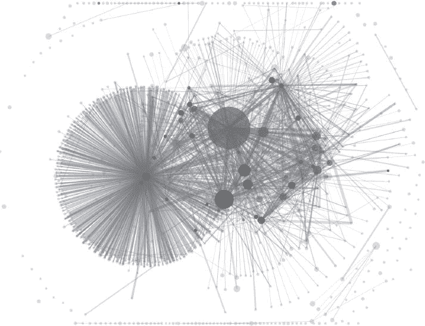

图 6.4。地址聚类。在 2013 年的论文《一把比特币:无名男性的支付特征》中，Meiklejohn 等人结合了共享支出启发式和新变化地址启发式来聚类比特币地址。这些圆圈的大小代表流入这些集群的货币数量，每条边代表一笔交易。

通过交易进行标记

如果只是访问每个交易所或商家的网站，并查找他们广告中接收比特币的地址，会怎么样？然而，这并不完全有效，因为大多数服务会为每笔交易公布一个新地址，而显示给你的地址还不在区块链。等待也没有意义，因为那个地址永远不会给别人看。

可靠推断地址的唯一方法是与服务提供商进行实际交易——存入比特币、购买物品等等。当你向服务提供商发送比特币或从服务提供商接收比特币时，你就会知道他们的一个地址，这个地址很快就会出现在区块链(以及其中一个集群)中。然后，您可以用服务提供商的身份标记整个集群。

这正是“一把比特币”研究人员(以及后来的其他人)所做的。他们购买各种各样的东西，加入挖矿池，使用比特币交易所、钱包服务和赌博网站，并以各种其他方式与服务提供商互动，总共进行了 344 次交易。

在[图 6.5](part0012.html#fig6_5) 中，我们再次显示了[图 6.4](part0012.html#fig6_4) 中的集群，但这次是附加了标签。我们对 Mt. Gox 和 Satoshi Dice 的猜测是正确的，但研究人员能够确定许多其他服务提供商，如果不与他们进行交易，这些服务提供商很难确定。

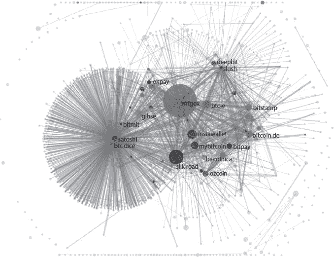

图 6.5。标记的集群。通过与各种比特币服务提供商进行交易，Meiklejohn 等人能够将现实世界的身份附加到他们的集群上。

识别个人

我们能为个人做同样的事情吗？也就是说，我们能把对应于个体的小集群和他们现实生活中的身份联系起来吗？

*直接交易*。任何与个人交易的人——线上或线下商家、交易所或使用比特币分摊晚餐账单的朋友——都知道至少一个属于该个人的地址。

*通过服务提供商*。在几个月或几年的比特币使用过程中，大多数用户最终会与交易所或其他集中式服务提供商进行互动。这些服务提供商通常会询问用户的身份——正如我们在[第 7 章](part0013.html#CCNA0-ea268daff50b4c55a00d858ef79f4a6c)中讨论的那样，法律通常会要求他们这样做。如果执法部门想要确定用户的身份，他们可以求助于这些服务提供商。

*粗心大意*。人们经常在公共论坛上发布自己的比特币地址。一个常见的原因是请求捐赠。当有人这样做时，就会在他们的身份和其中一个地址之间建立联系。如果他们不使用我们在下面几节中讨论的匿名服务，他们可能会面临所有交易都被匿名化的风险。

随着时间的推移，对隐私的攻击变得更加有效。历史表明，当数据公开时，去匿名化算法通常会随着时间的推移而改进，因为更多的研究人员会研究这个问题并识别新的攻击技术。此外，攻击者可以利用更多的辅助信息将身份附加到集群上。如果你关心隐私，这是值得担心的。

到目前为止检查的去匿名化技术都是基于分析区块链中的交易图。它们统称为*事务图分析*。

网络层去匿名化

一种完全不同的用户去匿名方式不依赖于事务图。回想一下，要将交易发布到区块链，人们通常会将其广播到比特币的点对点网络，在那里发送的消息不一定会永久记录在区块链中。

在网络术语中，区块链被称为*应用层*，对等网络被称为*网络层*。网络层去匿名化是由丹·卡明斯基在 2011 年黑帽大会上首次指出的。他注意到，当一个节点创建一个事务时，它会同时连接到许多节点，并广播该事务。如果网络上有足够多的节点相互勾结(或者由同一个对手管理)，它们就能找出第一个广播任何事务的节点。据推测，这应该是由创建事务的用户运行的节点。然后，对手可以将交易链接到节点的 IP 地址。IP 地址接近真实世界的身份；有很多方法可以尝试揭露 IP 地址背后的人。因此，网络层去匿名化是一个严重的隐私问题([图 6.6](part0012.html#fig6_6) )。

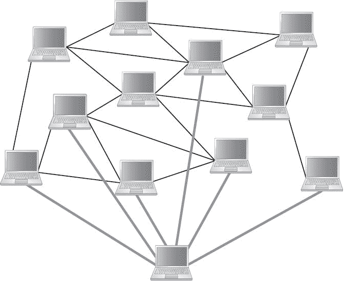

图 6.6。网络级去匿名化。正如丹·卡明斯基(Dan Kaminsky)在他 2011 年的黑帽演讲(Black Hat talk)中指出的，“第一个通知你交易的节点很可能就是交易的来源。”当多个节点合作并识别相同的源时，这种启发性被放大。

幸运的是，通信匿名的问题已经成为大量研究的主题。如[第 6.1 节](part0012.html#sec6_1)所述，广泛部署的 Tor 系统可用于匿名通信。

使用 Tor 作为比特币的网络层匿名解决方案有几个注意事项。首先，Tor 协议和覆盖在其上的任何协议之间可能会发生微妙的交互，从而产生破坏匿名的新方法。事实上，研究人员已经发现了使用比特币的潜在安全问题，因此必须非常谨慎。其次，其他匿名通信技术可能更适合用于比特币。Tor 是为“低延迟”活动设计的，比如网页浏览，在这种情况下，你不想坐在那里等待太长时间。它做出了一些妥协，以实现低延迟的匿名性。相比之下，比特币是一个高延迟系统，因为在区块链，交易需要一段时间才能得到确认。至少在理论上，你可能想使用一种替代的匿名技术，如 *mix net* (见[第 6.3 节](part0012.html#sec6_3))，但在撰写本文时，Tor 的优势在于它是一个拥有大量用户群的实际系统，其安全性已经过深入研究。

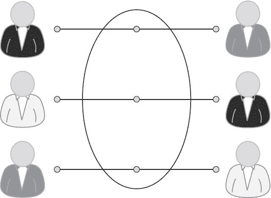

图 6.7。混合。用户将硬币发送给中介，并取回由其他用户存入的硬币。这使得在区块链上追踪用户的硬币变得更加困难。

到目前为止，我们已经看到不同的地址可能通过事务图分析链接在一起，并且它们也可能链接到现实世界的身份。我们还看到，基于对等网络，交易或地址可以链接到 IP 地址。后一个问题相对容易解决，即使现在还不能认为完全解决了。前一个问题要复杂得多，本章的其余部分将讨论解决它的方法。

**6.3。混合**

有几种机制会降低事务图分析的效率。其中一种技术是*混合*。背后的直觉很简单:如果你想匿名，使用中介。这一原则并不是比特币特有的，在许多以匿名为目标的情况下都很有用。混合如图 6.7 中的[所示。](part0012.html#fig6_7)

混合在线钱包

如果您还记得我们对在线钱包的讨论([第 4.4 节](part0010.html#sec4_4))，它们似乎适合作为中介。在线钱包是一种服务，你可以在网上存储比特币，并在以后的某个日期提取它们。通常情况下，你取出的硬币不会与你存入的硬币相同。那么，在线钱包能提供有效的混合吗？

在线钱包确实提供了一种不可链接性的衡量标准，可以挫败交易图分析的尝试——在一个案例中，杰出的研究人员不得不撤回一项受到大量宣传的声明，因为他们认为他们发现的链接是由在线钱包引起的虚假链接。

然而，使用在线钱包进行混合有几个明显的限制。第一，大部分网络钱包实际上并不承诺混用用户资金；相反，他们这样做是因为这简化了工程。你无法保证他们不会改变自己的行为。第二，即使他们确实混合了资金，他们几乎肯定会在内部保留记录，这将使他们能够将你的存款与你的提款联系起来。出于安全性和法律合规性的原因，这是钱包服务的谨慎选择。因此，如果你的威胁模型包括服务提供商本身跟踪你、或被黑客攻击、或被迫交出记录的可能性，你就又回到了起点。第三，除了在内部保存日志之外，信誉良好且受监管的服务还会要求并记录您的身份(我们将在第 7 章中更详细地讨论监管)。你不能简单地用用户名和密码创建一个账户。所以从某种意义上来说，你比不使用钱包服务的情况更糟。

在线钱包提供的匿名性类似于传统银行系统提供的匿名性。有很多了解我们交易的集中中介，但从一个没有特权信息的陌生人的角度来看，我们有合理程度的隐私。但是正如我们所讨论的，区块链的公共性质意味着如果出现问题(比如，钱包或交换服务被黑客攻击，记录被暴露)，隐私风险比传统系统更严重。此外，大多数转向比特币匿名的人倾向于这样做，因为他们对传统系统的匿名属性感到不满，并希望获得更好的(或不同种类的)匿名保证。这些是专用混合服务背后的动机。

专用混音服务

与在线钱包相反，专用混合承诺不保留记录；他们也不需要你的身份。你甚至不需要一个用户名或其他假名来与混音互动。你把你的比特币送到 mix 提供的一个地址，你告诉 mix 一个目的地地址把比特币送到那里。希望 mix 能很快将(其他)比特币发送到你指定的地址。本质上是一种互换。

**术语:混合与洗衣**

在本书中，术语 *mix* 指的是专门的混音服务。一些人更喜欢的一个等价术语是*混频器*。

你可能还会遇到术语*洗衣*。我们不喜欢这个术语，因为它不必要地将道德判断附加到一个纯粹的技术概念上。正如我们所见，你可能有很好的理由保护自己的比特币隐私，并在日常生活中使用混合比特币。当然，我们也必须承认不好的用途，但是使用“洗衣”这个词会提升负面的内涵，因为它暗示你的硬币是“脏的”，你需要清洗它们。

还有一个术语 *tumbler* ，指的是翻滚的滚筒。这种滚筒用于干衣机以及清洁和抛光宝石的“滚筒”中。尚不清楚是滚筒的搅拌作用还是它们的清洁作用激发了这个词在比特币语境中的使用。无论如何，我们将坚持术语“混合”

尽管专用混音承诺不保留记录是件好事，但你仍然必须相信他们会信守承诺。你必须相信他们会把硬币还给你。与钱包不同，mixes 不是你存放比特币的地方，所以你会希望相对较快地取回你的硬币，这意味着你的存款将与其他硬币混合的池相对较小——那些大约在同一时间存入的硬币。

混合指南

一组研究人员，包括本教材五位作者中的四位，研究了 mix，并提出了一套改进 mix 操作方式的指导方针，既包括增加匿名性，也包括将您的硬币委托给 mix 的安全性。在这里，我们讨论每一个指导方针。

使用一系列的混合物

第一个原则是使用一系列的混合，一个接一个，而不是仅仅一个混合([图 6.8](part0012.html#fig6_8) )。这是一个众所周知的既定原则——例如，Tor 使用一系列三个路由器进行匿名通信。这减少了你对任何单一组合可信度的依赖。只要该系列中的任何一个混音保持其承诺并删除其记录，你就有理由期待没有人能够将你的第一次输入与你收到的最终输出联系起来。

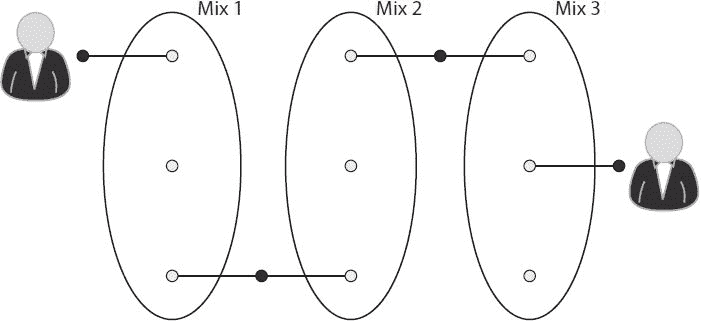

图 6.8。一系列混音。我们从一个拥有硬币的用户开始，我们假设对手已经设法将硬币链接到该用户。用户通过各种混合发送硬币，每次都向混合提供新生成的输出地址。只要这些混合中至少有一个破坏了它的输入-输出地址映射记录，并且没有信息的旁道泄漏，对手就无法将用户的原始硬币与他的最终硬币联系起来。

使用统一交易

如果不同用户的混合交易涉及不同数量的比特币，那么混合交易就不会非常有效。由于进入和退出混合的价值必须被保留，用户的硬币可以在它们流过混合时被链接，或者至少匿名集的大小可以被大大减少。

相反，我们希望混合事务在值上是一致的，这样可链接性被最小化。所有的 mix 都应该同意一个标准的*块大小*，这是一个固定值，传入的 mix 事务必须具有这个值。这将增加匿名设置，因为所有通过*任何*组合的交易看起来都是一样的，无法根据其价值进行区分。此外，在所有混合中使用统一的大小将使使用一系列混合变得容易，而不必拆分或合并事务。

在实践中，可能很难就适用于所有用户的单一块大小达成一致。如果块大小太大，想要混合少量钱的用户将无法。但是如果它太小，想要混合大量资金的用户将需要把它分成大量的块，这可能是低效和昂贵的。多个标准块大小会提高性能，但也会按块大小分割匿名集。也许一系列两到三个递增的块大小会在效率和隐私之间提供一个合理的折衷。

客户端应该是自动化的

除了尝试根据交易值链接硬币，聪明的对手可能会尝试各种其他方法来解除匿名，例如，通过观察交易的时间。这些攻击是可以避免的，但是必要的预防措施对于人类用户来说太复杂和麻烦了。相反，与 mixes 交互的客户端功能应该是自动化的，并内置于隐私友好的钱包软件中。

费用应该是全有或全无

混合是业务，并期望为他们的服务支付。mix 收取费用的一种方式是从用户提交的每笔交易中抽取佣金。但是这对于匿名来说是有问题的，因为混合交易不再是标准的块大小。(如果用户试图将他们略小的块分割和合并回原始块大小，这会引入严重且难以分析的匿名风险，因为引入了硬币之间的新联系。)

不要把混合费和交易费混为一谈，交易费是矿商收的。混合费用与此类费用分开，并且是此类费用的补充。

为了避免这个问题，混合费用应该是全有或全无，并应用概率。换句话说，mix 应该以很小的概率吞下整个块，或者全部返回。例如，如果 mix 希望收取 0.1%的混合费，那么每 1000 次 mix 中就有一次应该吞下整个块，而 1000 次中有 999 次 mix 应该处理并返回整个块，而不收取任何混合费。

这一壮举很难完成。mix 必须做出概率决定，并让用户相信它没有作弊:它没有偏向随机数生成器，因此它有 1%的概率保留一大块作为费用，而不是 0.1%。密码学提供了一种方法来做到这一点；详情见 2014 年 Bonneau 等人的“Mixcoin”论文，在进一步阅读部分。本文还讨论了 mix 提高其可信度的各种方法。

实践中的混合

截至 2015 年，没有功能性混合生态系统。许多混合服务是可用的，但是它们具有低容量，因此匿名集较小。更糟糕的是，许多混合被报道窃取比特币。也许建立这样一个生态系统的困难是它从未建立的原因之一。鉴于 mix 的不可靠声誉，没有多少人愿意使用它们，导致交易量低，因此匿名性差。有一句老话，匿名喜欢陪伴——也就是说，使用匿名服务的人越多，它提供的匿名就越好。此外，在提供广告服务无利可图的情况下，mix 运营商可能会转而窃取资金，从而使不可信 mix 的循环永久化。

今天的混音并不遵循我们之前设定的任何原则。每个混音都独立运行，并且通常提供一个 web 界面，用户可以与该界面手动交互，以指定接收地址和任何其他必要的参数。用户选择要混合的量。mix 将从每笔交易中抽取一部分作为混合费，并将剩余部分发送到目的地地址。

我们认为 mixes(和钱包软件)有必要转移到这里介绍的模型，以实现强大的匿名性，抵御巧妙的攻击，提供可用的界面，并吸引高容量。但一个强大的混合生态系统是否会进化，还有待观察。

**6.4。分散混合**

分散混合消除了混合服务，代之以点对点协议，一组用户可以通过该协议混合他们的硬币。可以想象，这种方法在哲学上比第 6.3 节中讨论的集中混合服务更符合比特币。

权力下放也有更多的实际优势。首先，它没有引导问题:用户不必等待有信誉的集中混合的出现。第二，在分散混合中偷窃是不可能的；该协议确保当你放入要混合的比特币时，你会得到等值的比特币。因为这一点，即使一些集中协调在分散混合中被证明是有帮助的，对某些人来说建立这样的服务是更容易的，因为他们不需要让用户相信他们的可信度。最后，在某些方面，分散混合可以提供更好的匿名性。

CoinJoin

分散混合的主要提议是共加入。在这个协议中，不同的用户共同创建一个单一的比特币交易，该交易结合了他们所有的输入。使 CoinJoin 能够工作的关键技术原理是:当一个事务有来自不同地址的多个输入时，对应于每个输入的签名是相互分离和独立的。所以这些不同的地址可能由不同的人控制。你不需要一方收集所有的私钥([图 6.9](part0012.html#fig6_9) )。

这允许一组用户在一次交易中混合他们的硬币。每个用户提供一个输入和输出地址，用户用这些地址组成一个事务。输入和输出地址的顺序是随机的，所以不属于这组用户的对手将无法确定输入和输出之间的映射。参与者检查他们的输出地址是否包括在交易中，以及它是否收到了与他们输入的相同数量的比特币(减去任何交易费用)。一旦他们确认了这一点，他们就签署交易。

在区块链上查看该事务的人(即使他们知道这是一个 CoinJoin 事务)将无法确定输入和输出之间的映射。从局外人的角度来看，硬币已经混在一起了，这就是 CoinJoin 的本质。

到目前为止，我们所描述的只是一轮混合。但是第 6.3 节中讨论的原则仍然适用。用户应该对不同的用户组重复这个过程。他们还应该确保块大小是标准化的，这样就不会引入侧通道。

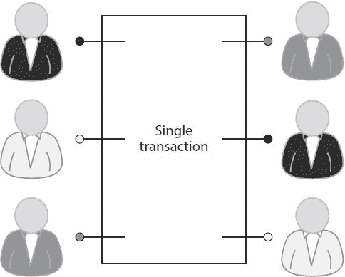

图 6.9。Coinjoin 交易。

现在让我们深入研究一下 CoinJoin 的细节，它可以分为五个步骤:

1.找想混的同行。

2.交换输入/输出地址。

3.构建交易。

4.将交易发送给每个参与者。每个对等体在验证其输出存在后签名。

5.广播交易。

要开始这个过程，一群都想交往的同龄人需要找到彼此。这一步可以通过充当“水坑”的服务器来实现，允许用户连接和分组。与集中式混合不同，这些服务器无法窃取用户的资金或损害匿名性。

一旦对等组形成，对等体必须相互交换它们的输入和输出地址。对于参与者来说，以这样一种方式交换这些地址是很重要的，即使对等组的其他成员也不知道输入和输出地址之间的映射。否则，即使对等体与一组假定随机的对等体执行 CoinJoin 事务，对手也有可能溜进组中并注意到输入到输出的映射。以不可链接的方式交换地址需要匿名通信协议。可以使用 Tor 网络，这是我们前面讨论过的，也可以使用一种叫做“解密混合网”的专用匿名路由协议

一旦输入和输出被传递，这些用户中的一个——谁是无关紧要的——将构造对应于这些输入和输出的事务。然后，未签名的事务将被传递；每个对等体将验证其输入和输出地址是否包含正确，然后进行签名。

如果所有的对等体都遵循该协议，那么这个系统工作得很好。任何对等体都可以组装该事务，并且任何对等体都可以向网络广播该事务。其中两个甚至可以独立播放；当然，它只会在区块链发行一次。但是如果一个或多个对等体想要破坏，他们很容易发起拒绝服务攻击，阻止协议完成。

特别是，对等体可以参与协议的第一阶段，提供其输入和输出地址，但在第二阶段拒绝签名。或者，在签署事务后，破坏性对等方可以尝试获取他提供给对等方的输入，并将其用于其他事务。如果替代交易赢得了网络上的竞争，它将首先被确认，而 CoinJoin 交易将被作为双重花费而拒绝。

为了防止 CoinJoin 中的拒绝服务，已经提出了几个建议。一种是通过工作证明(类似于挖矿)或刻录证明(一种可以证明销毁你拥有的少量比特币的技术，我们在[第三章](part0009.html#8IL20-ea268daff50b4c55a00d858ef79f4a6c)中研究过)来强加参与协议的成本。或者，有加密的方法来识别不合规的参与者，并将他们踢出团队。详情请见本章末尾的进一步阅读部分。

高层流动

我们在第 6.1 节的[中提到了侧通道。我们现在仔细看看侧边通道有多复杂。假设爱丽丝每周在特定地址收到特定数量的比特币，比如 43.12312 BTC，这可能是她的工资。进一步假设，她有一个习惯，会自动地立即将该金额的 5%转移到她的退休账户，这是另一个比特币地址。我们把这种转移模式称为*高层流*。在这个场景中，没有任何混合策略可以有效地隐藏两个地址之间存在关系的事实。想想在区块链可以看到的模式:具体的数量和时间极不可能是偶然发生的。](part0012.html#sec6_1)

有一种技术可以帮助在高级流存在的情况下重新获得不可链接性，这种技术被称为*合并避免*，由比特币开发者迈克·赫恩提出。一般来说，为了进行支付，用户创建单个交易，该单个交易根据需要组合尽可能多的硬币，以将全部金额支付到单个地址。如果用户可以避免合并的需要，从而链接所有的输入，会怎么样？合并避免协议通过允许收款人提供多个输出地址来实现这一点——根据需要而定。汇款人和收款人商定一组面额，将付款分成多个交易并执行，如图[图 6.10](part0012.html#fig6_10) 所示。

假设商店最终将这两笔付款与它收到的其他付款中的许多其他输入相结合，这两个地址之间的关联就不再明显了。商店应该避免一收到这两枚硬币就将它们重新组合，否则很明显它们来自同一个实体。此外，Alice 可能希望避免同时发送两笔付款，这可能同样会泄露此信息。


图 6.10。合并回避。爱丽丝想用 8 BTC 的价格买一个茶壶。商店给了她两个地址，她给其中一个付了 5 BTC，给另一个付了 3 BTC，与她可用的硬币相匹配。这种方法避免了暴露这两个地址都属于同一个实体。

一般来说，合并避免有助于减轻高层流的问题:如果一个流被分解成许多彼此没有联系的更小的流，对手可能无法识别它。在 Alice 为她的退休帐户提供资金的示例中，她在收到工资以及将一部分工资转移到她的退休基金时，都需要使用合并避免。合并避免也挫败了地址聚类技术，该技术依赖于在单次交易中共同花费硬币。

6.5**。零硬币和零现金**

没有任何加密货币匿名解决方案能像零币(Zerocoin)和它的继任者(T2)零现金(Zerocash)一样令人兴奋。这既是因为他们采用了巧妙的加密技术，也是因为他们承诺了强大的匿名功能。尽管到目前为止讨论的所有匿名增强技术都在核心协议上添加了匿名，但 Zerocoin 和 Zerocash 在协议层引入了匿名。我们在这里给出了该协议的高级视图，并且必要地简化了一些细节，但是你可以在本章末尾的进一步阅读部分找到对原始论文的参考。

*兼容性*。正如我们将看到的，Zerocoin 和 Zerocash 的强大匿名保证是有代价的:与集中式混合和 CoinJoin 不同，这些协议与今天的比特币不兼容。用软叉将 Zerocoin 部署到比特币在技术上是可能的，但实际困难足够严重，使得这不可行。在零现金的情况下，叉甚至都不可能，替代硬币是唯一的选择。

*密码保障*。Zerocoin 和 Zerocash 结合了协议级混合，并且匿名属性带有加密保证。这些保证在质量上优于我们讨论过的其他混合技术。你不需要相信任何人——混合体、同行或任何类型的中介，甚至矿工和共识协议——来确保你的隐私。与大多数加密保证一样，匿名的承诺只依赖于对手的计算极限。

零硬币

为了解释 Zerocoin，我们先介绍一下 Basecoin 的概念。Basecoin 是一种类似比特币的 altcoin，Zerocoin 是这种 altcoin 的延伸。提供匿名的关键特征是，你可以将基础硬币转换成零硬币，然后再转换回来，当你这样做时，它会打破原始基础硬币和新基础硬币之间的联系。在这个系统中，基础币是你交易的货币，而 Zerocoin 只是提供了一种机制，将你的基础币换成与旧基础币不挂钩的新基础币。

你可以将你拥有的每一枚零币视为一种代币，你可以用它来证明你拥有一枚基础币，并使其不可兑换。证据不会显示你拥有哪枚基础硬币，只显示你确实拥有一枚基础硬币。您可以稍后通过向矿工出示该凭证来兑换新的基础硬币。一个类比是进入一个赌场，把你的现金换成扑克筹码。这些可以作为你存了一些现金的证明，你可以在离开赌场的时候把这些现金换成相同价值的不同现金。当然，与扑克筹码不同的是，你实际上不能用零币做任何事情，除了拿着它，然后把它兑换成基础币。

为了在加密货币中实现这一点，这些证明是以加密方式实现的。我们需要确保每张凭证只能用于兑换一枚基础硬币一次。否则，通过将一枚基础硬币变成零硬币，然后多次兑换，就有可能免费获得基础硬币。

零知识证明

使用的密钥加密工具是一个*零知识证明*，这是一种让某人证明一个(数学)陈述而不透露任何其他导致该陈述为真的信息的方法。例如，假设您已经做了大量工作来解决一个哈希难题，并且您想要说服某人相信这一点。换句话说，你想证明这个陈述

```
I know *x* such that *H*(*x* ǁ other known inputs) < 〈target〉
```

当然，你可以通过显示 *x* 来实现。但是零知识证明允许你以这样一种方式做到这一点，即其他人在看到证明后并不比他们之前更了解 *x* 的值。

还可以证明“我知道 *x* 使得 *H* ( *x* )属于以下集合:{…}”这样的陈述。这个证明不会揭示任何关于 x 的东西，也不会揭示集合中的哪个元素等于 *H(x* )。Zerocoin 关键依赖于零知识证明，事实上 Zerocoin 中证明的语句与后一个例子非常相似。在本书中，我们将零知识证明视为黑盒。我们给出了零知识证明所达到的性质，并显示了它们在协议中的必要位置，但我们不深入研究这些证明是如何实现的技术细节。零知识证明是现代密码学的基石，也是许多协议的基础。我们建议有兴趣的读者到进一步阅读部分去了解更详细的处理方法。

铸造零硬币

零硬币是通过铸造产生的，任何人都可以铸造零硬币。它们有标准面值。为简单起见，假设只有一个面值为 1.0 的零币，每个零币值 1 个基础币。虽然任何人都可以铸造零硬币，但仅仅铸造一枚硬币并不会自动赋予它任何价值——你不可能得到免费的钱。只有当你把它放到区块链上时，它才会获得价值，而这样做需要放弃 1 个基础硬币。

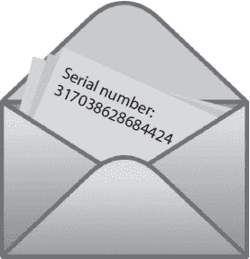

图 6.11。承诺一个序列号。加密承诺的真实模拟是将一个值密封在信封内。

要铸造一枚零硬币，你需要一个加密承诺。回想一下第一章中的[，承诺方案是将一个值密封在信封中并放在每个人看来的桌子上的密码模拟(](part0007.html#6LJU0-ea268daff50b4c55a00d858ef79f4a6c)[图 6.11](part0012.html#fig6_11) )。

铸造零硬币分三步完成:

1.生成序列号 *S* 和随机秘密 *r* 。

2.计算*提交* ( *S，r* )，提交给序列号。

3.在区块链上发布承诺，如图[图 6.12](part0012.html#fig6_12) 所示。这就烧掉了一枚基础硬币，使其无法使用，并创造了一枚零硬币。暂时对 S 和 r 保密。

要花掉一枚零硬币并兑换一枚新的基础硬币，您需要证明您之前铸造了一枚零硬币。你可以通过打开你之前的承诺来做到这一点，也就是说，展示 *S* 和 *r* 。但是这使得你的旧基础硬币和你的新基础硬币之间的联系变得明显。怎么能断链呢？这就是零知识证明的用武之地。在任何时候，区块链都会有很多承诺——姑且称之为*c*1、*c*2、…、*c*n。

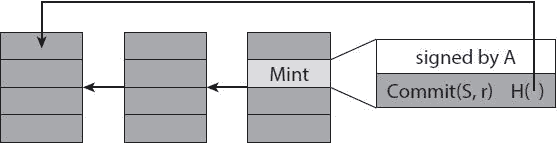

图 6.12。在区块链上放一枚零硬币。将零币放入区块链需要特殊的铸币交易，其输出“地址”是零币序列号的加密承诺。铸币交易的输入是一个基础硬币，现在已经被用于创建零硬币。交易不*不*显示序列号。

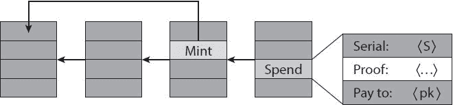

图 6.13。花一个零硬币。花费事务揭示了由较早的薄荷事务提交的序列号 *S* ，以及一个零知识证明，即 *S* 对应于*某个*较早的薄荷事务。与铸币交易(或普通的比特币/基础货币交易)不同，消费交易没有输入，因此没有签名。相反，零知识证明用于建立其有效性。

以下是花费一枚序列号为 *S* 的零币兑换一枚新基础币的步骤([图 6.13](part0012.html#fig6_13) ):

创建一个包含 S 的特殊“支出”交易，以及该语句的零知识证明:

```
“I know *r* such that *Commit*(*S, r*) is in the set {*c*1, *c*2, …, *c*n}”
```

矿工会验证你的零知识证明，这证明你有*能力*打开区块链上的一个零硬币承诺，而不用实际打开它。

矿工还将检查序列号 *S* 是否从未在任何以前的消费交易中使用过(因为那将是一次双重消费)。

您的消费交易的输出现在将作为新的基础货币。对于输出地址，您应该使用您自己的地址。

一旦你花了一枚 zerocoin，序列号就公开了，你就再也无法兑换这个序列号了。由于每枚零币只有一个序列号，这意味着每枚零币只能使用一次，正如我们对安全性的要求。

*匿名*。注意 *r* 始终保密；无论是造币厂还是消费交易都没有透露这一点。这意味着没人知道哪个序列号对应哪个零币。这是 Zerocoin 匿名背后的关键概念。在区块链上，提交序列号 *S* 的铸币交易和后来披露兑换基础硬币的 *S* 的消费交易之间没有联系。这种听起来不可思议的特性可以通过加密技术实现，但在基于信封的物理系统中却无法实现。这就好像桌子上有一堆密封的信封，里面装着不同的序列号，你可以证明某个特定的序列号是其中之一，而不必透露是哪个信封，也不必打开任何一个信封。

*效率*。回想一下在支出交易中得到证明的陈述:

```
“I know *r* such that *Commit*(*S, r*) is in the set {*c*1, *c*2, …, *c**n*}”
```

这听起来像是实现起来非常低效，因为零知识证明的规模将随着 *n* 的增加而线性增长，n n 是已经铸造的零硬币的数量。值得注意的是，Zerocoin 设法使这些证明的大小仅在 *n* 中为对数。注意，即使要证明的*语句*具有线性长度，它也不需要包含在证明中。这种说法是含蓄的；矿工们可以推断出来，因为他们知道区块链上所有零硬币的集合。证明本身可以短得多。然而，与比特币相比，Zerocoin 仍然增加了相当大的开销，证明大小约为 50 千字节。

可信设置

用于构建 Zerocoin (RSA 累加器)的加密工具之一需要一次性*可信设置*。具体来说，一个可信方需要选择两个大素数 *p* 和 *q* 并发布*N*=*p**q*，这是一个所有人都会在系统的生命周期内使用的参数。把 *N* 想成一个公钥，除了它是针对所有 Zerocoin 而不是一个特定的实体。只要可信方销毁了 *p* 和 *q* 的任何记录，系统就被认为是安全的。特别是，这种信念建立在一个广为接受的假设上，即把两个大素数的乘积因式分解是不可行的。但是如果*任何人*知道秘密因子 *p* 和 *q* (被称为“陷门”)，那么他们就能够在不被发现的情况下为自己创造新的零硬币。因此，这些秘密输入必须在生成公共参数时使用一次，然后安全地销毁。

这里有一个有趣的社会学问题。目前还不清楚一个实体如何选择 *N* 并让所有人相信他们已经安全地销毁了在设置过程中使用的因子 *p* 和 *q* 。关于如何实现这一点，已经提出了各种建议，包括“门限加密”技术，它允许一组代表联合计算 N，只要他们中的任何一个删除他们的秘密输入，系统将保持安全。

也可以使用稍微不同的加密结构来避免对可信设置的需要。具体来说，已经表明简单地为 *N* 生成一个非常大的随机值是安全的，因为该数可能不能被完全分解。不幸的是，这带来了巨大的效率损失，因此被认为是不实际的。

零现金

Zerocash 是一种不同的匿名加密货币，它建立在 Zerocoin 的概念上，但将密码学提升到了一个新的水平。它使用了一种称为“零知识简明非交互式知识论证”(zk-SNARKs)的加密技术，这是一种使零知识证明更加紧凑和有效的方法。结果是整个系统的效率得到了提高，使得在不需要基础硬币的情况下运行整个网络成为可能。所有的交易都可以以零知识的方式完成。如前所述，Zerocoin 支持不需要不可链接性时的常规事务，增加了仅用于混合的计算开销大的事务。混合交易有固定的面值，价值的分割和合并只能发生在基础货币中。在 Zerocash 中，这种区别消失了。交易金额现在包含在承付款中，在区块链上不再可见。密码证明确保拆分和合并正确完成，并且用户不能凭空创建零现金。

分类账公开记录的唯一事情是这些交易的存在，以及允许矿工验证系统正确运行所需的所有属性的证据。在任何时候，区块链上都不会透露地址和值。唯一需要知道交易金额的用户是特定交易的发送方和接收方。矿工不需要知道交易金额。当然，如果有交易费，矿工们需要知道这笔费用，但这并不会真正损害你的匿名性。

就匿名和隐私而言，作为一个完全不可追踪的交易系统运行的能力使 Zerocash 自成一类。Zerocash 不受针对混合的旁门左道攻击的影响，因为公共分类帐不再包含交易金额。

设置零现金

就其技术属性而言，Zerocash 听起来好得令人难以置信。这里面确实有蹊跷。就像 Zerocoin 一样，Zerocash 需要公共参数来设置零知识证明系统。但是与只需要一个数字 *N* (只有几百个字节)的 Zerocoin 不同，Zerocash 需要一组庞大的公共参数——长度超过 10 亿字节。同样，为了生成这些公共参数，Zerocash 需要随机和秘密的输入，如果*任何人*知道这些秘密输入，它会通过实现不可检测的双重花费来危及系统的安全性。

在这里，我们不会深入探讨建立 zk-SNARK 系统的挑战。这仍然是一个活跃的研究领域，但截至 2015 年，没有人知道如何以足够可信的方式在实践中建立该系统。迄今为止，zk-SNARKs 尚未在实践中使用。

把所有的放在一起

现在让我们比较一下我们已经讨论过的解决方案，从它们提供的匿名属性和它们在实践中的可部署性两个方面来看([表 6.1](part0012.html#tab6_1) )。

我们先从比特币本身说起，它已经部署好了，在这里被认为是默认系统。但这只是假名，可以针对它部署强大的事务图分析。我们研究了对大量地址进行聚类的方法，以及有时如何将真实世界的身份与这些聚类联系起来。

表 6.1。本章介绍的匿名技术的比较

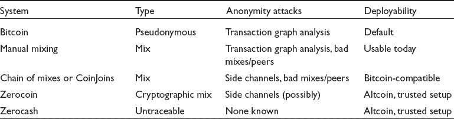

匿名的下一个级别是以手动方式使用单个混合，或者通过手动寻找同伴来进行投币加入。这模糊了输入和输出之间的联系，但在事务图中留下了太多潜在的线索。此外，混合和同行可能是恶意的，黑客，或被迫透露他们的记录。尽管在匿名性方面远非完美，但混合服务是存在的，因此这种选择在今天是可用的。

我们考虑的第三个层次是一连串的混合或组合。匿名性的提高是由于减少了对任何单一的混合或一组同伴的依赖。像标准化块大小和客户端自动化这样的功能可以最大限度地减少信息泄漏，但一些侧通道仍然存在。还有一种危险是，对手控制着多个组合或同行，或者与他们勾结。实现混合链的钱包和服务可以在今天部署和采用，但据我们所知，安全的混合链解决方案还不容易获得。

Zerocoin 将加密技术直接融入到协议中，并带来了匿名的数学保证。我们认为一些侧通道仍然是可能的，但它肯定优于其他基于混合的解决方案。然而，Zerocoin 必须作为替代硬币推出。

最后，我们看了 Zerocash。由于效率的提高，Zerocash 可以作为完全不可追踪的加密货币运行，而不仅仅是匿名的。然而，与 Zerocoin 一样，Zerocash 也不兼容比特币。更糟糕的是，它需要一个复杂的设置过程，社区仍在寻找最佳的实现方式。

在这一章中，我们已经讨论了很多技术。现在让我们后退一步。比特币的假名性(以及匿名的潜力)非常强大，当与其他技术，特别是匿名通信结合起来时，这种力量会越来越大。正如我们将在第 7 章中看到的，这是丝绸之路和其他匿名在线市场背后的强大组合。

尽管它的力量，匿名是脆弱的。一个错误就可能造成不必要的、不可逆转的联系。但是匿名是值得保护的，因为除了明显的不好的方面，它还有很多好的方面。尽管这些道德上的区别很重要，但它们无法在技术层面上表达出来。匿名技术似乎在道德上有很深的内在模糊性，作为一个社会，我们必须学会接受这一事实。

比特币匿名是技术创新和伦理争论的活跃领域。我们仍然不知道比特币的哪种匿名系统(如果有的话)会变得突出或主流。无论是开发者、决策者还是用户，这都是一个参与并做出贡献的绝佳机会。希望你在这一章学到的知识已经给了你正确的背景知识。

**延伸阅读**

与前几章讨论的主题相比，匿名技术正在不断发展，是加密货币研究的一个活跃领域。跟上这一领域最新发展的最好方法是从这里列出的论文开始，并寻找引用它们的论文。

关于交易图分析的“一把比特币”论文是:

```
Meiklejohn, Sarah, Marjori Pomarole, Grant Jordan, Kirill Levchenko, Damon McCoy, Geoffrey M. Voelker, and Stefan Savage. “A Fistful of Bitcoins: Characterizing Payments among Men with No Names.” In *Proceedings of the 2013 Conference on Internet Measurement*, New York: ACM, 2013.
```

关于混合技术的研究以及我们所讨论的有效混合原则的来源可以在以下文献中找到:

```
Bonneau, Joseph, Arvind Narayanan, Andrew Miller, Jeremy Clark, Joshua A. Kroll, and Edward W. Felten. “Mixcoin: Anonymity for Bitcoin with Accountable Mixes.” In *Financial Cryptography and Data Security*. Berlin: Springer, 2014.
```

一项关于混合服务实践的研究表明，许多服务信誉不佳:

```
Möser, Malte, Rainer Böhme, and Dominic Breuker. “An Inquiry into Money Laundering Tools in the Bitcoin Ecosystem.” In *2013 eCrime Researchers Summit*. Washington, DC: IEEE, 2013.
```

CoinJoin 是由比特币核心开发者 Greg Maxwell 在比特币论坛上提出的:

```
Maxwell, Gregory. “CoinJoin: Bitcoin Privacy for the Real World.” Bitcoin Forum, 2013\. Available at https://bitcointalk.org/index.php?topic=279249.0.
```

Zerocoin 是由约翰霍普金斯大学的密码学家开发的。Zerocoin 和 Zerocash 拥有我们在本书中讨论过的最复杂的加密技术:

```
Miers, Ian, Christina Garman, Matthew Green, and Aviel D. Rubin. “Zerocoin: Anonymous Distributed E-Cash from Bitcoin.” In *Proceedings of the 2013 IEEE Symposium on Security and Privacy*. Washington, DC: IEEE, 2013.
```

Zerocoin 的作者与开发 SNARK 技术的其他研究人员合作。这次合作的结果是零现金:

```
Ben Sasson, Eli, Alessandro Chiesa, Christina Garman, Matthew Green, Ian Miers, Eran Tromer, and Madars Virza. “Zerocash: Decentralized Anonymous Payments from Bitcoin.” In *Proceedings of the 2013 IEEE Symposium on Security and Privacy*. Washington, DC: IEEE, 2013.
```

Zerocoin 的替代设计是 CryptoNote，它使用不同的加密技术，提供不同的匿名属性。由于篇幅有限，我们没有在本章讨论它，但它是一种有趣的设计方法:

```
van Saberhagen, Nicolas. “CryptoNote v. 2.0.” Available at https://cryptonote.org/whitepaper.pdf.
```

这本关于密码学的经典书籍中有一章是关于零知识证明的:

```
Goldreich, Oded. *Foundations of Cryptography*, Volume 1\. Cambridge: Cambridge University Press, 2007.
```

本文描述了匿名通信网络 Tor 的技术设计:

```
Dingledine, Roger, Nick Mathewson, and Paul Syverson. “Tor: The Second-Generation Onion Router.” Washington, DC: Naval Research Lab, 2004.
```

关于比特币和加密货币的“知识系统化”论文如下。特别参见关于匿名和隐私的第七节:

```
Bonneau, Joseph, Andrew Miller, Jeremy Clark, Arvind Narayanan, Joshua A. Kroll, and Edward W. Felten. “Research Perspectives and Challenges for Bitcoin and Cryptocurrencies.” Presented at the 2015 IEEE Security and Privacy Conference, San Jose, CA, 2015.
```