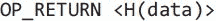
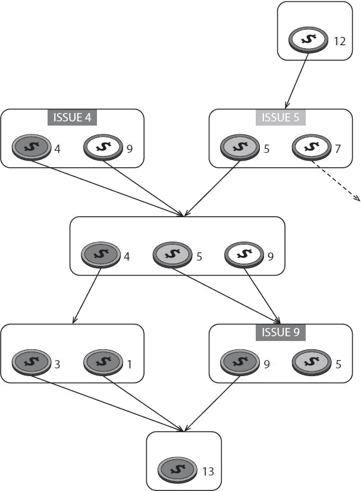
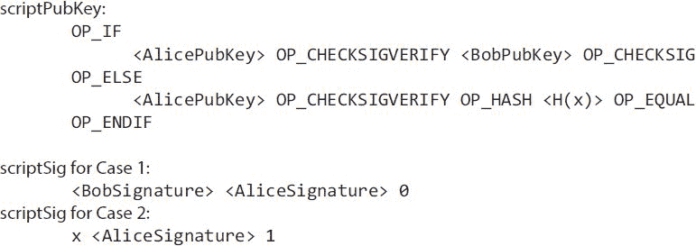
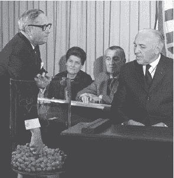
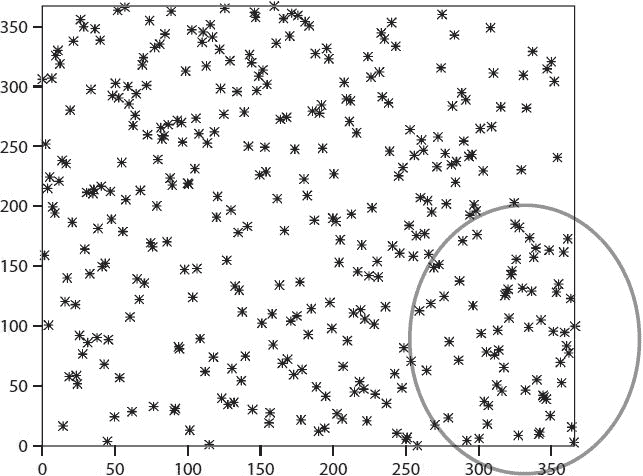
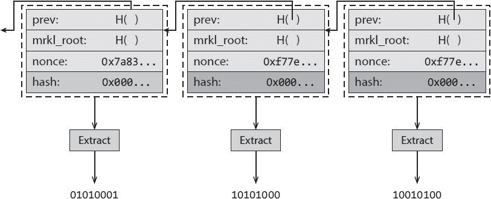
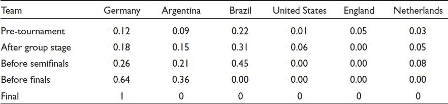
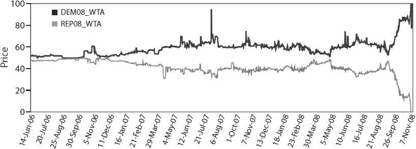

# 九、作为平台的比特币

在前面的章节中，我们开发了比特币的技术基础，并看到了它如何被用作货币。现在我们来看看除了货币以外的应用，我们可以使用比特币作为核心组件来构建这些应用。其中一些像今天一样依赖比特币，没有任何修改，其他许多只需要很小的修改。

我们选择这些应用程序是出于实用和学术兴趣的结合。这个列表并不详尽，但看到这些应用程序如何工作(或可能如何工作，因为许多只是想法或建议)将让你深入了解比特币功能的许多用途。

**9.1。作为仅附加日志的比特币**

将比特币想象成一个*只附加日志*是很有帮助的——一种我们可以向其中写入新数据的数据结构，其中数据是防篡改的，并且一旦被写入就永远可用。我们还有一个安全的排序概念:我们可以判断一个数据是在另一个数据之前还是之后写入日志的。这种排序源自数据块哈希指针，而非数据块时间戳—数据块的时间戳实际上可能比其前身的值更低(更早)。这是因为矿工可以谎报时间戳，矿工的时钟可能不同步，并且网络存在延迟。也就是说，如果块时间戳看起来相差几个小时以上，那么其他矿工会拒绝它，因此我们可以相信时间戳大致正确。正如我们将看到的，这些属性证明是非常有用的。

安全时间戳

仅附加日志可用于从比特币构建安全的时间戳系统。我们希望能够证明我们知道在某个特定时间 *T* 的某个值 *x* 。我们可能不希望在时间 *T* 实际显示 *x* 。而是我们真正做证明的时候才想揭示 *x* ，可能比 *T* 晚很多(当然如果在 *T* 的时候就知道了，在 *T* 之后还是知道的)。然而，一旦我们做了证明，我们希望证据是永久的。

回想一下第 1 章中的内容，我们可以使用散列函数提交数据。不用发布我们想要证明我们知道的数据 *x* ，我们可以只发布 hash *H* ( *x* )给区块链。hash 函数的性质保证了我们以后不会找到某个不同的值 *y* 具有相同的值，即*y*≦*x*使得*H*(*x*)=*H*(*y*)。我们还依赖于这样一个便利的特性，即只要 *x* 是从具有高最小熵的分布中选择的，那么 *x* 的散列就不会揭示关于 *x* 的任何信息，也就是说，它是充分不可预测的。如果 *x* 没有这个性质，那么我们可以挑选一个最小熵高的随机数 *r* ，用*H*(*r*|*x*)作为承诺，如[第一章](part0007.html#6LJU0-ea268daff50b4c55a00d858ef79f4a6c)所述。

主要的想法是，我们可以在时间 *T* 只发布散列值*H*(*r*| |*x*)，然后在稍后的某个时间，我们可以揭示 *r* 和 *x* 。任何人都可以查看仅附加日志，并确信我们在发布*H*(*r*|*x*)时一定已经知道了 *x* ，因为没有其他可行的方法来生成该数据。

时间戳的应用

我们能用这种安全的时间戳做什么呢？一个可能的用途是证明对某个想法的先验知识。假设我们想证明我们申请了专利的某项发明实际上早就在我们的脑海里了。当我们第一次想到发明时，我们可以通过发布设计文档或示意图的散列来做到这一点——而不向任何人透露想法是什么。后来，当专利被申请或想法被公布时，我们可以公布原始文件和信息，这样任何人都可以确认我们在公布对它的承诺时肯定已经知道了这个想法。

我们也可以证明别人收到了我们发给他们的信息。假设 Alice 雇佣 Bob 执行一项编程工作；他们的合约要求鲍勃在特定的时间之前把他的作品提交给爱丽丝。双方都希望确保，如果以后有关于 Bob 是否提交了工作或者代码是否按照规范执行的争议，他们有提交了什么以及何时提交的证据。为了确保这一点，他们可以相互同意发布 Bob 提交的由双方签名的作品的散列。如果任何一方后来谎报了提交的内容或时间，另一方可以通过透露散列的输入来证明他们是错的(比如在仲裁法庭上)。

许多其他有趣的系统和协议可以仅使用比特币的安全时间戳功能来构建。甚至有一个完整的公钥签名方案(称为“Guy Fawkes 签名方案”)，它只使用散列函数和一个仅附加日志。它不需要任何通常用于公钥签名的加密技术。

对“千里眼”证据的攻击

有一件事我们不能单独用安全时间戳来做——尽管如果可以的话会很好——就是证明千里眼(预测未来事件的能力)。这似乎是可能的。这个想法是发布一个对即将发生的事件的描述的承诺(例如体育赛事或选举的结果),然后在稍后披露该信息以证明我们提前预测了该事件。但是这有用吗？


图 9.1。试图证明超视力。一个试图通过“预测”比赛结果来“证明”2014 年国际足联男足世界杯决赛被操纵的 Twitter 账户。第一条、第三条、第四条推文最后都是真的；其余的在赛后被删除。

2014 年末，世界杯最后一场比赛期间，有人用这种方法“证明”国际足球协会联合会(FIFA)这个管理世界杯的组织腐败。比赛结束后，一个推特账户因在推特上发布了比赛期间发生的几起事件而受到了极大关注，这些事件的时间戳甚至在比赛开始前就已经打上了。例如，它正确地在推特上说，德国将在加时赛中获胜，马里奥·格策将得分。表面上看，这证明了要么这个 Twitter 账户的所有者能够预测未来，要么这场比赛被操纵了。但事实上，该账户在比赛开始前就已经发布了所有可能的结果。对于每一个参与比赛的球员，都有一条预测他将得分的推特，一条关于比赛每一个可以想象的最终比分的推特，等等([图 9.1](part0015.html#fig9_1) )。在比赛结束前，所有的错误预测都被删除了，只剩下真正的“预测”

可以对任何安全时间戳系统进行相同的基本攻击。你只是简单地承诺各种可能的结果，然后只透露那些最终证明是真实的承诺。这意味着，如果你真的有能力预测未来，并想证明这一点，你必须证明你是一个特定的预测，而不是多个预测的时间戳。如果你发布基于散列的承诺，这是很难做到的，尤其是在比特币中，因为安全时间戳系统不会将承诺与任何个人的公共身份联系起来。如果你不透露他们，很容易公布大量的承诺，而你从不透露的承诺也不容易追溯到你。

以传统方式保护时间戳

这里有一个简单的低技术含量的方法来实现安全时间戳:通过购买广告，在报纸或其他公众广泛看到的媒体上发布你的数据散列。旧报纸的档案保存在图书馆和网上。这种方法在很大程度上保证了您在报纸出版当天就知道这些数据。后来，当你想透露你犯下的数据时，你甚至可以拿出第二个广告在同一份报纸上公布这些数据。

比特币中的安全时间戳

如果我们想用比特币而不是报纸来做时间戳，我们应该把哈希承诺放在哪里？交易中的某个地方？还是直接在一块？

最简单的解决方案(也是人们首先想到的一个)是，不要把钱发送到公钥的散列中，而是把钱发送到你的数据的散列中。这就“烧掉”了那些硬币，也就是说，使它们变得无法使用，从而永远丢失，因为你不知道对应于该地址的私钥。为了降低成本，您可能希望发送非常小的金额，例如 1 satoshi(比特币的最低交易金额)。

虽然这种方法很简单，但需要燃烧硬币是一个缺点(尽管燃烧的数量与产生的交易费用相比可能可以忽略不计)。更大的问题是，比特币矿工没有办法知道交易产出是不可支出的，所以必须永远跟踪。由于这个原因，社区不赞成这种方法。

一种更复杂的方法叫做 *CommitCoin* ，允许你将数据编码到*私有*密钥中。回想一下在[第一章](part0007.html#6LJU0-ea268daff50b4c55a00d858ef79f4a6c)中，我们说过:“对于 ECDSA，一个好的随机信源是必不可少的，因为一个坏的信源可能会泄露你的密钥。直觉告诉我们，如果在生成密钥时使用不良随机性，那么您生成的密钥很可能不安全。但 ECDSA 的一个怪癖是，即使你只在签名时使用不良随机性，并且你使用的是非常好的密钥，不良签名也会泄露你的私钥。”

CommitCoin 利用了这一特性。我们生成一个新的私钥，它对承诺进行编码，并且我们导出它对应的公钥。然后，我们向该地址发送一个微小的事务(例如，2，000 个 satoshi ),随后分两个块发回，每个块 1，000 个 satoshi。至关重要的是，在发回交易时，我们两次都使用相同的随机性来签署交易。这允许任何查看区块链的人使用这两个签名来计算包含承诺的私钥。



图 9.2。使用 OP_RETURN 标记时间戳。嵌入数据承诺的可证明“不可描述”的事务输出脚本。

与在公钥中编码您的承诺相比，这种 CommitCoin 交易避免了焚烧硬币的需要，也避免了矿工永远跟踪不可支付的产出。然而，它相当复杂。

无法使用的产出

截至 2015 年，进行比特币时间戳标记的首选方式是 OP_RETURN 交易，这将产生可证明不可描述的输出([图 9.2](part0015.html#fig9_2) )。OP_RETURN 指令会立即返回一个错误，因此该脚本永远无法成功运行，并且您包含的数据会被忽略。如[第 3 章](part0009.html#8IL20-ea268daff50b4c55a00d858ef79f4a6c)所示，这既可用作烧录证明，也可用于对任意数据进行编码。截至 2015 年，OP_RETURN 允许推送 80 字节的数据，这对于一个哈希函数输出来说绰绰有余(对于 SHA-256 来说是 32 字节)。

这种方法避免了未用事务输出集中的膨胀，因为挖掘器将删除 OP_RETURN 输出。这种承诺的成本实质上是一笔交易费的成本。通过对多个值使用一个承诺，可以进一步降低成本。截至 2015 年，已经有几个网站服务在这方面提供帮助。他们收集来自不同用户的承诺，并将它们组合成一个大的 Merkle 树，发布一个包含 Merkle 树根的不可描述的输出。该树的作用就像是对用户当天想要标记的所有数据的承诺。

非法内容

能够将任意数据写入区块链的一个缺点是人们可能会滥用该功能。在大多数国家，拥有或传播某些内容是非法的，特别是儿童色情制品，处罚可能会很严厉。版权法也限制某些内容的传播。

几个人已经尝试做这样的事情来“悲伤”(即骚扰或烦扰)比特币社区。例如，有报道称比特币区块链发布了色情内容的链接。这些黑客的目标是使下载区块链到你的硬盘上和运行一个完整的节点变得危险，因为这样做可能意味着存储和传输非法拥有或传播的材料。

没有什么好办法可以阻止人们将任意数据写入比特币区块链。一个可能的对策是只接受对脚本哈希付费的交易。这将使写入任意数据的成本有所增加，但仍然无法阻止这种情况。

幸运的是，法律不是算法。试图通过技术手段“黑掉”法律以产生意想不到或意想不到的结果是很诱人的，但这并不容易。法律旨在由人类来解释，并包含诸如意图等因素。例如，美国联邦法律中有关拥有、分发和接收儿童色情制品的部分,《美国法典》第 2252 条在描述被禁止的活动时使用了“*明知*拥有，或*明知*访问并意图查看”的措辞(重点是我们的)。

还值得注意的是，由于上面讨论的大小限制，图像等数据(或许除了极小的图像)不能直接写入比特币区块链。它们要么必须在外部托管，仅将链接写入区块链，要么以繁琐的方式跨多个事务进行编码。最后，大多数比特币客户端不具备解码和查看写入交易的数据的能力，更不用说跨多个交易编码的数据了。

覆盖货币

从积极的方面来看，由于任何数据都可以写入比特币，我们也可以在比特币的基础上建立一个全新的货币系统，而无需开发新的共识机制。我们可以简单地使用比特币作为一个只附加的日志，并将我们新货币所需的所有数据直接写入比特币区块链。我们称这种货币为*叠加货币*。比特币充当底层衬底，覆盖货币的数据使用不可描述的交易输出写入比特币区块链。

当然，比特币矿工不会真的验证你在区块链里写了什么，因为他们不知道(也不在乎！)你写的数据在你新币的规则下是否有效。任何愿意支付比特币交易费的人都可以在里面写任何东西。相反，您必须开发更复杂的逻辑来验证使用新货币的交易，并且该逻辑必须驻留在参与发送或接收该货币的每个最终用户客户端中。

例如，在叠加货币中，矿工不再能够拒绝双重花费。相反，每一个叠加货币的使用者都必须看看区块链的历史。如果覆盖交易试图花掉已经花掉的覆盖硬币，那么第二次交易应该被简单地忽略。出于这个原因，不存在覆盖货币的轻量级 SPV 客户端。

交易对手是主要的重叠货币。所有交易对手的交易都被写入比特币区块链。2014 年期间，所有比特币交易中有 0.5%至 1%携带交易对手数据。这种货币还支持比比特币更大、更丰富的功能集。这个想法是，由于交易对手不需要开发新的共识算法，而且由于比特币矿工不需要了解交易对手规则，开发者可以专注于开发有趣的功能，如智能合约和用户定义的货币。交易对手 API 可以比比特币 API 大得多，因为比特币矿工不需要理解它或认可它。

开发一种新货币而无需建立新的共识体系的潜力很有吸引力。你甚至不需要鼓励新矿工加入你的系统，你可以添加新功能，而不需要改变比特币。然而，这种系统仍然依赖于比特币——例如，它们与其他比特币交易一样，需要遵守相同的费用要求。这种方法也可能效率低下:覆盖货币上的节点可能需要处理大量数据，因为比特币节点不会为用户过滤这些交易。

**9.2。作为“智能财产”的比特币**

现在我们讨论用比特币来表示比特币系统中货币单位以外的东西。

回想一下第 6 章中的内容，你可以简单地通过跟踪交易图来追踪比特币系统中价值的所有权。请记住警告:本质上没有“比特币”这种东西——只有未用完的交易输出，我们称之为硬币。每个比特币都有一段历史，任何人都可以在区块链看到。一枚硬币的历史可以追溯到最初铸造硬币的一次或多次交易。如前所述，这不利于匿名，因为你经常可以通过这种方式追踪硬币的所有权。

智能财产

这个可追溯性属性有用吗？我们已经看到了为什么它对隐私有害，因为潜在的去匿名化用户。在这一节中，我们考虑这个属性如何也能赋予比特币的历史意义。

**可替代性**

比特币有历史的事实意味着比特币是不可替代的。在经济学中，可替代商品是指所有单个单位都是等价的，并且可以互相替代。例如，黄金是可替代的，因为 1 盎司(纯)黄金可以替代任何其他盎司的黄金。但比特币并不总是如此，因为每一枚比特币都是独一无二的，有着不同的历史。

在许多情况下，这段历史可能无关紧要，但如果这段历史对你想与之交易的人有意义，这可能意味着你的 1.0 BTC 和他们的 1.0 BTC 不一样。也许他们不愿意和你交换他们的，因为比起你的，他们更喜欢他们硬币的历史。例如，正如硬币收藏家重视旧硬币一样，有一天比特币收藏家可能会对起源于创世纪区块或比特币历史上其他早期区块的硬币赋予特殊价值。


图 9.3。给普通钞票添加有用的元数据。

让我们思考一下赋予普通线下实物货币历史意义的意义。假设我们想给离线货币添加元数据。事实上，有些人已经这样做了。例如，他们在钞票上写各种各样的信息，通常作为一个笑话或一种政治抗议。这一般不会影响钞票的价值，只是一种新奇。

但是，如果我们能够将经过认证的 T4 元数据附加到我们的货币上——这些元数据不容易被复制，那会怎么样呢？实现这一点的一种方法是在元数据中包括加密签名，并将该元数据与钞票的序列号联系起来。

这能用来做什么？假设一支棒球队想用美钞作为球票。这样，他们就不再需要麻烦地打印自己的门票，并确保没有人可以打印假票。纽约扬基队可以简单地断言具有特定序列号的美元钞票现在代表特定比赛和特定座位的门票。这些美钞的分发方式与纸质球票的分发方式相同，比如当粉丝们在网上购买球票时，这些美钞会被邮寄给他们。任何持有这张纸条的人都有权进入体育场，坐在指定的座位上，观看比赛，没有其他问题。钞票本身就是票！

为了增加真实性，扬基队可以使用数字签名。他们会在一条信息上签名，包括具体的比赛日期、座位号和账单的序列号——并在账单上加盖信息和签名。二维条形码将是该数据的便利形式。或者，体育场可以维护一个列出每场比赛的序列号和相应座位号的数据库。当持票人进入大门时，他们可以检查数据库中的这些信息，这样就不需要在钞票上盖章了。

这能给我们带来什么？现在货币可以代表很多东西。除了体育彩票的例子之外，还有许多其他应用。我们继承了钞票已经具有的防伪特性。政府努力确保很难复制钞票！此外，纸币的基础货币值保持不变。球迷兑换门票后，纸币完全可以作为普通货币使用。如果每个人都想在货币上标记元数据，这可能是一个问题，但是如果我们使用数据库方法，这个问题就解决了。

当然，这个新元数据的有用意义取决于我们对签署它的发布者的信任。必须有人知道有一个特定的密钥用于签署有效的洋基队球票-或下载洋基队的数据库-以识别其作为球票的价值。对其他人来说，它看起来就像一美元钞票。但这实际上是一种可取的属性，因为一旦这种票实现了它的目的，它就可以作为普通的美钞重新进入流通。

彩色硬币

我们能在比特币上做同样的事情吗？我们希望保留比特币的优良特性，比如在线交易能力、快速交易结算和不依赖银行。

主要想法是给一些比特币打上“颜色”，并在硬币易手时跟踪颜色印记，就像我们能够在物理货币上标记元数据一样。印有颜色的比特币仍然可以作为有效的比特币使用，但会额外携带这些元数据。

为了实现这一点，在一个称为“发布”事务的事务中，我们插入一些额外的元数据，声明一些输出具有特定的颜色。图 9.4 中的[给出了一个例子。在一次交易中，我们在一次交易输出中发出五个“浅灰色”的比特币，而另一次输出继续是正常的未着色比特币。其他人，可能有不同的签名密钥，在不同的交易中发行“深灰色”的比特币。为了直观起见，我们称这些颜色为“颜色”，但实际上颜色只是位串。唯一重要的性质是，同色同值的硬币是等价的。](part0015.html#fig9_4)

现在我们有了不同颜色的比特币。我们仍然可以做所有与比特币交易相关的正常事情。我们可以有另一个比特币交易，它接受几个输入:一些深灰色的硬币，一些浅灰色的硬币，一些未着色的硬币，然后把它们混在一起。它可以有一些保持颜色的输出。事务中可能需要包含一些元数据，以确定哪种颜色与哪种事务输出相匹配。我们可以将四个绿色硬币的交易输出分成两个更小的绿色硬币。后来，我们可以将多个绿色硬币组合成一个大的绿色硬币。

开放资产

截至 2015 年，在比特币中实现这种叠加的最受欢迎的提议是 OpenAssets。资产是使用一个特殊的付费脚本散列地址来发布的。如果你想发行彩色硬币，你首先要选择一个支付到脚本散列地址来使用。任何通过该地址转移进来的没有颜色的硬币将带着该地址指定的颜色离开。为了使这个有意义，你必须在某个地方公布这个地址。有各种各样的交易所追踪哪个地址赋予硬币什么颜色。由于硬币可以顺序地通过一个以上的颜色发行地址，因此它们可以具有一种以上的颜色。



图 9.4。彩色硬币。所示的事务图说明了“颜色”的发布和传播

每次进行涉及彩色硬币的交易时，都要插入一个特殊的标记输出。这是一个可证明的不可描述的输出，类似于用于给数据承诺加时间戳的输出。嵌入在标记输出中的元数据对有关如何在不同输出中划分传入颜色值的细节进行编码。

如前所述，这种做法与比特币兼容。由于不需要兑换比特币，矿工群体往往不会阻止或干预这些计划。它允许任何人声明他们想要的任何颜色，而不必向中央权威机构申请发行彩色硬币的权利。如果有其他人理解并遵守您赋予您发行的颜色的含义，您的彩色硬币可能会获得超出其名义比特币价值的额外价值。例如，如果扬基队发行彩色硬币，这些硬币将能够起到比赛门票的作用，只要体育场经营者理解它们的含义并让你凭彩色硬币门票入场。

这种方案的一个缺点是，我们必须将不可描述的标记输出放入每个事务中。这增加了一点开销，因为每次我们想交易一枚有色硬币时，我们必须放弃一些钱。第二个缺点是，矿工不检查有色硬币的有效性，只检查底层比特币。为了验证您收到的彩色硬币是否有效，您必须检查硬币涉及的整个交易历史，或者委托第三方为您进行检查。特别是不能像普通比特币那样使用瘦 SPV 客户端。这使得在手机等计算能力有限的设备上使用彩色硬币变得更加困难。

彩色硬币和智能财产的使用

*某公司的股票*。智能财产的一个经常被引用的动机是公司的股票。希望发行彩色硬币作为股票的公司会公布其发行地址，用该地址着色的比特币具有股票的功能。一个 satoshi 可能代表公司的一股。股东可以在区块链交易股票，而不需要像证券交易所这样的集中中介。当然，股东必须相信公司会兑现股份。例如，公司可能承诺按比例向每股股票支付股息，或者给予股东对公司决策的投票权。对于传统股票，这些承诺是合法的。截至 2015 年，彩色硬币或其他区块链资产在任何司法管辖区都没有法律认可。

*物理性质*。另一个潜在的用途是，彩色硬币可能代表对某些现实世界财产的要求。例如，一枚彩色硬币可能与一栋房子或一辆汽车相关联。也许你有一辆复杂的汽车，它能在区块链上追踪一枚特定的彩色硬币，并自动启动，为任何拥有这枚彩色硬币的人开车。然后你可以卖掉你的车，或者至少转让它的控制权，只需要在区块链做一笔交易。我们将在[第 11 章](part0017.html#G6PI0-ea268daff50b4c55a00d858ef79f4a6c)中看到这种能力如何在技术上实现，以及实现它的社会和法律障碍。但彩色硬币和智能财产的梦想是，任何现实世界的财产都可以在比特币世界中得到体现，并像比特币本身一样容易转让或交易。

*域名*。作为最后一个例子，考虑使用彩色硬币来执行现有域名系统的一些功能:跟踪互联网域名的所有权和转让以及域名到 ip 地址的映射。域名市场有各种各样有趣的特性:有无限多的名字，这些名字基于它们的可记忆性和其他因素有很大不同的价值，相同的名字对不同的人可能有非常不同的效用。有可能使用彩色硬币来处理域名注册和我们列出的功能。然而，支持这个应用程序也是一个著名的替代硬币“Namecoin”的焦点，我们将在第 10 章中详细讨论。每种方法都有好处:彩色硬币给你比特币区块链的安全性，而替代硬币更容易实现域名所有权、转让和 ip 地址映射所需的复杂逻辑。

9.3**。比特币安全多方彩票**

让我们考虑用比特币主持一个“抛硬币”游戏。同样，我们从描述我们试图构建的离线版本开始。

爱丽丝和鲍勃想赌 5 美元。他们都同意提前下注和决定赢家的方法。鲍勃将在空中抛一枚硬币，当硬币旋转时，爱丽丝会喊出“正面”或“反面”当硬币落地时，他们都立即知道谁赢了赌注，并且他们都确信结果是随机的，并且他们都不能影响结果。

这个仪式的步骤顺序以及抛硬币的物理过程在让双方相信这个游戏是公平的过程中起着至关重要的作用。这个方案的一个缺点是双方必须同时出现在同一个地方。此外，双方还必须相信谁输谁付钱。在网络世界中，我们希望能够有一个公平的彩票，同时解决确保输家付费的问题。

乍一看，这似乎是一个需要详细研究的非常特殊和有限的应用。有趣的是，Satoshi Dice 等基于比特币的赌博服务——与我们想要设计的系统不同，它依赖于可信方——已经证明非常受欢迎，有时代表了网络上所有比特币交易的很大一部分。

然而，我们想研究加密抛硬币的真正原因是，如果我们能为它设计一个安全的协议，我们就可以用这些技术来建立许多其他有趣和有用的协议。密码学家研究*安全多方计算*，在这种情况下，两个或更多互不信任的各方都有一些数据，并希望计算出一个依赖于他们所有数据的结果，但不会向彼此透露数据。想象一下密封投标拍卖，但是没有一个可信的拍卖人。通常，这些计算需要被随机化，比如说，为了打破平局。最后，我们可能希望计算结果以不可撤销的方式决定货币结果。也许我们想确保拍卖中的中标者向卖家付款；也许我们甚至想确保被拍卖的卖方(聪明的)财产自动转移给中标者。或者，也许我们想惩罚那些违反协议的人。

换句话说，一个安全的多方抽奖是一个简单的设置，在这个设置中可以研究一个非常强大的范式:相互不信任的参与者使用敏感的输入共同执行一个程序，这个程序不仅有能力操纵位，还能操纵钱。

在线抛硬币

第一个挑战是用一些网上的等效物来代替抛硬币机制。假设我们现在有三方，Alice、Bob 和 Carol，他们都希望以相等的概率选择数字 1、2 或 3。这是这种协议的一个尝试。他们每个人都选择了一个大随机数——爱丽丝选择了 *x* ，鲍勃 *y* ，卡罗尔 *z* 。他们互相告诉对方他们的数字，然后计算输出为(*x*+*y*+*z*)% 3。

如果他们都独立选择随机数，这种方法确实有效。但请记住，我们是在互联网上做这件事，没有办法坚持他们都“同时”发送他们的号码。Alice 可能会等到听到 Bob 和 Carol 的号码后再广播她的号码。如果她这样做了，你可以看到她想要什么就做什么的最终输出是多么微不足道。我们不能设计协议让每一方都相信其他各方都没有作弊。

为了解决这个问题，我们可以再次使用哈希承诺。首先，每个参与者挑选一个大的随机数，并公布这个数的散列。一旦完成，他们中的每一个人都会透露他们所选的号码。然后，其他人检查显示的数字是否与第一步中发布的值一致，并根据三个随机数计算最终结果，如下所示:

第一轮:

每一方随机挑选一大串——爱丽丝挑选 *x* ，鲍勃挑选 *y* ，卡罗尔挑选 *z* 。

当事人分别公布 *H* ( *x* )、 *H* ( *y* )、 *H* ( *z* )。

各方检查 *H* ( *x* )、 *H* ( *y* )、 *H* ( *z* )是否都是不同的值(否则中止协议)。

第二轮:

三方揭晓各自的数值， *x，y* ，z*z*。

每一方检查显示的值是否与第一轮公布的散列值一致。

结果是(*x*+*y*+*z*)% 3。

这个协议起作用的原因有两个。首先，由于散列输入 *x、y* 和 *z* 是大随机数，任何一方都无法预测第一轮之后其他方的输入。第二，如果(比方说)Alice 按照协议的规定随机选择她的输入，她可以确定最终的输出将是随机的，不管 Bob 和 Carol 是否随机选择他们的输入。

公平

如果有人没有透露他们的承诺会发生什么？在协议的第二轮，假设 Carol 一直等到 Alice 和 Bob 透露了他们的秘密。卡罗尔在透露她的秘密之前，意识到如果她透露，她将会失败。所以她可能会拒绝公布她的随机数——她可以声称忘记了或者假装离线。爱丽丝和鲍勃可能会怀疑，但他们没有好的追索权。



图 9.5。事务输出在定时哈希提交中使用的 scriptPubKey 和 scriptSigs。

我们想要的是一个方案，无论谁做出承诺，都必须在某个时限内透露。这是一个名为*公平性*的加密属性的实例。比特币为此给我们提供了一个极好的机制。

假设爱丽丝想做一个*定时承诺*，鲍勃是唯一关心此事的人。首先，爱丽丝以比特币交易输出脚本的形式建立了一个债券，规定它可以以两种方式之一花费。一种方法是利用来自 Alice 和 Bob 的签名事务。另一种花费方式是只有爱丽丝的签名，但前提是她也要透露她的随机数。如果 Alice 的随机字符串是 *x* ，那么 scriptPubKey 实际上包含了值 *H* ( *x* )。

接下来，Alice 和 Bob 都签署了一项交易，向 Bob 支付债券(这是两种支付方式之一)。为什么爱丽丝会同意呢？该交易带有一个 nLockTime 值，保证 Bob 在某个时间 *t* 之前不能要求债券。由于 Alice 计划在此之前披露其承诺价值并收回债券，因此她签署该交易是安全的([图 9.5](part0015.html#fig9_5) )。

现在，如果爱丽丝没有透露她的价值就离开了，鲍勃可以在时间 *t* 要求保证金。这不会迫使爱丽丝透露她的承诺，但她会失去她所建立的整个纽带。所以保证她会透露自己的秘密价值取决于她愿意投入债券的金额。

我们如何使用这个定时散列承诺来实现我们的安全彩票呢？我们将拥有和以前几乎一样的结构，除了不使用简单的散列提交，我们使用这些定时提交。无论谁在截止日期前没有透露他们的随机值，都将被没收用于补偿其他两名玩家的保证金。揭示随机值现在只是通过提供正确的秘密输入 *x* 来恢复键的问题。

这种抽奖方案可以在比特币之上实现。但是有点复杂，定时哈希提交需要多个非标准事务。当抽奖中有 *n* 方时，需要*n*2 个承诺，因为每一方必须为其他每一方提供份保证金。玩家不得不托管比他们下注的钱还要多的钱。但是对于小部分参与者来说是合理的，并且存在效率更好的变体。最重要的是，它作为一个存在证据，证明看似不可能的协议——比如在互联网上抛虚拟硬币，惩罚中止协议的一方——在比特币世界中是可能的。

9.4**。作为公共随机性来源的比特币**

在第 9.3 节中，我们展示了一群人如何共同选择一个公平的随机值。在本节中，我们讨论使用比特币来生成对公众中任何人都公平的随机值。为什么我们想要这种能力？让我们讨论几个已经依赖于公共随机值来源的应用程序的例子。

NBA 选秀彩票

每年春天在美国发生的一个例子是 NBA 选秀抽签。NBA 的所有 30 支球队聚集在一起，随机选择——根据每支球队在上一个赛季的表现进行加权——球队选择全国准备成为职业球员的顶级业余球员的顺序。这是 1985 年首次进行的。抽奖是在电视直播中进行的，包括在信封被放入一个透明的旋转滚筒后进行挑选。这种彩票在当时引起了一些争议，因为纽约尼克斯队在第一年获胜，并能够选中备受追捧的中锋帕特里克·尤因(最终成为篮球名人堂的一员)。由于彩票是在纽约市拍摄的，其他球队的一些球迷声称这一过程被操纵，有利于尼克斯队。

关于 NBA 可能如何操纵这一过程的阴谋论比比皆是，例如著名的“弯曲角落”理论，该理论认为尼克斯的信封有弯曲的角落，所以专员可以通过触摸将其与其他信封区分开来。另一种理论认为尼克斯队的信封被放在冰箱里，专员只是拿走了一个冷信封。这些理论说明了为什么很难持有这样一幅画并证明它是公平的——有许多貌似合理的作弊途径。想想看，专业的变戏法的魔术师能做些什么！即使在今天，这种抽奖每年都会发生，每次都会导致各种阴谋论和谣言，认为抽奖不是公平的随机抽奖。

美国军事征兵彩票

一个更严重的例子发生在 1969 年，当时美国举行征兵抽签来决定哪些年轻人需要加入军队。他们中的大多数被派去参加越南战争。使用了类似于 NBA 抽签的程序，由美国国会的几名代表执行，并在电视直播中播出([图 9.6](part0015.html#fig9_6) )。他们将标有一年中每一天的小胶囊倒入一个大塑料桶中，然后轮流伸手将数字抽出。符合应征条件的男性会根据他们生日的日期获得一个优先号码。优先编号决定了它们的起草顺序。



图 9.6。图片来自 1969 年(越南战争)军事征兵抽奖。



图 9.7。1969 年选秀彩票的统计偏差。一年中的某一天(*x*-轴)与彩票号码(*y*-轴)。斯坦纳德的好意。

1969 年的征兵是第一次在全国范围内使用抽签程序。目标是使这个过程更加公平(从成千上万的地方征兵委员会手中接过来),并向公众证明这是一个随机的过程。不幸的是，抽签被搞砸了。一周之内，统计学家在查看数据时注意到一种异常模式(如图 9.7 所示)。年末的几天收到了较低的草案数字。尽管这种偏差是细微的，但它在统计上是显著的，而且极不可能是偶然发生的。当他们查看磁带时，结果显示鼓正好旋转了偶数圈，这样开始在顶部的胶囊倾向于仍然在顶部。没有足够的混合使其成为统计学上的随机抽取。

这两个例子表明，很难产生公众随机性，也很难让公众相信结果是真正随机的。这个过程有可能会受到影响。还有一个风险是，即使这个过程是随机的，公众也不会相信。

加密信标

在历史上，使用轮子、掷硬币、掷骰子等方式公开展示随机性非常流行，因为它们既便宜又容易理解。但是它们不太适合大规模的场景，因为它们很难审计。即使这个过程的视频看起来是合法的，人们也可能合理地怀疑彩票的主持人耍了一些花招来操纵这个过程。

我们能在加密方面做得更好吗？让我们使用术语*加密信标*来指代提供公共随机来源的服务。这个想法是，信标会以一个没有人能提前预测的固定速率不断发布新的随机数据。希望每个人都同意，没有人能够预测信标下一步会输出什么，所以每个人都可以依赖它作为一个公平的随机值。

如果存在完美的加密信标，那么它可以用于任何公共彩票。即使你只是想在当地的社交俱乐部玩宾果游戏，你也不需要使用一大堆数字。如果每个人都信任信标，与使用随机的物理显示相比，你会节省很多努力。

密码学家提出了公共随机性的许多其他应用，包括投票系统、零知识证明和切割选择协议。使用一个完美的加密信标可以更简单有效地完成其中的许多任务。不幸的是，我们还没有找到一个完美的方法来实现这样一个信标。

国家标准和技术研究所信标

国家标准和技术研究所(NIST)自 2011 年以来经营自己的信标服务。他们声称通过一个复杂的涉及两个纠缠光子的实验室设置来产生他们的随机数。这个想法是为了提供强有力的保证，保证这些数字是随机的，因为它们是由量子力学现象产生的。如果你接受海森堡测不准原理和其他被广泛接受的物理定律，那么这个信标应该是真正随机和不可预测的。该服务被设置为每 60 秒生成一个新的随机数据，并对数据进行数字签名。NIST 信标为编程应用程序提供了一个方便的接口:这些数字可以简单地从网络提要中读出。

从某种意义上说，这种量子力学过程是随机物理表现的极限。但是这无助于缓解信任的根本问题——你必须相信 NIST 确实在履行他们声称的程序。你必须相信，在马里兰州的某个建筑里，NIST 有一个真正的实验室来产生这些数字，他们不仅仅是在进行这个程序。您还必须相信，他们没有保留在发布之前故意覆盖一些随机值的能力。

建造灯塔的其他潜在方法:自然现象

那么另一种方法呢，我们使用一些每个人都能观察到的自然现象？也许我们可以利用天气的细节，比如明天某个地方的温度，或者风力有多强，或者是否会下雨。当然，我们有一些提前预测天气的能力，但并不精确，所以也许我们可以使用测量值的最低有效位作为随机数生成器。这里的限制是所有的参与者需要在同一个地方获得相同的测量值。

为了避免这个问题，我们可以转向太阳黑子，这是太阳表面的活动爆发([图 9.8](part0015.html#fig9_8) )。再比如宇宙背景辐射，就是你在地球上任何一点用无线电天线都能听到的噪音；每个人都应该能够读取相同的值。这些现象发生的规模如此之大，以至于你很容易说服自己，没有人会成功操纵这一过程。想象有人会驾驶宇宙飞船飞向太阳表面，以某种方式篡改它，只是为了在地球上操纵一些彩票，这是很牵强的。因此，这些方法有几个好的特性:公共可观察性、防止操纵的安全性，以及(在大多数情况下)可接受的不可预测性。


图 9.8。美国宇航局的太阳黑子图像。礼貌:美国宇航局。

这些方法的一个问题是它们相当慢。例如，如果你的随机信号是每天的高温，那么你每天只能得到一个读数。太阳的表面不会经常变化。在许多密码应用中，随机位被用作*伪随机发生器*的输入。为了保证伪随机发生器的安全，输入需要 80 位(或更多)长。基于天气和天文学的来源积累 80 比特的随机性可能需要一段时间。

此外，测量太阳黑子需要专业知识，所以你实际上需要依靠一些可信的观察者来发布测量结果。然而，可能会有许多值得信任的观察者，我们可以希望他们会“彼此保持诚实”使用信标的应用程序或此类应用程序的用户可以选择依赖哪个观测器。他们还可以随时轻松切换观察者。这种特性被称为“信任敏捷性”，可以说它优于由一个实体(如 NIST)来产生信标。

还有一个更深层次的问题，乍看起来似乎微不足道。我们如何将一个真实世界的观测结果——一个温度，一张太阳黑子的照片——转换成一串比特，使得每个观测者最终得到相同的比特串？我们可以尝试量化测量:例如，我们可以用华氏温度表示温度，并使用第一个十进制数字作为信标输出。但是，除非每个观察者的温度计都精确得不切实际，否则会有一些观察者将温度读数(比如说)为 62.7，而其他人将读数为 62.8。似乎无论我们选择哪种自然现象，使用哪种协议，总会有“极限情况”，不同的观察者最终会得到不同的位串。对于加密信标，即使很小概率的不一致测量也可能是不可接受的，因为这将导致伪随机发生器输出的随机位完全不同。

财务数据

一个类似的想法是使用金融数据，如股票市场价格。同样，这些都是公开可见的价值。与自然现象不同，它们被报告为数字值，因此不一致的观察问题消失了。有充分的理由相信预测股票价格的低水平波动是困难的:如果你能在一便士之内预测出一只特定股票明天在纽约证券交易所的最终价格，你就能作为一个日内交易者获得大量利润。有人可能会试图通过买卖股票来影响价格，使其达到特定的价值，但这有着你无法避免的实际成本。

然而，这种方法也存在依赖可信方，即证券交易所的问题。即使证券交易所有建立其诚信的强烈动机，如果允许他们操纵有价值的彩票，他们仍然可能被怀疑试图以一分钱操纵股票价格(例如，通过将他们自己的订单插入订单簿)。

到目前为止考虑的所有方法似乎都要求有一个可信的、对过程的某些关键部分有影响力的一方。



图 9.9。作为灯塔的比特币。我们可以通过将一个称为“随机性提取器”的函数应用于区块链中的块头来提取公共随机性。

用比特币作为灯塔

贯穿本书的一个主要主题是，比特币是一种很有前途的技术，可以用我们以前认为不可能的方式消除协议中的集中信任。我们可以用比特币作为随机信标吗？我们希望从比特币区块链中提取随机数据，同时保留让比特币本身如此吸引人的去中心化属性。

回想一下，当矿工们试图找到一个获胜的区块时，他们必须计算大量的随机散列值。也许这意味着，如果不进行实际的挖掘工作，没有人能够预测或影响下一个块散列会是什么。当然，任何块散列的前几个比特将是零，但事实证明，在适当的假设下，预测剩余比特的唯一方法是通过找到一个获胜的块并选择性地丢弃它来影响它们([图 9.9](part0015.html#fig9_9) )。

这使得把区块链变成一个随机灯塔变得很简单。对于链中的每个块，我们将“随机性提取器”应用于块头的值。粗略地说，随机性提取器就像一个哈希函数，它被设计成将输入的所有随机熵压缩到一个均匀随机的字符串中。每次发布一个块，我们都有新的信标输出。

评估比特币信标的安全性

假设你正在参加一场彩票，其结果由区块链高度为 *h* 的某个预先指定的未来街区的比特币信标输出决定。这个彩票有 *N* 个玩家，他们每个人都在下注 *B* 比特币。如果你也是一名矿工，你可能会幸运地找到区块 *h* 的散列谜题解决方案。然后，您可以选择是否发布该块。如果您不喜欢发布您找到的块所导致的抽奖结果，您可以简单地放弃它，让其他发布块 *B* 的人来决定抽奖结果。然而，你会放弃你可以从该区块赚取的收入。

让我们来计算一下 *B* 需要多大的赌注才能让你觉得选择性弃牌策略值得。你成功地找到了块高度为 *h* 的块，并意识到如果你发布它，你肯定会输掉彩票，而如果你丢弃该块，你仍有 1/ *N* 的机会赢得*B*N 比特币。这意味着，如果你的预期支出(1/*N*)*B**N*比特币(即 *B* 比特币)大于开采一个区块的回报(2015 年为 25 BTC，忽略交易费用)，那么丢弃该区块将是理性的。所以攻击有利可图如果*B*25。2015 年，25 BTC 价值超过 5000 美元。因此，如果每个玩家的赌注低于 5000 美元，假设玩家是理性的，彩票将不会受到这种攻击。

这个方案的优点之一是它是一个完全分散的信标，没有中心信任点。与其他一些 beacon 提案相比，它的速度相当快。它大约每 10 分钟就会产生一次输出。使用上面的简单模型来估计攻击者操纵信标输出的成本也很有用。

使用比特币作为灯塔的一个缺点是，它的时机有点不准确。假设我们想在明天中午读取信标值。我们不知道具体哪个区块会是那个时候的最新区块。虽然平均而言，一个区块会在中午前后 10 分钟内发布，但还是有一些差异。如果我们想降低我们所看到的块在短分叉中丢失的可能性，我们还必须计划容忍多一点的延迟。和比特币的通常情况一样，我们希望等待大约六个街区的到来，然后我们才相信信标值已经真正稳定下来。

另一个缺点是，对于我们关心的一些应用程序来说，操纵信标值的成本可能太低。如果我们真的在进行 NBA 选秀，其中有数千万美元处于危险之中，那么突然之间，其中一个团队开始贿赂比特币矿工来操纵这一过程可能看起来是值得的。这仍然是一个悬而未决的问题，当数百万美元危在旦夕时，我们是否可以扩大这一建设，使其安全。

最后，我们的安全评估忽略了一些现实生活中的因素。例如，一个矿工是一个矿池的一部分，丢弃一个区块不会损失太多，因为他们的奖励是基于股份而不是区块。目前，比特币信标是一个有趣但未经证实的想法。

信标的脚本支持

如果我们用一个特殊的操作码来扩展比特币的脚本语言，以读取信标值，会怎么样？目前，比特币脚本中没有任何随机性。这是故意的，因为矿工必须验证脚本，他们都希望就脚本是否有效达成一致。但是如果我们使用信标值，它是可证实随机性的公共来源。我们可以使用信标将随机性添加到每个矿工都同意的交易脚本中。

假设我们有一个操作码，它将根据前一个块的信标输出做出随机决定。我们可以用一个脚本来代替整个复杂的彩票协议，这个脚本读取信标值并将输出分配给 *n 个*键中的一个。它不需要多轮协议、安全押金或定时散列承诺。

这种想法的一个缺点是，如果矿工发现将彩票交易包括在他们正在开采的区块中会导致他们失去彩票，那么他们现在可以简单地通过将彩票交易延迟到后面的区块来操纵彩票。它不再需要没收块奖励。可以修改信标操作码来避免这种攻击。您可以指定使用特定块高度的信标值，而不是参考前一个块。

**9.5。预测市场和真实世界的数据来源**

最后，我们看看如何使用加密货币以分散的方式实现*预测市场*，以及将现实世界的数据引入比特币的相关主题。预测市场允许人们聚集在一起对未来的事件下注，如体育比赛或选举。预测市场的参与者购买、出售和交易此类事件特定结果的“股份”。

让我们通过一个例子来阐明支撑预测市场的概念。2014 年世界杯在巴西举行。假设有一个市场，你可以买卖与每个团队相关的股票，获胜团队的每股股票最终价值 1 美元，其他所有股票价值 0 美元。在锦标赛开始时，每支球队都会根据市场认为他们获胜的可能性，以某个非零价格开始。六个不同团队的示例如[表 9.1](part0015.html#tab9_1) 所示。

在赛前阶段，德国队的股价约为 12 美分，这意味着市场大致认为德国队有 12%的胜算。随着锦标赛的进行，这些价格将会波动，反映出市场参与者如何调整他们对每支球队获胜可能性的信念。

在我们的例子中，英格兰最初的交易价格为 5 美分，但在小组赛后跌至 0。那是因为英格兰在小组赛就被淘汰了。他们不再有任何获胜的机会，价格反映了这一点；他们的股票现在一文不值。相比之下，最初被认为几乎没有机会在小组赛中幸存的美国队表现非常出色。如果你一开始就想在美股便宜(1 美分)时买入，你可以在小组赛结束后立即以 6 美分的价格卖出。你会赢回六倍的钱。你不必等到锦标赛结束后才能获利。尽管美国队最终没有赢得锦标赛，但在他们在小组赛中的出色表现后，你预计他们获胜的可能性会发生变化，这一事实将使你受益匪浅。

在半决赛中，只剩下四个队。美国和英国被淘汰了，所以他们的股价已经跌到了 0。现在剩下的每个团队价格都比较高，他们的股价加起来应该是 1.0。巴西尤其有望获胜，因此价格最高。事实上，巴西在半决赛中输了，他们的股价跌到了零。在几个小时的时间里，市场的信念发生了戏剧性的变化。如果你有信心参加巴西被高估的比赛，你会在很短的时间内获利；你可以“做空”巴西，或者押注其他球队(或者两者兼而有之)。

**表 9.1。2014 年世界杯期间部分球队在假设预测市场上的美元价格**



注:在美国队在小组赛中表现出色后，押注美国队赢得奖杯的股票价格从 1 美分升至 6 美分。随着巴西进入半决赛，巴西的股票逐步上涨到 45 美分，然后在巴西输掉半决赛后失去了全部价值。世界杯结束后，只有德国(赢得了世界杯)的股票还有价值。

进入决赛的只有两支队伍，他们的份额再次加起来是 1.0。当然，在锦标赛结束时，唯一有价值的股票是德国队的股票，因为他们最终赢了。

显然，获利的一种方式是一开始以 12 美分的价格购买德国的股票，并一直持有到最后。这基本上是传统体育博彩的工作方式——你在比赛开始前下注，比赛结束后收取奖金。然而，在预测市场中，有许多其他的方法来玩和获利。你可以在任何时候投资任何团队，你可以仅仅依靠预测人们的信念会改变的能力来获利，而不管最终的结果如何。

**预测市场的力量**

经济学家往往热衷于预测市场。与预测未来事件相关的信息通常是广泛分散的，而预测市场是一个很好的机制，通过给参与者一种从他们的知识中获利的方式来聚集这些信息。在合适的经济模型下，股票的市场价格可以解释为结果的概率，尽管有人担心真正的预测市场会有偏差。从经验上看，预测市场相对于其他预测方法，如投票和专家小组，表现良好。

然而，预测市场面临许多监管不确定性和障碍。Intrade 在美国遇到监管合规问题并于 2013 年关闭之前，是互联网上最受欢迎的预测市场。许多经济学家对它的关闭感到失望，因为他们认为我们失去了一个揭示未来有用信息的有价值的社会工具。

【T2

图 9.10。预测市场份额。2008 年美国总统大选预测市场份额的价格。来源:爱荷华电子市场。

这是另一个例子，这次来自一个真实的预测市场。在 2008 年美国总统大选之前，爱荷华州电子市场允许人们购买巴拉克·奥巴马或约翰·麦凯恩是否会获胜的股票。在[图 9.10](part0015.html#fig9_10) 中，巴拉克·奥巴马的股票价格显示为黑色，麦凯恩的股票价格显示为灰色。你可以看到，随着几个月的竞选活动的展开，人们对谁会赢的信念发生了波动。但是在选举的前一天，奥巴马有 90%的胜算。市场很清楚，投票之前，结果基本上已经确定。

分散预测市场

建立一个*分散的*预测市场需要什么？有几项任务需要下放。我们需要一种方法来接受金钱和支付支出，并根据结果强制支付正确的金额。我们尤其需要分散仲裁。仲裁是断言哪些结果实际发生的过程。大多数时候，在国家选举或体育比赛中，谁赢谁输是显而易见的。但是也有很多灰色地带。最后，订单簿——这是人们寻找交易对手进行股票交易的一种方式——必须去中心化。我们将依次讨论这些挑战。

让我们设计一个名为“Futurecoin”的假想替代硬币，它明确支持预测市场。我们需要一些新的交易类型来执行特定于预测市场的功能。这些函数可能类似于图 9.11 。

CreateMarket 允许任何用户通过指定仲裁人(根据公钥)为任何事件创建预测市场，该仲裁人被授权宣布该事件的结果以及可能结果的数量。event_id 是一个任意字符串，它将涉及同一市场的不同交易联系在一起。Futurecoin 不关心真实世界的事件 event_id 指的是什么，也不关心结果是什么，也没有办法在系统中指定这些。用户必须从市场创建者(通常与仲裁者相同)那里获得这些信息。我们将很快讨论不同的仲裁选择。


图 9.11。未来新的交易类型。Futurecoin 是一个假想的 altcoin，实现了去中心化的预测市场。

支付和结算

BuyPortfolio 允许您购买某个事件的股票组合。以一枚未来币的价格，你可以购买事件每一种可能结果的一股股票。假设我们在赌 2014 年世界杯。有 32 支队伍可能会赢。用一枚硬币，你可以购买 32 股股票，每支球队一股——这显然正好“值”一枚硬币，因为其中一支球队将最终获胜。任何用户都可以单方面创建买入组合，而无需交易对手。该交易实质上破坏了用户作为输入提供的一个期货币，并在每个结果中创建了一个新的份额。还有一种交易类型是出售投资组合，它让你在每一个结果中出售(或烧掉)一份股票，以获得一个未来的回报。对于一个未来币，你可以购买每一个结果的股份，然后你可以将每一个结果的股份转换成未来币。

你也可以用股票换期货，或者用一种股票换另一种股票，只要你能找到交易对象。这个案子有趣多了。你可以花一笔未来的钱购买每种结果的股票，然后卖掉你认为不太可能发生的结果的股票。对于你不想下注的球队，你可以把这些股份卖给其他想下注的人。一旦你这样做了，你就不再在每个团队都有一个平衡的投资组合，你也不再能自动地把你的投资组合兑换成一个未来的积分。相反，你必须等到赌注结束才能赎回你的股份——如果你下注的球队没有赢，你可能根本不能赎回它们。然而，你也可以通过交易直接获利。你可以购买一个平衡的投资组合，等待价格变化，,然后直接出售所有股票以换取未来货币，然后你可以用这些货币交易比特币或你选择的任何其他货币。

预测市场仲裁

怎样才能做到去中心化的仲裁？我们如何断言谁真正赢了，这样人们就可以在最后赎回他们赢的股份？最简单的系统是有一个可信的仲裁者，这就是 CreateMarket 所做的(见[图 9.11](part0015.html#fig9_11) )。任何用户都可以启动一个他们是仲裁者的市场(或者指定其他人作为仲裁者)。他们可以创建一个交易，并宣布他们正在打开一个关于世界杯结果的市场。他们将决定最终谁会赢，如果你信任他们，那么你应该愿意接受他们在封闭市场交易上的签名，作为结果的证据。

正如在许多其他市场一样，我们认为，随着时间的推移，一些实体将建立起作为可靠仲裁者的声誉。那么他们就会有一些动力去正确地进行仲裁，以维护他们宝贵的声誉。但是，通过操纵赌局，他们总是有可能偷很多钱——比他们的名誉更值钱。在预测市场中，这将是危险的。例如，在世界杯市场上，仲裁人可以断言阿根廷赢了，尽管他们实际上输了。如果仲裁人在阿根廷身上下了重注，那么他们可能会从中获得足够的利润，从而有理由毁掉自己的名声。

我们能有一个更分散的仲裁系统吗？一种选择是指定多名仲裁员，根据多数决定结果。一些选项基于投票——要么由市场中持有股票的所有用户投票，要么由加密货币的矿工投票。这方面的提案通常建议惩罚投票反对多数的参与者。但是这些方法有许多潜在的问题，我们不知道它们在实践中的效果如何。

另一个问题是，有时现实是复杂的。除了仲裁员撒谎的问题之外，对事件的结果可能会有合理的争议。我们最喜欢的例子是 2014 年的超级碗。超级碗有一个传统，获胜队向他们的主教练泼一桶佳得乐。人们喜欢打赌获胜队用于庆祝的佳得乐的颜色，这种打赌已经发生了二三十年。2014 年，人们押注黄色、橙色和其他所有颜色的佳得乐。但那一年，一个前所未有的结果让这场赌局难以了结。当海鹰队获胜时，他们把橘子佳得乐倒在他们的主教练皮特·卡罗尔身上。过了一会儿，其他几个玩家决定再来一次，把另一桶佳得乐倒在他身上。第一桶装的是橙色的佳得乐，第二桶装的是黄色的佳得乐。

如果你经营一个预测市场，人们对佳得乐的颜色下注，你会如何处理这种情况？目前还不清楚橙色、黄色或两者都应该获胜。几家体育博彩服务公司在实践中发生的事情是，他们决定最好损失一些钱来维持他们的声誉。为了表示对顾客的诚意，他们把赢的钱给任何赌橙色或黄色的人。

当然，在一个分散的预测市场中，这并不容易，因为你不能凭空创造钱来支付双方。取而代之的是，仲裁人可以在橙色和黄色之间平分奖金。这两只股票的收盘价不是 1.0，而是 0.5。你可以仔细定义合约以避免这种混乱，但是你不能确定你已经预料到了每一种可能性。这里的教训是，仲裁在一定程度上是一个社会问题，任何技术解决方案都不会是完美的。

数据馈送

仲裁的想法引出了一个更普遍的概念:用一种机制来断言真实世界的事实，从而扩展加密货币。我们称这样的机制为*数据馈送*。事实可能是典型的预测市场事件，如谁赢得了选举，某一天的股票或商品价格，或任何其他重要的现实世界数据。如果我们在比特币中有这样的事实，脚本语言将能够使用它们作为输入。例如，一个脚本可以将铜的当前价格加载到堆栈中，并根据价格做出决策。

如果可信的数据源存在，我们可以在体育比赛或商品的未来价格上下赌注，并自动结算。预测市场只是数据馈送能够实现的一个应用。你可以通过押注于你所拥有的股票价格来对冲投资组合中的风险。你可以衍生出各种各样的金融工具，比如通常在金融市场交易的远期和期货。如果我们能用比特币完成这一切，那岂不是很棒？

我们可以将如何用比特币(或替代币)表示真实世界的技术问题与如何提高我们对信息来源正确性的信心的社会技术问题分开。在讨论仲裁的选择时，我们已经讨论了前一个问题。

一种将数据输入普通比特币的巧妙方法被称为“现实钥匙”。在这个系统中，仲裁器为每个感兴趣的事件的每个结果创建一对签名密钥——一对表示“是”,一对表示“否”。artitrator 在事件首次注册时发布公钥，并在结果确定后发布两个*私钥*中的一个。如果 Alice 与 Bob 打赌结果会发生，他们可以将他们的赌注发送到比特币输出，该输出可以由 Alice 使用来自 Alice 的签名和来自“是”密钥来认领，或者由 Bob 使用来自 Bob 的签名和来自“否”密钥来认领。这个过程远没有达到能够以任意方式使用数据馈送值作为脚本输入的理想目标，但是它允许简单的应用程序，如上面描述的 wager。注意，仲裁人不需要知道或卷入 Alice 和 Bob 之间的特定赌注。

订购书籍

预测市场的最后一块是分散的订单簿。同样，这个概念是非常通用的，实现它将允许许多其他应用程序。什么是订单簿？在真实的预测市场或大多数金融市场中，没有单一的市场价格。取而代之的是*出价*和*要价*，它们被列在*订单簿*中。出价是任何人愿意购买股票的最高价格，而要价是任何人愿意出售股票的最低价格。通常情况下，要价大于出价(否则将有两个参与者匹配，交易将发生，并且至少一个订单将不再保留在订单簿中)。想要立即购买股票的参与者可以以要价购买，想要立即出售的参与者可以以出价购买。这些订单被称为“市价订单”，因为它们以市价执行，这与订单簿中记录的以指定限价(或更高价格)执行的“限价订单”相反。

传统上，这是以集中的方式完成的，由一个单一的订单簿服务(通常是一个交易所)收集所有订单。集中服务的典型问题是，不诚实的交易可能以牺牲参与者的利益为代价来获利。如果交易所收到市场买入指令，他们自己可能会在下单前从 best ask 买入，然后转身以更高的价格卖出刚刚买入的股票，将差价收入囊中。这种做法被称为“领跑”它出现在各种金融环境中，被认为是一种犯罪。集中式订单簿需要法律强制来阻止抢注，并确保对系统完整性的信心。

在一个分散的秩序册中，我们不能依靠强有力的法律执行。但是有一个聪明的解决办法，那就是简单地忘记抢先。与其宣称它是一种犯罪并对其进行辩护，我们不如称之为一种特征。这个想法是，任何人都可以通过广播交易向矿工提交限价单，矿工可以匹配任何两个订单，只要出价大于或等于要价。矿商只是将差价作为交易费的一种形式。现在，矿商没有动力抢先下单，因为抢先下单永远不会比简单地完成订单并获得剩余利润更有利可图。

这是一个建立分散订单簿的好方法。主要的不利因素是交易者必须支付的矿工费用。为了避免支付这笔费用，人们可能会提交更保守的订单，可能不愿意提前透露他们愿意交易的最佳价格。这可能会降低市场效率。我们还不知道这种矿商匹配订单的订单簿在实践中会如何运作，但这似乎是一个有前途的想法。

总之，今天的比特币可以作为各种应用的平台。但对于一些应用来说，比特币只能带我们走这么远。它不具备我们所需要的安全分散预测市场或分散订单簿的所有特征。

但是，如果我们能从零开始，在给比特币增加新功能时忘记软分叉、硬分叉和其他挑战，会怎么样？自 2008 年比特币首次问世以来，我们学到了很多东西。为什么不从头开始设计一种新的加密货币，让一切变得更好？

在下一章中，我们来看看替代硬币，它就是试图做到这一点。我们讨论了所有有希望的想法和启动新加密货币时将面临的挑战。

**延伸阅读**

我们查看的两个覆盖协议的项目页面和规范可以在以下位置找到:

```
The Counterparty Protocol Specification. Available at https://github.com/CounterpartyXCP/Documentation/blob/master/Developers/protocol_specification.md.
```

```
The OpenAssets Protocol. Available at https://github.com/OpenAssets/open-assets-protocol.
```

我们描述的安全多方彩票协议来自下面的文章，它不适合胆小的人:

```
Andrychowicz, Marcin, Stefan Dziembowski, Daniel Malinowski, and Lukasz Mazurek. “Secure Multiparty Computations on Bitcoin.” Presented at the 2014 IEEE Symposium on Security and Privacy, San Jose, CA, 2014\. Available at https://eprint.iacr.org/2013/784.pdf.
```

以下是经济学家关于预测市场力量的论文:

```
Wolfers, Justin, and Eric Zitzewitz. “Prediction Markets.” Paper w10504\. Cambridge, MA: National Bureau of Economic Research, 2004.
```

```
Arrow, Kenneth J., Robert Forsythe, Michael Gorham, Robert Hahn, Robin Hanson, et al. “The Promise of Prediction Markets.” *Science* 320, 2008.
```

我们描述的预测市场设计来自这篇论文，由几位作者合著:

```
Clark, Jeremy, Joseph Bonneau, Edward W. Felten, Joshua A. Kroll, Andrew Miller, and Arvind Narayanan. “On Decentralizing Prediction Markets and Order Books.” Presented at the Workshop on the Economics of Information Security, State College, PA, 2014\. Available at http://www.jbonneau.com/doc/CBEKMN14-WEIS-decentralizing_prediction_markets.pdf.
```