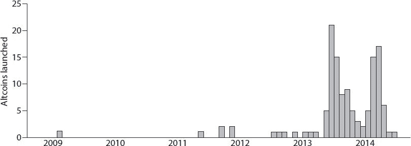
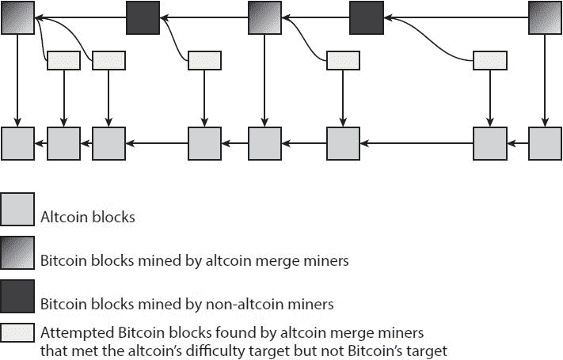
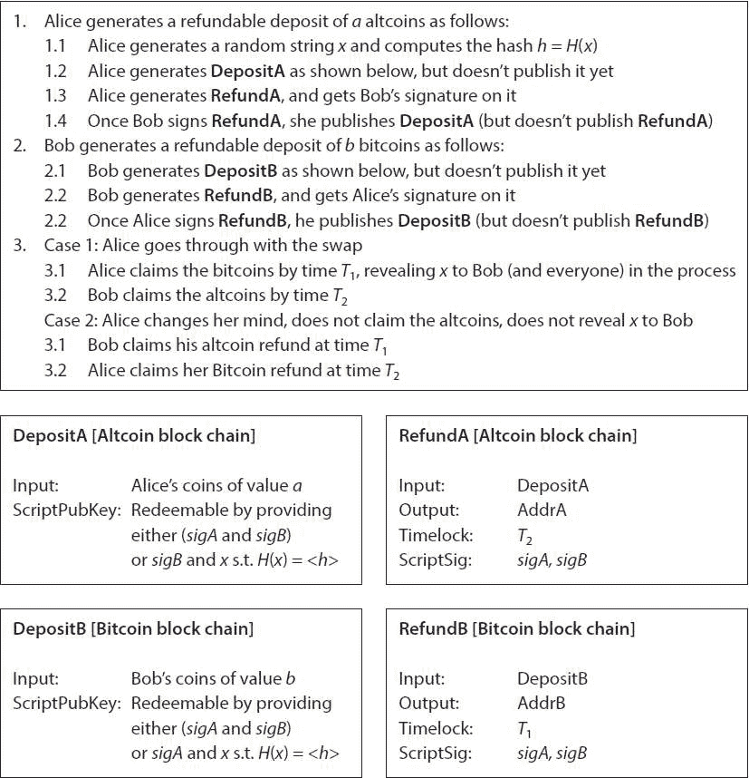
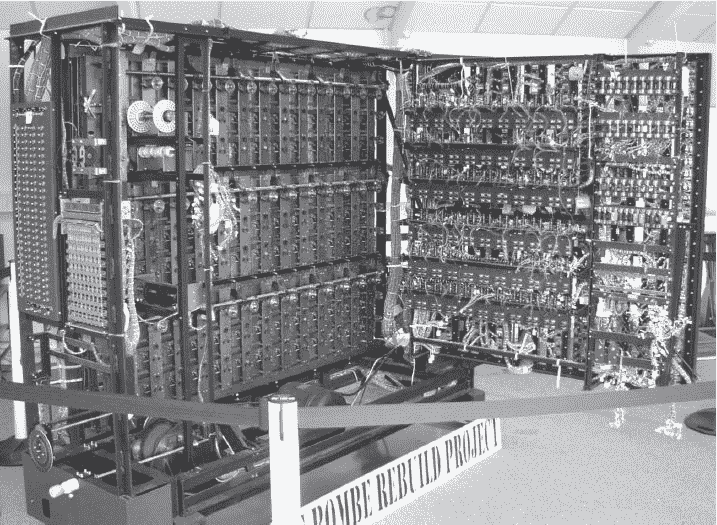
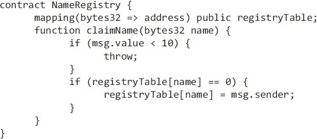

#  十、替代货币和加密货币生态系统

比特币只是一个更广泛的替代货币生态系统的一个组成部分(尽管是重要的一个)，但通常非常相似，被称为*替代货币*。在这一章中，我们来看看替代硬币和加密货币的生态系统。

**10.1。ALTCOINS:历史和动机**

比特币于 2009 年 1 月推出。直到 2011 年年中，第一个类似比特币的衍生系统——命名币才推出。altcoin 的推出率在 2013 年爆炸式增长，此后又有数百家公司跟进([图 10.1](part0016.html#fig10_1) )。总共有多少？一个确切的数字是不可能计算出来的，因为不清楚哪些代用币值得清点。例如，如果有人宣布了一个 altcoin，也许发布了一些源代码，但还没有人开始挖掘或使用它，这算吗？其他替代硬币已经推出，并看到了一些初步的使用，但随后在推出后很快死亡。

相对于简单的另一种加密货币，什么是替代硬币也不太清楚。毕竟，在比特币之前就有各种各样的加密货币提案和系统，它们通常不被称为“替代币”。许多替代币借用比特币的概念，通常直接派生其代码库或采用其部分代码。有些只对比特币进行微小的修改，比如改变系统某些参数的值，并继续纳入比特币开发者所做的修改。迄今为止，我们所知道的所有替代币都是从一个新的创世区块和它们自己的交易历史替代视图开始的，而不是在某个历史点之后分叉比特币的区块链。出于我们的目的，我们不需要替代硬币的精确定义。相反，我们将把自比特币以来推出的任何加密货币统称为替代货币。

这里我们顺便提一下非替代系统，如 Ripple 和 Stellar:这些是在第 2 章中考虑的传统分布式共识协议。这些系统在一个模型中达成共识，在该模型中，节点具有标识符并且需要知道彼此。当然，比特币完全背离了这一模式。在 Ripple 和 Stellar 中，共识协议支持支付/结算网络，每个系统都有一种本地货币。尽管与替代硬币有这些相似之处，但我们不认为它们在本书的范围之内。



图 10.1。每月推出的 Altcoins(以创世纪区块创建来衡量)。

推出 Altcoins 的原因

每个另类硬币都需要某种故事来讲述。如果一个替代硬币不能声称它有区别于所有其他硬币的特征，它就没有存在的理由。在最简单的情况下，一个 altcoin 只是简单地改变了比特币的一些内置参数。这些参数包括，例如，区块之间的平均时间、区块大小限制、正在创建的奖励计划以及替代硬币的通货膨胀率。

还可以有更复杂的技术差异，这使得 altcoin 更有趣。例如，对脚本语言的补充可以表达不同种类的事务或安全属性。挖掘可能会有所不同，共识算法可能会与比特币的算法大相径庭。

有时，推出替代硬币时会有一个主题或一种社区意识，替代硬币旨在支持或与之相关联，通常会赋予该社区成员在替代硬币中的特殊角色或能力。在本节的后面，我们将查看所有这些可能性的示例。

如何发射替代硬币

考虑一下发射 altcoin 的过程中涉及到什么，以及发射后会发生什么。正如我们提到的，创建一个替代币涉及到创建一个新的参考客户端，通常是通过分叉一些现有的、更完善的替代币或比特币本身的现有代码库。简单的部分是添加你认为会很好工作的技术特征或修改参数。事实上，曾经有一个名为“Coingen”的网站可以通过收取少量费用来自动完成这一过程。它允许您指定各种参数，如平均阻塞时间和您想要的工作证明算法，以及您的 altcoin 名称、三个字母的货币代码和徽标。然后，点击一个按钮，你就可以下载一个带有你选择的参数的比特币叉子，你(和其他人)可以立即开始运行它。

最难的部分是引导人们接受你的替代硬币。你可以派生源代码，也可以公开发布，但目前没有人在使用你的 altcoin。所以它没有市场价值(因为没人想要硬币)，也没有安全性(因为还没有矿工)。[第 7 章](part0013.html#CCNA0-ea268daff50b4c55a00d858ef79f4a6c)描述了比特币的各种利益相关者:开发者、矿工、投资者、商人、顾客和支付服务。最终，你将不得不吸引所有这些类型的参与者到你的替代货币经济中来，以使它起步。

这些群体很重要，而且相互关联。组装它们的挑战类似于启动任何其他平台并使其被采用的挑战。比方说，如果你想推出一个新的智能手机操作系统，你需要吸引用户、设备制造商、应用程序开发者和其他各种利益相关者，而这些群体中的每一个都需要其他群体。

吸引矿工对加密货币来说具有特殊的重要性，因为如果替代硬币背后没有足够的散列能力，如果双重支出和分叉是可能的，安全性可能会严重失败。事实上，你的替代硬币可能会被完全挤兑；我们在[第 10.4 节](part0016.html#sec10_4)中查看“奥特金杀婴案”。没有简单的方法来引导采用，但一般来说，一旦矿工们相信他们可以获得的挖矿回报值得他们努力，他们就会来。为了鼓励他们，许多 altcoins 给早期矿工更大的奖励。当然，比特币开创了这种方式，但一些替代币采取了更积极的方式来奖励早期矿工。

让一群人相信替代硬币是有价值的是最困难的把戏。正如在第 7 章中所讨论的，即使对于比特币，也不清楚这个过程是如何启动的，因为它依赖于小叮当效应。培养这种信念可以追溯到为什么替代硬币需要一个好的叙事:要起步，其社区必须相信新的替代硬币将变得有价值(并相信其他人会相信它有价值，等等)。其他重要元素通常跟随矿工和早期采用者。这些包括让你的替代币在交易所上市，开发各种类型的支持基础设施，从宣传基金会到探索区块链的工具。

泵和转储骗局

当一枚替代硬币的创造者成功建立了一个社区和一个真正的交易市场时，他们通常会发现自己非常富有。这是因为他们几乎肯定拥有大量的硬币——例如，在杂凑率上升之前成为早期矿工，甚至是“预挖矿”，我们将在下面讨论。一旦 altcoin 的汇率上升，创始人将能够抛售他们的硬币，如果他们愿意的话。

致富的可能性吸引了创业个人和风险投资来替代硬币，不出所料，它也吸引了骗子。事实上，两者之间的界限有时有点模糊。骗子可能会使用各种方法来夸大替代硬币的潜力，以引起人们的兴趣。他们可能会大肆宣传其所谓的技术优势，伪造草根支持的外表，以虚高的价格在市场上购买替代硬币，等等。

事实上，这种骗局甚至可以由不是 altcoin 创始人的人来完成。他们首先需要购买一些不知名的替代硬币的股份，然后让公众相信这种硬币被认为有未被发现的潜力(即，宣传替代硬币)。如果他们成功地以这种方式抬高了价格，他们就可以抛售股票并获得利润(即抛售他们的硬币)。在这一点上，投资者可能会对欺诈变得明智，价格会暴跌，许多人会持有毫无价值的硬币。这种利用默默无闻的低价股票的欺诈行为在主流金融领域由来已久，在替代硬币的早期也很常见，当时人们的热情很高，投资者很难区分真正创新的替代硬币和具有圆滑营销但没有真正创新的“模仿”系统。因此，如今用户和投资者都对山寨币保持警惕。

初始分配

在比特币中，货币仅通过挖掘分配给用户。但由于种种原因，altcoin 开发者除了挖矿，还寻求了其他的初始币配置方式。

开发者可以预先开采货币，即，为他们自己或一些其他指定的实体(例如，具有开发货币的特许的非营利基金会)保留货币供应的一部分。这个想法是，发横财的可能性给了开发者更多的激励，让他们花时间创造和推出一种新的加密货币。有时他们更进一步，进行预售，将这些预先开采的单位卖给其他投机者，换取比特币或法定货币。这有点类似于投资一家初创公司:如果 altcoin 做大了，投机者就可以暴富。

寻求额外的初始分配方法的另一个动机是确保发展一个拥有货币并与其成功有利害关系的早期采用者的多样化社区，因为今天的挖矿相当集中，并可能导致资产所有权的集中。实现多样化所有权的一个聪明方法是向现有比特币所有者分配替代比特币单位。

我们如何从技术上设计系统，让任何拥有比特币的人都可以要求得到他们的替代比特币份额，并自动裁决这一要求？一种选择是烧毁证明，我们在第三章中讨论过:用户可以按照他们可证明销毁的比特币数量的比例要求新替代比特币的单位。所有者将在燃烧证明中承诺一些数据，如识别特定 altcoin 的特殊字符串，以表明他们燃烧比特币只是为了赚取该特定 altcoin 的新单位([图 10.2](part0016.html#fig10_2) )。

通过燃烧证明分配替代硬币也被称为*单向挂钩*或*价格上限*。将一个替代币单位与一个比特币联系起来，实际上并不会让它值一个比特币。相反，它确保了替代币最多值一个比特币，因为一个比特币可以兑换一个替代币，但反之则不行。


图 10.2。通过燃烧证明分配替代硬币。altcoin 支持 GenCoin 交易，该交易将一个*比特币*交易作为输入。GenCoin 由签署烧录证明的相同私钥签署(使用相同的签名方案)。这确保了烧毁比特币的同一个用户也创建了 GenCoin。如果 peg 比率为 1:1，则*v*’必须不大于 *v* 。

还有一个不那么严厉的选择:要求证明比特币的所有权，但不要烧掉它们，以获得替代比特币。具体来说，替代币将指定一个比特币区块高度(可能与替代币的推出日期一致)，在此期间，任何拥有该区块未用完的比特币交易输出的人都可以要求一定比例的替代币([图 10.3](part0016.html#fig10_3) )。在这个系统中，比特币和替代币的价格之间不存在固定的关系，因为比特币不会通过烧录证明转换为替代币。

当然，要实现这些转换，替代比特币矿工也需要掌握比特币区块链。替代比特币必须说明什么才算已确认的比特币交易。一种选择是要求一些固定数量(例如，六个)的确认。另一种选择是在每个 altcoin 块中指定最近的比特币块。通过这种方式，比特币交易可以立即在 altcoin 中使用。这类似于在比特币本身内部，交易产出可以在下一个区块，甚至是同一个区块中花费。我们在[第 10.4 节](part0016.html#sec10_4)中讨论的合并开采是将替代币块与比特币块绑定的一种方式。


图 10.3。通过证明比特币的所有权来分配替代币。对 GenCoin 的输入是在指定块高度的一个或多个未用完的比特币交易输出。与任何普通的比特币交易一样，它将由控制这些未用输出的私钥签名。这里所示的比特币交易在指定的块高度处具有两个未用完的交易输出，到地址 B 和 C。地址 B 的所有者已经认领了他们的代用币，但是地址 C 的所有者还没有认领。如果 peg 比为 1:1，那么*v*’必须不大于*v*1。

最后，捐赠已经分配的硬币是增加货币所有者多样性的另一种方式。一种方法是给小费:各种服务允许向电子邮件地址或社交媒体账户发送小费，这在一定程度上是一种激励接受者了解和分享货币的方式。小费服务将硬币保存在代管账户中，接收者会收到一条信息，告诉他们他们可以收集硬币。接收者可以通过他们的电子邮件地址或社交媒体账户向该服务认证自己来认领硬币。他们还需要安装钱包软件或启用其他方式来接收硬币。另一种捐赠方法是水龙头:这些服务向任何访问网站并输入电子邮件地址的人发放少量硬币。

**10.2。几个山寨币详解**

在这里，我们将重点放在几个最古老的替代硬币上，并更详细地研究它们的特征。

命名硬币

我们已经看到比特币的区块链是一个安全的全球数据库。一旦数据被写入其中，该数据就是防篡改的，并且可以永远证明其包含性。我们能否修改比特币的设计，以支持安全全球数据库的其他应用，比如命名系统？

我们需要一些基本规则来使这个数据库对非货币应用程序更有用。首先，我们同意将数据条目视为名称/值对，名称是全局唯一的。这允许每个人查找映射到名称的值，就像散列表或带有主键字段的数据库一样。为了加强名称的全局唯一性，如果名称/值对与以前的数据库条目同名，那么我们将其视为值的更新，而不是新条目。

其次，我们同意只有最初为特定名称创建条目的用户才被允许对该名称进行更新。我们可以通过将每个名称与一个比特币地址相关联，并要求更新交易由该地址的私钥签名来轻松实现这一点。

我们可以在比特币的基础上做这一切，就像我们可以使用比特币作为附加日志来构建任何覆盖货币一样(见[第九章](part0015.html#E9OE0-ea268daff50b4c55a00d858ef79f4a6c))。但是在一个 altcoin 里面做更简单，因为我们可以把这个“君子协定”写进 altcoin 的规则里。然后，这些规则将是不可侵犯的，并由挖掘器执行，而不是要求每个用户(即，完整节点)检查规则并独立地决定如果违反了规则该做什么。如果处理得当，这种实现甚至允许 SPV 风格的证明:轻量级客户端将能够向运行完整节点的服务器提交查询(即名称)，服务器将返回该名称的值，以及返回值实际上是数据库中该名称的最新更新的证明。

简而言之，那就是硬币。这是一个全球名称/价值商店，每个用户可以注册一个或多个名称(象征性收费)，然后发布对他们任何名称的值的更新。用户还可以将自己名字的控制权转让给他人。事实上，你可以进行一项交易，将你的域名转让给某人，同时从他们那里转移一定数量的硬币给你。由于这是一个单一的原子交易，这是一个安全的方式来出售你的域名给你从来没有见过面，不信任的人。截至 2015 年，Namecoin 不支持安全轻量级客户端，但支持它们的扩展已经提出。

Namecoin 的目标是提供一个去中心化版本的域名系统(DNS)，数据库中的名称是域名，值是 IP 地址。默认情况下，你不能在未经修改的浏览器上使用这个功能，但你可以下载一个浏览器插件，比如说 Firefox 或 Chrome，它允许你输入一个地址，比如 example . bit——任何以“”结尾的域名。位”，它将在 Namecoin 注册表中查找位置，而不是传统的 DNS。

Namecoin 在技术上很有趣，在历史上也很有趣——事实上，它是第一个推出的 altcoin，在 2011 年 4 月，比特币推出两年多一点。其特点是合并开采(见[第 10.4 节](part0016.html#sec10_4))。

截至 2015 年，Namecoin 的使用率并不高。几乎所有的注册域名都被“擅自占用者”占据，他们希望(但目前为止失败了)出售他们的域名来获利。Namecoin 的支持者倾向于认为，现有的 DNS 将对互联网关键组成部分的太多控制权交给了一个实体。你可以想象，这种观点在比特币社区很流行，但看起来主流用户并没有吵着要 DNS 的替代品，抢走了 Namecoin 需要享受大量采用的杀手级应用。

莱特币

Litecoin 也是在 2011 年推出的，比 Namecoin 晚了一段时间。截至 2015 年，莱特币无论是整体人气还是用户基数都是排名第一的 altcoin。它也是最广泛的分叉代码库。事实上，它被分叉的次数比比特币本身还多。

莱特币和比特币的主要技术区别是，莱特币的特点是内存硬挖掘难题(基于 scrypt)，我们在第 8 章的[中讨论过。当莱特币推出时，比特币挖矿处于 GPU 时代，因此莱特币使用内存硬挖矿难题的目标是 GPU 阻力。当它推出时，你仍然可以在有 CPU 的莱特币上挖矿，尽管这对于比特币来说已经变得毫无用处。但从那以后，Litecoin 并没有成功抵抗向 GPU 挖矿再向 ASICs 的过渡。莱特币中的每一次挖矿转换都比比特币花费更长的时间，但不清楚这是因为莱特币的难题实际上更难在硬件上实现，还是仅仅因为莱特币的较低汇率提供了更少的激励来实现。](part0014.html#DB7S0-ea268daff50b4c55a00d858ef79f4a6c)

无论如何，与 CPU 挖掘相比，对于莱特币来说，ASICs 的性能改善与比特币大致相似。从这个意义上说，Litecoin 未能实现其最初的目标，即通过维护一个 CPU 矿工社区来创建一个更加分散的系统。但是，重要的是，这种叙事仍然为 Litecoin 的发展起到了作用——它吸引了许多采纳者，即使在最初的前提失败后，他们最终还是留了下来。莱特币后来明确改变了说法，称其最初的分配比比特币更公平，因为它抵制 ASICs 的时间更长。

莱特币还做了一些小的参数更改:例如，莱特币中的块到达速度比比特币快四倍，每 2.5 分钟一次。莱特币在其他方面尽可能多地借用比特币。事实上，它的发展遵循了比特币，以至于随着比特币的补丁和改进，莱特币也采用了它们。

Dogecoin

Dogecoin 可能是迄今为止所有替代硬币中颜色最丰富的了。它于 2013 年底发布，区分它的主要不是技术(它是莱特币的一个紧密分支)，而是一套社区价值观:小费、慷慨，以及不把加密货币看得那么重。事实上，它是以 Doge 命名的，Doge 是一个有趣的互联网迷因，以一只语法有问题的柴犬为特色([图 10.4](part0016.html#fig10_4) )。这个社区已经开展了几次有趣而成功的营销活动，比如赞助一名 NASCAR 车手，在他的车上贴满 Dogecoin 标志。他们还筹集了 3 万多美元来支持牙买加国家雪橇队，以便该队能够参加 2014 年冬季奥运会的旅行和比赛。有趣的是，这与 20 世纪 90 年代电影《酷跑》(Cool Runnings)的情节非常相似。


图 10.4。几个 Dogecoin 标志之一。卖点是幽默多于技术创新。Dogecoin 的徽标，版权所有 2013–2014 doge coin 开发者。

社区的慷慨、公关活动和 Doge 固有的模因价值的结合意味着 Dogecoin 在 2014 年变得流行。似乎许多早期采用者在 Dogecoin 之前对加密货币并不熟悉，这提供了一个新的社区来提升货币的价值，而不必提供关于相对于其他货币的优势的令人信服的故事。Dogecoin 表明，自举可以通过非技术叙事获得成功。但是就像许多互联网现象一样，这种流行并没有持续，Dogecoin 的汇率自此一落千丈。

10.3**。比特币和山寨币的关系**

我们可以使用各种指标来了解不同替代硬币的相对大小或影响。

比较替代硬币

市值

传统上，市值(“市值”)是一种估算上市公司价值的简单方法，方法是将股票价格乘以发行在外的股票总数。在替代硬币的情况下，这种市值通常类似地用于估计替代硬币的总价值，方法是将替代硬币的单个单位的价格(可能在最流行的第三方交易所测量)乘以流通中的替代硬币的货币单位总数。按照这个标准，比特币是迄今为止最大的——截至 2015 年，它占所有加密货币总市值的 90%以上。其他代用币的相对排名往往变化很大，但关键是大多数代用币的货币价值相对较小。

重要的是不要过度解读市值。首先，不一定要花多少钱才能买下流通中的所有硬币。这个数字可能会更高或更低，因为大订单会影响货币的价格。第二，尽管计算只考虑了目前流通的硬币，但我们应该预计市场参与者会将未来新硬币将进入流通的事实纳入汇率因素，这将使数字的解释进一步复杂化。最后，我们甚至无法准确估计目前流通的硬币的真实数量，因为一些硬币的主人可能丢失了他们的私人钥匙，我们也没有办法知道丢失了多少百分比的硬币。

矿业力量

如果两个 altcoin 用的是同一个挖矿拼图，我们可以直接通过 alt coin 的所有矿工的挖矿力有多大来比较。由于基于散列的谜题的突出性，这通常被称为“散列率”。例如，Zetacoin 是一种使用 SHA-256 矿业谜题的 altcoin，就像比特币一样，截至 2015 年 12 月，它的网络哈希速率约为 5 万亿哈希/秒(5 × 10 ^(12) 哈希/秒)。这个数字大约是比特币挖矿能力的十万分之一。比较使用不同挖矿谜题的硬币之间的挖矿能力更棘手，因为谜题可能需要不同的计算时间。此外，专为制造的挖矿硬件不一定能用来开采(包括攻击)另一枚硬币。

即使对于一个使用完全独特的挖矿拼图的 altcoin，我们仍然可以从挖矿能力随时间的相对变化中了解到一些东西。挖矿力量的增长表明，要么更多的参与者已经加入，要么他们已经升级到更强大的挖矿设备。失去挖矿能力通常意味着一些矿工已经放弃了 altcoin，这是一个典型的不祥之兆。

其他指标

我们还可以看看其他几个指标。一枚替代硬币的汇率随时间的变化为我们提供了关于其健康状况的线索，并且往往与它的散列率在长时间内的变化相关联。各种第三方交易所的交易量是衡量 altcoin 的活跃程度和兴趣的指标。相比之下，在 altcoin 的区块链上进行的交易量并不能告诉我们太多信息，因为这可能只是用户在钱包里随意移动自己的硬币，甚至可能是自动的。最后，我们还可以看看有多少商家和支付处理商支持 alt coin——只有最突出的货币倾向于得到支付处理商的支持。

比特币-替代币互动的经济观点

比特币和山寨币的关系很复杂。在某种意义上，加密货币相互竞争，因为它们都提供了一种在线支付的方式。如果在竞争中有两种标准、协议或格式在提供的内容方面大致相当，那么其中一种通常会占据主导地位，因为经济学家称之为“网络效应”。

例如，蓝光和 HD DVD 在 2000 年代中期和后期为成为 DVD 格式的继承者展开了激烈的竞争。渐渐地，蓝光开始变得更加流行，这在很大程度上是因为广受欢迎的 PlayStation 3 游戏机可以作为蓝光播放器使用。这使得蓝光成为电影工作室更具吸引力的格式，这种受欢迎程度也在不断增长:随着越来越多的电影以蓝光发行，越来越多的消费者购买独立的蓝光播放器，从而导致更多的电影发行等等。同样，如果你的朋友都有蓝光播放器，你会想自己买一个，而不是 HD DVD 播放器，因为你可以很容易地与他们交换电影。不出两年，HD DVD 就成了历史的注脚。

这种推理表明，一种加密货币——可能是比特币，目前最受欢迎的一种——将占主导地位，即使一些后续系统可能在技术上更胜一筹。但这可能过于简单化了。加密货币之间的竞争不像光盘格式之间的竞争那样敌对，至少有两个原因。

首先，用户可以相对容易地将一种加密货币转换成另一种，供应商也可以接受多种加密货币，这意味着多种加密货币可以更容易地共存和发展。从经济学角度来看，加密货币表现出相对较低的转换成本(T2)。将这种情况与 DVD 播放器的情况相比，大多数人真的不希望家里有两台笨重的机器，如果他们换成播放其他格式的机器，也不能转换他们现有的光盘库。加密货币的转换成本当然不是零。例如，用户可能会购买无法升级的硬件钱包。但总的来说，转换加密货币或同时使用多种加密货币很容易。

谁赢得了比赛？

早在 HD DVD 之前，从 Betamax 模拟录像带到俄罗斯轨距铁轨，就有无数技术标准迅速败给竞争对手并默默无闻的例子。如果你从未听说过这些过时的标准，网络效应就是原因。有时候，就像托马斯·爱迪生的直流电网和尼古拉·特斯拉的交流电网之争一样，胜利者(交流)是由压倒性的技术优势决定的。然而，在许多其他情况下，如 Betamax 磁带输给 VHS 磁带，输家可能实际上在技术上更胜一筹，网络效应足以克服轻微的技术劣势。

第二，如前所述，许多替代硬币都有独特的功能，这为它们的存在提供了独特的理由。这些替代币不应该被视为比特币的替代品；它们可能是正交的，甚至可能是互补的。从这个角度来看，互补的替代币实际上增加了比特币的实用性，而不是与之竞争。例如，如果 Namecoin 成功了，比特币用户可以用他们的比特币做一件更有用的事情。

但这幅愉快合作的画面也过于简单化了。一些替代硬币，如莱特币，只是试图实现与比特币相同的功能，但以不同的，也许更有效的方式。即使在提供新功能时，这些用例实际上也可以在比特币本身中实现，尽管方式不那么优雅(我们在第 11 章中有更多关于这一点的内容)。“在比特币上做”模式的支持者认为，拥有大量的替代币会分散可用的哈希能力，降低每种货币的安全性。

相反，替代硬币的支持者认为，这些替代货币允许市场力量决定哪些功能值得拥有，哪些系统在技术上更优越，等等。他们进一步认为，拥有大量备用硬币可以限制任何一个系统潜在灾难性故障的损害。他们指出，比特币开发者高度厌恶风险，通过软或硬分叉给比特币添加新功能既缓慢又困难。相比之下，使用替代硬币来尝试一个新想法很容易；altcoins 可以被视为比特币潜在功能的研发试验台。

实际结果是，比特币的支持者和替代币的支持者之间有些紧张，但也有一种协作感。

**10.4。ALTCOIN 杀婴和合并挖矿**

在这一节和下一节，我们将文化、政治和经济问题放在一边。相反，我们专注于比特币和替代币之间的技术互动。

Altcoin 杀婴

截至 2015 年，比特币的哈希能力令其他任何替代货币相形见绌。事实上，比特币拥有强大的矿商和矿池，他们控制的矿能比整个比特币的矿能还要多。这样的矿工或实体可以很容易地对一个小的替代硬币进行攻击(如果它使用与比特币相同的 SHA-256 挖矿难题)，导致分叉和大破坏，这通常足以杀死替代硬币。我们称这种现象为 *altcoin 杀婴*。

为什么有人会这样做，因为他们必须使用他们宝贵的挖矿权力这样做，而且不会获得重大的金钱回报？以 2012 年对一种名为 CoiledCoin 的小型替代币的攻击为例:比特币挖矿池 Eligius 的运营商认定 CoiledCoin 是一个骗局，是对加密货币生态系统的冒犯。因此，Eligius 将其挖掘资源指向 CoiledCoin，挖掘反转 CoiledCoin 交易历史数天的数据块，并挖掘一个包含空数据块的长链，这实际上造成了拒绝服务攻击，阻止了 CoiledCoin 用户进行任何交易。经过相当短的围攻，用户放弃了 CoiledCoin，它已经不存在了。在这个例子和其他 altcoin 杀婴攻击中，攻击者的动机不是直接获利。

合并挖掘

默认情况下——比如说，如果一个替代币派生了比特币源代码，但没有进行其他更改——在替代币上挖掘是排他的。也就是说，你可以尝试解决挖矿难题的解决方案，以找到替代币或比特币的有效区块，但你不能尝试一下子解决这两个难题。当然，你可以划分你的挖矿资源，将一部分专用于在 altcoin 上挖矿，一部分专用于在比特币上挖矿。你甚至可以在多个不同的替代硬币之间分配，并随着时间的推移调整你的分配，但没有办法让你的挖矿能力做双重任务。

有了独家挖掘，网络效应会让替代币很难自举。如果你想推出一个 altcoin，并说服今天的比特币矿工参与到你的网络中，他们将不得不停止开采比特币(至少用他们的一些资源)，这将意味着立即失去比特币开采奖励。这意味着你的替代币在哈希能力方面可能仍然很小，更容易受到比特币矿工的杀婴式攻击。

我们是否可以设计一个替代币，以便同时在替代币和比特币上挖掘区块？为此，我们需要创建包含比特币和替代币交易的区块，使它们在区块链都有效。设计替代币很容易，因为我们可以随心所欲地编写替代币的规则。反过来更难。比特币区块的 altcoin 交易可以放在哪里？[第 3 章](part0009.html#8IL20-ea268daff50b4c55a00d858ef79f4a6c)和 [9](part0015.html#E9OE0-ea268daff50b4c55a00d858ef79f4a6c) 讨论了如何将任意数据放入比特币块，但是这些方法的带宽非常有限。

不过，有一个技巧:即使我们不能将替代币的交易内容放入比特币块中，我们也可以将替代币交易的摘要以指向替代币块的哈希指针的形式放入比特币块中。找到一种方法将单个散列指针放入每个比特币块是很容易的。具体来说，回想一下，每个比特币区块都有一个特殊的交易，即 coinbase 交易，矿工使用它来创建新的硬币作为区块奖励。该事务的 scriptSig 字段没有意义，因此可用于存储任意数据(不需要对比特币基地事务进行签名，因为它没有使用任何以前的事务输出)。因此，在合并挖掘的 altcoin 中，挖掘任务是计算比特币基地 scriptSig 包含指向 altcoin 块的哈希指针的*比特币*块。

这个区块现在可以做双重任务:对比特币客户来说，它看起来就像任何其他比特币区块一样，在 coinbase 交易中有一个可以忽略的哈希。Altcoin 客户端知道如何通过忽略比特币交易并查看 coinbase 交易中哈希提交的 altcoin 交易来解释该块。虽然这不需要对比特币进行任何更改，但它需要 altcoin 专门理解比特币并接受合并挖掘的块。

如果我们的 altcoin 被合并开采，我们希望许多比特币矿工会开采它，因为这样做不需要任何额外的哈希功率。它需要少量额外的计算资源来处理区块和交易，矿工需要了解并足够关心我们的替代硬币，才能费心去开采它。假设 hash power 有 25%的比特币矿工在开采我们的 altcoin。那么平均来说，25%的比特币区块包含指向 altcoin 区块的指针。看来，在我们的 altcoin，平均每 40 分钟就会开采一个新区块。更糟糕的是，虽然 altcoin 仍在启动，比特币矿工开采它的比例很小，但区块之间的时间将是几个小时或几天，这是不可接受的。

我们能否确保以稳定的速度创建合并开采的替代币块，无论我们想要多高或多低，而不考虑开采它的比特币矿工的比例？答案是肯定的。诀窍在于，尽管替代币的挖掘任务与比特币的相同，但挖掘目标*不一定相同。替代币网络独立于比特币网络计算其区块的目标和难度。就像比特币调整其挖掘目标，以便平均每 10 分钟发现一个块一样，altcoin 也会调整自己的目标，以便每 10 分钟(或任何其他固定间隔)发现 altcoin 中的块。*

然后，替代币的目标通常会比比特币的目标小得多，并且一些(甚至大多数)替代币块将不会被有效的比特币块指向。不过没关系！你应该把比特币和替代币区块链想象成两条平行的链，偶尔会有指针从一个比特币区块指向一个替代币区块。这在[图 10.5](part0016.html#fig10_5) 中有所说明。在这个例子中，60%的比特币矿工开采替代币，替代币的区块间隔时间是 5 分钟。这意味着 altcoin 的难度是比特币的百分之六十× 5/10 =百分之三十。请注意，在本例中，40%的比特币块不包含指向 altcoin 块的哈希指针。



图 10.5。合并挖掘。比特币和替代币区块链显示，以及它们之间的互动。

相反，每一个有效的 altcoin 块都是试图挖掘比特币块的结果，但其中只有 30%实际上符合比特币的难度目标。对于其他 70%的 altcoin 区块，altcoin 网络需要能够验证挖矿难题解决方案。简单的方法就是除了 altcoin 块之外，还要广播比特币近块。但一个更聪明的方法是只广播比特币近区块的报头，以及比特币基地交易包含在比特币区块中的 Merkle 证明。

也有可能(尽管很少见到)替代币实际上比比特币有更难的谜题。这是不寻常的，因为大多数替代硬币希望每 10 分钟找到一次以上的方块，但如果出于某种原因，你想要一个更慢的速度，这很容易实现。在这种情况下，你会看到一些矿工希望也能成为 altcoin 块的比特币块，但它们会在 altcoin 网络上被拒绝，因为它们未能满足更难的难度目标。

最后，请注意，任何数量的替代币都可以与比特币同时合并开采，每个矿工都可以自由选择替代币的任意子集进行合并开采。在这种情况下，比特币基地 scriptSig 本身将是指向各种 altcoin 块的散列指针的 Merkle 树。请注意复杂程度:验证替代硬币交易的包含需要验证，其中包括:(1)替代硬币块中包含替代硬币交易的 Merkle 证明，(2)比特币基地 scriptSig 中包含替代硬币块散列的 Merkle 证明，以及(3)比特币块或近块中包含比特币基地 scriptSig 的 Merkle 证明！

合并挖掘和安全性

合并挖掘是一件喜忧参半的事情。正如我们已经讨论过的，它使引导更容易，并且最终提高了你的 altcoin 的总散列能力，增加了它对攻击的弹性。一个想要购买计算能力来摧毁你的替代硬币的对手将需要进行大量的前期投资。

然而，有人可能会认为这是一种错误的安全感，因为这样的对手可能会通过挖掘比特币来收回投资成本，而攻击你的替代比特币的边际成本是微不足道的。如果我们考虑一个已经是大型比特币矿商的对手，这一点就更容易理解了。事实上，CoiledCoin，这个遭受杀婴的 altcoin(在本节前面已经描述过)被合并开采了。Eligius 挖矿池及其参与者不需要停止比特币挖矿来攻击 CoiledCoin。事实上，池参与者甚至没有意识到他们的计算资源正在被攻击中使用！

通过思考一个理性的矿工决定是否合并矿井，我们可以发现更多合并开采的安全问题。回想一下，粗略地说，如果预期回报等于或超过预期成本，挖矿就有意义。对于比特币挖矿来说，成本主要是哈希计算。但对于已经是比特币矿工的人来说，决定是否合并开采替代比特币，哈希运算不会产生额外的成本。相反，额外的成本来自两个因素:(1)验证 altcoin 交易所需的计算、带宽和存储，以及(2)保持软件更新的需要，以及在 altcoin 经历硬分叉或软分叉时做出明智决策的需要。

这一推理产生了两种见解。首先，合并开采具有强大的规模经济，因为所有的矿商无论其散列能力如何，都会产生大致相同的成本。这与比特币形成鲜明对比，在比特币中，成本与哈希能力成正比，达到一级近似。所以对于一个低价值的 altcoin 来说，一个小的 solo miner 会发现合并 mine 它是无利可图的，因为成本超过了他们由于 hash 能力低而获得的微薄回报。请记住，截至 2015 年，开采 altcoins 的潜在收入仍然只是比特币开采收入的一小部分。这种说法预测，相比比特币，合并开采的 altcoins 将具有更大的矿权集中化或集中。

**alt coin 挖矿谜题的趋势**

截至 2015 年，很少有 altcoins 推出与比特币相同的 SHA-256 挖矿难题，无论是否合并挖矿，这表明它可能被认为是一个安全风险。Scrypt 是一个更受欢迎的选择，这使得比特币 ASICs 无法用于挖掘或攻击这种替代硬币。当然，为开采莱特币而制造的加密专用集成电路可以用来攻击他们。

一个相关的预测是，大多数矿商将选择外包他们的交易验证。替代硬币越小，外包的动力就越大。做到这一点的自然方法是加入比特币挖矿池。这是因为联营企业通常会将这些计算从矿工手中拿走。在验证比特币块以及任何替代币块中的交易之后，池操作者组装比特币块，该比特币块结合了来自(零个或更多个)替代币的块。矿工只是试图解决现时。这些预测在实践中得到了证实。比如 GHash。IO 一度是最大的比特币挖矿池，允许合并开采 Namecoin、IXCoin 和 DevCoin。因此，这些货币成为最受欢迎的替代货币。

从经济推理中得出的第二个观点或许比矿业力量的集中更令人担忧。当矿商的主要成本是工作证明时，从设计上来说，矿商没有办法利用这个系统。考虑到哈希函数的安全性，挖掘没有捷径可走，此外，其他挖掘者可以很容易地验证工作证明。当成本是交易验证的成本时，这两个假设都不成立。一个矿工可能会认为他们听说的交易是有效的，并希望不检查它们而逃脱惩罚。此外，对其他矿工来说，验证一个区块及其交易的工作量与发现它的矿工一样多。出于这些原因，我们应该预料到，至少对于小型合并矿商来说，有一种在验证上偷工减料的动机。不正确地验证挖掘器的存在使得攻击变得更容易，因为恶意的挖掘器可以创建一个块，这将导致其余的挖掘器在最长有效分支是什么的问题上产生分歧。

总之，合并挖掘解决了一个安全问题，但也产生了许多其他问题，部分原因是合并挖掘的经济性在许多重要方面不同于独占挖掘的经济性。总的来说，对于担心挖矿攻击的新 altcoin 来说，合并挖矿是否是一个好主意还远未明朗。

**10.5。原子交叉链互换**

在比特币中，创建一个由不同的人或实体控制的交换货币或资产的单一交易非常简单。这是 CoinJoin 背后的直觉，我们在[第 6 章](part0012.html#BE6O0-ea268daff50b4c55a00d858ef79f4a6c)中研究过。它对智能财产交易也很有用，我们在第 9 章中简要介绍了这一点，并在第 11 章中再次介绍。正如本章前面提到的，同样的想法也可以在 Namecoin 中销售域名。

但在所有这些情况下，互换交易都局限于一个区块链，即使它们涉及该区块链不同类型的资产。一般来说，一个替代硬币上的交易完全独立于其他替代硬币交易历史上发生的交易，并且无法引用这些交易。但是这是一个基本的限制吗，或者有什么方法可以把一种硬币换成另一种？也就是说，如果爱丽丝想让向鲍勃出售一定数量的 *a* 的代用币，以换取一定数量的 *b* 的比特币，他们能以原子的方式做到这一点吗，而无需相互信任或依赖交换服务等中介？乍一看，这似乎是不可能的，因为没有办法强迫两个不同的区块链上的事务同时发生。如果他们中的一个——比如说爱丽丝——在另一个人之前完成了她的转账，那么是什么阻止了鲍勃违背他的承诺呢？



图 10.6。原子跨链交换协议。

这个解决方案很聪明，涉及到加密承诺和时间锁定存款，这两种技术我们以前都见过(分别见[第 1 章](part0007.html#6LJU0-ea268daff50b4c55a00d858ef79f4a6c)和[第 3 章](part0009.html#8IL20-ea268daff50b4c55a00d858ef79f4a6c))。[图 10.6](part0016.html#fig10_6) 描述了该协议。目前，假设两个区块链中的块以锁步方式生成:每个时间单位生成一个块。让 *T* 代表协议开始时的时间。

在第一步中，Alice 存入价值为 *a* 的替代硬币，这些硬币可以通过两种方式中的一种来兑换(“存款”只是指将这些硬币发送给 ScriptPubKey，它指定了两种可能的消费条件)。首先，如果爱丽丝和鲍勃同意，他们可以赎回它。事实上，Alice 只有在确保获得 Bob 签名的退款交易后才会公布存款，这允许她在 2 个时间单位过去后赎回存款，而存款尚未被认领。

另一种方法是在任何时候要求 Alice 的存款，就是提供 Bob 的签名以及打开散列承诺 *h* 的值 *x* 。注意，我们在 *DepositA* 中写*h>表示 Alice 将 *h* 的值逐字写入 ScriptPubKey。因为只有爱丽丝知道 x，所以在第一阶段结束时，任何一方都不能以这种方式要求押金。这个想法是，鲍勃将学习值 *x* ，使他能够要求替代硬币，当且仅当爱丽丝要求他的比特币，正如我们将看到的。*

第 2 步大致与第 1 步相反:Bob 存入价值为 *b* 的比特币，这样它们就可以用两种方式中的一种来兑换。关键的区别是，他没有选择一个新的秘密；相反，他使用相同的散列值 *h* (他只是将值从 *DepositA* 事务复制到 *DepositB* 事务)。这是将两个区块链的交易捆绑在一起的关键。

在这一点上，球在爱丽丝的球场上。她可以改变对交换的想法——如果在时间*T*T[1]爱丽丝没有做任何事情向鲍勃透露 *x* 的话，他会简单地要求他的押金并退出协议。爱丽丝的另一个选择是在时间*T*T[1]之前认领鲍勃的比特币。但是她只能通过创建并广播一个包含值 *x* 的 scriptSig 来做到这一点；Bob 可以收听该广播，并使用值 same *x* 认领 Alice 的替代硬币，完成交换。

请注意，如果爱丽丝试图认领鲍勃的比特币为时过晚(在时间*T*T[1]之后，但在时间*T*T[2]之前)，鲍勃可能会认领*两笔*存款。同样，如果爱丽丝按时认领了鲍勃的比特币，但鲍勃等了太久，爱丽丝也许可以带着两笔存款回家。但这不是问题:只要一个玩家没有办法背离协议欺骗另一个玩家，我们就很高兴。

最后，比特币或任何替代币中的块不会以固定的时间步长到达，这带来了一些混乱，特别是当两条链可能不同步时。假设两个区块链街区之间的平均时间是 10 分钟。然后我们会选择一个“时间单位”，比如说 1 小时。换句话说，我们希望 *T* [1] 至少是 current_altcoin_block + 12，而 *T* [2] 至少是 current_bitcoin_block + 6，可能还有更大的安全余量。

不幸的是，在接下来的 6 个比特币区块之前，有一个微小但非零的机会可以找到接下来的 12 个 altcoin 区块。在这种情况下，爱丽丝可能会要求两种存款。这个概率可以通过增加时间单位来任意变小，但是以牺牲事务速度为代价。

这是一个简洁的协议，但截至 2015 年，没有人使用它。相反，加密货币在传统的集中式交易所交易。使用集中交易所有许多原因。首先是协议的复杂性、不方便性和缓慢性。第二，虽然协议可以防止盗窃，但不能防止拒绝服务。有人可能会以惊人的汇率打广告，但在第一步或第二步之后就退出了，浪费了其他人的时间。为了减轻这一点，并聚集和匹配人们的报价，你可能需要一个集中的交易所——尽管它不会偷你的硬币，因此不需要被信任——进一步降低了协议的有效性。

**10.6。侧链:比特币支持的替代币**

在[第 10.1 节](part0016.html#sec10_1)中，我们讨论了向现有比特币所有者分配新替代币单位的两种方式:(1)要求可证明正在燃烧的比特币来获取替代币，或者(2)根据拥有未用完交易输出的比特币地址，简单地向现有比特币持有者分配替代币。正如我们所见，这两者都不允许将替代币的价格与比特币的价格进行双边挂钩。如果没有这种挂钩，替代硬币的价格在启动阶段可能会波动。侧链的动机是认为这种价格波动是有问题的:它分散了注意力，使替代硬币难以凭借其技术优势进行竞争。

这是我们在技术特征方面需要的，以便能够以固定的汇率将替代币的价格与比特币的价格挂钩。首先，你应该能够将你拥有的比特币放入某种托管中，并铸造一枚替代币(或固定数量的替代币)。你应该可以在区块链上正常使用这个硬币。最后，你应该能够烧掉你自己的替代币，并赎回之前托管的比特币。这类似于 Zerocoin(参见[第 6.5 节](part0012.html#sec6_5))，我们托管基础硬币来创建 zerocoins，但不同的是，这里我们需要在两个不同的区块链之间进行。

坏消息是，据我们所知，不修改比特币就无法实现这一点，因为比特币交易不能依赖于另一个区块链发生的事件。比特币脚本根本不足以验证整个独立的区块链。好消息是，它可以通过对比特币进行相对实用的软分叉修改来实现，这就是 sidechains 背后的想法。sidechains 的愿景是大量蓬勃发展的替代货币迅速创新和实验，将比特币作为一种储备货币。截至 2015 年，它只是一个提案，但正在积极工作，并在比特币社区产生了严重的影响。该提议仍在不断变化，出于教学目的，我们冒昧地简化了一些细节。

扩展比特币以允许将硬币从侧链转换回比特币的明显但不切实际的方法是:将侧链的所有规则编码为比特币，包括验证侧链的所有交易并检查侧链的工作证明。这种方法不切实际的原因是，比特币脚本的扩展会过于复杂，比特币节点所需的验证工作会令人望而却步。此外，复杂性和工作量会随着挂钩侧链的数量而增加。

特殊目的公司的诡计

避免这种复杂性的诀窍是使用 *SPV 证明*。回想一下[第 3 章](part0009.html#8IL20-ea268daff50b4c55a00d858ef79f4a6c)中，轻量级客户端使用简化的支付验证，例如比特币的移动应用。SPV 节点不会验证他们不感兴趣的事务；它们只是验证块头。SPV 客户不用担心最长的*有效*分支，他们只需要寻找他们关心的交易在最长的分支中的证据，不管是否有效，以及它已经收到了一定数量的确认。他们认为，在没有验证这些区块中的交易的情况下，创建这些区块的矿工不会努力挖掘它们。

或许，我们可以用一个指令来扩展比特币的脚本，以验证一个特定交易(例如，销毁硬币的交易)在侧链中发生的证据。就比特币的区块链而言，进行这种验证的比特币节点仍然会进行完全验证，但它们会对侧链中的事件进行相对轻量级的 SPV 验证。

对转让提出异议

这种方法更好，但仍不理想。为了进行更简单的验证，比特币节点仍然必须连接到侧链的对等网络(对于每个挂钩的侧链！)并跟踪所有侧链块头，以便节点可以确定最长的侧链分支。相反，当交易试图将侧链中的硬币转换回比特币时，我们希望侧链包含比特币节点验证其合法性所需的所有信息(即，验证特定侧链交易是否发生)。这就是“特殊目的证明”的概念

在这里，我们提出了一种可能的工作方式，并警告说，侧链的这一组成部分仍然是一个研究领域。要引用比特币中的侧链交易，用户必须提供(1)侧链块中包含侧链交易的证明，以及(2)侧链块标题，表明该块已收到一定数量的确认，累计代表一定数量的工作证明。比特币节点将验证这些声明，但不会尝试验证所呈现的块头链是最长的。相反，他们将等待一段规定的时间，比如一两天，以允许其他用户提供证据，证明步骤 2 中提供的块头是最长分支上的*而不是*。如果在规定期限内出示此类证据，比特币侧链交易的临时受理将失效。

基本原理是，如果提交了不应被接受的 SPV 证明，因为交易不在最长的分支上，则肯定会有某个侧链用户因接受该证明而受到损害。该用户将有动机出示证据以使证据无效。如果没有用户会受到伤害(可能有一个分支或侧链的重组，但是所讨论的事务也存在于另一个分支中)，那么接受证据就没有害处。

更一般地说，这个系统并不试图对侧链中的问题刀枪不入，也不会阻止你搬起石头砸自己的脚。例如，如果你将比特币转移到破解了密码的侧链中，其他人可能会窃取你侧链中的比特币，并将其转换回比特币。或者，侧链上的所有挖掘都可能因漏洞而崩溃，锁定的比特币将永远丢失。但该提议确实确保了侧链上的问题不会损害比特币。特别是，同一枚硬币不能从一条侧链上兑换两次，不管这条侧链有多糟糕——也就是说，侧链不允许你铸造比特币。

通过工作证明样本压缩 SPV 证明

还有最后一个困难。一些侧链可能具有高的嵌段率，可能每几秒钟一个嵌段。在这种情况下，对于比特币节点来说，即使是验证 SPV 证明也可能过于繁琐。事实证明，我们可以使用一种巧妙的统计技术来减少验证从*到* ( *N* )的 *N* 块确认所需的计算量，使其增长速度比线性增长速度慢得多。

直觉是这样的:当我们验证一个区块被深埋在区块链中时，我们验证了在它上面构建的每个区块都满足目标难度(即，它满足*哈希* < *目标*)。现在，这些块的哈希值将均匀分布在区间(0，*目标*)中，这意味着统计上大约 25%的这些块将实际上满足*哈希* < *目标* /4。事实上，找到每个满足*散列* < *目标* /4 的 *N* /4 个块所需的工作量与计算每个满足*散列* < *目标*的 *N* 个块所需的工作量相同。数字 4 当然没有什么特别的；我们可以用任何因素来代替它。

这个逻辑意味着，如果我们有办法知道链中的哪些块满足*散列* < *目标* /4，并且只验证那些块(或块头)，我们就完成了，只完成了四分之一的验证工作！我们如何知道哪些块满足*散列* < *目标* /4？积木本身可以告诉我们，如图[图 10.7](part0016.html#fig10_7) 所示。每个块将包含指向其前任以及满足*散列* < *目标* /4 的最近块的指针。

我们能把这种方法推进到什么程度？我们可以选择任意大的倍数吗？不完全是。这里的逻辑类似于池化挖掘，但方向相反。在池化挖掘中，池操作符验证份额，份额是具有较低难度(即较高目标值)的块。矿工发现的份额比数据块多得多，因此操作员必须做额外的工作来验证它们。这样做的好处是能够更准确地估计挖掘器的散列能力——估计的方差更低。

这里我们看到了相反的权衡。随着我们越来越少地估算构建链的总工作量，我们的估算将会有越来越大的偏差。这里有一个例子。假设 *N* = 4，那么在没有上述 skiplist 解决方案的情况下，我们将检查是否有 4 个块满足*哈希* < *目标*。对手欺骗我们所需的工作量是找到一个方块所需工作量的 4 倍。


图 10.7。工作证明。块包含指向前一个块和满足*散列* < *目标* /4 的最近的块的指针。这个概念可以递归应用，第三层指针指向满足*散列* < *目标* /16 的块，依此类推。

假设对手只做了一半的工作。如果我们计算一下，结果是这个对手有 14%的机会找到满足*散列* < *目标*的 4 个块。但是对于因子为 4 的 skiplist 解决方案，对手的任务将是找到满足*散列* < *目标* /4 的单个块。在这种情况下，懒惰的对手只做了预期工作量的一半，就能以 40%的概率愚弄我们，而不是 14%。

10.7**。以太坊和智能合约**

我们已经看到了几种使用比特币脚本语言来支持有趣应用的方法，例如托管支付交易。我们也已经看到比特币脚本有一些限制，有一个不完整的小指令集(见[第 3.2 节](part0009.html#sec3_2))。因此，一些新的替代硬币提议增加特定于应用程序的功能。Namecoin 是第一个例子，但其他许多人也提出了类似比特币的加密货币，但支持赌博、股票发行、预测市场等。

如果我们不需要推出一个新系统来支持每个应用程序，而是建立一个加密货币来支持我们未来可能想象的任何应用程序，会怎么样？这就是图灵完备性的意义所在:一种图灵完备的编程语言让你可以指定任何可以编程到图灵机中的功能，图灵机是一种计算机的抽象模型，被认为能够计算任何可以计算的功能。因此，每一种图灵完全编程语言——包括大家熟悉的语言，如 Java、Python 和 Lisp——在允许表达的计算集合上都是相同的。在某种理论意义上，就表达能力而言，图灵完全性是我们在编程语言中所能希望的最好的，忽略了实际问题，如简单性和性能。

在某种程度上，今天的情况可以追溯到 20 世纪 40 年代计算机本身的早期:在第二次世界大战期间，越来越复杂的机器被建造用于各种特定的应用(如机械密码机使用的暴力破解密钥或确定海军火炮的发射轨迹)，这促使研究人员建造了第一台可重新编程的通用计算机，可用于任何可以想象的应用([图 10.8](part0016.html#fig10_8) )。



图 10.8。重建 Bombe 机器位于英国布莱奇利公园博物馆。炸弹是艾伦·图灵设计的一台专用计算机，用来破解德国的恩尼格玛密码。以太坊会像通用计算机对类似炸弹的装置那样对特定用途的替代硬币产生影响吗？照片由汤姆·耶茨拍摄。

以太坊是一个雄心勃勃的 altcoin，旨在为编写脚本或“合同”提供一种图灵完整的编程语言。虽然有其他的建议，以太坊是最值得注意的:它引入了几个新颖的技术理念；成功举办了一场众筹活动，在几个月内筹集了 2000 万美元；并对参数采取了积极的选择，如阻塞时间。在这一节中，我们提供了以太坊的一个简要概述——尽管这个系统非常复杂，我们可以很容易地用整整第二本书来讨论它！

智能合约编程模型

术语*智能合同*最初用于描述使用计算机系统(或其他自动化手段)来执行合同。例如，您可以将自动售货机想象成一个机械智能契约，它强制执行您和机器所有者之间的协议，涉及购买糖果条。

在以太坊中，契约是一个位于区块链上的程序。任何人都可以通过在一个特殊的交易中上传程序代码，以很少的费用创建一个以太坊合同。这个契约是用字节码编写的，由一个特殊的以太坊专用的虚拟机执行，通常被称为“EVM”一旦上传，合同将在区块链上生效。它有自己的资金余额，其他用户可以通过程序公开的任何 API 进行过程调用，契约可以发送和接收资金。

一个简单的例子:以太坊中的命名硬币

我们声称以太坊可以用来实现任何应用特定的 altcoin 的功能。作为一个简单的例子，我们可以展示如何在一个简单的以太坊契约中实现 Namecoin 风格的功能。

图 10.9 中显示了一个实施示例。它是用 Solidity 编码的，Solidity 是以太坊用于定义契约的高级编程语言。这个契约实现了一个粗糙的名称/值存储或名称注册中心，其中名称被一劳永逸地赋值。该协定定义了一个数据变量 registryTable，它是从 32 字节字符串到公钥的映射。最初，它将每个字符串映射到空地址 0x0000000000 … 000。该契约还定义了一个名为 claimName 的入口点。这个入口点接受单个参数 name。首先，契约确保调用者发送了至少 10 魏的价值，魏是以太坊中最小的货币单位。如果发送的资金不足，契约会因出错而终止(throw 语句会这样做)，并且不会采取任何措施。如果发送了足够的资金，但该名称尚未被占用，则它将被永久分配调用此函数的地址的值。

这就是这个契约在八行代码中所能做的一切。但是我们可以通过更多的工作来添加 Namecoin 的所有其他功能。例如，我们可以为每个映射存储更多的数据，而不仅仅是声明它的实体的地址。我们可以通过存储“最后更新”时间，要求域名所有者定期重新注册，并允许其他用户申请长时间未更新的域名。

我们可能还想添加第二个函数来允许取款。按照目前的计划，这笔钱将永远积累在合同中，实质上是从流通中移除。当然，在允许取钱的功能中，我们最好确保检查调用者是合同的所有者。任何人都可以调用以太坊合约上的任何函数，但是调用是签名的，所以我们可以安全地识别调用者是谁。



图 10.9。实现名称注册的简单以太坊智能合同。

天然气、激励和安全

与比特币不同，以太坊支持循环，尽管我们在第一个例子中并不需要它们。这应该会立即敲响警钟。如果有循环，就可能有无限循环。一般来说，以太坊合约可能会因为各种原因而永远有效。计算机科学中的一个著名结果(停机问题的不可判定性)表明，没有算法可以查看程序的源代码并总是正确地确定它是否会永远运行下去。那么，我们如何才能防止合同永远运行下去呢？

更一般地说，我们需要某种方法来限制运行时间长的合同，即使时间是有限的。以太坊使用一种叫做*气体*的机制来实现这一点。本质上，执行每条虚拟机指令都要花费少量的金钱(汽油)。不同的手术费用不同。像加法或比较这样的基本操作花费 1 个 gas，而计算阿沙-3 哈希(作为内置指令提供)花费 20 个 gas，将 256 位的字写入永久存储器花费 100 个 gas。每笔交易也马上要花费 21000 美元。你可以把以太坊想象成乘坐超级折扣的航班:你付钱登机，然后为你在那里做的一切支付额外的费用。以太坊中可用的完整指令列表和每个指令的气体成本是固定的；改变这些需要一个硬分叉，就像改变比特币脚本语言的语义一样。

天然气是使用以太坊的内置货币“以太”支付的。只是用来支付合同执行的时候叫“气”。每笔交易都可以指定“天然气价格”，即每消费一单位天然气要支付多少乙醚。提供的天然气价格就像比特币中的交易费:矿工可以自由发布任何天然气价格的交易，每个矿工都可以独立决定自己的费用结构。这将导致天然气的市场价格反映供求关系。然而，截至 2016 年初，该网络仍处于试验阶段，并已在每单位天然气 50 千兆位的默认值附近合并(50 千兆位是 5×10^(–8)以太，或大约 3×10^(–10)BTC，根据 2015 年底的以太-BTC 汇率)。

每个电话必须预先指定愿意花多少汽油(“汽油限额”)。如果达到该值(气体耗尽)，执行将会停止，对程序状态的所有更改都将被撤消，矿工仍然会将气体保存起来。所以不要把汽油用完是非常重要的。

气体需求意味着非常昂贵的计算不适合以太坊。这个系统不是设计成云计算服务的，在云计算服务中，你付钱给别人去做一个你自己做不了的困难的计算。像亚马逊的弹性计算云或微软的 Azure 这样的服务提供了数百万倍的性价比。相比之下，以太坊适合实现安全协议逻辑。从本质上讲，它提供了一种服务，两个(或更多)匿名方可以依靠这种服务按照指定的方式行事。

以太坊的区块链的安全性远不如比特币的安全。从理论上讲，这个系统要复杂得多，因此也更难从数学上进行推理。实际上，以太坊出现的时间并不长，也没有受到比特币那样的审查。特别是，有人担心交易处理的成本会打破比特币式的激励论点，这与我们关于合并挖矿的讨论类似。当事务处理在挖掘器的总成本中占很大一部分时，系统倾向于较大的挖掘器，因为这个成本与散列能力无关。更重要的是，天然气费用只支付给最初将交易包含在区块中的矿商。但所有在该区块进行建设的矿工也必须验证交易，他们这样做不会得到报酬。因此他们有跳过验证的动机。正如我们前面看到的，这对区块链的健康是危险的。

第二个例子:以太坊里的象棋

我们还没有说太多关于以太坊的新功能，所以让我们看第二个例子。假设 Alice 想和 Bob 赌一盘钱。唯一的问题是爱丽丝和鲍勃生活在不同的国家，如果他们输了，他们都不相信对方会付钱。这是以太坊能解决的问题！

爱丽丝会写一个实现象棋规则的以太坊程序，上传到以太坊。她会给合约送去等量的乙醚。Bob 可以看到这个合同，如果他决定接受挑战，他可以通过将自己的赌注发送到合同来开始游戏。在这样做之前，Bob 应该确保契约写得正确，因为它实现了 chess，并最终将它的所有值发送给获胜的玩家。

一旦两个玩家都投入了他们的赌注，合同应该检查赌注是否相等，假设他们是在进行一个公平的赌注。在这一点上，游戏正在进行中，任何一个玩家都没有办法在没有赢得游戏的情况下从合同中提取钱，或者任何其他人在任何情况下都没有办法提取钱。

Alice 和 Bob 将轮流向合同发送一个交易，这表明他们想玩的下一步棋。当然，契约必须确保每一步棋只能由该走棋的玩家送出，而不是由其他玩家或其他人送出。请记住，每个事务(导致契约执行某个功能)都是由调用者签名的，因此契约可以验证源的身份。合同还必须检查所有的国际象棋规则。如果玩家试图将棋子移动三格，该交易将被拒绝。

最终，游戏会结束。在每一步棋之后，契约必须检查双方是否配对，或者游戏是否是僵持和棋，或者是国际象棋中的其他和棋情况。玩家也应该能够发送一个表明他们辞职的动议。当游戏结束时，合同可以自行终止，并将所有的钱发给获胜的玩家，或者在平局的情况下平分这些钱。

概念上，这是以太坊的一个简单应用，但也有微妙之处。如果一个处于失败位置的玩家简单地走开会怎么样？该合同需要一种机制，如果玩家在指定的时间内没有提交有效的移动，该机制会将钱奖励给对手。

哪个玩家先行动？在国际象棋中,“下白棋”会带来一点优势，所以双方都想要这种优势。这指出了许多以太坊合约面临的一个困难:没有内置的随机性来源。这是一个困难的问题，因为随机数生成器需要所有矿工都可以验证(这样他们就可以检查合同是否正确执行)，但对于任何一个玩家都不应该是可预测的(否则，如果他们知道他们必须第二个玩，他们可能会拒绝加入)。

这就是随机信标的问题。正如在第 9.4 节中所讨论的，在两个玩家都加入之后，合同可能会计算区块链下一个区块的价值。对于我们的特定应用程序，问题稍微简单一些，因为只有 Alice 和 Bob 需要确信硬币的投掷是随机的，而不是整个世界。因此，他们可能会使用第 9.3 节中的方法:他们都提交一个随机值的散列，然后都显示输入并从输入中导出随机位。这两种方法都在实践中见到过。

其他应用

下棋可能很有趣，但以太坊真正令人兴奋的是金融应用。到目前为止，我们在文中讨论的许多应用程序，包括预测市场、智能财产、托管支付、小额支付渠道和混合服务，都可以在以太坊中实现。微妙之处困扰着所有这些应用，但它们都是可能的，而且在大多数情况下，实现起来比我们见过的比特币附加协议要简单得多。还有很多其他的应用，比如拍卖和订单簿，我们还没有谈到，但是它们在以太坊的实现正在引起用户的热情。

*以太坊*中的状态和账户余额。在[第三章](part0009.html#8IL20-ea268daff50b4c55a00d858ef79f4a6c)中，我们讨论了设计分类账的两种方法:基于账户和基于交易。在像比特币这样基于交易的分类账中，区块链只存储交易(以及块头中的少量元数据)。为了更容易验证交易，比特币将硬币视为不可改变的，交易输出必须全部花费，必要时使用更改地址。实际上，交易是在全局状态下操作的，全局状态是未用交易输出的列表，但这种状态从未在比特币协议中明确表示，只是矿工自己创建的东西，以加快验证速度。

相比之下，以太坊采用的是基于账户的模式。由于 Ethereum 已经存储了一个将合同地址映射到州的数据结构，自然也存储了系统中每个常规地址(也称为“拥有的地址”)的帐户余额。因此以太坊没有使用非循环交易图来表示支付，在非循环交易图中，每笔交易花费一些输入并产生一些输出，而是像传统银行存储每个账号的余额一样，只存储每个地址的余额。

*以太坊中的数据结构*。在第 3 章中，我们说过基于账户的分类账需要奇特的数据结构来保存记录。以太坊就有这样的数据结构。具体来说，每个块包含每个地址的当前状态(余额和交易计数)以及每个合同的状态(余额和存储)的摘要。每个契约的存储树将任意的 256 位地址映射到 256 位字，构成了 2256×256 = 2^(264)字节的巨大存储空间！当然，你永远不可能填满所有这些存储空间，但这是理论上的空间。摘要使得证明给定地址具有给定的平衡或存储状态变得容易。例如，Alice 可以向 Bob 证明她的余额是多少，而 Bob 不必扫描整个区块链来验证证明。

比特币中使用的简单二进制 Merkle 树可以实现这一目的，因为它可以有效地证明包含性(前提是矿工确保没有一棵树会包含同一地址的两个不同状态)。但是我们还希望快速查找和高效更新地址值的能力。为了做到这一点，以太坊使用了一种稍微复杂一点的树结构，称为*帕特里夏树*，也称为前缀树、trie 树或基数树。每个以太坊块包括 Merkle Patricia 树(即，具有散列指针的 Patricia 树)的根，提交每个地址的状态，包括合同地址。每个契约的状态依次包括提交其存储的整个状态的树。

基于帐户的分类帐的另一个棘手问题是防止重放攻击。在比特币中，由于每个交易都消耗其输入未用完的交易输出，因此同一个已签名的交易永远不会有效两次。有了以太坊的设计，我们需要确保，如果爱丽丝签了一笔交易，上面写着“向鲍勃支付 1 以太”，鲍勃就不能一遍又一遍地广播这笔交易，直到爱丽丝的账户被榨干。为了避免这种情况，以太坊的每个账户都有一个交易计数器，记录它已经发送了多少笔交易。Alice 真正签署的声明是“我授权我的第 n 笔交易是向 Bob 支付 1 ether。”这个事务不能被重放，因为在它被处理后，Alice 的事务计数器将递增，并且是全局状态的一部分。

总而言之，以太坊使用比比特币更强大的数据结构作为其分类账的一部分。虽然我们还没有看到细节，但它可以有效地证明关于账户、合同和交易的各种类型的报表。

以太坊项目

以太坊最初是在 2013 年底被描述的，并在 2015 年推出了第一个版本，名为“Frontier”。以太坊采用预售的方式，以固定的比特币价格公开出售以太货币单位，所有收入归以太坊基金会所有。

与许多替代硬币相比，这是一个较慢的发展速度，但它反映了以太坊更大的复杂性。除了 EVM、新的编程模型和新的数据结构，以太坊还对比特币的共识协议做出了重大改变。封锁时间的目标是 12 秒，而不是 10 分钟。为了减少旧块的影响，以太坊使用一种称为“GHOST”的替代协议来计算共识分支，旧块在以太坊中比在比特币中占更大的份额。它还使用了不同的工作证明。目前，它是一个哈希函数的混合体，旨在存储硬盘，尽管在未来以太坊计划切换到一个股权证明系统。

这代表了比特币在哲学上的又一次重大偏离。以太坊项目由一个非盈利基金会管理，其规划和决策相对集中。有一个公布的协议未来版本的时间表，将引入基于早期以太坊经验的变化。这些版本将被设计成硬分叉，此外，每个以太坊合同都将在版本之间被销毁。所以以太坊在很大程度上仍然是一个实验性的系统，并计划有重大的改变。截至 2015 年，在以太坊之上投资太多构建真正的应用还为时过早。但是这个系统很有前途。也许这本书的未来版本甚至可以叫做“以太坊和加密货币技术”

为了总结这一章，我们已经讨论了比特币如何成为加密货币和替代货币的更大生态系统的重要组成部分。他们以各种方式竞争、合作和互动，有些合作，有些有害。将来也有可能出现这样的技术途径，一个区块链的事务可以显式地引用另一个区块链的事务。

几个悬而未决的问题仍然存在。altcoin 生态系统会整合以使少数货币占据主导地位，还是会保持多元化？特定应用的 altcoins 会激增吗，还是通用平台的以太坊模型会占据主导地位？比特币本身最终会被其他替代货币超越吗？鼓励比特币和替代币之间的互动是个好主意吗？还是每种加密货币都应该是一个独立的系统——比如通过使用不兼容的挖掘谜题而不是合并挖掘？我们现在还不能回答这些问题，但是我们已经讨论了你需要理解和理解它们的重要性的所有概念。

**延伸阅读**

侧链白皮书是:

```
Back, Adam, Matt Corallo, Luke Dashjr, Mark Friedenbach, Gregory Maxwell, Andrew Miller, Andrew Poelstra, Jorge Timón, and Pieter Wuille. “Enabling Blockchain Innovations with Pegged Sidechains.” 2014\. Available at https://blockstream.com/sidechains.pdf.
```

以下是一篇关于 Namecoin 和使用加密货币设计名称/价值商店的替代方法的论文:

```
Kalodner, Harry, Miles Carlsten, Paul Ellenbogen, Joseph Bonneau, and Arvind Narayanan. “An Empirical Study of Namecoin and Lessons for Decentralized Namespace Design.” Presented at the Workshop on the Economics of Information Security, 2015\. Available at http://randomwalker.info/publications/namespaces.pdf.
```

以太坊白皮书是:

```
Various authors. “A Next-Generation Smart Contract and Decentralized Application Platform.” Available at https://github.com/ethereum/wiki/wiki/White-Paper.
```

本文分析了以太坊中的激励错位:

```
Luu, Loi, Jason Teutsch, Raghav Kulkarni, and Prateek Saxena. “Demystifying Incentives in the Consensus Computer.” *Proceedings of the 22nd ACM SIGSAC Conference on Computer and Communications Security*, New York: ACM, 2015.
```