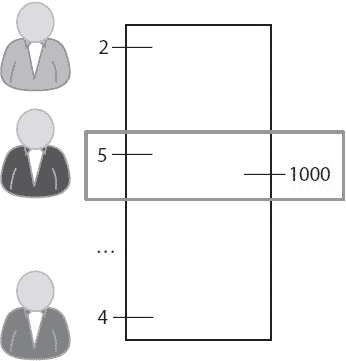
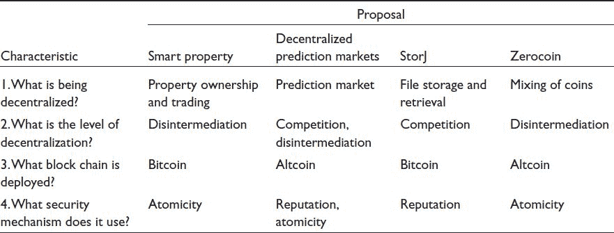

# 十一、去中心化机构：比特币的未来？

到目前为止，在本书中，我们已经探索了截至 2015 年比特币和区块链技术的状况。在这一章中，我们考虑比特币未来可能实现哪些可能性。遵循“永远不要做预测，尤其是对未来的预测”这句格言，我们不会声称知道会发生什么。因此标题中有个问号。

相反，我们坚持本书迄今为止采用的学术方法，即使是在研究潜在的未来技术时。比特币的未来是一个主题，似乎聚集了一场真正技术革命的热情和令人窒息的愿景。这一章可能是一个宣言。它不是。我们找出值得注意的建议，并采取临床的方法对它们进行分类，并严格评估它们的相对利弊。

比特币是一个广泛的主题，包括协议本身及其作为新应用平台的潜力。本章的重点不是比特币协议的未来，尽管我们认识到许多塑造该协议未来的问题值得研究，包括比特币的治理、效率、可扩展性和功能集。

相反，我们关注的是比特币在分散货币方面的明显成功如何引起对其他集中机构的反思——那些处理股票、债券、产权等的机构。区块链技术也能应用于分散他们吗？如果去中心化在技术上是可能的，那么它在经济上是明智的并且对社会有益吗？

**11.1。区块链作为权力下放的工具**

在比特币出现之前，曾有过无数次数字或电子现金的失败尝试(前言提到了其中的许多尝试)。与大多数这些尝试相比，比特币的关键区别在于去中心化。比特币实现去中心化的核心创新是区块链。

在本节中，我们考虑区块链技术如何在货币以外的领域实现去中心化。在这一章中，我们使用了一个汽车运行的例子，它的所有权是通过区块链控制的。这是第 9 章中介绍的的一个具体例子，这是关于智能财产的一个更一般的概念。智能财产和管理智能财产的数字合同是由尼克·萨伯(Nick Szabo)等人在 20 世纪 90 年代初提出的，远在比特币被提出之前。然而，有了区块链，这个想法就可以具体化了。

激励范例

现代汽车使用两种主要的锁定机制:门上的物理锁和车辆防盗器，后者通过电子方式防止发动机启动。向车主提供与汽车无线通信的密钥卡，以基于密钥卡与汽车的接近度和潜在的用户动作(例如按下按钮)来授权解锁车门和启动发动机。

为了防止对手盗用汽车钥匙，这种解锁机制应该使用加密技术。虽然安全研究人员已经发现了许多最近部署的锁定协议的问题，但它是有可能正确的。通常，这些算法使用对称密钥加密，但是为了我们的示例，考虑一个使用基于非对称加密的数字签名方案的算法，比如 ECDSA。

在这个例子中，汽车可以存储被授权打开车门和启动发动机的密钥卡的公钥的副本。当遥控钥匙请求访问时，汽车发送一个随机的挑战，并要求遥控钥匙用它存储的私钥签名。当且仅当密钥卡能够以正确的签名响应该询问时，汽车才授权进入。到目前为止，这与锁定机制的实际工作方式没有太大的不同，只是它使用了更不对称的加密技术，部署起来成本会稍微高一些。

变聪明

设计智能汽车的下一个迭代是假设验证密钥卡的公钥不是由制造商直接硬编码的。相反，这种汽车有技术能力不断无线接收来自区块链的新数据块，比如比特币。当汽车被制造时，其第一个用户(例如，装配厂的经理)的密钥卡中的公钥在特殊交易中被添加到区块链，并且汽车用其交易 ID 被编程。

其核心思想是，随着汽车所有权的转移——它可能从装配线转移到质量控制，转移到送货员，转移到汽车经销商，然后转移到第一个所有者——区块链的更新将授权每一次转移。需要注意的是，在这款车型中，授权的遥控钥匙不随车携带。每个人或实体都具有预先存在的密钥卡(或携带/佩戴适于实现密钥卡功能的技术),该密钥具有唯一的签名密钥，该签名密钥基于在区块链上发生的交易而被激活或去激活。这种交易将汽车最近的交易 ID 作为输入，并指定一个新的公钥作为输出。它将用对应于当前所有者的私钥来签名。

这类似于第九章中讨论的智能财产的概念，但有一个关键的区别。区块链的交易不仅仅代表了汽车所有权的变化:它还转移了汽车的实际控制权或占有权。当汽车以这种方式转让时，早期所有者的密钥卡停止工作，新所有者的密钥卡获得打开锁和启动发动机的能力。以这种方式将所有权等同于占有权具有深远的意义。它促成了一种强有力的权力下放，但这是否是一个好主意还不清楚。我们在[第 11.4 节](part0017.html#sec11_4)中回到这个问题。

安全交换

考虑这样一种情况，Alice 拥有一辆 smart 汽车，并想将其出售给 Bob。以数字方式转移控制权的能力开启了有趣的可能性。例如，Alice 可能正在国外旅行，为了支付更多的旅行费用，她可能想卖掉她的车，而这辆车实际上就停在她家的车道上。通过互联网连接，鲍勃可以用比特币支付爱丽丝的汽车费用，爱丽丝可以用汽车使用的区块链远程将所有权转让给鲍勃，鲍勃可以开着他的新车离开。

然而，这种交易带有一定的风险。如果 Bob 先付款，Alice 可能会保留这笔钱，而不会转移所有权。如果爱丽丝先转让所有权，鲍勃可能会不付钱就把车开走。即使 Alice 亲自到场，一方也可能中止，而不在场的第三方可能很难调解争议。

这个问题我们之前遇到过几次，包括讨论 CoinJoin ( [第 6 章](part0012.html#BE6O0-ea268daff50b4c55a00d858ef79f4a6c))和 Namecoin ( [第 10 章](part0016.html#F8900-ea268daff50b4c55a00d858ef79f4a6c))的时候。所有这些情况下的解决方案都使用相同的原理。只要用于支付的货币和汽车所有权在同一个区块链上共存，Alice 和 Bob 就可以形成单个原子事务，同时转移汽车的所有权和汽车的付款。具体来说，该事务将指定两个输入:Alice 的所有权和 Bob 的付款；并指定两个输出:Bob 的所有权和 Alice 的付款。交易需要双方签字，因为双方都在提供投入。如果一方签字，另一方不签字，则交易无效。一旦一方签名，在不使签名无效的情况下，不能改变交易细节。一旦签名的交易被广播到区块链，car 将等待预设数量的确认(例如，六个),然后允许 Bob 访问。同时，Bob 对 Alice 的付款将被确认。没有另一个，一个也不会发生。

勤奋的读者可能会注意到一个微妙的问题。Bob 可以接受由 Alice 签名的事务，签署它，但是实际上不广播它(还没有)。如果 Alice 正在销售的商品的价格发生变化，Bob 就可以按原来的价格广播旧的交易。已经提出了包括超时的更复杂的原子事务。Alice 也可以简单地将硬币花到她控制的新地址，以使她给 Bob 的签名交易无效，作为撤销交易的手段。

这是本章中第一个使用区块链技术分散各种现实协议的例子，它们实现了不同类型的分散。但是这种*原子性*的想法对他们中的大多数人来说是共同的，也就是说，将事务的每一方的可交付成果耦合在一起，这样它们就可以同时发生(或者根本不发生)。原子性是一个重要的安全概念，其应用超越了区块链技术。

**11.2。区块链一体化路线**

因为比特币的区块链是为货币量身定制的，所以重新利用它来表示其他应用程序的语义可能会很有挑战性。在比特币社区，你会发现许多人非常偏爱比特币或替代区块链作为去中心化的平台。我们在这一节中研究两种选择。

路线一:直接上比特币

区块链整合的自然起点是比特币的区块链。这是我们在智能汽车的例子中使用的方法([第 11.1 节](part0017.html#sec11_1))。直接使用比特币的主要优势是可部署性:代码运行，网络获得了巨大的挖掘能力，共识过程看起来很合理。然而，我们只能在示例应用程序中使用比特币进行一些黑客攻击，例如用于授权比特币交易的加密和用于打开车门的加密之间的等价。这样的黑客攻击并不总是可能的。更根本的是，如果你在不同方之间有一些任意复杂的合同，它可能无法在比特币的区块链上得到充分表达，也无法自动执行。为了说明使用比特币区块链的风险，我们可以考虑如何实现一些非中介化的自然应用。

首先考虑*众筹服务*。截至 2015 年，使用最广泛的此类服务是 Kickstarter，它通过一个中心网站为创业者和资助者牵线搭桥。如果我们喜欢 Kickstarter 的想法，但希望建立一个完全分散的替代方案，我们需要实现一个系统，在这个系统中，企业家可以请求捐款，但在他们收集到预先指定的金额之前不能花钱，所有这些都不需要使用中介。

使用比特币实现这一点的一个技术方法是，指导企业家创建一个单笔交易，交易的输入数量可以是任意的(随着过程的进行，输入数量可以变化)，单笔交易的输出数量是特定的，比如说 1000 BTC。这种交易将在潜在的赞助商之间流通，其中任何人都可以通过在交易中添加他们贡献的金额并对他们自己的输入和总输出进行数字签名来做出贡献。这样的交易只有在投入大于或等于产出时才能被企业家花费([图 11.1](part0017.html#fig11_1) )。这种方法使用比特币的一些鲜为人知的特性来度过最后的交易，只给这些有限形式的签名。虽然今天可以实现，但我们已经不得不深入比特币的一些鲜为人知的角落。这不是日常标准的比特币交易。

图 11.1。通过比特币进行众筹。显示了具有由不同潜在赞助商贡献的许多输入的单个交易。如图所示，每个贡献者在自己的输入和输出上签名。除非输入值的累积和匹配或超过输出，否则事务将无效。

现在考虑第二个例子:*支付一个证明*。这个例子最初可能看起来很奇怪，但有一些重要的应用。为了说明这一点，假设有一个散列函数 *H* 和一个众所周知的值 *y* ，该值表面上是某个输入值或预映像 *x* 上的 *H* 的输出值。Alice 声称她知道这个值 *x* ，Bob 愿意付钱让 Alice 也知道这个值。总的来说， *H* 可以是任何可计算的程序，鲍勃想学习产生他感兴趣的某些输出的输入值。在此问题的一个变体中，Bob 可能会为在区块链上公开发布的输入值付费。

为了安全地实现这个事务，我们必须确保原子性:Alice 只有在产生正确的输入时才应该得到报酬，Bob 必须承诺在产生这样的输入时付款。回想一下，在第 10 章的[中的原子跨链交换协议中，我们展示了如何将输入值的显示与给定的散列输出绑定在一起。这里可以使用类似的方法。](part0016.html#F8900-ea268daff50b4c55a00d858ef79f4a6c)

这些例子说明了直接使用比特币区块链的一个重要局限性。在每种情况下，我们都必须将现实世界中的复杂交易编码到比特币的抽象概念中。这并不总是可能的。在智能汽车的例子中，我们方便地假设汽车使用 ECDSA 签名来认证车主。这使得我们可以在区块链和钥匙链上使用相同的公钥/私钥对来解锁和启动汽车。在众筹的例子中，就像我们描述的那样，企业家们只能筹集到他们要求的数量，不能再多了。如果捐款超过该金额，超出部分将成为交易费。最后，在支付凭证的例子中，如果函数 *H* 不是比特币脚本支持的哈希函数之一，那么将支付与价值揭示联系起来就变得很棘手。

如果你不能——或者不想——把你的应用硬塞进比特币的交易语义，总有使用覆盖货币的选项，在第 9 章的[中讨论过。这种方法将比特币视为纯粹的数据存储，因此比特币脚本的表达能力变得无关紧要。除了能够实现更多类型的应用程序之外，这种方法还可以实现透明性。再次考虑汽车销售的例子。如果已知现实世界中物体的颜色(在有色硬币的意义上)，任何人都可以检查区块链来查看汽车销售发生的时间和支付的价格，而不必知道买方和卖方的身份。这在某些情况下可能是有用的，并且在有害的情况下颜色可以保持私密。](part0015.html#E9OE0-ea268daff50b4c55a00d858ef79f4a6c)

然而，也有一些重要的缺点。覆盖货币的用户不能依赖比特币矿工来验证他们的交易(因为矿工不理解覆盖的交易语义)。所以覆盖层的所有用户必须运行他们自己的完整节点，而 SPV 是不可能的。如果实现中存在导致共识协议失败的错误，覆盖货币也是脆弱的。如果覆盖货币的两个实现在特定交易是否有效的问题上意见不一致，它可能会将货币一分为二，从而带来潜在的灾难性后果。相比之下，当矿商验证交易时，这种情况发生的可能性要小得多，如果发生了，它会很快被注意到，并且很可能在不导致分叉的情况下得到解决。

一个额外的考虑——不管是否使用覆盖——是用超出其原始范围的交易来负担或“污染”比特币区块链的问题。这是比特币社区中一个有分歧的问题。缓解这个问题的一个方法是将比特币仅仅作为一种时间戳服务，正如在[第 9.1 节](part0015.html#sec9_1)中所讨论的，而不是作为一种数据存储。截至 2015 年，出现了提供独立区块链或数据存储的新兴服务，但这种服务通过比特币区块链来标记时间戳。这就像[第 9 章](part0015.html#E9OE0-ea268daff50b4c55a00d858ef79f4a6c)中讨论的方法，但是每 10 分钟向比特币区块链提交一次哈希，而不是每周在报纸上发布一次。使用比特币进行时间戳标记只需要每个区块进行一次交易(对于每个这样的服务或协议)。一个缺点是，这种外部数据存储不太可能像比特币的区块链那样被广泛复制和使用。此外，它还引入了一定程度的集中化。

总而言之，无论是否使用嵌入技术，比特币的区块链确实实现了许多新颖的应用。它带来了用户和矿工广泛采用的好处，这使它成为一个安全和易于部署的选择。

路线 2:替代区块链

另一个去中心化的方法是使用另一个区块链。这里也有一些选择。最明显的一个是拥有一个独立的区块链，拥有自己的规则、功能和货币(即替代货币)。第二种选择是侧链，在第 10 章的[中讨论。主要区别在于，侧链所代表的货币将以 1:1 的方式与比特币挂钩。具有增强脚本功能的 Sidechains 可以让我们达成复杂的合同并实现非中介化。然而，支持侧链需要对比特币进行修改，截至 2015 年，这还没有发生。](part0016.html#F8900-ea268daff50b4c55a00d858ef79f4a6c)

第三种选择是使用已经存在的替代区块链，它支持在其基础上创建新应用程序的能力。截至 2015 年，寻求成为基于分散加密货币的应用平台的最突出的项目是以太坊，在第 10 章中讨论过。从概念上讲，它是一个分散任意复杂合同的梦想平台。然而，它也有一些实际挑战:至少截至 2015 年，它不具备比特币的成熟度、采用率或挖掘力，也没有受到可比水平的审查。尽管如此，这是一个分散强大合同的迷人的思想实验，以太坊或类似的系统可能在未来变得可行。

11.3**。权力下放模板**

我们审查了在区块链实现权力下放的若干途径。接下来，建立一个模板将是有用的，该模板将显示权力下放的内容、哪种类型的区块链是合适的，以及权力下放在实体和安全方面的确切含义。

权力下放的程度

通过非中介化去中心化

再次考虑智能汽车的例子。为了更好地理解它，让我们问:这种数字类型的所有权转移试图取代的现实世界的过程是什么？

以汽车为例，在美国，所有权是由所有权文件决定的。这是一种集中的所有制形式。标题文件只有在机动车管理局(DMV)认可的范围内才有意义。当一辆汽车被出售时，仅仅将该文件从卖方转移到买方是不够的。转让必须亲自向车管所登记，由车管所更新其中央数据库。通过区块链转移支付，我们从一个国家控制的集中过程转向一个没有任何中介的过程。它通过*脱媒*实现去中心化。

争端调解:通过竞争实现权力下放

现在假设有一个关于汽车销售的纠纷。或许卖家卖了一辆柠檬车给买家，买家不高兴，想反向交易。在[第 3 章](part0009.html#8IL20-ea268daff50b4c55a00d858ef79f4a6c)中，我们讨论了三取二多重签名交易，如果除了买方和卖方之外，还涉及到法官或调解人，这种交易可以允许托管。在这种情况下，买家可以在单独的交易中从汽车上转移比特币，而不是直接转移到卖家，而是转移到一个 3 选 2 的地址，该地址由买家、卖家和中介共同控制。调解人可以批准转账或在一方或另一方的帮助下恢复转账，但不能窃取资金。

这是建立争端解决机制的良好开端，但许多细节仍需理清。首先，我们失去了之前所依赖的汽车销售的原子性。第二，不清楚这辆车的所有权能否用这笔钱收回。第三，如果汽车交易的地址也是 3 选 2，那么在这种情况下，应该授权谁的密钥卡解锁汽车？我们在这里的目的不是要解决这些问题，而是利用这个例子来仔细考虑调解人的作用。具体来说，让我们将这种调解模式与更传统的模式进行比较。

在现实世界中，纠纷调解是如何进行的？它可能会通过法院系统，一个集中的，国家控制的调解过程，最好是在聘请律师的帮助下导航。相比之下，在数字合同中，双方可以自由选择他们想要的任何调解人。不再被要求与法律系统合作，一个私人的调解市场可能会出现，潜在的中介可以在公平，效率和成本方面进行竞争。出现了几个挑战。第一个是激励:调解人可能被交易的任何一方贿赂。第二，在争端提交期间，资金被锁定。最后，参与者可能是匿名的，这使得如果内部争议解决失败，最终很难诉诸法院。即使确定了当事人的身份，法院目前也不承认数字合同。

然而，我们在这里的观点是，这不是通过非中介化的去中心化——我们没有完全去除中介。相反，它使实体能够选择他们信任谁。换句话说，就是通过*竞争*去中心化。因此，有一个范围，一边是单一的强制性中介，另一边是完全不需要任何中介——完全去中介化。在中间，你可以有多个竞争的中介，就像刚才讨论的那样。事实上，我们在《T2》第 9 章第 3 节中已经看到了这一点，当时我们正在讨论分散式预测市场。与 InTrade 等单一实体经营市场不同，参与者可以从多个相互竞争的仲裁者中自由选择他们信任的人，这些仲裁者在市场中执行敏感操作。

如何实现安全性

我们可以对这个例子做另一个观察。争议调解过程的安全性不依赖于原子性。相反，这需要信任调解人。调解员如何变得值得信任？可能有各种各样的方式，但一个显而易见的是声誉。与原子性不同，原子性是一种技术安全增强机制，声誉是通过固有的社会机制随着时间的推移建立起来的。

信任

比特币社区中的一些人使用“信任最小化”或“不信任”等术语作为目标。这听起来可能有些落后——难道我们不希望我们可以信任的系统能够正确运行吗？

“信任”一词有不同的含义，这可能会引起混淆。当爱丽丝借给鲍勃 10 美元并说她信任他时，她的意思是她认为他是一个值得信赖的人，并且她相信他会还她的。在安全上下文中，可信组件是您被迫依赖的组件。当人们使用“可信”一词来描述认证机构时，他们的意思是，如果这种机构行为不当，在线安全保证将无效。

“信任最小化”是一个有价值的目标，在这种意义上，在其他条件相同的情况下，我们希望构建的系统具有更少的安全依赖的组件。但当你有一把锤子时，所有东西看起来都像钉子，比特币爱好者经常会忘乎所以地从系统中移除可信的组件。可信组件并不总是坏的，真实世界信任关系的存在本身当然不是问题。删除可信组件也可能有其他微妙的缺点。

我们在第 11.4 节中详细阐述了这些观点，但是现在，注意到“信任”这个词的复杂性，我们避开它，转而谈论安全性，一个不那么模糊的词。

在缺乏技术解决方案的情况下，声誉可以发挥作用，或者作为技术解决方案的补充。然而，它也不是没有缺点。声誉是和身份联系在一起的，如果身份不是静态的或有约束力的，声誉就不能很好地发挥作用。例如，如果一家餐馆在网上收到糟糕的评论，决定关闭并在相同的管理下重新开业，但换了新名字，它的坏名声就会被重置。在匿名环境中，信誉根本不起作用，而在身份可以轻松转换的假名环境中，基于信誉的系统面临着巨大的挑战。声誉系统还努力验证影响一个人声誉的“他说/她说”断言。在 Yelp 这样的传统系统中，商家是实名经营的，用户在某种程度上也是实名经营的。然而，在一个使用假名的环境中，明智地从事实中挑出虚假的指控是不可行的。

包括安全硬件在内的其他安全机制在此不再详述。无论使用何种机制，缺乏现实世界的执行最终会使安全性成为一大挑战。没有针对不当行为的惩罚措施，纠纷也不会在法庭上结束，尤其是在没有人使用真实身份的情况下。提供债务是不可行的，因为没有强制措施来确保债务得到偿还，因此交易通常需要存款，这在争议期间锁定了资金。

框架

总结本章到这一点，我们可以通过提出四个问题来描述分散各种事情的建议:

**表 11.1。基于区块链的分散化提案的特点**

1.什么是去中心化？

2.分权的水平如何？

3.区块链部署了什么？

4.它使用什么安全机制？

有了这四个问题的答案，我们可以简洁地代表比特币社区中正在讨论的几乎所有基于区块链的去中心化提案。让我们考虑几个例子([表 11.1](part0017.html#tab11_1) )。

智能财产

如前所述，智能财产分散了财产所有权和所有权转让的概念。它实现了完全的非中介化——它消除了对像 DMV 或国家这样的实体的需要。我们看到了如何使用比特币的区块链来实现它，但你当然可以使用另一种区块链。最后，使用的关键安全原则是将付款与汽车所有权转让捆绑在一起的原子性。

分散预测市场

在集中式预测市场中，集中式平台或交易所至少提供两种关键服务:仲裁每个下注事件的结果，并向参与者出售股票(或促进参与者安全地相互交易)。在[第 9 章](part0015.html#E9OE0-ea268daff50b4c55a00d858ef79f4a6c)中描述的分散预测市场消除了对这两个特征的中央权威的需求。它允许任何人通过发送一个简单的交易，为一个事件创建一个市场，并成为其仲裁者，降低了履行这一职能的门槛。因此，中介仍然存在，但是用户可以自由地从一组相互竞争的中介中进行选择，如果用户仍然不满意，她总是可以自己执行这个功能。但是，用户直接原子地相互交易股份，因此中央权威的这一功能已经被去中介化。去中心化的预测市场需要比特币本身没有的新功能，因此自然会通过定制的具有自己区块链的替代比特币来实现。

斯托尔杰

StorJ 是 Greg Maxwell 为文件存储和检索提出的建议。它随着时间的推移而发展，但我们讨论的是它的一个简单版本。在高层次上，StorJ 部署了一个“代理”,它位于云中，并被编程为自行做出某些决定。比如它可以租用云计算和存储给自己计算资源。它向用户提供的另一个功能是能够将文件存储一段时间，比如说 24 小时，以换取比特币的支付。它将继续托管文件，只要它继续收到付款。除了简单的存储，它还可以做许多这里没有考虑到的有趣的事情。在我们的框架中，StorJ 分散了文件存储和检索，这是 Dropbox 等集中式服务的核心特性。代理是中介；对于我们的目的来说，它是自动化的并不重要。但是，中介可以竞争。支付是通过比特币完成的，但代理人履行其服务和收到的付款之间没有原子联系，因此安全是代理人的声誉问题。

零硬币

第 6 章中讨论的 Zerocoin 是一种分散混合硬币以实现匿名的有效方法。Zerocoin 没有使用集中式混合服务，而是实现了一种加密协议，该协议在功能上等同于使用 mix，但完全没有使用中介——只有数学和共识。Zerocoin(及其继任者 Zerocash)需要相对较重的加密技术，这意味着独立的区块链是更可行的途径。至于安全机制，回想一下燃烧一枚基础硬币和获得一枚零硬币的概念是通过同一个事务原子地耦合在一起的；并且类似地用于以后兑换零硬币。这是原子性的一个例子。

**11.4。什么时候去中心化是个好主意？**

在这一章中，到目前为止，我们已经关注了实现去中心化的技术挑战。现在我们深入研究动机问题。这些问题是非技术性的，但通常也很难回答:去中心化是个好主意吗？经济上可行吗？权力下放的社会后果是什么？

到目前为止，我们一直将“权力下放”作为一个技术概念来使用，而没有明确指出它具有政治含义。当我们谈论用技术替代品完全或部分取代传统系统时，我们实际上是在谈论从完善的法律、社会和金融机构中重新分配权力。因此，去中心化的想法源于比特币在赛博朋克运动(cypherpunk movement)中的根源——这场运动是由梦想加密技术能够赋予个人自主权的非正统者发起的(见前言和第七章)。有了区块链，这个理想似乎比以往任何时候都更接近了。但这种理想是否可行或可取？

回到我们运行的例子，传统机构试图为车主解决两个问题。首先是加强所有权，或者说本质上是防止盗窃。第二是确保交易安全，或者防止有人在交易中被骗。因此，要分析与现有系统相比，智能地产的表现如何，我们不仅要看一切顺利时的效率，更重要的是，还要看出问题时的糟糕程度。

现实世界安全的挑战

防范任何形式的盗窃——汽车、艺术品、金钱等等——是一项预防、检测和纠正的工作。预防性安全机制试图在盗窃发生之前阻止盗窃，而检测机制确保盗窃被察觉，从而可以采取潜在的纠正措施来恢复盗窃的损害并惩罚犯罪者(这也可以作为对实施盗窃的威慑)。车锁和警报是预防机制，而 GPS 跟踪装置(如 LoJack)可以帮助检测盗窃行为，并使执法部门能够找回被盗的汽车。关键的见解是，汽车锁只是阻止汽车盗窃的一小部分——涉及警察、保险公司、法院等庞大复杂系统的一部分。如果你生活在一个无法无天的环境中，车锁本身并不能阻止盗窃。把你的车锁在街上肯定会很快被偷。

我们用于智能财产的模型严重依赖于预防机制。我们之所以能够实现去中心化，仅仅是因为我们将拥有等同于拥有——拥有一辆汽车本质上等同于知道区块链上指定交易对应的私钥。但这种控制机制很难取代我们目前的机构支持。

如果我们把所有权归结为保护私钥的问题，它会增加数字安全的风险——这是一个人类是薄弱环节的难题。几十年来，程序员一直在努力编写无错误的代码，但挑战仍然难以捉摸。几十年来，密码系统的设计者一直试图吸引非技术用户使用和管理私钥，以防止密钥被盗和意外丢失，但也没有取得什么进展。如果去中心化模式过度依赖私钥，汽车可能会被恶意软件或网络钓鱼攻击窃取，丢失一把钥匙可能会让您的汽车变成一块巨大的砖头。虽然可以有后备机制来覆盖这些类型的事件，但这种机制不可避免地会将我们引回中介和集中式系统，削弱我们努力追求的分散模式的优势。

另一个从根本上以人为本的财产转让领域是处理可能因销售条款或转让的其他方面而产生的纠纷。在现实世界中，如果参与者无法达成解决方案，这个问题将在法庭上结束，法官将有条不紊地检查每一点证据、证词和书面文字，以对销售的有效性做出细致入微的裁决。人们，尤其是技术人员，很容易将法律视为一套逻辑规则或算法，可以产生明确的裁决。然而，法律制度的现实是，法律和合同不仅冗长，而且最终还要服从人的解释和判断，这与明确的逻辑规则的概念相去甚远。这个属性不是弱点。它允许解决远比制定法律的个人所预期的更复杂的情况。

为了说明分散模型中的安全属性和我们实际需要的安全属性之间的不匹配，让我们回顾一下早期的分散众筹的例子。我们看到了一种技术机制，可以确保企业家在捐款总额达到某个预先指定的数额之前，不能从投资中套现。但是，这绝不妨碍一个成功筹集到资金的企业家携款潜逃！事实上，即使是在当前的集中模式下，众筹网站上也存在大量涉嫌诈骗的案例，导致了几起诉讼。在这种模式下，企业家可能是匿名的，被起诉的威胁也没有威慑作用，这个问题可能会严重得多。很难想象这个问题的技术解决方案。这是另一个例子，技术仅仅解决了问题的一小部分，坦率地说，甚至不是问题的有趣部分。

总的来说，智能财产的有趣问题似乎是社会问题，是出问题时出现的问题。当各方都满意时，技术可以确保高效的交易，但它不擅长解决棘手的纠纷。

智能财产的利弊

如前所述，智能财产难以分散传统上需要人工干预的系统的各个方面。事实上，如果中介和其他流程是在事后进行的，那么自动化可能会因为不能很好地与中介和其他流程结合而变得更加困难。最后，它可能会产生新的问题类别，例如对于汽车来说，除了物理安全之外，还需要软件安全。

从某种程度上来说，这些例子是一个完整的智能财产提案的卡通版本。比特币社区中的许多提议更加细致入微，但即使在我们简单的设置中，我们也可以辨别智能财产的优势和劣势。

智能物业的主要优势是所有权转移的效率，可以在任何时间任何地点进行。对于价值低于汽车的物品(如智能手机或电脑)的销售，纠纷不太可能在法庭上结束，因此在这方面没有什么损失。对于这样的项目，原子事务是一个有用的安全特性。

智能财产通过区块链也提供了更大的隐私，甚至匿名。虽然我们认为这会使争议解决变得复杂，但隐私也是有益的,在这样一个社会中，消费者数据被公司以不可见的方式使用，购买者可能并不知道这些方式。在某些情况下，交易各方不披露其身份可能很重要，这在集中的中介模式中是不可行的。

最后，分散模式允许选择调解人。即使我们对法律体系感到满意，争议也经常由私人公司如 Visa 或 PayPal 关起门来调解，使用一种很难审查的方法。通过使用一种替代模式，在这种模式下，这种调解向竞争开放，我们可能会给这一过程带来更多的透明度和公众监督。

加密、国家和巨大的机会

现代国家的出现和我们在本章中讨论的技术目标之间有着惊人的相似之处。在从部落和小团体扩大社会规模的过程中，政府不得不面对的问题正是如何在陌生人之间实现安全的商业和其他互动。方法可能大不相同，但目标是一致的。

尽管分权的最大化愿景可能涉及解散国家，但这并不是一个真正可行的愿景，尤其是当其他与我们共享民主的人想要一个国家的时候。然而，通过技术去中心化并不一定与国家完全对立。事实上，它们可以是互利的。例如，假设当事人身份明确，智能财产的转让可以使用区块链进行高效转让，并且在发生争议时仍然可以使用法院系统。我们认为区块链技术的巨大机会是以补充国家职能的方式实施分权，而不是试图取代它们。

人们很容易认为，仅仅因为技术的存在，某些过程就会被分散化。但在实践中，需要有令人信服的经济原因，比如特别繁重或低效的政府监管，或者可能导致滥用的权力失衡。作为这方面的一个例子，许多非洲国家的人民已经将手机分钟作为不受国家控制的特别货币，并且较少受到滥用权力的影响。

总的来说，我们已经在这一章中描述了去中心化的技术蓝图，并且批判性地研究了去中心化背后的动机。我们鼓励您寻找令人信服的分权使用案例，尤其是那些整合到现有法律和监管实践中的案例。