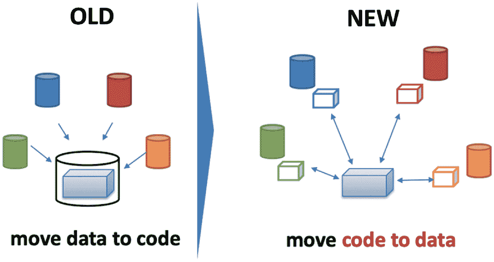

# 五、分布式数据经济学

David Shrier^([1](#Aff3) [ ](#ContactOfAuthor1))(1)Imperial College London, London, UKDavid ShrierEmail: [david@visionaryfuture.co](mailto:david@visionaryfuture.co)

## 第一部分:分布式数据经济学的基础

分布式分类账为数据货币化提供了新的机会，并提供了新的模式，个人消费者可以通过这种模式获得对个人数据的更多控制并从中受益，而当今的主导模式将最大的经济收益授予平台营销公司，如脸书和谷歌，这些公司通常利用数据提取的经济学。随着分布式账本公司的数字交易令牌的市值超过 2400 亿美元，私营部门的大量投资正在支持新的分布式数据生态的创建。 ^([1](#Fn1))

在我们探索分布式数据经济学之前，我们需要了解数据是从哪里获得的，它是如何制造的，以及它在过去是如何货币化的。

区块链系统，或者说分布式账本，从根本上来说就是数据库。虽然人们对这些数据库的设计、架构、支持、分发和筹资给予了大量关注，但对进入这些系统的数据的性质和质量以及这些数据的货币化方式却关注不够。套用欧洲一家顶级银行的首席创新官的话来说，鉴于消费者数据在质量方面经常存在问题，我们面临着制造不可改变的问题的风险。^(2[2](#Fn2))

### 分布式数据的潜力

想象一下这样一个世界，消费者而不是少数企业集团决定如何使用他们的个人数据。想象一下这样一个世界:从个人银行业务到医疗保健再到能源服务，服务提供商之间存在激烈的竞争和选择。想象一下这样一个世界:公司直接向消费者付费，而不是通过营销平台来获得业务。想象一下这样一个世界，艺术家直接从他们的作品中获得版税，而不是小艺术家的大部分利润消失在运营唱片公司和发行系统的公司的金库里。想象一下这样一个世界，一场公共卫生危机可以通过一个社区几乎自动的集体行动来遏制传染病的传播而得到解决。病毒流行病学信息和基因测序可以在几秒钟或几分钟内通过分布式数据网络自动传播，而不是像新冠肺炎冠状病毒爆发那样，需要多层人工批准，有时会以牺牲公共健康为代价进行政治干预。 ^([3](#Fn3))

这些都是分布式数据经济中的可能性，但有许多障碍需要克服——尤其是围绕个人数据的历史遗产。

### 数据聚合器

数据聚合器产生于一个机会，可以将互联世界中开始出现的大量数据转化为货币，例如支付系统和电信系统中提供丰富人类行为信息来源的数据。

这些数据源以越来越快的速度从数十亿个人那里产生越来越多的数据。咨询公司 IDC 预计，全球将产生超过 440 亿字节的数据，高于 2013 年的 4.4 亿字节。 ^([4](#Fn4)) 一个 zettabyte 是 2 的 70 次方字节。如果这本书是印刷形式的，并且充满了一个 zettabyte 的数据，你将会有 10 本书，每本书的高度足以够到太阳。^(T55)

谁是第一代数据聚合的巨头？Acxiom(相关部门现在由营销集团 Interpublic Group 所有)是数据聚合领域无可争议的宙斯。像 Equifax、Experian 和 TransUnion 这样的信用机构也加入了他们的行列。与奥林巴斯众神一样，这些数据聚合器非常难以接近，例如，如果你对通过欺诈或身份盗窃进入你记录的不良数据有争议。是的，也许有一个你最终能破解的网络表单，但是监督是薄弱的，求助是有限的。在某些情况下，信用局购买了收集机构，这些机构根据信用局的数据采取行动。如果消费者试图反驳某项主张，他们就会陷入一个自我封闭的世界。像 Plaid、CreditKarma、Mint 和 MyLife.com 这样的公司现在围绕消费者数据收集和获取见解。数十家供应商出售聚合的“匿名化”移动数据，即关于消费者群体如何在城市、社区或特定位置移动的信息。

对消费者的洞察使一个人能够迅速穿透人群的匿名性。通过几个人口统计维度(年龄、大致收入、城市)，可以追踪到一个人的家庭住址。其他更间接的隐私渗透是可能的。例如，研究人员发现，四点购物数据(如购买日期和地点)可以从数百万条记录中唯一地重新识别一个人。 ^([6](#Fn6))

### 细粒度人类行为数据的出现

通过理解人们在无处不在的电子网络上留下的数字痕迹或“面包屑”,可以提取精细的人类行为洞察，电子网络渗透到现代社会的各个方面。 ^([7](#Fn7))

第一张现代支付卡发行于 1950 年。起初，它的应用很慢，但随着 20 世纪 70 年代和 80 年代数据通信服务的改善，它开始加速发展。预计到 2028 年，信用卡的交易量将超过 8500 亿笔，高于目前的 3690 亿笔。 ^([9](#Fn9)) 在欧洲，仅 2018 年就有超过 3 万亿美元的采购量。 ^([10](#Fn10)) 随着支付系统的发展，从购买数据中可以洞察消费者的购买行为，这对营销人员来说非常有价值。

同样，在过去的十到十五年里，移动电话已经成为丰富的人为因素数据来源。 ^([11](#Fn11)) 其他数据源开始出现——例如，Catalina Marketing 从收银台零售店收集“扫描”数据，生成消费者购物行为的精细地图(尽管该地图在消费者向电子商务迁移的过程中遇到了困难)。 ^([12](#Fn12)) 忠诚度计划(赚取“积分”或“里程”)进一步生成了可操作的消费者数据，商家利用这些数据来微调营销。 ^([13](#Fn13))

随着万维网(通常被称为“互联网”)在 20 世纪 90 年代后期及以后爆炸式地被广泛采用，一种用于获取个人消费者数据的新工具被创造出来。

消费者数据的激增为数据聚合者创造了一场数字信息的虚拟盛宴。最初，宝洁和雀巢等消费品牌公司渴望找到更聪明、更好的方式来营销产品，用数十亿美元的收入支撑着这个新兴行业。随着时间的推移，金融服务和汽车等其他面向消费者的行业也采用了这种方法来识别和锁定相关受众和个人。

### 寡头垄断平台公司

越来越多的寡头垄断平台公司，如 BATs(百度，阿里巴巴，腾讯)和 FANGs(脸书，亚马逊，网飞，谷歌)，正在聚合和捆绑来自不同来源的数据，并向其企业客户提供营销分析服务。来自安卓(Android)等移动操作系统和微信(WeChat)和 WhatsApp 等 messing 应用程序的连续位置流，能够非常精细地理解行为——不仅能够识别个人，还能识别他们的偏好，甚至对未来行为的预测。 ^([14](#Fn14))

## 第二部分:遗留数据经济学

### 数据损耗

十年前，世界经济论坛(World Economic Forum)发布了一份白皮书《个人数据:一种新资产类别的出现》(Personal Data:The emerging of a New Asset Class)， ^([15](#Fn15)) 与“数据是新的石油”这一表述的出现不谋而合。像石油和天然气一样，数据系统是一种长期资产类别，需要长周期投资才能获得，并且还需要持续的维护投资。数据库也有一个类似于石油和天然气储量的概念:枯竭。在数据世界中，这通常被称为“衰退”或“数据衰退”，即数据库中的信息过时的速度。随着个人数据经济学的世界变得更加复杂和相互关联，世界经济论坛和其他机构正在寻找新的方法，以新的方式通过使用数据来创造和分配价值。诸如使用联邦数据来揭示潜在健康信息的价值(例如，反过来创造治疗罕见疾病的经济激励)等方法 ^([16](#Fn16)) 我们将在本章稍后描述。

例如，在欧洲的部分地区，多达 23%的人口在过去 5 年内迁移过——与流动性最大的社会之一美国的 24%相当。 ^([17](#Fn17)) 从就业驱动运动(如巴黎的波兰工人)到人道主义危机(如叙利亚)等因素进一步加速了这些趋势。这意味着姓名和地址信息变得过时。

这将我们带到一个消费者数据集每年会衰减 30%甚至更多的世界。对于某些市场中的业务数据(例如旧金山的技术工作联系信息)，衰减率可能超过 70%。如果你在寻求理解社会或理解客户，那么你需要投资的不是*数据集*，而是*数据系统*，使你能够跟上迅速退化的数据。数据是一条河，而不是一块石头，应该被视为快速移动的资源，而不是空间和时间中的固定对象。支持这些数据的系统应该包含一个改进*最近度*的机制。

### 个人数据的价值

一旦构建了数据系统，以及获取和编辑信息(比如说，关于消费者的信息)的方法，这些数据的价值是什么？

#### 消费者的行业评估

从数据经济学的角度来看，一个人的经济价值到底有多少？

答案当然是消费的方式，如何货币化。在撰写本文时，全球范围内，一个人的平均年收入对谷歌来说是 359 美元，但对亚马逊来说是 1793 美元(就收入而言)。美国脸书用户的平均年收入约为 220 美元，但欧盟用户的平均年收入仅为 220 美元，这可能是由于更严格的广告法规——鉴于德国和挪威等欧盟成员国的人均收入在购买力平价基础上与美国相当甚至更高，人们可能会认为这与美国的收入更接近。 ^([20](#Fn20))

亚马逊是一个有趣的案例研究。虽然它通过购物服务带来了更多的收入，但其 2019 年近三分之二的营业利润来自亚马逊网络服务(AWS)，这也比亚马逊的核心产品业务增长快 25%。 ^([21](#Fn21)) 国际业务板块仍在亏损经营。^([22](#Fn22))AWS 的利润收入非常高——23%的运营利润率，而亚马逊的整体运营利润率为 5%。 ^([23](#Fn23)) 这意味着用户数据为亚马逊创造了大量低利润的收入，而与云服务相关的企业收入现在构成了亚马逊的大部分利润。

另一方面，脸书截至 2019 年的运营利润率为 34%，即使在 2018 年费用上涨后也是如此。 ^([24](#Fn24)) 他们已经能够比亚马逊更好地成功地将用户数据货币化 790+ %。脸书的利润率是一般媒体公司的两倍多。有些人认为，他们应该像寡头垄断的媒体公司一样受到监管，而不仅仅是他们希望归类的“技术提供商”。 ^([26](#Fn26))

事实上，脸书和 LinkedIn 等寡头垄断平台展示了个人数据货币化的一个有趣方面——“网络效应”。使用这些平台的人越多，他们之间的联系越紧密，平台体验对用户就越有价值(让他们变得“更粘”，花更多时间与平台互动)，营销人员也越愿意付费来接触这些受众。Airbnb 或 Lyft 或 Ola 等双边网络具有间接的网络效应，但仍然可以看到这种幂律价值创造曲线。 ^([27](#Fn27))

至少对脸书来说，它消耗用户数据的利润可能已经到了穷途末路。新的数据隐私法、一再发生的网络黑客攻击，以及人们越来越意识到脸书方面对利用其平台传播虚假信息的回应相对软弱，这些都开始改变脸书方面与监管机构和政策制定者的互动，并可能给其利用用户数据赚钱的能力带来压力。 ^([28](#Fn28)) 政府对脸书赞助的 Libra 项目的强烈反对， ^([29](#Fn29)) 公开试图从其网络中获取更多的消费者数据(这一次是在支付领域)，表明了数据货币化政策未能透明和严格地解决数据道德问题的危险。事实上，Libra 的宣布刺激了一些政府加速其中央银行数字货币(CBDC)项目，其明确目的是与 Libra 竞争或压制 Libra。加拿大储备银行更进一步，表示只有天秤座成功了，他们才会推出 CBDC。例如，像苹果这样的公司还没有刺激政府做出如此程度的反应，也许是通过更精明的政府事务努力加上被认为有利于消费者的数据隐私行动。 ^([32](#Fn32))

#### 消费者自我价值

逆向系统具有启发性:消费者认为他们的各种个人数据元素有多少价值？在 LinkedIn 上发表文章的人可能不会对他们自己的名字赋予巨大的价值，因为可以在他们发表的文章中找到他们的名字。关于个人的其他数据元素要敏感得多。根据特伦托大学的研究，“我现在在哪里”(用户在时间和空间中的位置)是最“有价值”的个人数据。媒体消费，在光谱的另一端(你阅读新闻或信息的地方)，很少或根本没有价值，你使用的应用程序介于两者之间。这项具有里程碑意义的“金钱行走”研究还确定，与普通日子相比，人们更重视自己在异常事件或活动发生的日子里的数据。 ^([33](#Fn33))

在个人数据值的世界里，一般化是不可靠的。人们只需看看德国、美国和尼日利亚个人数据保护法之间的差异，就能了解消费者的敏感性或缺乏敏感性。也就是说，如果有助于改善他们对产品或服务的体验，消费者通常会表现出分享活动信息的意愿。年龄和性别也会影响个人对个人数据的重视程度。 ^([34](#Fn34)) 或许不出所料，数字原生的千禧一代更倾向于无偿分享数据。 ^([35](#Fn35)) 一些商业模式已经围绕有形的个人数据共享的有形利益而构建:Waze 之所以运作得如此之好，是因为 Waze 的用户彼此共享交通和其他路况数据；网飞的推荐引擎是其价值主张的核心组成部分，它要求用户允许观看偏好的交叉融合(“像你一样观看的其他观众……”)——有时会让服务陷入困境，即使是在发布对这些数据的“匿名化”见解时。 ^([36](#Fn36))

### 遗留数据模型的社会成本

#### 隐私经济学

几十年来，经济学家一直在探索隐私的经济成本。与水的过滤系统、执法部门的公共安全巡逻或建筑物的安全门不同，数据隐私有相关的成本。例如，如果某个职位的求职者在一家药房工作，该药房负责分发处方药，他或她隐瞒自己因非法销售药物而被捕，他或她的个人隐私受到保护，但相关企业承担的经济风险比其预期的要大得多(商业、监管和声誉)。如果一个普通公民遭遇交通事故，但他或她的医疗记录被锁在第一响应者无法访问的安全系统中，则可能会对医疗保健产生直接的有害影响，例如，如果该个人对某些药物过敏或有不复苏(DNR)命令存档。如果个人希望申请贷款，如果可信的第三方(如征信机构)能够向贷方(如银行)保证该个人有足够的信誉，则会带来一定的效率。 ^([37](#Fn37))

对于上述每一种情况，都有相反的观点，认为它们带来了同等的经济负担。求职者可能被错误地指控，并且缺乏足够的资金来抵御州政府的起诉。交通冲突中的人可能在另一个时间不恰当地访问他们的医疗信息，如果它太容易获得的话，并且因此遭受其他伤害。贷款申请人可能对信用文件上的信息有争议，但无法成功删除不正确的信息。例如，至少有一个主要的信用局已经购买了贷款收集机构，他们在那里购买债务。即使有人希望对某个局的报告提出质疑，提出虚假主张的对手……也是同一个局。或者该局的算法可能是歧视性的，例如不喜欢个人所属的阶层。肖珊娜·祖博夫和其他人一直在抨击“监控资本主义”的兴起，以及伴随着脸书和谷歌等寡头垄断数据平台公司增长的社会腐败。 ^([39](#Fn39))

一般来说，对数据隐私的态度是与公共利益相权衡的。某人的医疗隐私权通常不会被公众知晓传染病危机的权利所取代；即使零号病人的身份受到保护，公众也需要意识到疾病是从 X 位置传播的，以便采取措施控制感染。在一些住所，包括性侵犯者照片在内的身份被公布；在其他住所，这被视为惩罚性的，而不是改造性的，并采取其他措施。然而，数字数据的界限在哪里？如果有人在脸书发帖威胁要炸毁一所学校，那肯定是一个安全问题；公职人员应该围绕个人、学校还是两者采取措施？如果一个人只是简单地陈述了对持有极端主义观点的政治候选人的偏好呢？在一种情况下，大多数居住地对社会来说过于谨慎，在第二种情况下，大多数居住地会保护个人的身份。但是在脸书网页上发帖真的是隐私吗？保护各类个人数据的肯定性声明只是最近才被编入法令和法规，我们将在本章后面讨论。

#### 网络(不)安全

黑客已经注意到个人数据的价值，并在过去几年中从事大规模的数据盗窃。不幸的是，正如我们在《网络安全的新解决方案》一书中指出的，这些海量数据存储没有得到充分的保护。拥有 12 亿印度人的 Aadhaar 生物特征和人口统计数据库被攻破，一个个人记录被以 500 卢比(约 6.50€)的价格出售。 ^([40](#Fn40)) Equifax 目睹其整个美国数据库被盗，约 1.48 亿美国人。随着越来越多的个人数据被获取、分析和存储，这为网络罪犯创造了越来越诱人的目标，既有纯粹出于利润动机的，也有越来越多的国家支持的数据窃贼。经济分析可以揭示实施更好的数据安全性的成本与减轻社会、业务或个人伤害的好处之间的权衡。 ^([42](#Fn42))

## 第三部分:新一代数据生态

我们现在已经确定了个人数据的价值，考虑了个人数据隐私的成本和糟糕的网络安全的影响，并暗示了丰富数据流中蕴含的一些机会。在这一节中，我们将探讨有助于积极社会变革的强大计算工具，以及随之而来的必要的隐私和个人数据治理法规，为分布式数据经济奠定基础。如果没有适当的保护，这些更丰富的数据流在保护消费者免受剥削方面提出了重大挑战。

### 个人数据的社会物理学

麻省理工学院(Massachusetts Institute of Technology)教授亚历克斯·彭特兰(Alex Pentland)及其合作机构十多年的研究已经衍生出一门新的计算社会科学“*社会物理学*”。 ^([43](#Fn43)) 将机器学习的严谨性置于亚当·斯密对公共利益的思考之后， ^([44](#Fn44)) 社会物理学揭示了新的透明度和对社会的洞察力，并使大规模的干预成为可能，例如绘制疫苗如何减少撒哈拉以南非洲疟疾的传播 ^([45](#Fn45)) 并帮助中欧的一个地区减少 17%的能源使用以“走向绿色”(使他们能够只使用可再生能源，而不依赖化石燃料来为他们的电力供应 ^([46](#Fn46)) 这些见解是通过分析匿名的聚合数据集得出的，这些数据集由人们通过使用信用卡和手机在一天中留下的微小数字痕迹组成。 ^([47](#Fn47))

这自然将彭特兰教授和他的合作者引向了社会物理学洞见的必要孪生兄弟——个人数据隐私领域。彭特兰是世界经济论坛隐私工作组的主席，该工作组提出了一套他称之为“数据新政”的原则。这种想法为欧洲和其他地方新的隐私法规的出现提供了直接的渊源。

### 紧急监管:GDPR、PSD2、开放银行和加州消费者隐私法案

欧盟对个人数据和个人数据货币化的话题高度敏感，并在这方面取得了进步。认识到数据隐私问题和私营部门利益利用消费者数据的明显影响，欧盟颁布了一系列法律法规来改变这一框架。

第一项主要立法《GDPR 法案》围绕个人数据所有权、个人数据治理(控制)和“被遗忘权”等理念，帮助确立个人对抗企业集团的基本权利。它还引入了对数据泄露的惩罚措施，这是帮助消费者理解数据经纪人和数据整合商这一阴暗领域的隐性经济成本的重要一步。GDPR 的一个有趣的产物是，即使欧洲公民不在欧洲，他们的权利也是可以强制执行的，也就是说，一个在佛罗里达州度假的法国家庭使用当地的互联网或电信服务，在理论上可以享受到与在图卢兹一样的保护。鲜为人知的事实是，GDPR 围绕数据可移植性创建了一个事实上的开放银行指令。 ^([49](#Fn49)) 在美国，加利福尼亚州也通过了类似的法规(《加州消费者隐私法》)。

它的姊妹法规，第二支付服务指令(PSD2)，实现了关键数据的个人可携带性，在这里是银行数据。英国通过了一个非常相似的法规，开放银行业。在每一种情况下，我们的目标都是摆脱大公司寡头垄断给消费者带来不可逾越的转换成本的模式，转向对消费者来说竞争加剧(伴随着更低的价格和/或更好的服务)的模式，因为消费者的个人财务数据变得可以携带。为消费者和银行带来二级经济成本改善的额外好处是更好的网络安全；API 提供了比以前的“屏幕抓取器”市场更强大的网络协议，这些“屏幕抓取器”会伪装成用户，登录不同的银行网站，代表消费者收集个人财务数据。原则上与 GDPR 非常一致，开放银行要求个人消费者金融数据变得透明和可移植，以满足个人消费者的需求。 ^([50](#Fn50))

在实践中，遵守这两项法规对公司来说是一项挑战。整合了分布式账本和人工智能的新解决方案不仅可以实现对 GDPR 和 PSD2 的遵从，还可以实现分布式数据的个人货币化，以造福于个人，而不是像脸书-亚马逊-微软-谷歌-阿里巴巴(Ali baba)这样的公司参与者。我们将在分布式数据经济一节中讨论这一点。

## 第四部分:分布式数据经济

在最后一节中，我们将讨论分布式数据的潜力和促成因素。请注意我们在本章中的语言变化，从经济学到生态学再到经济学。我们自觉地设想向更高层次的社会组织进化。

### 为分布式数据奠定基础

We are not quite at a place in the progression of both our technologies and of our legal and business frameworks to harness the full potential of distributed data. Too, we need to improve data literacy if we hope for individuals to be able to appreciate, fully understand and take advantage of the benefits that can arise from distributed data. Before these actions can take place, we have core infrastructure challenges to address to create the necessary conditions for a distributed data future:

1.  A.

    **首先，我们需要来源更多更好的数据**。数据质量仍然是大数据革命的未言明的悲剧之一。“水，水，到处都是/也没有一滴可以喝的”。所有这些 zettabytes 的数据都在产生，其中大部分是个人数据，但很少有人关注这些信息的实际质量。首席数据质量官维基·雷伯恩(Vicki Raeburn)分享道，如果她花太多时间考虑“大数据”的当前质量，她将不得不躺下来，这些“大数据”正在被自豪地讨论^([53](#Fn53))……由于区块链而变得不可改变。英国巴克莱银行(Barclays UK)前首席创新官柯斯蒂·鲁特(Kirsty Rutter)在 2019 年春天在一个关于 DLT 的小组讨论会上发言时表示，“不可改变的[垃圾]”。数据等式的另一个输入是数据短暂性的特征(如前所述，“数据是一条河，而不是一块石头”)。特别是当我们开始探索社会物理学时，我们发现动态数据流需要新的管理和技术流程来确保预测的准确性。我们需要将数据系统移动到接近实时分析的程度，这也许可以通过我们将在下面讨论的 OPAL 等系统来部分实现。数据系统的测量和性能管理对于管理和缓解数据老化至关重要。

2.  B.

    **其次，我们需要对这些数据进行更好的分析**。在撰写本文时，我们仍处于大数据分析的初级阶段。让我们回想一下，谷歌孵化的 TensorFlow 等技术进步还不到四年。像恩多的人工智能预测引擎这样的新系统才刚刚开始规模化。结合了人类直觉、合成和机器分析的混合系统正在出现，但在成为工业标准之前，还需要更多的研究和开发。随着像量子计算(今天很大程度上是一种实验室技术)这样的突破商业化，新的数学正在出现，新的能力也将出现。^([56](#Fn56))

3.  C.

    **然后，我们就可以进化成完全分布式的数据网络**。虽然 DLT 在计算上很昂贵，但这是用经济利益的货币来购买的，经济利益可以从在正确的控制下(数据治理)在正确的时间更好地共享正确的信息中获得。IPFS 和其他具有“链上”和“链下”数据存储的混合方案实现了分布式分类帐的透明性和弹性以及大规模数据集的可扩展性。

### 分布式数据伦理

人们越来越关注大数据和人工智能的道德问题，在分布式数据世界中，解决这些问题的复杂性只会增加。例如，研究伦理学家正在质疑传统的大学保护个人的方法如何在大数据面前崩溃^([57](#Fn57)；伦理学家还没有开始认真探索这在分布式数据世界中意味着什么。)

Data systems become geometrically more useful with the application of artificial intelligence, and advanced artificial intelligence (AI) systems such as machine learning and deep learning are powered by large volumes of data. Accordingly, the data discussion and the AI discussion quickly converge. Technology scholars such as Luciano Floridi of the Oxford Internet Institute have proposed a framework approach to AI ethics, based on reviewing numerous ethical frameworks and models and converging on 5 pillars of ethical AI^([58](#Fn58)) summarized below:

1.  (1)

    *行善*:艾应该为社会做好事。

2.  (2)

    *非* - *恶意*:人工智能需要走得更远，不仅仅是做好事，它还需要确保它不会造成伤害(由于驾驶地图应用程序，消费者可能会缩短通勤时间，但如果关于他们通勤模式的数据随后被用于恶意目的，那该怎么办？).这就是数据隐私和数据安全等问题发挥作用的地方。

3.  (3)

    *自主性*:在创建自主机器的系统时(这在分布式数据经济中变得更加难以管理)，我们需要确保*人类的自主性*不会受到损害。人们仍然需要对影响他们的事情做出决定。

    
4.  (4)

    *公正*:人工智能系统既要公平，又要促进公平。人工智能的算法歧视已经被广泛报道， ^([59](#Fn59)) 社会价值观需要嵌入人工智能驱动的系统，以确保技术符合法律和道德。

5.  (5)

    *可解释性*:人工智能做出的决定需要人类能够理解，这有助于确保对它们的问责。

    T31

对于分布式数据经济，可以设想一个类似的模型。事实上，随着分布式系统被越来越广泛地采用，分布式数据经济的*伦理框架*变得势在必行，因为分布式系统从本质上来说更难以从一个中心源头进行控制。考虑到在一个复杂的加密网络中审计数千个服务器的代码和活动很困难，你怎么能这样做呢？您如何监控安全、加密的通信流的内容，这些内容可能会做出对社会不利的决定？

### 新数据秩序的治理

欧泊项目( [www。OpalProject。org](http://www.OpalProject.org) )提供了一种用于管理高度分布式数据环境的机制的联合方法，这种方法仍然是有用的，并允许更好地控制上一节中讨论的伦理维度。OPAL 的基本原则侧重于提高数据安全性和数据治理。它们非常适合分布式数据的未来。

旧的数据处理方式会导致 Equifax 或 Aadhaar 中出现的大量数据不安全挑战，需要在单个存储库中积累大量数据，然后可以对这些数据进行分析。集中化的信息论认为，从计算机系统管理的角度来看，维护数据库和执行分析都更有效。经济分析表明，当不确定性较低时，尽管灵活性有所降低，但对一个公司来说，集中化在经济上更有利。 ^([60](#Fn60))

By bringing the code to the data, instead of the data to the code, we have an opportunity to dramatically improve information security. Contemporary information management systems, notably blockchain or current-generation distributed ledger technologies, provide for a robust code architecture to manage these more complex information flows. Next generation systems that implement near-homomorphic encryption, such as Enigma, offer the potential for exponential improvements on information security and encryption while maintaining sufficient flexibility and accessibility for the data system to be useful in a number of applications (Fig. [5.1](#Fig1)).^([61](#Fn61))

Fig. 5.1

保护数据的 OPAL 方法

(*来源*作者)

分布式分类帐技术似乎是为这些类型的分布式数据系统量身定制的，OPAL 等标准围绕如何管理算法和数据治理创建了一个一致性主体。将这些系统整合在一起构成了一个可行的平台，在该平台上可以保持 GDPR 和 PSD2 合规性，同时向用户提供更多控制，并提高数据安全性。 ^([62](#Fn62))

### 为人民服务的数据

只有具备足够数据素养的消费者能够理解个人数据的货币化(和保护)并采取相应措施，分布式数据经济才有可能实现。支持代表消费者行事的数据聚合者(一种新型的“数据合作社”)的市场需求，只有在消费者对各种类型的数据价值以及这些消费者如何治理和管理其个人数据经济有了更高水平的认识时，才会出现足以支持分布式数据经济的水平。

消费者驱动的个人数据市场的想法并不新鲜；像 Datacoup 这样的公司多年来一直试图获得临界质量。 ^([63](#Fn63)) 在数据感知的圈子里，一个常见的说法是“如果你不为产品付费，你就是产品”(归因于不同的个人)。很少有消费者意识到这种动态。消费者数据盲的问题一直是(1)缺乏授权消费者使用他们的数据(现在通过 GDPR 等法规得到解决),以及(2)用户的复杂性。联合国在其世界数据论坛中强调这是一个优先事项，与会者表示“需要提高数据素养”。 ^([65](#Fn65))

提供更多信息素养的模式已经存在。已经提出了由数据驱动的大规模社区参与框架，提出了如何将数据用于公共利益的问题，并声称分布式数据中内置的控制机制(如 OPAL)可以管理个人数据隐私和社会利益之间的紧张关系。 ^([66](#Fn66)) 通过一系列协调一致的行动，数据素养可以被引入社会的不同领域，并为促进分布式数据经济创造必要的要素。

然而数据素养本身是不够的。不仅仅是数据，元数据(从数据的收集或解释中提取的抽象概念)也为今天的许多人工智能模型提供了动力，未来将会更加如此。用户的知情同意以及用户数据素养不仅需要考虑个人可能会接触到公司的特定数据元素(例如，此人的位置，以便能够使用地图应用程序)，还需要考虑由此得出的推理见解(财富、收入和信用评分可以根据与位置 ^([67](#Fn67)) 相关的数据点集合的模式分析来估计)。

### 分布式数据策略

全球政策制定者正在积极解决如何处理分布式数据以及如何监管这些数据的问题，同时还要管理其中包含的创新和新企业形成的潜力。例如，世界各地的政府都在考虑 CBDC 项目，将政府资金与分布式数据机会直接结合起来。超过 120 个国家的数据隐私法已经出台，68 个国家的数据隐私法在缺乏协调的情况下冒着空想的风险，因为数据跨境移动，但在当地受到监管。

例如，欧盟在数据政策方面可以努力的领域包括:

**稳健治理**。监管机构鼓励私营部门使用基于分布式分类账的框架方法，如 OPAL，将有助于协调活动，简化监督，并在市场形成和市场增长方面带来标准的好处。欧洲的这些努力可能与已经分配给区块链投资的大规模资金有关。

**Adaptation and Innovation Support**. GDPR and PSD2 merit active review and augmentation, as would privacy and data portability regulations more broadly (particularly in light of how GDPR and PSD2 have been used as models by other jurisdictions). Now that Europe has had time to see how corporations are attempting to comply in practice, adjustments can be made to the frameworks and the interpretation guidelines. For example, an unintended consequence of GDPR has been to make it more difficult for smaller companies to comply, and introducing new costs and business and financial risks to start-up ventures, although potentially also have created areas of opportunity.^([69](#Fn69)) Steps that regulators and policymakers can take to modulate the effects of these regulations on innovation include:

1.  (1)

    *渐进式监管模式*，类似于一些司法管辖区处理金融服务许可的方式(例如，英格兰银行的电子货币、“中途”和“完全”银行许可，以支持挑战者进入银行业)。

    T13
2.  (2)

    初创企业有更多的"*沙盒*"机会在一个封闭的环境中与监管机构接触，在这里可以坦率地提出和解决问题，初创企业内部的合规能力也得到提高。在监管者和决策者的参与下，围绕分布式数据、数据隐私和数据可移植性的“技术冲刺”和黑客马拉松成为另一种机制，可以同时围绕新技术建设政府能力，并将私人部门活动与机会领域结合起来。

3.  (3)

    *安全港豁免*为中小企业规定的活动，以便合规成本不会将它们赶出市场

4.  (4)

    鼓励并可能资助私营部门*合规* - *作为*-*-*-*服务*提供者，这也有助于降低单个中小企业的成本，同时保持质量和严谨性。

**协调**。欧洲联盟、经合组织、联合国数据机构和 20 国集团，以及东盟、非洲联盟、美洲国家组织和加共体等其他机构之间的进一步协调，将有助于减轻分布式数据政策不协调的风险，以及大公司利益集团“挑选管辖权”的风险(这有破坏数据政策的风险)。一方面，欧盟的 Gaia-X 项目在一定程度上独立于虚拟化数据和数据治理的纯企业模型，如亚马逊或微软提供的模型。 ^([70](#Fn70)) 另一方面，这是 EU-目前唯一的一项创举。它也能提供给其他国家吗？在分布式数据世界中，数据是全球性的，政府的反应需要是全球性的，而不仅仅是区域性的。

通过协调这些领域的稳健治理、适应和创新支持以及协调，可以更好地管理分布式数据所代表的中断，实现经济效益，同时减轻对社会的潜在危害。

Acknowledgements

作者希望感谢世界经济论坛的 William Hoffman 和麻省理工学院的 Alex Pentland 教授为本章提供的建议和见解。