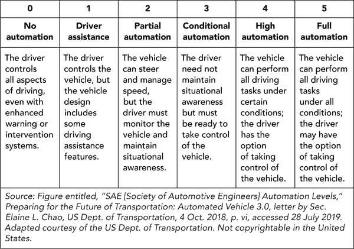

# 五、自动驾驶汽车和区块链

分布式总账系统如何为下一代交通基础设施提供资金

***大卫·米尼涅奇***

|  | **联网自动驾驶汽车简介** |

从科幻小说的页面到你身边的人行道，自动驾驶汽车开始在我们的道路和高速公路上行驶。公司之间的激烈竞争吸引了资本、重要的利益相关者和其他资源来推动这个行业的技术发展。

然而，无处不在的无人驾驶汽车世界带来了挑战，例如如何为道路建设和维护提供资金；如何保护移动物联网上的设备；如何保护所有者、用户及其数据的隐私和安全；以及车辆故障时谁该为事故负责。

区块链技术被证明不仅在降低与身份和信用卡系统相关的 IT 基础设施成本方面有效，而且在增加车辆的利润功能方面也有效。为了资助州和联邦公路网络，政府可以通过即时汇款获得这些收入。

区块链还可以减少二手车市场的信息不对称，提高保险索赔的准确性和可验证性，自动化索赔处理，并支持可信的 P2P 自动车辆租赁系统。对安全和责任的需求正在将传感器技术和机器学习推向新的高度。

一个重要的联盟是移动开放区块链倡议(MOBI)。它正在用技术开发人员、汽车制造商、交通部门和其他利益相关者之间的协作来取代孤立和秘密的研发(R&D ),以提供克服采用障碍的路线图。

电信至关重要。对高频数据输入的需求正在推动第五代(5G)国家网络的建设。对可以支持高用户量的区块链的需求正在推动可扩展性解决方案的进步，如状态通道、辅助通道、分片和互操作链。

有一天，车主或运营商可能会因为分享其他基本资源(如可再生能源和互联网连接)而获得补偿。这种总部位于区块链的共享经济可能会扩展到电动垂直起降(电动垂直起降)车辆和促进航空运输的个人飞机。

**我国国际公路网状况**

在过去的 100 年里，汽车已经成为北美的主要交通方式。为了适应个人交通，一个国际高速公路网络已经扩展到了 T4 的大部分大陆。这些高速公路系统为人员和产品有效跨境流动提供了经济管道。由于这些网络能够刺激经济活动和消除交通摩擦，因此对新道路的需求大幅增长，尤其是在发达的大都市地区。其结果是增加了交通和道路拥堵，不断的道路维护和维修，以及对新的可使用的道路和高速公路的更大需求。

为了跟上，政府不得不决定如何支付下一批道路维护和建设的费用。在过去的 50 年里，市政、州和联邦机构通过支付通行费、汽油税、停车费、车辆注册费、交通罚款和其他机动车辆违章收费来实现这一目标。

虽然汽车创新在近期快速加速，但汽车行业的两项新兴技术正在削弱政府对这些网络进行现代化改造的能力。第一个是电动汽车，这是一项环境突破，减少了我们对化石燃料的依赖，但不一定是政府对燃料销售税收的依赖。第二个是自动驾驶汽车，它正在从根本上改变我们的驾驶文化和我们对个人拥有汽车的需求。结果，来自交通罚单、车辆登记、驾照和停车的重要收入处于危险之中。

政府必须创造性地寻找新的公共资金来支付我们道路的维护和发展。2017 年，雅各布工程集团(Jacobs Engineering Group)和 Volterra Partners 的一群经济学家联合提交了一份提案，旨在以对道路使用者公平、对经济有益、对环境有益的方式资助更好、更安全、更可靠的道路。 ^([268](23_bm005.html#ch5fnr268)) 这些经济学家提出了一个基于移动性的按使用付费系统，将区块链技术与按需拼车服务(如优步和 Lyft)以及联网和自动驾驶汽车(CAV)相结合，他们的解决方案被提名为受人尊敬的沃尔夫森经济学奖的决赛候选方案。^(然而，他们的研究非常有趣。)

在这一章中，我们调查了一个以区块链为基础的系统的可行性和优点，该系统通过收费系统和基于里程的使用费来筹集资金。特别是，我们检查了几个用例，并分析了这样一个系统的技术属性，区块链的局限性和大规模采用的障碍，以及受过渡影响最大的利益相关者。

**全行业的支点**

对于许多乐观主义者来说，向电动和自动驾驶汽车时代的过渡似乎是必然的，因为强大的利益集团在这一范式转变背后投入了大量资源。2009 年，数字巨头谷歌开始开发一个秘密的无人驾驶汽车项目，该项目被称为 Waymo。^([270](23_bm005.html#ch5fnr270))2013 年，像宝马(BMW)、奔驰(Mercedes-Benz)、福特汽车公司(Ford Motor Company)和通用汽车(General Motors)这样的传统行业参与者都推出了自己的自动驾驶汽车计划。2014 年，特斯拉、优步和苹果等品牌紧随其后。到 2018 年年中，谷歌宣布其自动驾驶汽车已经行驶了超过 800 万英里。 ^([272](23_bm005.html#ch5fnr272))

对于传统汽车制造商来说，对自动驾驶汽车的重视是愿景和战略的惊人转变。多年来，经典的汽车经销商模式一直专注于在明年车型发布前推动销售。然而，制造商必须从主要关注销售单位的商业模式转变为拥有多种收入来源的商业模式。

例如，今天的汽车几乎 95%的时间都是停着的。 ^([273](23_bm005.html#ch5fnr273)) 作为资产，自动驾驶汽车可以持续工作，全天候为车主提供价值，并根据时间、距离、货物重量或价值等因素收费。一旦进入流通领域，自动驾驶汽车将成为租赁、使用和按需保险的共享资源。这对汽车所有权的概念提出了挑战。如果我们可以简单地从手机上叫一辆车，而不是支付与租赁或出售、停车、维护、强制保险和车辆检查相关的高额费用，那么我们拥有一辆车的需求就会下降。这种转变直接影响到道路上的车辆数量，汽车销量，制造商的底线，以及政府收取的费用。因此，一个行业局外人可能想知道为什么这些公司投资研发来扰乱他们自己。

值得称赞的是，制造商正在寻求利用一种称为移动即服务(MaaS)的新业务模式。MaaS 代表了一种新的以用户为中心的移动模式。 ^([274](23_bm005.html#ch5fnr274) 这两件事让汽车以前所未有的方式参与到服务经济中。” ^([275](23_bm005.html#ch5fnr275)))

巴林杰解释道:“20 年前，汽车制造商的价值链随着汽车的销售和贴在挡风玻璃上的标价而结束。租金和价值的提取来自金融服务，如租赁和车辆维修。现在，这种提取将在汽车的生命周期中持续进行。” ^([276](23_bm005.html#ch5fnr276))

根据德勤的数据，消费者对优步和 Lyft 等新的移动选项和拼车应用持积极态度。到 2024 年，全球汽车共享预计将超过 2300 万用户。 ^([277](23_bm005.html#ch5fnr277)) 底特律三巨头——通用、福特和菲亚特克莱斯勒——以及其他汽车制造商在这些合资企业的发展上投入了大量资金。看看通用汽车在 2016 年初对 Lyft 的 2.5 亿美元投资就知道了。 ^([278](23_bm005.html#ch5fnr278)) 同样，就在 2018 年 8 月，丰田在优步投资了 5 亿美元，以达成一项“无人驾驶汽车协议”，为 MaaS 和自动驾驶汽车的未来搭建桥梁。 ^([279](23_bm005.html#ch5fnr279))

如果我们考虑这些投资的规模和数百万英里的成功试驾，我们会发现这些公司拥有比许多车主预期的更快实现无人驾驶未来的资本和能力。据*连线*报道，汽车行业的普遍共识是，四级自动驾驶汽车(即全自动化以下一级)的发展正在迅速加速([表 5-1](#tab5-1) )。 ^([280](23_bm005.html#ch5fnr280))

**表 5-1**
六个自治级别

自主的福与祸

尽管取得了重大进展，但交通运输领域这种巨大转变的长期后果值得我们关注。通常，自动驾驶汽车的头条新闻都集中在积极的环境影响和该技术缓解道路拥堵的潜力上。然而，在 2018 年 6 月的一次会议上，在离密歇根州汽车城不远的“思想交流峰会”上，主题是严肃的:“我们如何防止自动驾驶汽车将美国城市带入金融毁灭？” ^([281](23_bm005.html#ch5fnr281)) 与会者的共识是，尽管许多人可能普遍认为无人驾驶汽车是一座金矿，但这项技术的经济现实却截然不同。

俄勒冈大学(University of Oregon)城市规划未来中心(Urbanism Next Center)主任尼科·拉科(Nico Larco)是此次活动的发言人，他的发言集中在许多城市严重依赖机动车辆带来的收入。仅在美国，这些收入流就占运输收入的 15%到 50%。 ^([282](23_bm005.html#ch5fnr282)) 市领导的担心有几个原因。首先，自动驾驶汽车的许多概念都是针对电动汽车的；通用汽车选择了雪佛兰 Bolt 作为未来的主要电动汽车。 ^([283](23_bm005.html#ch5fnr283)) 虽然福特等其他公司更强调混合动力车，但这种转变仍有可能降低汽油税。其次，制造商可能会对自动驾驶汽车进行编程，使其遵守交通法规，从而有效消除公共驾驶违规带来的收入。最后，自动驾驶汽车将能够继续行驶并为其他乘客服务，而不是收取停车付费。

我们需要创造性的解决方案来资助公共基础设施。沃尔夫森勋爵将 2017 年沃尔夫森经济学奖定位于解决这一问题。Jacobs 和 Volterra 的联合竞标承认，通过按使用付费系统，区块链技术可以成为自动驾驶汽车网络的重要收入组成部分。联合投标的作者指出，利用区块链可以实现隐私保护、个人数据的许可货币化、无摩擦计费以及账户透明度和可审计性。

**区块链作为交通平台**

区块链是一种新兴的网络技术，其功能是作为全球分布式价值分类账，使对等方之间的交换不需要可信的中介。分布式分类帐的性质使得创建不需要中心控制点的网络(如车辆到车辆的信息网格)变得既容易又划算。区块链固有的以安全可靠的方式进行通信、发行、交易和管理价值的能力，使其作为一种新的革命性运输经济的基础特别有吸引力。MOBI 的巴林杰说，“区块链可以以许多有趣的方式提供服务。” ^([284](23_bm005.html#ch5fnr284))

区块链和自动驾驶汽车是相对较新的发展。正如大型汽车制造商在谷歌 2009 年推出 Waymo 后花了几年时间开发无人驾驶汽车一样，在中本聪 2009 年发布比特币区块链协议后，企业用了几年时间开始试点区块链项目。尽管历史短暂，但初创公司已经做了很多工作来理解区块链如何支持一个能够在自动驾驶汽车、人类和其他实体之间实现安全通信甚至价值交易的网络。

**收费公路:早期基于区块链的车辆价值转移系统**

一些最早的区块链车辆价值转移系统的出现是为了解决与收费公路计费相关的问题。Oaken Innovations 是一家总部位于得克萨斯州的区块链技术公司，专注于基于区块链的自主移动和安全物联网应用，用于机器对机器(M2M)通信和价值转移。Oaken 在 2017 年 2 月首次掀起波澜，当时它在世界政府峰会上获得了 10 万美元的最高奖项，这是一个专注于智能治理和建立区块链解决方案以推进智能城市应用的会议。 ^([286](23_bm005.html#ch5fnr286)) 它的获奖作品将一辆特斯拉放到了区块链，目的是建立一个 P2P 收费公路解决方案。

Oaken 的平台发展了它喜欢称之为*冗余节点上的自主通信* (ACORNS)。它使用以太坊、IPFS 和 Node.js 来驱动它的分散系统。 ^([287](23_bm005.html#ch5fnr287)) 因为 ACORNS 运行在以太坊虚拟机(EVM)之上，所以该平台兼容所有以 EVM 为核心的区块链。

奥克恩的系统工作原理如下。装有 ACORN 的收费站有一个虚拟的收费站，由红灯和绿灯表示。特斯拉的 ACORN 然后与收费站通信，它想要支付通行费，导致收费站触发智能合约交易。智能合约交易获取原始 Tesla 数据，并以 IPFS 散列的形式将其传送给区块链。然后，特斯拉使用原始数据验证区块链交易，并将它们与收费站智能合约中的全球定位系统(GPS)数据进行比较。画布数据存储在 IPFS 上，并触发支付通行费智能合约，以加密货币无缝支付通行费。最后，收费站的 ACORN 接收到来自付费合约的信号，打开大门，允许特斯拉进入收费公路。 ^([288](23_bm005.html#ch5fnr288))

收费变得越来越普遍，因为它们有助于偿还大量基础设施债务。例子包括美国州际高速公路系统，一个最初计划通过收费资助的网络。该网络耗资 1320 亿美元建造，最终由联邦天然气税资助，筹集了 1190 亿美元。 ^([289](23_bm005.html#ch5fnr289))

重要的研究吹捧收费的好处，罗德岛被证明是一个恩人。 ^([290](23_bm005.html#ch5fnr290)) 然而，收费并非没有缺点。收费公路需要昂贵的收费公路基础设施来管理会计、身份和支付，交易费用高达 3%或更高。一个收费解决方案是 Kapsch TrafficCom 的 E-ZPass 技术。 ^([291](23_bm005.html#ch5fnr291)) E-ZPass 是一个 RFID 系统，至少由三部分组成:每辆车中都有一个应答器，它存储着与用户账户相关联的唯一标识符；在每条收费车道上都有另一个应答器，它与收费站(甚至车道)的位置相关联，并通过局域网连接到第三方，即中央服务器。它的工作原理是这样的:电话亭的应答器不断发射信号，以搜索车辆的应答器。当车辆应答器进入展台应答器的读取场时，它会广播其唯一标识符。展台应答器接收信号，将标识符、位置以及可能的车道数据发送到系统的中央服务器。服务器将标识符与用户账户相关联，并向该账户收费。但是这个系统并没有加密，所以黑客可以从应答器中提取单个司机的信息，或者从中央数据库中提取更多的数据。 ^([293](23_bm005.html#ch5fnr293))

基于区块链的收费站解决方案有几个好处。区块链的使用大大增加了流程的价值，因为它消除了数据库、身份和信用卡系统的集中式服务器基础架构。这样做可以将双方之间的 3%的费用减少到 0.1%，同时还有即时汇款的额外好处。俄亥俄州收费公路和基础设施委员会执行主任兰迪·科尔强调了区块链管理本届政府的重要性。他表示，目前的系统在管理交易的后端产生了大量不必要的成本，这些成本随后被转嫁给了司机。 ^([294](23_bm005.html#ch5fnr294))

事实上，这与区块链企业中许多人宣称的将陈旧的遗留银行系统转移到分布式账本上，以简化流程来帮助节省数百万美元没有太大区别。从这个角度来看，用例似乎非常适合。这也回避了这样一个问题:区块链还能在哪里为交通问题提供解决方案。

**移动开放区块链倡议**

2018 年 5 月，首席执行官 Chris Ballinger 宣布成立 MOBI，这是一个由丰田研究所、福特、通用汽车和宝马等大型制造商组成的财团。MOBI 现在拥有超过 80%的全球汽车制造商。加入汽车制造商行列的有 Oaken 和其他区块链和分布式分类账初创企业，如 Gem、BigChainDB 和 Commuterz，以及咨询和开发公司，如 IBM、Accenture 和 ConsenSys。这些利益相关方寻求提供初始汽车平台，为生态系统的汽车数据交换和移动平台提供动力。MOBI 的主要目标是利用区块链和其他技术，使交通更安全、更实惠、更普及。 ^([296](23_bm005.html#ch5fnr296))

根据巴林杰的说法，MOBI 是这些公司之间的中立召集人。由于在独立实验室中生产可行的区块链解决方案的 R&D 成本可能对许多运营商来说过于昂贵，MOBI 作为一种公共产品，多个实体可以提供资金，并从共享的突破中受益。该联盟代表最终隔离的概念验证(POC)试点、秘密研究和开发项目。这个开放式创新工作组包括竞争对手、供应商、监管机构和拥有共同目标的政府机构。有这么多令人印象深刻的利益相关者出席，它还允许创建和执行所有成员都同意的通用标准，以便未来车辆之间的通信更容易。这种结构所提供的协作已经为未来的路线图提供了几个关键产品。

**车辆身份护照、历史记录和追踪**

MOBI 的巴林杰和初创公司 Oaken 的联合创始人约翰·格里茨(John Gerryts)表示，数字身份是区块链和无人驾驶汽车平台最关键的组成部分之一。因此，MOBI 的第一个项目是开发一个身份系统，被称为“汽车护照”，用于跟踪区块链上的里程和所有相关数据的车辆。 ^([298](23_bm005.html#ch5fnr298)) 它与 CARFAX 模式的相似之处在于，它减少了二手车的欺诈销售，因为买家和卖家可以访问车辆未经篡改的历史。这种透明度凸显了汽车销售中的“柠檬”或高估资产。 ^([299](23_bm005.html#ch5fnr299))

**保险定价**

随着车辆身份的确定，在区块链上运行的保险应用程序也是开发的目标。通过不可变的数据输入来描述汽车的历史，保险提供商可以应用特定于该车辆及其驾驶员自身历史的动态定价模型。其结果是为每个人量身定制价格，而不是根据年龄、性别、品牌或车型根据司机或其车辆的感知风险来定价。这种模式被称为*基于使用的移动定价。*

虽然准确性和效率绝对是这里的驱动因素，但这项技术也应该阻止鲁莽驾驶。但是，保险公司应该跟踪驾驶习惯到什么程度呢？尽管保险公司应该奖励谨慎的司机，但每个人都容易偶尔犯错。数据隐私可能会引起争议。

**车辆租赁、汽车共享和乘车服务**

数字身份再次从根本上与入站支付联系在一起。内向支付最终将管理大多数 P2P 服务，如同行汽车租赁以及与之相关的车对车或 M2M 拼车支付。

在 2017 年共识大会上，MOBI 首次推出了其支持区块链的 P2P 汽车租赁应用。该应用程序允许消费者使用以太坊区块链上的智能合约、IPFS 上的文件存储以及租赁和控制车辆访问的移动应用程序从车主处租赁车辆。这些应用允许交易方之间的即时汇款，并且通过使用编码到智能合约的逻辑来这样做而不需要支付处理器。基于区块链的超安全物联网控制增加了目前消费市场上没有的安全级别，同时减少或消除了对服务器基础设施的需求。

MOBI 表示，区块链可以处理应用程序逻辑和数据存储，从而取代传统的服务器基础设施。区块链中的应用层可以存储车辆身份以及 GPS、道路和地图数据。 ^([301](23_bm005.html#ch5fnr301)) 可信实体可以更新这个分散的数据层。同时，智能道路传感器可以为这个数据库提供信息。它将提供所有车辆和基础设施的完整视图，包括当前的建设和交通状况，第三方可以在这些数据的基础上构建应用程序。还可以针对租赁或拼车服务修改车辆数据，以使用此区块链服务图层构建消费者移动应用程序。

在使用区块链技术的潜在共乘或租赁交易中，即时价值转移和微交易现在是可能的。在一个智能合约交易中，即时汇款给多方:

车主

司机

保险提供商

收费公路管理局

道路税实体(如州运输部)

所有实体都收到即时和有保证的资金支付。此外，骑手可以为骑手的租赁交易向托管合约支付小额保险政策，然后在骑手完成后汇给保险提供商，托管的余额归骑手或承租人所有。正如我们所讨论的，用户可以实现自主收费的托管合约，甚至可以从收费公路基础设施中取消收费站，因为我们可以使用 GPS 来证明车辆的位置。我们甚至可以拥有智能收费公路基础设施，公路只在高峰时段收费。

此外，通过标记汽车的身份，我们可以使私人 GPS 和时间戳数据能够进行数据交换，立即允许路线优化和容量建模供其他实体使用。该系统还允许其他车主通过使用区块链骑手身份来租赁他们自己的车辆。

随着消费者行为从购买燃油转向更青睐按次付费的流动性而非车辆所有权，道路和基础设施主管部门将面临税收收入的短缺，目前这些税收收入用于道路的建设和维护。MOBI 假设在移动交易中包含基于使用的税收，以弥补这一收入损失。它甚至可以满足短途旅行的需求，而税收只需几分之一便士。

通过该系统，资产所有者和驾驶员、税务实体、收费公路和保险提供商都可以在单笔交易中获得即时汇款的好处，而无需支付处理中介。这家总部位于区块链的汽车共享平台的运作方式如下:

经过认证的驾驶员或骑手找到可租赁的车辆和租车价格。

驾驶员或骑手选择驾驶员想要租赁的车辆，现在可以打开车门并使用汽车的按钮启动车辆。在背景中，内部汽车密钥卡已经打开，以授予驾驶员操作车辆的能力。

这一过程非常有价值，因为车主能够立即将他们未使用的车辆时间货币化给信任的司机或乘客。为自动驾驶汽车的未来做准备，这个平台使用户能够按需支付并获得移动性。

**实施注意事项**

虽然区块链肯定拥有支撑基于 MaaS 的自动驾驶汽车网络的特性，但该技术有重大障碍需要克服，我们必须在大规模采用之前解决个人、法律和道德问题。

**区块链延迟和可扩展性**

由于使用按使用付费的自动车辆网络的用户数量，这些系统必然会经历大量的交易。像以太坊这样的大型公共区块链网络在面对太多用户时会遇到困难。

面对高交易量，以太坊的速度明显变慢了。2017 年 11 月，以太坊最受欢迎的 Dapp CryptoKitties 上了大幅头条。CryptoKitties 是一款手机游戏，允许玩家在以太坊的底层网络上购买和繁殖“密码宠物”。这款游戏的开发者表示，CryptoKitties 为将区块链带到日常移动用户手中提供了“关键的一步”，而区块链的 MaaS 服务肯定会提供这一点。但是这款游戏获得了巨大的成功，据报道，它导致未决交易增加了 6 倍，占以太坊总交易量的 10%以上。 ^([304](23_bm005.html#ch5fnr304)) 商业用户担心游戏交易获得与网络上的一般商业交易相同的优先权。更糟糕的是，由于流量增加，所有交易时间都明显变慢了。

区块链进程和在核实交易方面达成共识是如何导致经济放缓的。当网络上发生对等体之间的交换时，所有节点都必须更新它们的记录，以保持链的当前状态，这是“真实”的单一来源，但这样做从根本上降低了整个技术的处理能力。

当我们考虑到像优步这样的打车应用每天处理的出行数量时，这些网络问题就变得很成问题。根据应用程序的*业务，优步在 2017 年每月服务 4000 万客户。 ^([305](23_bm005.html#ch5fnr305)) 我们可以将这个数字分解为每秒大约 900 笔交易，这还不包括类似 Lyft 这样的服务应用。那些认为未来车主数量会减少、基于 MaaS 的打车应用用户数量会增加的人也预计用户数量会增长。目前，以太坊每秒只能处理 15 次左右的交易。乍看之下，这两个数字之间的差异似乎是一条鸿沟，但许多创造性的努力正在进行中，以增加以太坊和其他区块链的交易容量。*

这些解决方案中的第一个被称为*状态通道。*状态通道是发生在*链外*的交易——本身不在特定的区块链上(*链内*)——并且显著地降低了成本并提高了交易速度。 ^([307](23_bm005.html#ch5fnr307)) 考虑有多个不同停靠点的共享乘车，需要在短时间内处理很多支付。我们只需要记录链上的期初和期末账户余额，因为我们可以离线重新处理所有中间支付。这种能力有助于减少记录在主分类账上的交易量。

*侧链*是遵循类似逻辑的另一个进步，交易发生在主区块链之外。这里的优势是，几个不协调的团体都可以利用同一个区块链。 ^([308](23_bm005.html#ch5fnr308)) 举例来说，优步经常向乘客收取更高的费用，即所谓的*激增定价*，而优步却在一次服务更多的用户。 ^([309](23_bm005.html#ch5fnr309)) 侧链可以作为一种结构来处理这些额外的交易，以保持合理的网络费用和可管理的处理时间。雷电网络和等离子体正在应用这些原则来扩展以太坊区块链上的服务。根据 ConsenSys 首席战略官 Sam Cassatt 的说法，这些网络已经能够以较低的价值增量安全地处理数以千计的交易。 ^([311](23_bm005.html#ch5fnr311))

最后，最有趣的解决方案之一被称为*分片*，这是谷歌等公司使用的一种较老的数据存储技术。分片将数据库划分成小的、容易消化的部分，称为*分片*，意思是*小块。 ^([312](23_bm005.html#ch5fnr312))* 当我们聚合查看这些碎片时，我们看到的是原始的数据结构。 ^([313](23_bm005.html#ch5fnr313))

虽然区块链可扩展性方面的技术突破无疑将改善自动驾驶汽车 Dapps，但支持区块链的自动驾驶汽车的未来可能会围绕多个利益相关方；像以太坊这样的单一网络不一定是任何大型系统(如自动车辆数据网格)的底层协议。

Matthew Spoke 是 AION(现在称为开放应用网络)的创始人，该协议专注于不同区块链之间的互操作性和通信。他不是唯一一个相信所需的基础设施将由许多不同的链组成的人，就像互联网由许多网络组成一样。有了这样的基础设施，区块链可以相互通信和交易，通过一种叫做原子跨链交换的方法来分担大量的交易。在这个领域运作的一些项目包括 AION、宇宙和图标。 ^([316](23_bm005.html#ch5fnr316))

Oaken 的首席执行官 John Gerryts 喜欢另一个名为 Polkadot 的项目，该项目功能类似，可以帮助像 MOBI 这样的项目。Polkadot 允许这些区块链之间的连接，本质上是将它们的网络啮合在一起。 ^([317](23_bm005.html#ch5fnr317)) 波尔卡多特使用一种被称为*副链*的切割方法，多条链同步前进。然而，这些链也可以用不同的共识算法与不同的链对话。因此，使用其固有逻辑的区块链必须确定其他链的共识。虽然复杂，但这些突破让我们相信，这项技术将在不久的将来大批量生产。

许多项目正试图让区块链加快速度，投入巨大的努力和资源来实现这一未来。正如自动驾驶汽车需要更多的发展才能在我们的道路上随处可见一样，区块链需要创新来支持大规模 MaaS 网络的需求。

**通信网络延迟**

今天，5G 网络代表了连接的下一个进步。改进的通信基础设施、最新研究的进展以及尖端的网络技术将使连接速度成倍增长。 ^([318](23_bm005.html#ch5fnr318)) 平均下载速度预计达到每秒 1gb。 ^([319](23_bm005.html#ch5fnr319)) 延迟的大幅降低是推动物联网大幅发展的关键因素。这是自动驾驶汽车网络的一项重要发展。

雷·夏尔马(Ray Sharma)是 Extreme Venture Partners 的联合创始人兼执行经理，也是早期新兴科技公司的狂热投资者。在最近西安大略大学艾维商学院的一次谈话中，夏尔马表示，“5G 的最大受益者是自动驾驶汽车。” ^([320](23_bm005.html#ch5fnr320)) 事实上，2018 年，*福布斯*发布了一份支持这一说法的报告，称自动驾驶汽车司空见惯的世界很可能依赖于无处不在的 5G 网络。 ^([321](23_bm005.html#ch5fnr321)) 这是因为驾驶还是关乎人的认知、反射、反应。模仿这些动作所需的速度和数据处理能力很高。据 Maja Systems 的联合创始人兼首席执行官 Joy Laskar 博士称，自动驾驶汽车每周将产生 2 Pb(200 万 GB)的数据。为了清楚起见，他说，“通过先进的 Wi-Fi 连接，从自动驾驶汽车传输一周的数据需要 230 天，这就是为什么我们需要更快的 ASIC(专用集成电路)处理技术和产品。” ^([322](23_bm005.html#ch5fnr322))

事实上，比特币社区面临着类似的问题。验证区块链交易的过程——挖掘——在很大程度上也依赖于 ASIC 处理芯片。充分运行这些复杂的系统需要计算性能和效率，因此，这些芯片的创新是下一代技术的瓶颈。然而，像英特尔和高通这样专注于这些半导体的大公司可能即将在 ASICs 方面取得突破，这将显著提高处理能力。 ^([324](23_bm005.html#ch5fnr324)) 这些进步将结合当前创新的天线架构和具有更大带宽和 5G 频率的数字无线电。 ^([325](23_bm005.html#ch5fnr325)) 其结果将是将互联的车辆变成强大的“车轮上的数据中心”,能够做出准确的实时决策。 ^([326](23_bm005.html#ch5fnr326))

此外，国际律师事务所 Holland & Knight (H&G)最近的一份报告表明，将区块链纳入 5G 将产生许多好处。由于 5G 有望带来自动驾驶汽车等物联网设备的激增，H&G 表示，区块链将有助于提高这些设备上数据的安全性和有效性。这些设备的数量无疑会大大增加可用的信息量。考虑到一些操作过程对这些信息的依赖程度，例如 GPS 与其他车辆协同确定一辆汽车的位置，它们收集的数据的完整性必须保持不被破坏。

虽然这个未来看起来很遥远，但它可能会比预期来得更早。特朗普政府探索加速部署 5G，并估计 5G 可以帮助创造 300 万个新工作岗位、2750 亿美元的私人投资和 5000 亿美元的新经济增长。时任美国国家经济委员会(National Economic Council)主任的拉里·库德洛(Larry Kudlow)断言，5G 竞赛将“主要通过自由企业、自由市场经济”赢得，并得到美国联邦通信委员会(US Federal communication s Commission)等政府机构的一些支持，该委员会最近刚刚投票废除了实施方面的监管障碍。 ^([329](23_bm005.html#ch5fnr329))

库德洛的观点刺激了像电信基础设施项目这样的新联盟的建立，这是由英特尔和脸书这样的巨头带头的超过 450 家电信公司的伙伴关系。 ^([330](23_bm005.html#ch5fnr330)) 该财团的目标是加快全球 5G 基础设施发展的步伐。我们可以在两到五年内看到 5G 的普及。 ^([331](23_bm005.html#ch5fnr331)) 它将消除采用自动驾驶汽车的最大障碍之一。

总之，虽然将自动驾驶汽车推向市场的竞争正在加剧，但在这些汽车体验到最高性能和功能之前，我们需要更普及的 5G 网络基础设施。尽管如此，几个重要的利益相关者，从政府到大型企业，都表示他们打算在未来几年支持类似的努力来发展这个网络。这些技术之间的关系值得关注，因为 5G 的采用可能会先于自动驾驶汽车时代。

**不可变记录与隐私**

在技术领域，数据隐私是今年最普遍的问题。2018 年初，我们了解到，一家总部位于英国的数据分析公司 Cambridge Analytica 在未经同意的情况下，从 5000 万脸书用户账户中获取了信息。这一泄密事件与美国总统大选有关，受到许多人的关注。这一事件将侵犯隐私置于显微镜下，因为人们开始询问谁有权访问或监控他们的数据，以及他们如何使用这些信息？

在自动驾驶汽车和 MaaS 系统中，这个问题值得特别关注，因为用户越是利用网络技术来促进他们的交通，他们在理论上就越容易被跟踪和记录。2014 年，在公众了解到一个被称为“上帝视角”的功能被使用后，优步的管理受到了严厉的批评^([333](23_bm005.html#ch5fnr333))God View 是一个工具，它使优步的公司办公室能够实时跟踪任何个人的位置和活动。^([334](23_bm005.html#ch5fnr334))虽然该办公室表示这些信息仅用于合法的商业目的，如支付司机费用、监控欺诈活动和排除用户漏洞，但来自 *Time* 的一些报告证实了一些更邪恶和不负责任的做法。 ^([335](23_bm005.html#ch5fnr335))

当欧盟在 2018 年通过 GDPR 时，它为欧盟的所有个人建立了关于数据和隐私保护的重要法律，包括在其管辖范围之外输出个人数据。 ^([336](23_bm005.html#ch5fnr336)) 这些规则很重要，因为尽管任何坏演员都可能恶意地使用新技术，但我们有机会利用这些创新创造出令人难以置信的好处。数据和分析正在塑造交通的未来。该行业在创造万物互联方面处于领先地位。 ^([337](23_bm005.html#ch5fnr337)) 嵌入交通网络的传感器正在收集和提供有关车辆定位系统、收费和售票的信息。^(338)

该领域的领导者正在使用大数据和先进的分析和规划工具来设计和建设更加高效、协调和有效的运输路线。城市规划者和交通机构正在使用这些数据来改善运营、降低成本和更好地为旅客服务。他们正在研究交通事故和交通维护对效率的影响，以及公共交通延误或交通工人罢工对经济的影响，他们正在模拟新城市和商业发展与交通系统的关系。 ^([339](23_bm005.html#ch5fnr339))

虽然数据的这些用途带来了机遇，但在对话中引入区块链等新技术时，我们必须小心谨慎。任何听说过区块链的人都知道，其最受推崇的优点之一是其不变性，由交易分类账保证，所有交易都由网络参与者的共识来验证。一旦交易达到适当的验证级别，加密技术可以确保交易不会被更改、改变或撤销。 ^([340](23_bm005.html#ch5fnr340))

当涉及到我们的行踪时，我们可能不想使用不可变数据的系统。对于任何基于区块链的 MaaS 系统，我们必须考虑自我识别数据的收集和使用。2014 年，欧盟引入了另一项名为“被遗忘权”的进步数据法律，根据该法律，个人可以从互联网上删除任何个人数据。 ^([341](23_bm005.html#ch5fnr341)) 法律云:

相应命名的规则主要规范擦除义务。根据这一规定，如果数据不再需要用于最初的处理目的，或者数据主体已经撤回同意并且没有其他合法理由进行处理，数据主体已经反对并且没有压倒一切的合法理由进行处理，或者为了履行欧盟法律规定的法定义务或成员国的权利而需要删除，则必须立即删除个人数据。此外，如果处理本身首先是违法的，数据自然必须被删除。 ^([342](23_bm005.html#ch5fnr342))

在这样的法律下，区块链的属性似乎使其无法支持基于 MaaS 的服务。然而，它的技术属性也使用户能够要求对自己的数据拥有所有权，或将自己的身份与自己的数据分离开来。

首先，用户可以在他们的交易中加入零知识证明。零知识证明使得“证明者”能够向“验证者”保证证明者知道秘密或陈述，而不暴露秘密本身。虽然最初很复杂，但这些证明允许完全匿名的交易，并具有增强的安全性和隐私性:用户在他们的移动和移动中不会被识别，至少在他们的交易历史中不会。此外，我们正通过一个称为 zk-SNARKS 的微小变化，在区块链看到这种技术的实现。虽然电子货币公司、Dash Core Group 和 Monero Project(专注于增强隐私的公司)是第一个采用这一加密货币标准的公司，但以太坊后来通过名为 Byzantium 的系统升级增加了这一功能。^(344)

其次，用户可以建立 ConsenSys 首席执行官 Joseph Lubin 所说的“持久的数字身份和角色”，在区块链上存储和管理。Tapscotts 把这种私人数据存储称为“虚拟黑匣子”:

您的黑盒中可能包含政府颁发的 ID、社会安全号码、医疗信息、服务账户、财务账户、文凭、执业执照、出生证明、各种其他凭证等信息，以及您不想透露但希望将其价值货币化的个人信息，如性取向或医疗状况，以用于民意调查或研究。您可以将这些数据授权给特定的实体，在特定的时间段内用于特定的目的。 ^([346](23_bm005.html#ch5fnr346))

例如，用户可以分享他们的驾照，以获得区块链交通系统的司机资格，或者分享他们的数字钱包地址，以确认他们可以支付交通费用。

Brave 是一款位于区块链的浏览器，由 Mozilla 前 CEO 布伦丹·艾奇开发。去年，Brave 在一次 ICO 中在 30 秒内筹集了 3500 万美元，用于资助开发一种保护用户数据并阻止广告商使用的浏览器。 ^([347](23_bm005.html#ch5fnr347) 更严重的是，处于数据危机中的脸书开始与几家加密货币交易所谈判，准备发行一种脸书货币，这可能是对通过所谓的*数据红利利用用户数据的奖励。 ^([349](23_bm005.html#ch5fnr349))*)

在*区块链革命*中，Tapscotts 讨论了区块链在特定时间段内为特定目的向特定实体许可数据的能力。 ^([350](23_bm005.html#ch5fnr350)) 考虑移动性:用户可以将他们的运输历史许可给相关的运输机构，这样在用户获得许可收入的同时，这些机构可以做出更明智的决策。

DOVU 是 MOBI 的成员，是区块链的一个项目，试图提供数据许可功能。2017 年 4 月，DOVU 获得了捷豹路虎投资部门 inMotion Ventures 和英国政府支持的基金 Creative England 的种子资金。DOVU 认识到这些数据对交通部门的价值。这些团体可以从那些愿意用 DOVU 的本地 DOV 令牌交换这些信息的用户那里购买，而不是非法获取这些信息。^(T22)351据巴林杰称，MOBI 正致力于建立一个被称为*数据市场的类似系统。 ^([352](23_bm005.html#ch5fnr352))*)

通过这种方式，用户可以收到他们创建和共享的数据的令牌。反过来，他们可以使用这些代币支付与交通相关的服务，如使用租赁的自动驾驶汽车、优步等拼车服务或任何其他相关的公共交通工具。这个概念很强大。Oaken 的联合创始人约翰·格里茨(John Gerryts)说，“你知道，当你想到这一点时，它几乎就像一种普遍的基本收入。” ^([353](23_bm005.html#ch5fnr353)) 谷歌首席未来学家兼工程总监雷·库兹韦尔(Ray Kurzweil)以对未来的准确预测而闻名。在 2018 年的一次 TED 会议上，他回应了 Gerryts 的想法，他说:“在 21 世纪 30 年代初，我们将在发达国家实现普遍的基本收入，到 21 世纪 30 年代末，在全球范围内实现普遍的基本收入。你可以靠这个过得很好。首要关注的将是意义和目的。” ^([354](23_bm005.html#ch5fnr354)) 因此，其影响远远超出了区块链、数据和后果难言的自动驾驶汽车。

总之，虽然对数据和隐私的担忧可能会加剧，但将区块链整合到 MaaS 应用程序中可能会提供一个解决方案。zk-SNARKS、匿名交易、身份黑盒和头像的结合可以帮助用户对在移动应用中使用他们的信息和共享个人数据以换取令牌感到安全。

**设备安全**

我们道路上的自动驾驶汽车可以保证一件事:基于物联网的联网设备数量激增。这将不仅包括道路上的汽车，还包括与之交互所需的移动设备数量，以及为这些车辆提供信息的外部设备数量。到 2025 年，将有多达 75 亿台设备连接到物联网。 ^([355](23_bm005.html#ch5fnr355))

然而，随着物联网设备数量的增加，安全漏洞也随之增加。2018 年初，密歇根大学发布了一篇论文，结论是与自动驾驶汽车相关的风险是前所未有的，也是没有记录的。黑客有越来越多的机会渗透和利用数百万台设备。根据行业专家的说法，这些设备上运行的许多固件都非常脆弱和不安全，将数量不定的关键系统和设备置于风险之中。 ^([357](23_bm005.html#ch5fnr357))

虽然黑客迄今已经攻破了一些重要的物联网系统，从圣犹大医疗中心的心脏设备到臭名昭著的 Mirai 未来组合僵尸网络攻击，但最能说明问题的可能是 2015 年 7 月被称为“吉普黑客”的事件，该事件暴露了一个固件更新漏洞。 ^([358](23_bm005.html#ch5fnr358)) 当一辆吉普车在高速公路上行驶时，黑客使用 Sprint 蜂窝网络控制了它，并发现他们可以让吉普车加速、减速，甚至驶离公路。 ^([359](23_bm005.html#ch5fnr359))

根据福布斯的数据，今年使用物联网的攻击增加了 280%。密歇根大学的研究人员表示，这种攻击可能涉及拒绝服务或分布式拒绝服务攻击，汽车会在道路中间停下来。黑客还可以控制一辆汽车，并以特定数量的比特币来赎金。最后，无人驾驶汽车可以被黑客攻击并开到当地的拆车厂，而窃贼却无法实际接触到汽车。 ^([362](23_bm005.html#ch5fnr362))

面对这些威胁，密歇根大学的团队开发了一种称为 Mcity 威胁识别模型的工具，使研究人员、学者和行业工作者能够识别威胁及其潜在的严重性。该矩阵涵盖五个关键领域:攻击场景、系统抵御攻击的能力、攻击者的能力、攻击者的动机以及对利益相关者的影响。研究人员使用这些输入信息开发一个全面的矢量统计，并确定总的威胁和影响水平。对通用安全标准和协议的需求也在增长。美国商务部已经启动了几项教育和技术举措，以确保消费者了解他们购买的产品的安全级别，并确保设备制造商在设备设计和制造中采取预防性安全措施。 ^([364](23_bm005.html#ch5fnr364))

使用与物联网集成的区块链系统可以提供额外的安全优势。物联网安全的一些缺点包括设备的身份和认证问题，以及其集中式安全模型和基础设施。 ^([365](23_bm005.html#ch5fnr365)) 物联网使用分布式客户端/服务器模式运行:为了运行这些网络，管理员或中央机构必须管理网络(与 E-ZPass 一样)，从而为整个系统创建单点攻击和故障。 ^([366](23_bm005.html#ch5fnr366))

有了区块链，数据存储在分布在许多节点的分类账上，因此黑客必须一次攻击一个特定的节点。一旦网络中的其他节点识别出一个节点的邪恶行为，它们就可以隔离它以防止进一步的伤害。当物联网节点在链上注册时，它们会收到一个唯一的交易标识符和相应的哈希。对分类账的所有更改都需要此签名授权；所有节点都可以追溯到做出更改的节点。节点将不会验证共识中的未授权改变。 ^([367](23_bm005.html#ch5fnr367))

虽然区块链的房产可以提供安全增强，但它们也不能免受攻击。区块链最常被引用的漏洞被称为“51%攻击”，黑客控制了网络中至少 51%的节点，这相当于网络哈希能力的大部分。然而，区块链和其他中间件一样容易受到代码错误的影响。事实上，这些漏洞已经导致了重大损失:臭名昭著的 Mt. Gox、DAO、Bitfinex 和 NiceHash 黑客攻击总共让用户损失了大约 7 亿美元。 ^([368](23_bm005.html#ch5fnr368)) 在 2017 年末 Parity 的安全漏洞之后，又有 1.5 亿美元被冻结。 ^([369](23_bm005.html#ch5fnr369))

如果我们希望区块链和物联网支撑一个庞大的自动驾驶汽车互联系统，连接到成千上万的数字钱包，那么我们必须采取谨慎的措施来减轻巨大的风险。教育用户和制造商可接受的安全标准和数据处理实践是重要的一步。对硬件制造商实施这些标准和实践也是如此。有价值的奖励可以吸引更好的测试人员仔细检查代码中的错误。

总之，即将到来的物联网设备和联网车辆的激增必然会为黑客和抵御攻击的安全解决方案带来更多机会。针对 St. Jude's 和 Jeep 的高调黑客攻击表明，区块链和物联网在增强安全性方面有很大的进步空间。事实上，随着这项技术变得越来越普遍，这个问题可能会在变好之前变得更糟。进一步的技术开发、完善的风险评估工具、安全标准的教育和实施以及软件奖励计划可能会减轻潜在的风险。

**法律和道德含义**

法律和技术经历了一种有趣的关系。普通法是在加拿大、美国、英国、澳大利亚和其他国家实行的法律标准。它是基于*遵循先例*的原则，也称判例。法院判决影响未来案件的结果。通过这种方式，法律通过回顾过去来发展未来。这一演变也极其缓慢，决策可能需要数周时间，而立法过程可能需要数月或数年。公平地说，这样一个经过深思熟虑的过程最大限度地减少了条件反射规则和反应性监管。

与之相反的是技术创新。创新只对速度和一个方向感兴趣:快速前进。库兹韦尔称之为“加速回报定律”，这一理论解释了不同形式的技术进步的指数增长。 ^([370](23_bm005.html#ch5fnr370)) 法律常常迟迟不能制定出能够充分补偿技术发展速度的框架。

【2018 年 3 月 19 日，自动驾驶汽车行业遭遇了毁灭性的挫折。在亚利桑那州的坦佩，优步的一辆自动驾驶汽车在完成其无数英里试驾中的一英里时，撞死了一名行人。华盛顿大学汽车自动驾驶的法律含义研究员瑞安·卡洛(Ryan Calo)表示，虽然调查已经展开，但这起事故不太可能成为一个法律先例，因为即使被撞者负有部分责任，优步也可能负有责任，并将迅速解决并避免一个测试案例。尽管如此，谁应该对这种性质的事件负责还是个问题。

优步迅速达成和解的举动可能代表着对责任和自动驾驶汽车的看法发生了变化。据 VentureBeat*报道，谷歌、沃尔沃和梅赛德斯-奔驰等公司已经站在了愿意承担责任的前列，如果他们的自动驾驶系统被发现在事故中出现故障。 ^([373](23_bm005.html#ch5fnr373)) 这限制了对拉尔夫·纳德式后果的暴露，这种后果可能更难控制。特斯拉甚至将保险扩展至其客户。 ^([374](23_bm005.html#ch5fnr374)) 汽车保险甚至可能会因自动驾驶汽车技术而改变。随着时间的推移，我们可能会看到事故总数的减少。此外，随着资源丰富的大型汽车制造商和拥有资本的科技公司开始接受这一责任，我们可能会看到汽车保险费大幅下降。 ^([375](23_bm005.html#ch5fnr375))*

即使接受责任解决了这个问题，事故的伦理仍然相当混乱。考虑“电车问题”，汽车必须在事故中的两个潜在受害者之间做出选择，并且可能没有必要的认知来评估这种情况。在优步事故之前，2016 年 5 月发生了另一起致命事故:一辆处于自动驾驶模式的特斯拉汽车未能看到迎面驶来的卡车。在这两种情况下，车辆传感器都没有记录障碍物，或者算法不理解传感器正在通信的内容。 ^([377](23_bm005.html#ch5fnr377))

即使监管责任和自动驾驶汽车的立法获得通过，保险并发症得到解决，这些也不是预防措施；相反，他们处理后果。因此，我们必须将开发技术的责任放在完全避免这些情况上。当前的车辆协调方法包括车载传感器、计算机视觉和具有第三方数据集的机器学习的组合。

私有公司 INRIX 开发了一个用于安全自动驾驶汽车部署的 AV 道路规则平台，允许市政官员和交通部门将道路和交通法融入对在公共道路上行驶的自动驾驶汽车的认知。 ^([378](23_bm005.html#ch5fnr378)) 这些利益相关者可以将他们的具体驾驶限制(停车标志、公交专用道、学校区域、人行横道和速度限制)数字化，以确保符合每个地方的要求。 ^([379](23_bm005.html#ch5fnr379)) INRIX 还引入了一个从车辆到这些相同道路管理机构的通信通道，因此数据可以更好地通知资产维护和管理。 ^([380](23_bm005.html#ch5fnr380)) 通过专注于预防，INRIX 可以帮助公众利益相关者应对具有挑战性的现实道路环境。

总之，尽管汽车制造商已经接受了由软件引起的事故的责任，但无人驾驶汽车未来的真正法律含义仍然未知。这部法律将需要必要的时间来制定一个适当的法律框架。然而，考虑到这个行业的发展速度，监管者必须跟上创新的步伐。无论如何，这项技术必须以足够高的性能运行，以降低事故风险。

**展望未来**

虽然区块链和自动驾驶汽车可能已经突破了许多人的想象力，但技术发展的快速加速仍在继续。每天都有新的进步来增强我们现有技术的能力，甚至为曾经认为不可能的新技术铺平道路。

**真正的共享经济**

当优步等 MaaS 解决方案首次上市时，许多专家竞相宣布一个被称为共享经济的新时代即将到来。公司利用技术释放未充分利用的资产的价值，并从租金中获利。同样，Airbnb 允许业主在空置的房地产上获得额外的收入。

巴林杰说，这是将区块链纳入这些系统的一个目标。通过实现无缝价值转移，区块链可以显著增加汽车固有的利润功能。除了资产租赁，车主现在还可以从令牌化的能源和数据中获利。在自动驾驶世界中应用的区块链平台使我们能够超越骑手移动性。

考虑能源共享。一天中阳光最充足的时候，太阳能产量最高。相比之下，能源需求通常在早上达到峰值，然后在晚上再次达到峰值——此时太阳能生产最弱。在低移动性需求时间，自动车辆可以存储高峰生产时间的太阳能，并在需要的时间和地点输送该能量。

假设我们把车停在了朋友车旁边的停车场。我们也需要加油。通过 Dapp，我们确定我们朋友的汽车有多余的燃料可以出售，因此我们在我们的汽车之间无线传输这种能量。作为交换，我们向我们的朋友发送了一个令牌化的电子信用，他可以用它从网络中的另一辆车获得燃料。这种能力的效果在管理车队(可能是出租车服务)时变得更加明显。在这里，出租车协调员可以管理车辆组合的能源效率，以优化能源水平。虽然具有变革性，但这种系统可能需要改进电池存储和性能。这是 MOBI 已经开始发展的一个概念。

这种共享经济可以扩展到能源之外的数据能力。由于无处不在的自动驾驶汽车网络需要 5G 连接，因此有机会提供跨大面积和分区消费者 Wi-Fi 服务的自我修复网状网络。与能源共享类似，车辆共享互联网连接将获得微交易补偿；依赖于这种连接水平的自动驾驶汽车功能可以保持最佳性能。

总之，虽然 MaaS 无疑允许车主通过参与拼车从其资产中获得额外收入，但区块链增强了这一能力。通过令牌化的信用系统，参与者可以共享能源燃料、移动数据和互联网连接等关键资源，并即时无缝地以汇款回报，开创了共享经济的新时代。

**飞行汽车**

也许没有哪种技术能像飞行汽车一样定义未来的交通。2018 年 10 月，全球首款飞行汽车开始预售。该车由德国汽车巨头大众旗下的制造商 Terrafugia 设计。被称为 TF-X 的型号可以从普通公路上起飞，而不需要机场，因为它配备了折叠式机翼。该车还可以在不到一分钟的时间内从汽车转变为移动飞机，在空中的最高时速为 200 英里，飞行范围为 500 英里。 ^([382](23_bm005.html#ch5fnr382))

多个利益相关者正在竞相开发个人飞行的可行解决方案。大部分都集中在电动垂直起降车辆上。在 2019 年 1 月的拉斯维加斯消费电子展上，展示了几个工作原型，让人想起早期的 AV 原型。像 NFT 这样充满活力的新兴公司正在掀起波澜。一个名为 Cartivator 的日本众筹解决方案将在 2020 年东京奥运会上点燃奥运火炬。Joby、Volocopter 和 EHang 都获得了大量的资助。与此同时，空客和优步的“Elevate”等大型公司已经宣布，优步的汽车预计将于 2020 年在洛杉机等城市投放市场。最后，谷歌也加入了竞争，支持三家独立的初创公司(Cora、Flyer 和 Opener)角逐电动垂直起降奖。

这些计划中有许多超越了汽车创新；它们正在成为大规模的基础设施项目。虽然协调的自动驾驶汽车网络可以解决交通拥堵问题，但将这些汽车从道路上完全移除的效果显然会更大。这可能是最棘手的问题:我们是应该利用区块链协议智能合约提供的即时汇款和成本分配来修复和资助旧的公路基础设施，还是应该将这笔资金用于建设全新的交通网络？在 2016 年 10 月的白皮书中，优步披露了其屋顶到屋顶的运输系统计划，该系统在建筑物顶部设有发射台(skyports)。 ^([386](23_bm005.html#ch5fnr386))

虽然这种发展的影响可能难以衡量，但有些人比其他人更持怀疑态度。Gartner 列出了几个实施挑战:高成本、安全问题和监管负担。优步对这些担忧进行了扩展，设置了市场可行性、认证程序以及 eVTOLs 对美国联邦航空管理局和欧洲航空安全局的合规性等障碍，这两个机构监管着全球 80%的航空安全。飞行员培训也至关重要，合格飞行员的数量可能会减少采用——尽管自动化可能会减少对飞行员的需求。与电动汽车类似，电池技术也必须改进，才能为长途飞行提供动力。 ^([389](23_bm005.html#ch5fnr389))

随着空中交通工具数量的增加，空中交通管制变得至关重要。按需航班的致死率是私人运营汽车的两倍；然而，优步坚持认为，一个适当协调的自动辅助系统可以使这些车辆比在陆地上行驶更安全。巴西圣保罗已经管理了大量的直升机旅行。 ^([390](23_bm005.html#ch5fnr390)) 成本和承受能力是另一个症结。如果成本得不到控制，这些电动汽车可能会成为富人的交通工具。然而，优步已经声明，如果这些服务无法负担得起，它将不会进入市场——因为主要是城市车辆、排放和噪音必须得到控制。也许最大的绊脚石是城市基础设施:城市需要各种配备发射台、验证站和验证站的场所，这需要相当大的规模和投资。

然而，自动道路车辆的采用可能会为自动电动汽车的起飞扫清障碍，因为它们都涉及移动即服务应用的开发，它们都致力于减少交通拥堵和燃烧车辆排放，并且它们都需要大量的资本和资源。

结论

尽管我们一开始就着眼于区块链如何为国家交通网络的修复和发展提供资金，但我们相信区块链将对交通行业产生更大的影响。

**经济实惠的移动即服务是一个不断增长的市场。智力和金融资本、技术发展、主要利益相关者和其他投入这些努力的资源的绝对水平意味着这个未来现在离现实更近了。仅在这十年中，优步和 Lyft 等 MaaS 提供商的迅速崛起就证明了新的大众市场的出现速度有多快。**

自动驾驶汽车提供了新的收入来源。面对这些障碍，区块链和分布式账本等下一代技术为这些复杂问题提供了创新解决方案。虽然区块链通过减少对重型基础设施、集中式服务器和数据库、身份和信用卡系统的需求，对收费系统产生了明显的影响，但它也有助于增加车辆的盈利功能。我们可以捕捉并利用这些收入流，通过即时汇款为公共的州和联邦公路网络提供资金。

**大规模创新需要大规模协作。**为了了解多个利益相关方如何受益并为这种技术变革做好准备，MOBI 等大型财团提供了我们应该如何对待创新的范例。由单一实体进行封闭和秘密研发的日子已经一去不复返了。水涨船高，技术开发商、汽车制造商、交通部门和政府之间的合作开发展示了这种合作的成果。

**区块链颠覆保险和二手车销售。**区块链与交通工具的整合不仅为基础设施融资提供了答案。对事故责任及其法律追索权的理解被证明是保险的创新。消除二手车市场的信息不对称，利用经过验证的时间戳数据和自动化处理来改善保险索赔难题，以及创建可信的 P2P 自动车辆租赁系统的基础，只是这种创新的一些例子。

**交通领域的创新正在推动更广泛的创新。**这些技术面临的挑战正在推动其他行业的创新。主动而非被动应对事故的需求正在将传感器技术和机器学习推向新的高度。对高频数据输入的需求使得创建国家 5G 网络成为必要。对具有高用户量的区块链网络的需求解决了可扩展性，例如状态通道和辅助通道、分片和可互操作链。

个人数据的所有权可以推动社会变革。对数据隐私的担忧引发了信息所有权概念的根本性变化,它在数据租赁和分红方面的解决方案可能有一天会为人类最大的挑战之一提供答案，为任何拥有手机的人开创一个普遍基本收入的时代。越来越多的互联设备对这些数据的安全性越来越担忧，这导致了更高安全标准的实施、消费者教育，甚至区块链和互联物联网设备的进一步集成。

汽车共享之外的收入机会增加。车辆运营商可能会因共享可再生能源和互联网连接等基础资源而获得补偿。或许，在这个总部位于区块链的共享经济中，最具前瞻性的实现可能不仅发生在停飞的车辆之间；它还可以扩展到电动汽车和私人飞机，促进空中运输。

**交通部门必须为变化做好准备。各级政府必须做好应对混乱的准备。尽管取得了这些进步，但我们必须为技术创新的后果做好准备。如果无处不在的自动驾驶汽车网络的开始比我们想象的更快成为现实，那么政府和相关的交通和公共当局必须得到通知，以便他们能够克服未来基础设施发展所面临的挑战。**

从表面上看，这种发展水平似乎令人震惊。微软创始人比尔·盖茨(Bill Gates)解释了这一现象:“我们总是高估未来十年将发生的进步量，低估未来十年将发生的变化。不要让自己被麻痹而无所作为。” ^([392](23_bm005.html#ch5fnr392))