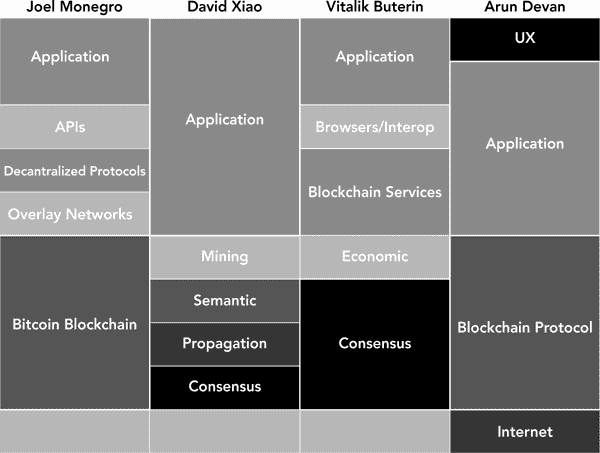

# 八、标准化和去中心化？

重新思考区块链技术栈

***克里斯蒂安·基尔***

|  | **标准化简述** |

标准化之所以强大，是因为网络效应的力量和流向标准战赢家的巨大经济收益。为了实际讨论区块链技术的去中心化世界，我们需要区分两种类型的标准化:语义的和技术的。

语义标准化是关于如何谈论区块链技术的一致性——定义一个类似于互联网开放系统互连(OSI)堆栈的“堆栈”。我们应该在所有情况下追求这种标准化，因为它可以帮助我们将创新置于特定的环境中，找到创新的新机会，并提出关于当前存在的区块链生态系统的有力问题。

技术标准化是关于如何构建区块链技术的联盟，如互联网协议，比语义标准化困难得多。只要我们遵循黄金法则，“不要使用你自己的密码”，我们肯定可以在去中心化的环境中实现它，这可以从 ERC-20 被以太坊接受为令牌标准得到证明

最大的区块链生态系统比特币和以太坊中的意识形态战争和相应的分歧揭示了定义和调整技术标准的难度，特别是有证据表明区块链协议的分裂可以创造价值。

最终，在分散的环境中，标准化游戏的规则有所不同。技术专家和学者都应该明智地考虑语义和技术标准化的不同前景，并抵制为了共识而共识。

**一个由来的故事**

一开始，有一份白皮书。近 10 年后的今天，中本聪的技术突破——比特币及其背后的区块链技术——已经产生了数千亿美元的经济价值:

截至 2021 年 3 月 9 日，全球加密货币市场价值约 1.8 万亿美元。 ^([494](23_bm005.html#ch8fnr494))

299 个独立组织通过 ico 筹集了 50.3 亿美元的非稀释性资本资金。 ^([495](23_bm005.html#ch8fnr495))

世界上最大的公司——阿里巴巴、美国运通、美国电话电报公司、思科、康卡斯特、高盛、穆勒-默勒、微软、捷蓝航空、摩根大通、斯普林特、丰田、威瑞森、维萨、沃尔玛和许多其他公司——已经在这个领域投资了数十亿美元。 ^([496](23_bm005.html#ch8fnr496))

用马克·安德森的话来说，区块链技术正在吞噬世界——这是 Satoshi 在 2008 年向一个利基加密邮件列表发表一篇短文时难以想象的。 ^([497](23_bm005.html#ch8fnr497))

但是这个新世界出现得也很快吗？即使在如此大量的资本流入之后，我们还没有看到一个改变游戏规则的(非金融)消费者区块链应用程序。

麻省理工学院媒体实验室前主任 joichi“Joi”Ito 解释了他对区块链技术成熟度的看法:

看看许多[区块链]企业，它们看起来像那个时期的初创企业，但我们没有 pets.com[，而是 x 的区块链。我不认为今天的区块链是 1996 年的互联网——它可能更像 1990 年或[20 世纪 80 年代]后期的互联网——我们还没有就[互联网]协议达成一致，也没有思科或 PSINet。许多应用层公司正在构建一个从稳定性或可扩展性角度来看都没有准备好的基础设施，他们要么是坏主意，要么是好主意 ***【原文】*** 为时过早。…有初创企业和学者在研究这些基础层，但我希望有更多的人。](http://pets.com)[498](23_bm005.html#ch8fnr498)

在这种情况下，缺乏改变世界的应用程序是有道理的，因为应用层团队仍然在不断变化的沙子上建造他们的房子。

那么，作为区块链的技术专家和学者，我们如何帮助巩固区块链技术的深厚基础，未来面向消费者的应用程序可以依赖的脚手架呢？

伊藤暗示的答案是按照标准化的协议进行整合——但对于区块链这种天生分散的技术来说，这是正确的解决方案吗？说得更直接一点，标准化和去中心化有矛盾吗？

在这一章中，我们将探索标准化的起源，我们是否应该使用该框架来指导区块链理工大学的发展，如果是，那么如何进行。在这样做的过程中，我们将发现语义和技术标准化之间的差异，创建一个统一区块链语不同方言的罗塞塔石碑，调查最激烈的区块链自相残杀的战斗，并以对希望成功导航新兴区块链生态系统的组织、学者和技术专家的战术建议结束。

**为什么要标准化？**

在互联网时代，技术是至高无上的。正如 Joi Ito 所宣称的那样，“互联网之所以有效，是因为我们有清晰的开放标准层。”

这些“层”是在端到端解决方案中填充特定功能的技术，如“网络”(IP)、“传输”(TCP)或“应用”(HTTP、SMTP)，它们共同定义了互联网的*通用语*。因为这些协议已经被明确定义并普遍采用，所以构成互联网的一切——从 Wi-Fi 路由器到您选择的浏览器——都精确地知道如何接收数据以及如何传递数据。

标准化的积极影响是多方面的；这里最值得讨论的有两个。

**网络效应**

首先，标准化技术可以帮助玩家受益于*网络效应。*这里最明显的例子是 App Store，它无疑是 iPhone 生态系统中最具影响力的功能。现在，iPhone 已经成为历史上最赚钱的产品，许多人忘记了，在 2007 年推出后，开发者立即嘲笑该产品，并嘲笑他们无法在新的操作系统中创建应用程序。 ^([499](23_bm005.html#ch8fnr499)) 然而在 2008 年初，苹果发布了软件开发工具包和 App Store，大家很快就忘记了它最初的沉默寡言。截至 2013 年 5 月，App Store 已经支持了 500 亿次下载，并向应用开发者交付了 90 亿美元。 ^([500](23_bm005.html#ch8fnr500))

从所有外部信号来看，苹果似乎已经通过其应用程序商店利用了自然的力量，也许它在梅特卡夫定律中做到了，即命题，即网络的价值与其用户数量的平方成正比。

苹果的 iPhone，因为掌握在每个消费者手中，给了最优秀的开发者强大的动力，让他们花时间为 iOS 平台制作应用。反过来，在这些应用上线后，消费者甚至有更强烈的理由购买 iPhone，复合网络效应的良性循环开始启动。

**特大的经济收益**

第二，也许更明显的是，*巨大的经济收益往往流向那些赢得“标准战争”的人对于 API 公司来说，这是最直接的事实:他们的产品是常见类型数据交易的有效标准——从 Stripe 和 Twilio 到云计算巨头 Salesforce，后者超过一半的收入来自 API。 ^([501](23_bm005.html#ch8fnr501))*

其他更传统的行业也感受到了标准战争的巨大影响。例如，在电信行业，一场决定第四代(4G)无线技术行业标准的战役打响了。WiMAX(全球微波接入互操作性)和 LTE(长期演进)这两个追求者加入了竞争，目前还不清楚哪个标准会胜出，因为这两个标准都声称速度比现有的 3G 服务快四倍。 ^([502](23_bm005.html#ch8fnr502))

考虑到在上一段之前你可能从未听说过 WiMAX，所以 LTE 赢得了胜利，并仍然是 4G 的全球标准，这并不是一个太大的剧透。它的胜利给了像美国电话电报公司和威瑞森这样在战前*投资 LTE 和在战时*投资 T2 的公司在一个万亿美元的市场上一个重要的开端。 ^([503](23_bm005.html#ch8fnr503)) 在 Sprint 上看到了相等而相反的反应，该公司在 WiMAX 上投资了数百亿美元，却发现它与 iPhone 不兼容。 ^([504](23_bm005.html#ch8fnr504))

**“标准化”模式如何适用于区块链？**

在正常的技术环境中，标准化的好处是不可否认的，但是区块链不是正常的环境。对于一个明确去中心化的技术来说，标准化到底意味着什么？为了指导我们对这种表面上的冲突的其余探索，让我们区分一下*语义*和*技术*标准化。

语义标准是那些类似于 OSI 的标准——或者是 20 世纪 80 年代流行的互联网开放系统互连模型。语义标准统一了我们 T21 谈论技术的方式。OSI 标准本身并不是一种传输网络流量的方式；相反，它编纂了人们应该如何描述互联网的架构。每当你谈论互联网的一部分时，你应该使用标记 OSI 各层的七个词中的一个(且只能是一个)——用我的母语咨询术语来说，它们是互斥的，但总体上是穷尽的(MECE)类别。

相反，技术标准描述了一种构建端到端解决方案的特殊方式。TCP/IP 是一种技术标准，因为它为互联网定义了一种总体架构。如果您想与 TCP/IP 应用程序集成，那么您应该使用这种(并且只有这种)技术规范来构建您的低层技术。在本章的剩余部分，我们将探索这两种标准化在区块链技术世界中是如何体现的。

**语义标准化:定义区块链堆栈**

第一个也是最有影响力的定义区块链技术层的尝试是由风险投资家乔尔·莫内格罗(Joel Monegro)创建的，并在他 2014 年的文章“区块链应用堆栈”中推广 Monegro 的堆栈相当简单，只有五层:比特币区块链、覆盖网络、分散协议、开源和商业 API 以及应用程序。 ^([506](23_bm005.html#ch8fnr506))

Monegro 的图表值得称赞，当然也引发了相当多的讨论——在我看来，它仍然是迄今为止被引用最多的“堆栈”。也就是说，它创建于 2014 年(即 Monolithic 纪元，以区块链年计量时间)。因此，它需要更新，我们将转向三个可供选择的堆栈-由 David Xiao、Vitalik Buterin 和 Arun Devan 提出的堆栈-以更好地捕捉我们在语义标准化尝试中的技术、文化和其他方面的进步([图 8-1](#fig8-1) )。在接下来的章节中，我们将讨论五个新的语义选择，它们可以增强 Monegro 的堆栈，并为现代社会进行更新。

**图 8-1**
四个说明性的区块链技术堆栈

*Christian Keil 于 2018 年发布的图表和对比图。*

**超越比特币**

现代区块链堆栈应该超越比特币。2014 年，区块链的绝大多数交易似乎都会通过比特币的区块链进行——它占当时所有加密货币总市值的 90%以上。然而，在 2018 年 2 月，这一数字不到 35%。以太坊(~ 20%)、Ripple(~ 10%)和众多替代货币的出现让人们相信，区块链科技的未来不会由任何一个区块链主宰。但是到 2021 年 3 月，比特币已经收复了大部分失地，其市场主导地位约为 60 %,相比之下以太坊的市场主导地位为 12 %, Ripple 为 1.34%。 ^([509](23_bm005.html#ch8fnr509))

**区块链层的细分**

正如 David Xiao 的堆栈所捕捉到的，自 Monegro 的堆栈最初定义以来，间的技术也在不断进步。萧主张将细分为四层:

*共识*，决定哪个版本的分类账有效

*传播*，决定数据块和分类帐如何在网络中从一个节点发送到另一个节点

*语义*，确定新块与现有块的关系

*采矿*，它决定了推动区块链增加的激励结构

这种特殊性是有帮助的，但快速观察一下今天区块链·R&D 的能量所在，我们会看到一个更简单(但仍然细分)的图景，就像以太坊创始人维塔利克·布特林(Vitalik Buterin)提出的那样。最近关于*共识*机制(即 PoW vs. PoS)的辩论已经成为一个令人难以置信的热门话题，同样，Vitalik 的*经济*子层——对应于肖的*采矿*——是“令牌经济”的一个关键部分。

**重新定义覆盖网络**

Monegro 通过使用侧链的例子定义了他的*覆盖网络*层。然而，这种特殊的结构在最近几年已经失宠了，因为区块链的技术人员越来越倾向于使用叉子或代币来实现类似的目标。下面是我们对侧链的解释:

侧链是一种分叉，使用比特币等大型协议的基础单元作为抵押品:他们在托管账户中“冻结”比特币，作为回报，在其他区块链上奖励新的代币。例如，当我的 10 个比特币被冻结时，我可以使用另一个网络中的 10 个代币，这些代币可以进行比特币无法进行的某些类型的计算。

即便如此，一些类型的覆盖网络对区块链技术的未来变得至关重要——最值得注意的是，像闪电网络和雷电这样的链外扩展解决方案。这些技术通过创建链外“支付通道”以极低的成本或零成本提供极快的交易，这些通道基本上是分散的(仍有密码保护)，只有在用户打开或关闭支付通道时才发生链上交易。 ^([510](23_bm005.html#ch8fnr510))

这些覆盖网络不是唯一的区块链，也不会直接改变区块链数据——相反，它们最好被理解为在*区块链数据*层和编辑它们的*核心协议*层之上的一个新层。

**将应用程序连接到协议**

Monegro 称之为*API*的那一层在这几年里也发生了变化。这里我们将使用*互连*这个词来描述将应用程序连接到区块链协议的这一层技术。例子包括像 0x 这样的项目，一个通过流动性池交换 ERC-20令牌的协议，或 MetaMask。伯克利区块链咨询经理阿什利·兰奎斯特解释了后一个例子的重要性及其在堆栈中的正确位置:

元掩码是将基于以太坊的应用连接到以太坊区块链的关键层，用户无需在她的计算机上运行完整的以太坊节点；它拥有一个数字货币钱包，因此当用户与各种应用程序交互时，他们可以连接到以太坊，并使用 MetaMask 中托管的单一身份和钱包。用户直接参与应用程序，MetaMask 允许应用程序通过其浏览器连接到堆栈中较低的区块链。 ^([512](23_bm005.html#ch8fnr512))

**添加端到端完整性**

最后，Arun Devan 的堆栈提供了两个独特的层，他称之为 *UX* 和*互联网*——为了完整性，我们认为这两个层都是值得添加的。

用户(B2C，企业对消费者)或企业(B2B) *体验*如今很少被讨论，但我们预计随着竞争优势(以及开发者的能量)的增加，它会越来越受欢迎。在所有公司中，IBM 最近写了一篇关于设计区块链产品的特别棒的文章《区块链设计原则》，这是区块链技术专家的必读之作。 ^([513](23_bm005.html#ch8fnr513)) 人们很容易忘记这一点，正如乔尼·豪勒所说，“仅仅因为区块链技术的建立是为了消除对信任的依赖，并不意味着用户会信任(它)。” ^([514](23_bm005.html#ch8fnr514))

互联网也是端到端区块链解决方案中同样未被重视的部分。我们更喜欢更宽泛的术语，*基础设施*，它可以包含支持区块链技术所需的连接性*和*硬件解决方案(例如，泰雷兹为 Chain 和 Gem 提供的安全硬件)。 ^([515](23_bm005.html#ch8fnr515))

**现代区块链栈**

最终，这些考虑导致了对区块链技术的如下看法——试图将上述来源的智慧(以及 Monegro 后三年的额外发展)聚集到语义标准化中([图 8-2](#fig8-2) )。 ^([516](23_bm005.html#ch8fnr516))

**图 8-2**
更新后的区块链堆栈

*Christian Keil 的图形、描述和示例，2018 年。*

我们希望这种更新的语义结构可以帮助我们将技术解决方案置于情境中，找到新的创新机会，并就目前存在的区块链生态系统提出有力的问题。

例如，未来的研究可以专注于每一层的投资金额——我们是否在堆栈的每一层都发现了类似的风险投资、企业投资和 ICO 美元投资，或者某些投资者是否只投资于特定的层？类似地，我们可以建立在 CRV 的 Justine 和 Olivia Moore 完成的伟大分析的基础上，看看在 GitHub 提交数量、Telegram 组成员、subreddit 订户数量、Google 搜索分数等方面是否存在类似的公平或差异。 ^([517](23_bm005.html#ch8fnr517)) 可能性很多，都依赖于一个语义标准的存在。

**技术标准化:分散一致**

那些认为分散标准化的悖论太难克服的人可能注定要重复过去的错误。2017 年 9 月，IOTA 当时的第八大加密货币，市值超过 19 亿美元-被发现有一个严重的漏洞:其代码中的一个错误使伪造签名成为可能，从而产生欺诈性交易。这个错误是完全可以避免的，只要我简单地遵循“哈希”的技术标准，SHA-256。相反，它打破了“密码系统的黄金法则”，根据麻省理工学院媒体实验室数字货币项目主任 Neha Narula 的说法:“不要使用自己的密码。”这种规则的存在表明了在一个去中心化的世界中技术标准化的可行性和重要性。在接下来的章节中，我们将讨论一些技术标准化的例子(或者缺乏技术标准化的例子),以揭示这些标准为什么以及如何产生。

**核心协议层:以太坊经典和比特币现金**

在区块链世界，一种新的竞争态势是*分叉，这在相对集中的现代互联网世界中几乎完全不存在。*分叉是指一个统一的历史转变为两个平行的历史的区块链分歧。“硬分叉”是新链不向后兼容的分叉，而“软分叉”是新链向后兼容的分叉。它们听起来足够温和，也确实如此。例如，在以太坊的早期，出现了两次硬分叉——一次是在发布后几天，另一次是发布一组名为“家园”的新代码。两者都是系统的简单升级；他们没有大张旗鼓地离开了，遗留的、升级前的连锁店只是按计划消亡了。

然而，有时叉子会更加引人注目。最近，我们看到了关于核心协议架构的激烈的意识形态分歧，在这些架构中，受到威胁的分叉使得未来数十亿美元的经济价值悬而未决。

**比特币块大小**

在比特币发展的早期，中本聪编写了一段简单的代码，将每个区块的大小限制在 1 兆字节以内。他的决定在当时是无关紧要的——在 2010 年初，平均数据块还不到 1 千字节——代码被低调地传入核心客户端。那个无关紧要的决定最近有可能将比特币社区一分为二。

一组战斗人员认为，应该增加块大小，以帮助比特币扩大其交易吞吐量——今天，该网络每秒只能处理大约三笔交易，远远低于 Visa 每秒 65，000 笔交易的最大容量。 ^([522](23_bm005.html#ch8fnr522))

然而，另一组人*强烈*不同意。反对者认为，增加块大小将是一个临时的解决方案，使运行一个完整的节点(即挖掘比特币和处理交易)变得极其昂贵，从而牺牲了挖掘权力的分散化(从而牺牲了整个比特币)。用他们的话说，这种技术分歧已经升级为“宪法危机”。 ^([524](23_bm005.html#ch8fnr524))

多年来，双方曾多次尝试达成妥协。但是，用丹尼尔·摩根的话来说，这些努力之所以失败是因为:

文化、技术和治理开发团队抵制被认为是“有争议的”“有争议的”提议是尚未得到比特币社区完全支持的东西。比特币经典、比特币 XT、比特币无限和 Segwit2x 都是寻求在更大的块大小中建立共识的替代客户的例子。 ^([525](23_bm005.html#ch8fnr525))

2017 年 4 月，数字货币集团试图通过发布“纽约协议”来调和这一有争议的提议，这是一项通过硬分叉实现 2MB 块大小的计划。“位于 22 个国家的 58 家公司，83.28%的哈希能力，[以及]每月 51 亿美元的连锁交易量”签署了协议——但它仍然失败了。制定一个总体上的合作硬分叉*和*一个具体的块大小升级的政治挑战被证明太具有挑战性，即使考虑到作者所声称的来自绝大多数社区的共识。根据摩根的说法，挥之不去的异议人士称纽约协议是少数个人对比特币的“企业收购”，他们的批评阻止了危机的和平、一致解决。 ^([526](23_bm005.html#ch8fnr526))

最终，两个阵营之间的意识形态差距被证明是不可逾越的，2017 年 8 月 1 日发生了一场有争议的硬分叉。大块尺寸的支持者创造了一个现在通常被称为比特币现金(BCH)的比特币分叉，包括一个闪亮的新的 8mb 块尺寸。传统链条仍然是比特币(BTC)。

随着 BTC 和 BCH 争夺道德制高点(和哈希力量)，这场辩论至今仍在进行，但这场变革的麻烦历史已经给社区上了技术标准化的重要一课:有时，差异确实是无法解决的，在像区块链这样分散的世界里，一种尺寸不可能总是适合所有人。

**以太坊与道**

比特币现金并没有将区块链世界引入有争议的硬分叉。事实上，以太坊在一年前发现自己处于这样一个分叉的边缘——在 DAO 被黑之后，当时是世界上最大的众筹项目。黑客攻击本身是巨大的——一名黑客在以太中吸走了超过 5000 万美元——但真正的故事来自以太坊社区对此的反应。 ^([527](23_bm005.html#ch8fnr527))

以太坊创始人 Vitalik Buterin 和 Consensus Systems 创始人 Joe Lubin 等 Hard fork 倡导者认为，社区应该有意识地从一个从未发生黑客攻击的新区块链中分出来。卢宾表示，这样的措施是必要的，因为黑客是一种存在性威胁:“如果黑客的目标是摧毁以太坊，那么黑客可能已经进行了多年的拒绝服务攻击，扰乱了网络高效处理交易的能力。我们会在不同的智能合约中追逐这个人，就像猫捉老鼠一样。” ^([528](23_bm005.html#ch8fnr528))

然而，对其他人来说，硬叉子似乎是一种亵渎。他们声称，允许“协议外”的政治活动来改变区块链理应不变的账本是错误的，社区应该认识到“代码就是法律”的秘密格言

随着提议的硬分叉日期的临近，没有人十分确定结果会如何。非正式投票显示七比一的人支持分叉，但是不清楚最初的以太坊区块链会发生什么——少数民族社区还会有足够的火力来开采和维护区块链吗？

最终的结果甚至让维塔利科都感到惊讶。在接受风险投资公司 Andreessen Horowitz(也称为 a16z)采访时，他解释了最终的分裂是如何克服所有困难实现价值累加的。从以太坊经典(ETC)分叉出以太(ETH)后一加一等于三。

【ETH 加 ETC 的值】在分叉前在 ETC 之上，其实很有意思。我觉得这是一场伟大的政治辩论……(人们喜欢)网络效应，人们一起努力。但是反其道而行之有时会被视为软弱、困惑或混乱…

在这种情况下，它确实看起来像是在网上有积极的价值。当然，问题是为什么。这里的答案很有趣，因为在此之前加密货币领域的一般观点是梅特卡夫定律…你希望让所有用户在一个网络上实现价值最大化，但在这里我们基本上了解到，在一些情况下，它实际上走向了另一个方向。 ^([529](23_bm005.html#ch8fnr529))

一个如此具有破坏性的事件(即，使区块链历史无效)或最具分配性的事件(即，将整体分割成部分)可以*创造*经济价值，这是一个激进的发展，值得在未来更详细地探索。

这能证明过多的技术标准化在区块链的分布式世界中是一件坏事吗？或者这是一个错误的信号，由投机驱动的交易产生的？只有时间能告诉我们，但不管出于什么原因，从 ETC/ETH 分叉中出现了一个清晰的教训:有时，关于核心协议的意见分歧——甚至那些细分社区的意见分歧——可能是价值创造的。

**共识层:工作证明和利益证明**

如今，区块链的另一个技术标准化问题涉及 PoW 和 PoS，它们是区块链协议栈的 *consensus* 子层中的竞争技术。这个争论被广泛讨论，那些寻找这个主题的技术介绍的人可以找到比这一章更深入的资源；但维塔利克·布特林的“一句话哲学”是，PoS 安全来自“损失经济价值”，而在 PoW，“安全来自燃烧能源”。更简单地说，PoW 很难破解，因为它需要大量计算能力，而 PoS 的破解成本很高，因为如果你这么做的话，你会失去你的“损害押金”。

这两个标准之间的争论集中在许多人认为的 PoW 的致命缺陷:能量消耗。从定义上来说，PoW 命令矿商将能量浪费在无用的计算上，以使伪造交易代价高昂——但它可能也很擅长实现这一目标。根据比特币能源消耗指数，比特币网络目前每笔交易消耗 729 千瓦时的电力，相当于每年 50.4 太瓦时的电力。 ^([531](23_bm005.html#ch8fnr531)) 后者足以为葡萄牙这个国家供电一整年。考虑到现在几乎所有的区块链协议都使用 PoW，这就有问题了。 ^([533](23_bm005.html#ch8fnr533))

Vitalik 目前正在积极开发 PoS，但他面临的挑战是巨大的。当然，存在技术上的挑战，这导致新共识机制的发布推迟了近两年。但是也许更大的挑战是政治上的——人们有很多钱被束缚在这个系统中，最近的漏洞使他们对像新的共识机制这样大的变化持怀疑态度。事实上，以太坊计划中的第一次 PoS 升级不会(也不可能)完全铺开；在今年年底，“君士坦丁堡”的更新仍将保持以太坊 99%的 PoW，每 100 个街区中有一个通过 PoS 验证。 ^([535](23_bm005.html#ch8fnr535))

在某种意义上，提出和执行技术更新与其说是决定哪种技术更好，不如说是选择如何分配核心开发人员的时间和智力——这就像预算，而不是判断，因为这些挑战如此巨大，而技术知识又如此集中在少数人手中。如果没有 Vitalik 本人的参与，像 PoS 这样大的变革可能永远无法在以太坊站稳脚跟——想想如果没有 Satohi 的领导，改变比特币的块大小这样简单的事情是多么困难。知道了这一点，技术标准化的另一个教训就来了:去中心化世界中的标准化看起来更像政治而不是商业。

**经济层:ERC 20 令牌标准**

也许迄今为止，没有任何标准化工作产生了像 ERC-20 令牌标准接口那样大的价值([图 8-3](#fig8-3) )。这看似简单，就像大多数区块链创新一样:仅仅六项功能和两项活动就让超过 367，000 个独立项目筹集了自己的资金，其中前 100 个项目的总市值为 2326 亿美元。 ^([537](23_bm005.html#ch8fnr537))

**图 8-3**
ERC-20 标准规范

*来源:《ERC-20 代币标准》，TheEthereum。维基，2018 年 2 月 12 日访问，在 CC0 1.0 下使用。*

以太坊的令牌标准于 2015 年 11 月在以太坊改进提案(EIP)中推出，以解决一个紧迫的问题——“令牌”可能是以太坊智能合约中最常见的类型，但由于没有两个是相同的，第三方应用程序(如钱包和交易所)无法承诺通用令牌支持。用以太坊基金会成员 Alex van de Sande 的话说，提议的标准将是确保令牌互操作性的“最低标准”,或多或少是一个令牌 API。 ^([538](23_bm005.html#ch8fnr538)) 以太坊核心开发者于 2017 年 5 月批准了该标准，并于当年 9 月正式并入以太坊主代码。 ^([539](23_bm005.html#ch8fnr539))

然而，EIP 的审批过程比上述可能透露的更具挑战性。众所周知，这个过程是不透明的；也许以太坊标准化的过程本身从来没有被明确地标准化过。核心开发人员最接近于代码化的是在核心开发人员会议记录中发现的以下内容:“[标准]一旦受益于[标准]的社区成员和思想领袖走到一起，就[规范]达成一致，并实现该规范，就被批准/最终确定。” ^([540](23_bm005.html#ch8fnr540))

然而，要评估通过这个黑盒的难度，我们只需要看看它的输出就行了:截至 2021 年 3 月，该社区仅正式确定了 69 个 EIP 和 18 个 ERC，试图定义以太坊使用的特定标准。区块链世界中存在技术标准，但它们很难获得。要赢需要付出很多——这意味着一个问题:获胜者是如何选出的？

**标准化分散技术的建议**

如果说我们从跟踪技术标准发展的曲折历史和语义标准化的千变万化中学到了什么，那就是旧的规则并不总是能够帮助我们在这个新的、去中心化的世界中导航。

因此，本着我们寻求标准的精神，这里有一些给区块链技术专家、学者和组织的建议。它们肯定会有例外，但可能有助于现在看来必要的范式转变:从中央集权的大陆转移到分权的边疆。

**不懈地追求*语义*标准化**

实现技术标准化的正确时间和地点谁都说不准——但是对于语义标准化来说，答案显然是“此时此地”区块链社区需要一个像 OSI 这样的标准，有了它，编目、组织和交流这项新技术的进步可能会变得容易得多。

为什么这样的交流进步在今天没有更受欢迎？也许是因为技术和语义标准化的融合。当我联系几位区块链技术专家，请他们对一篇关于区块链堆栈的文章发表评论时，他们嗤之以鼻。“不止一个，”一个人(希望匿名)争辩道，“所以定义一个栈是没有意义的。”

这个答案在技术世界中是完全公平的——有太多的架构变化和太多的用例来表明一个特定的区块链协议在所有情况下都将战胜所有的来者——但是将这一事实等同于确保这些协议都使用相同的词语的努力是错误的。

社区需要一个语义标准，这就是 Joel Monegro 的文章如此有影响力的原因；我们希望上面的分析可以作为我们定义区块链通用语的下一步。

**做的东西比任何人都好**

如果你还想赢得一场技术标准战争，这就是你需要做的。区块链社区在意识形态上足够分散，以至于该系统或多或少民主地运行——记住，在以太坊在道之后的硬分叉之前，进行了投票。是的，有些动物(如 Vitalik Buterin)比其他动物更平等。对于来说，区块链的生态系统给人的感觉更纯粹是精英管理，而不是在当今精英们私下交易和握手的商业世界中如何选择获胜者。(有些人可能还记得纽约协议，在受赛博朋克影响、权力分散的世界里，这些强硬策略并不总是奏效。)^(542)

想要赢得标准之战吗？开发能解决实际问题的技术(并避免如今区块链社区中的意识形态地雷)，向社区证明它是可行的——在技术上、政治上、经济上、历史上、密码上等等。—获得社区的认可，并向全世界推广。说起来容易做起来难。

每一个严肃的技术专家都希望，许多人也坚信，随着时间的推移，比特币的炒作将会消失，真正改变世界的区块链解决方案将会存在。如果你想成为赢家，就玩长线游戏。

**重新考虑发动一场分散的标准战争**

谷歌首席经济学家哈尔·瓦里安(Hal Varian)和美国司法部反垄断部门负责经济的前副助理司法部长卡尔·夏皮罗写道，标准战争的赢家是那些拥有“知识产权、对用户群的控制、创新能力、先发优势、制造能力、互补优势以及品牌和声誉”的人 ^([543](23_bm005.html#ch8fnr543))

在互联网的早期，基础标准的建立是因为还没有一个大规模的非技术消费者群体来权衡——只有耐心的，通常是政府或大学资助的参与者在(相对)和平中发展。

然而，在去中心化的世界里，如此多的注意力——和如此多的美元——在技术标准能够站稳脚跟之前就流入了系统，这极大地复杂化了技术决策，因为经济、政治和道德在决定最佳前进道路方面变得与技术一样重要。

最终，区块链在许多方面与现代企业世界截然不同:

一切都是开源的，知识产权充其量也很难保护。

代币允许新贵绕过不利的小网络效应。

“行动迅速、打破常规”的创新先行者可能会冒着数十亿美元的资金投入技术漏洞的风险。

一切都是数字化的，更依赖脑力，而不是纯粹的钱包深度。

没有我们可以或应该补充的杀手级应用(或许除了比特币)。

试图通过品牌赢得积分通常是一个透明的声明，即代币是一个技术噩梦和/或彻头彻尾的骗局。

区块链是一种协议级的颠覆，这意味着我们已经不在堪萨斯了。即使是旧世界最可靠的规则，如梅特卡夫定律，也可能不适用——因此，玩家们应该明智地重新考虑试图赢得一场标准战争，因为这总是能够产生巨大的经济回报。

**为了共识而抵制共识**

我们将以一个来自旧世界的常青树故事来结束这一部分——一个为了共识而共识并不总是好主意的故事。在互联网的早期，互联网协议和异步传输模式(ATM)技术之间爆发了一场激烈的战争。就像以前的 WiMAX 一样，你从未听说过后者这一事实证明了这个故事将如何结束——但理解为什么一个成为新时代的技术标准，而另一个逐渐淡出人们的视线是很重要的。

毫无疑问，完整的答案包括对成本和互操作性的更复杂的分析，但我们认为 ATM 技术失败的一个主要原因是它盲目追求妥协:这就是 ATM 信息包最终以 53 位的*质数*结束的原因。NetBSD 基金会的软件工程师和开发人员 Eric Fair 解释道:

参与 ATM 规范的计算机网络人员希望使用 64 字节的信元，以较低的开销传输数据。电话技术人员希望使用 32 字节的信元，以便能够以非常精细的粒度细分他们的网络带宽。很自然地，他们分割了差异(48 字节)，然后添加了 5 字节的头，导致一个没有人满意的单元大小。 ^([545](23_bm005.html#ch8fnr545))

随着区块链技术朝着技术标准化的方向发展，或者至少参与到关于块大小、缩放等非常激烈的争论中，让我们不要重复过去的错误。

结论

在不到十年的时间里，最初的白皮书已经成为一个庞大的生态系统，其中包含未来的技术、邪恶的政治和以前不可想象的大量金融财富和经济活动。

区块链技术的下一个十年将会有更高的赌注和更大的挑战。我们将在 PoS 等*共识*层和 Lightning Network 等*覆盖协议*中看到扩展解决方案的兴起。随着像 DAO fork 这样更有争议的想法进入主流，我们将面临治理挑战。我们将继续澄清我们用来描述一类技术的语言，这些技术可能很快就价值数万亿美元。

冒着听起来老套的风险，对这些挑战的短期回答可能只是好的、老式的谦逊。正如布莱恩·贝伦多夫所说，“这些东西就像 1993 年或 1994 年的网络一样，随时可以离开实验室。让我们确保不要让太多的遗产和太多的承诺拖累它。”换句话说，在我们有足够的时间找到解决我们所面临的棘手的底层问题的好办法之前，我们不应该急于标准化——或者担心开发杀手级应用。

我们仍然处于区块链技术的早期阶段，未来几年的成功将在很大程度上取决于我们如何处理技术和语义标准化的挑战和机遇。