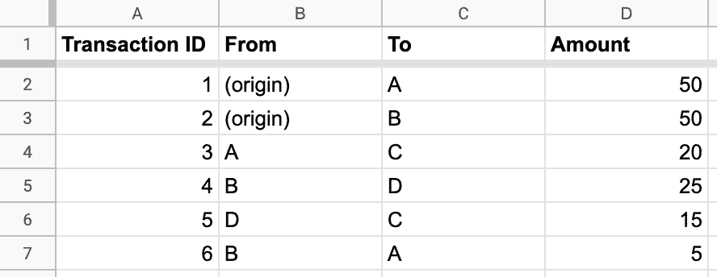
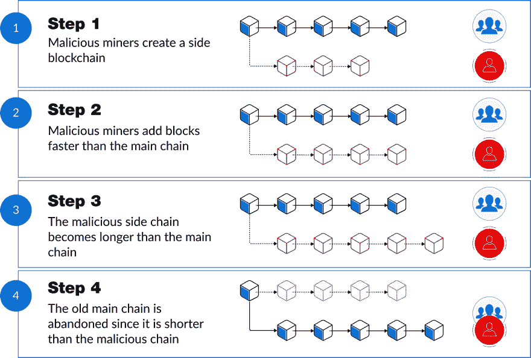
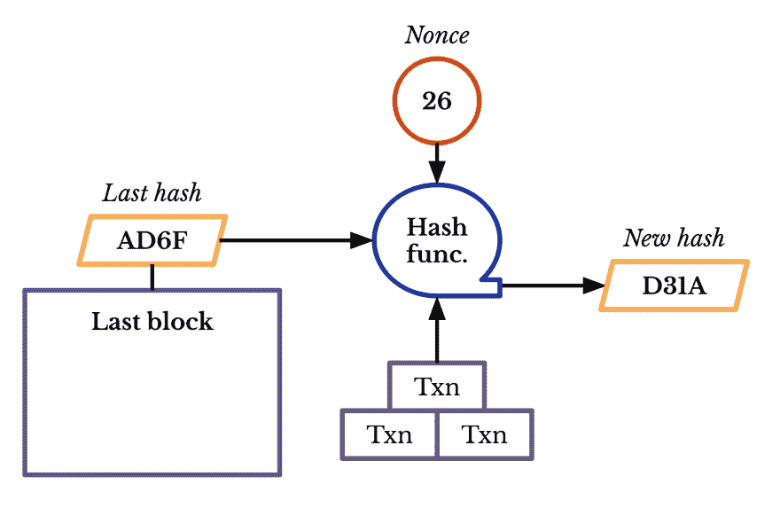
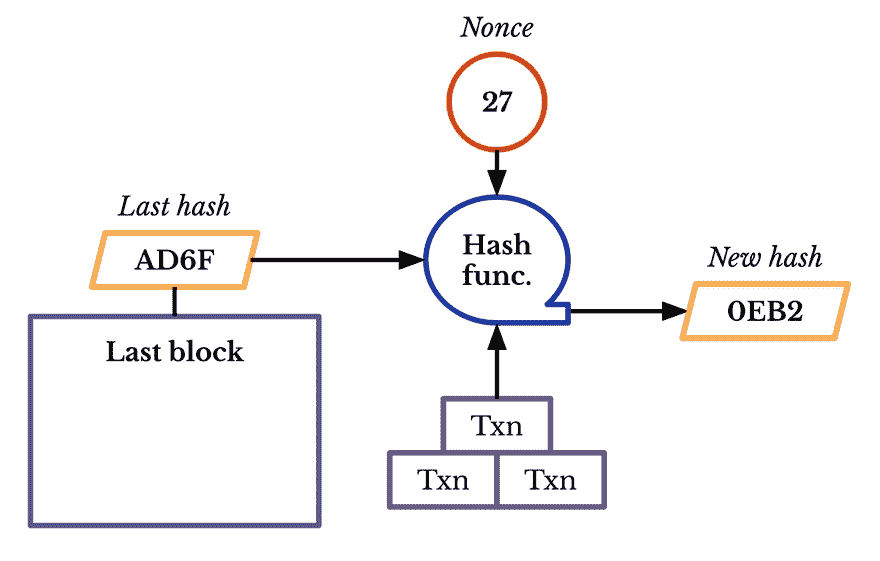
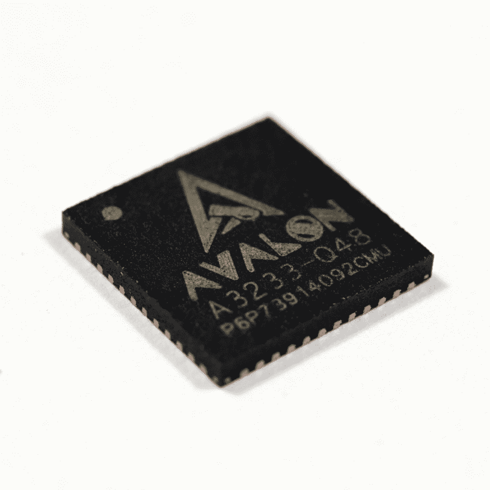
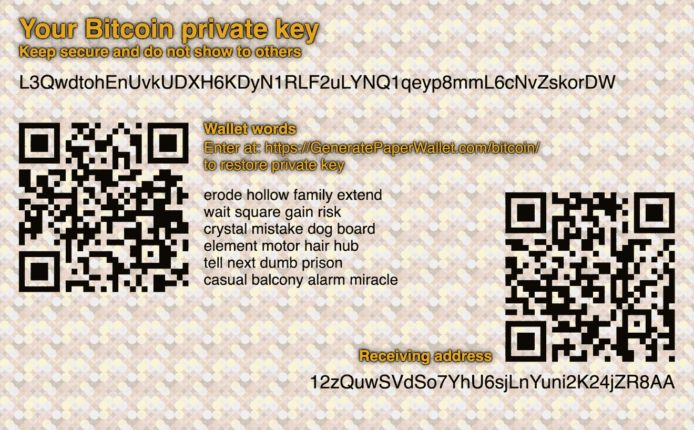

 

# 一、比特币与区块链

比特币第一次为我们提供了一种方式，让一个互联网用户向另一个互联网用户转移一件独特的数字财产，这样转移就可以保证安全可靠，每个人都知道转移已经发生，没有人可以质疑转移的合法性。这一突破的后果很难被夸大。

——马克·安德森，安德森·霍洛维茨基金的联合创始人[【22】](part0040.xhtml#a77R)

可信第三方是安全漏洞。区块链领域的任何人，我都想让他们明白这一点。这基本上是整个设计的关键。

尼克·萨伯，比特黄金(比特币的前身)的创造者[【23】](part0040.xhtml#a6VW)

 

在 2008 年的万圣节，一位自称中本聪的计算机科学家发表了一份白皮书，介绍比特币，一种让人们无需通过银行、信用卡处理器或其他金融机构就能兑换货币的数字货币。没人知道聪是谁，但他公布论文的邮件列表上的每个人都注意到了。

通过一封电子邮件，Satoshi 向世界介绍了区块链和加密货币，这两项技术已经成为家喻户晓的名字。但是要理解这些技术，我们必须从揭开神秘科学家的发明开始。

钱的问题

纵观人类历史，持有货币有两种方式:拥有实物(现金、金币、牛、盐等)。)或者让银行或酋长这样的可信机构跟踪你有多少钱。

这两种形式的货币都有自己的问题。

现金或奶牛等有形货币的缺点非常明显:容易被盗，不能用于网上或远程交易(试着用现金从国外的人那里买东西)，经常被伪造，储存和运输很麻烦。

中间人中介的钱

为了解决这些问题，人类发明了以银行或地方长官等可信机构为中介的货币。许多形式的货币和支付都属于这一范畴:银行账户、银行贷款、信用卡、支票以及我们现在使用的许多其他金融工具。通过信任中央机构或中间人，你可以解决有形货币的大部分问题:

*   你可以相信银行会比你把钱放在家里更安全(把银行账户比作床垫下的现金)。

*   你可以进行快速的在线和数字支付，因为向某人付款就像让你的银行和他们的银行更新你的账户余额一样简单(账户余额只是某处数据库中的数字)。

*   当一个可信的权威机构准确跟踪每个人有多少钱时，制造假币就更难了。(由于没有关于每个人有多少现金的中央记录，识别伪钞的唯一方法就是希望你能区分假钞和真钞。)

*   如果你信任一个中间人来保管你的钱，你就不需要随身携带。

这种中间人的钱真的很了不起。但人们仍然使用现金，一些商店只收现金，这是有原因的:中间商交易的货币(我们简称为 M3)有其缺点，其中大部分源于存在中间商这一事实。

第一个问题:当你的钱通过中间人流动时，你必须遵守他们的规则，这往往意味着必须支付费用。当你用信用卡买东西时，商家并没有得到所有的钱；他们必须向信用卡处理机构支付费用(Visa、Mastercard 和 Discover 的费用约为 1.5-2.5%，美国运通为 2.5-3.5%)。[【26】](part0040.xhtml#a6ET)[【答】](part0040.xhtml#a6EU)

使用 PayPal 进行国际汇款将收取约 3%的费用，如果你是商家，接受 PayPal 付款也将收取约 3%的费用。[【27】](part0040.xhtml#a64X)通过西联、速汇金、Xoom 或其他汇款公司向国外汇款的费用也可能是百分之几。[【28】](part0040.xhtml#a64Y)

你现在可以明白为什么许多商店只收现金，或者有最低消费限额让你使用信用卡。

M3 的另一个问题是，你只有在中间人允许你进入的情况下才能使用它。实际上，这意味着世界上 20 亿没有银行账户的人不能使用任何涉及银行账户的钱(也就是说，大部分 M3 人)，信用不良或没有信用的人不能使用信用卡。

M3 的最后一个大问题是，你把你的钱委托给他们，现在，你的数据也委托给他们。银行在不损失你的钱方面做得很好，但是金融机构在数据安全方面的记录远没有这么好。黑客在 2014 年窃取了 1 亿摩根大通客户的数据，[【30】](part0040.xhtml#a66Z)以及敏感信息(出生日期、地址等。)上 2019 年 1 亿 Capital One 客户被盗。 [[31]](part0040.xhtml#a670) 更不用说可能是最臭名昭著的黑客攻击了:将近 1.5 亿美国人的个人数据(包括社会安全号码)从 Equifax 被盗。[【32】](part0040.xhtml#a671)

简而言之，有形的货币不安全，不方便，容易伪造，对于数字支付来说不切实际。中间人货币或 M3 解决了这些问题，但也带来了费用、缺乏可获得性和另一种形式的不安全感等问题。现在，我们必须选择我们的毒药。

无形

但是如果你仔细想想，你会意识到我们在金钱中真正需要的是无形。M3 通过引入中间人给了你无形资产:如果你信任机构为你管理和转移你的资金，你就不必再持有有形资产。但是，当然，中间商也有自己的一大堆缺点。有没有一种方法可以省去中间人，同时保留无形性？换句话说，你能有一种既无形又没有中间人的货币形式吗？

你大概可以看到我们在这里得到了什么。但事实证明，在 Satoshi 向世界介绍比特币之前几个世纪，人们就发明了一种无形的、无中间人的货币形式。为了见到这些人，我们必须去太平洋中部的密克罗尼西亚小岛雅浦。

Rai 石头

雅浦岛上的传统货币是被称为 rai stones 的巨型石环。这些石头非常巨大:有些直径达 10 英尺，重量相当于一辆小卡车。每个雅浦村都有几十块 rai 石头散布在镇上。[【35】](part0040.xhtml#a4Y0)

一块拉伊石，太平洋雅浦岛上的一种传统货币。来源:维基媒体[【36】](part0040.xhtml#a6G4)

你可以想象，人们不能拖着这些石头在岛上走来走去。取而代之的是，雅皮士集体记住谁拥有每一颗宝石，并在头脑中记录过去的交易。例如，如果酋长的女儿想从木匠那里买一艘船，她可能会向村民宣布，她控制的一块 rai 石头(比如说，海滩上的那块)现在属于木匠。村民们会散布消息说酋长的女儿给了木匠一块石头。

然后，如果木匠想把那块石头给别人，村民们会让他这么做，因为每个人的精神记录都说那块石头现在属于他了。[【37】](part0040.xhtml#a4P3)(大致来说，如果大多数村民都同意某个人拥有某块石头，那么他就可以花掉这块石头。)

无形的

rai stone 系统令人印象深刻的部分是，所有类型的经济活动都可以在石头完全不移动的情况下发生；事实上，你可以拥有一块石头，即使它在你房子的另一边。事实上，你甚至可以使用 rai 石头，如果它们再也看不见的话。数百年前，一艘载有 rai 石头的船在海岸边沉没。当地村民推断，这块石头一定还存在于海洋底的某个地方，所以人们继续用这块石头互相支付，就好像什么都没发生过一样！[【38】](part0040.xhtml#a73M)

换句话说，在 rai 石头系统中，石头的物理位置和移动根本不重要。这与传统的有形货币系统形成鲜明对比，在传统的有形货币系统中，货币的物理位置和移动确实很重要:你拥有的唯一货币是你房子里或身上的钱，你向某人付款的唯一方式是将实物交给他们。

这意味着拉伊石系统是一种无形货币。这很像银行里的钱，我们知道它是无形的:美钞在哪里并不重要——或者它们是否存在都不重要！—当你给某人寄钱时，没有任何实物会移动。

无中间人的

此外，拉伊石头系统是民主的:如果你的大多数村民同意你拥有一块石头，你就拥有它。你不像在 M3 那样，相信某个人或某个机构会跟踪你有多少钱，而是把你的信任分散到整个村庄。

这种决定谁拥有宝石的民主制度——换句话说，就是共识——比中间人主持的制度有很多优势。想象一下另一个世界，村长保存着官方的支付记录和石头所有权，而不是村民们通过共识集体保存记录。(在这个宇宙中，雅皮士货币体系的表现很像 M3；酋长将扮演银行的角色。)酋长可以很容易地迫使每个人向他支付费用，通过有策略地从他的日志中删除付款来偷石头，丢失他的日志(从而使当地经济陷入停顿)，等等。

因此，rai stone 系统是无形的，不需要中间人。你可以享受 M3 的便利——不需要在镇上搬运石头——也没有依赖中间人的问题。它提供了一个“两全其美”的货币系统的例子，我们在上一节中讨论过。

这里的教训是，无形的金钱系统总是需要信任:只有当你相信某样东西或某个人会准确记录你的钱时，你才会放弃对你的钱的实际控制。Yap 的创新是意识到你可以信任系统，而不是中间人；在这种情况下，可信任的系统是雅皮士村民共享的交易心理日志。通过将你的信任放在一个共享的、共识驱动的系统中——一群遵循共享规则的人——而不是一个人或一个实体，你就可以在没有中间人的情况下获得无形的金钱。

比特币的区块链

我们不知道 Satoshi 在开发比特币时是否研究过 Yap，但他的见解非常相似。

比特币是一种数字货币，所以它是无形的，并且(理论上)没有中间人，因为它不依赖于银行或其他机构来跟踪人们的资金余额。相反，比特币依靠遍布全球的计算机网络来保存过去每笔支付的共享日志或分类账。众所周知，这种“共享公共账本”被称为区块链，它基本上是雅皮士村民对过去付款的共享记忆的高科技版本。

简而言之，比特币是 rai stones 的现代、互联网友好版本。它是无形的，并且(理论上)没有中间人，这使它成为我们传统货币系统的一个令人信服的替代选择，传统货币系统迫使你要么有有形资产，要么有中间人。

共享的谷歌表单

另一种更技术性的方式是将区块链视为一个巨大的谷歌电子表格，与世界上的每个人共享，每笔交易占一行:

一种简单的方式来看待比特币区块链:它是一个与全世界共享的谷歌表单。

(很自然，您会希望这个表只添加:您不会希望流氓用户更改过去的交易。)

无论如何，想象一下，世界上每个比特币用户的电脑上都有一份这种电子表格的副本。每当有人进行新的交易时，交易会广播给每个人，每个人的电脑都会下载新版本的电子表格。

采矿

制作这样一个谷歌电子表格来跟踪付款的一个明显缺陷是，有人可能会试图花掉他们没有的钱。显然，您需要有人在提交交易之前对其进行验证，这样这些有问题的交易就不会通过。

在 M3 世界，你会信任银行或金融机构来做这种验证；如果你的账户里没有足够的钱，你的银行不会让你转账给朋友。但在比特币的世界里，你不能依靠某个可信的人来做验证；这将破坏没有中间人的整个目的。

相反，比特币将这一验证工作外包给社区成员。任何比特币用户都可以使用他们的电脑来验证未决交易，并只将有效交易添加到区块链中。为了提高效率，事务被分成几个块，每个块有几千个事务。[【39】](part0040.xhtml#a4BH)

激励

但是，当然，人们不会免费做验证交易的计算工作，所以比特币软件必须投入一些钱来激励他们。如果你验证了一批交易，你将从该批交易中的每一笔交易中赚取一些费用，比特币软件也将向你支付固定的一大块比特币，[【b】](part0040.xhtml#a41Y)称为“整批奖励”。区块奖励里的比特币在验证之前是不存在的——比特币软件凭空创造出来的。[【40】](part0040.xhtml#a41Z)

因为比特币认为自己是黄金[【41】](part0040.xhtml#a3X7)的数字版本，验证者投入工作以提取全新的货币，这个验证过程被称为挖掘，验证者被称为矿工。(你是在用电脑采矿，而不是用镐和铲，但商业模式大致相同。)

因此，如果我们想返回到我们的谷歌表单，让它看起来更像一个真正的区块链，我们可以添加区块、费用和奖励栏，如下所示:

一个更高级的比特币区块链模型，包含了挖掘、费用和奖励。

因此，C 开采了包含三次交易的 B1 区块，并从他们的麻烦中获得了 28 个比特币:25 个来自区块奖励，1 个来自每次交易。

突击测验:假设每个人(A、B、C、D 和 E)开始时有 100 个比特币，那么在他们进行这些交易后，他们有多少个？

答案是:

*   人 A 向 B 发送 10 个比特币并支付 1 个比特币的费用，然后向 D 发送 15 个比特币并支付 1 个比特币的费用，再向 E 发送 5 个比特币并支付 1 个比特币的费用，然后收到 10 个比特币。这意味着 A 最终拥有 100 - 10 - 1 - 15 - 1 - 5 - 1 + 10 = 77 个比特币。

*   人 B 从 A 那里赚了 10 个比特币，给 c 发了 2 个比特币(外加 1 个比特币的手续费)，所以 B 现在有 100 + 10 - 2 - 1 = 107 个比特币。

*   人 C 从采矿区块 B1 赚了 25 + 1 + 1 + 1 = 28 个比特币，所以他们有 100 + 28 + 2 - 10 - 1 = 119 个比特币。

*   人 D 现在有 100 + 15 - 5 - 1 = 109 个比特币。

*   人 E 也从 B2 矿区赚了 28 个比特币，所以他们有 100 + 5 + 28 + 5 = 138 个比特币。[【c】](part0040.xhtml#a49M)

滑车和链条

原来我们的电子表格模型只是:一个模型。这是一种简化。真正的比特币区块链不会以类似电子表格的格式存储区块。

相反，比特币的区块链以线性“链”的形式存储区块，每个区块都以数学方式指向最后一个区块:[【42】](part0040.xhtml#a561)

区块链以线性链存储块；“txn”是比特币对“交易”的简称。每个区块都指向前一个区块，但计算机科学家通常像这样绘制链，箭头从一个区块指向下一个区块，这样更直观。

这样，即使块没有明确的编号，块的顺序也是清楚的。想象一下，如果你拿起一本平装小说，撕掉所有的书页，去掉所有的页码和章节号。然后想象你把书页撒了一地。

不过，您仍然可以将页面按顺序放回原处，因为每一页都隐式引用了上一页发生的事情。(例如，如果第 X 页的结尾是一个角色开车去法院，而第 Y 页的开头是这个角色走进法院，那么可以肯定第 Y 页就在第 X 页之后。)

散列法

当然，比特币没有情节的概念，所以区块之间用数学相互参照。具体来说，他们使用一种叫做哈希的数学技术，你输入一堆信息(单词、数字、比特币块等。)转化成一种算法，吐出一个简短的信息“指纹”。[【43】](part0040.xhtml#a541)

我们人类一直在使用散列法，比如首字母。一个长名字很容易被压缩成几个字母:像“约翰·菲茨杰拉德·肯尼迪”这样的长名字会变成像“JFK”这样的短名字你有一个输入(全名)；哈希函数(取某人姓名首字母的过程)；和一个输出或散列(首字母)。

计算机使用更花哨的散列函数——最流行的是 MD5[【44】](part0040.xhtml#a4K3)或 SHA-256[【45】](part0040.xhtml#a4K4)算法——但核心思想是一样的:大量的数据输入变成短输出。

在比特币中，每个区块都有一个关联的哈希。每个块的散列部分基于它之前的块的散列。[【d】](part0040.xhtml#a6PJ)这样，每个块都是指它之前的块。因此，如果您得到了一个无序的块列表及其相关的散列，您可以很容易地将块按顺序放回原处，就像通过查看情节连接来安排页面的人一样。

使用它们的散列将块链接在一起；每个哈希都是根据前一个块的哈希计算出来的。

(散列中的数字和字母是怎么回事？哈希以十六进制或 16 进制格式编写。它们也比 4 个字符长得多，但是我们的缩写版本现在已经足够好了。)

因此，比特币批量批量交易，并通过链条将它们相互联系起来。块，满足链。

分支机构和欺诈

回头看看我们基于散列的链接系统，你会注意到它实际上并不需要将块放入线性链中。没有什么可以阻止您在一个给定的块之后紧接着出现两个或更多的块:

多个块可以引用任何给定的块作为它们的前身，所以区块链可以(并且确实)分支。图片改编自:中本聪[【47】](part0040.xhtml#a6YA)

块状树

因此，区块链不一定是线性链。事实上，通常不是。区块链看起来更像一棵“块状树”，有“树干”和“树枝”:

区块链可以有很多分支，就像一棵树一样(想象一下底部的方块在地面上，这个图看起来很像一棵树。)最长的分支被认为是“官方”分支。来源:维基百科[【48】](part0040.xhtml#a64G)

当两个矿工同时生成(或“开采”)一个区块时，区块树有时会长出一个新的分支。这种情况很少见，但确实会发生。当它这样做时，有两个事务从最近的事务中分离出来，并且块树的新分支诞生了。[【49】](part0040.xhtml#a75H)

但是，和 rai stone 系统一样，比特币需要有单一的线性交易历史。你不能允许多个分支共存。(你能想象告诉某人“在一个版本的历史中，我有 500 美元，但在另一个版本中，我有 600 美元”吗？)

最长链规则

为了有一个线性的官方历史，比特币使用了一个被称为最长链规则的经验法则，即“区块树”中包含最多区块的分支是官方区块链。[【50】](part0040.xhtml#a72T)最长的链条决定了你到底有多少钱，过去发生了什么交易等等。如果它不在最长链上，它实际上就没有发生。

运行在比特币用户电脑上的比特币软件执行了最长链规则，只向在最长链上添加了一个区块的矿工支付费用。[【51】](part0040.xhtml#a66K)这通常足以让矿工们守规矩。(不过，它有一个不幸的副作用。如果两个矿工同时开采一个区块，就会产生两个分支，只有一个分支会胜出，成为最长的链条。另一个分支变成了“孤儿”并被扔掉，而在那个分支底部开采的不幸矿工没有得到任何钱。这些“孤儿”每天都会发生几次。[【52】](part0040.xhtml#a66M))

连锁劫持

但是最长链规则仍然留下了一个安全漏洞。如果一个弯曲的矿工创造了一个新的分支，比其他人更快地开采石块，从而使她的分支比合法的分支更长，会怎么样？弯曲的矿工树枝会成为最长的链条，所以它会成为官方的区块链。她欺诈链上的所有区块将成为官方历史，而合法链上的一些区块将被丢弃。

攻击者如何通过比其他人更快的采矿速度劫持区块链。

让一个骗子控制区块链当然会引起很多混乱，但也可能导致欺诈。想象一下，邪恶的矿工用比特币购买了数千美元的商品，并将交易放在区块链上。然后，她执行她的攻击，建立一个比正式链更长的新链。她向商家付款的交易被丢弃，因为它不再在最长的链上；就好像她一开始就没付过钱一样。所以现在，她得到了她所有的商品，但她从来没有支付它！

随机游戏

你如何阻止这样的攻击？你必须让攻击者难以比诚实的矿工开采得更快。为了做到这一点，Satoshi 使得开采一个区块变得非常耗时。

Satoshi 设计的流程从事务开始。等待审查和确认的事务在事务池中，也称为内存池或内存池[【53】](part0040.xhtml#a61G)。当您想要挖掘一个块时，您从池中选择几千个事务，验证它们，然后构建您的块。

然后你所要做的就是为你的区块生成一个散列，你就可以把它放到链上并获得你的奖励。

但是生成散列并不容易。它需要三个输入:最后一个块的散列、事务和您选择的一个称为 nonce 的特殊数字。

哈希函数使用三个输入来生成块的哈希。

问题是，每个 nonce 的哈希值是不同的，只有当您的哈希以正确的零开始时，才允许您将块添加到链中。因此，如果你选择的随机数不能产生好的散列，你必须一次又一次地尝试:

更改 nonce 会得到完全不同的输出哈希。

猜一猜，检查一下

使这变得困难的是在散列中没有可辨别的模式；您无法从输入中预测散列，即使对输入的微小更改也会使输出完全不同。如果您通过流行的 MD5 散列函数运行单词“cat ”,您会得到这个难以理解的输出:

d 077 f 244 def 8 a 70 e 5 ea 758 BD 8352 fcd 8。

与此同时,“bat”的 MD5 散列甚至都不接近:

5f3f 4681121 b 460 e 3304 a 1887 f 42 f1 c 3。

此外，计算机使用的哈希函数往往是所谓的单向函数:给定输入很容易计算出输出，但给定输出几乎不可能猜出输入。人类的首字母有点像这样:如果你看到首字母 GMD，它不是立即明显的原来的名字是什么。[【f】](part0040.xhtml#a4VN)

这意味着“破解”散列函数的唯一方法——在给定输出的情况下计算出输入——是猜测每一个输出。暴力破解计算机的哈希函数极其困难:破解比特币用于哈希的 SHA-256 哈希函数将需要数百万年[【54】](part0040.xhtml#a6NJ)，并且很可能花费数百万或数十亿美元。[【55】](part0040.xhtml#a6NK)[【g】](part0040.xhtml#a6NM)

换句话说，你不能试图对一个好的随机数进行逆向工程。因此，挖掘一个区块的唯一方法是一遍又一遍地猜测随机数，直到你赢了——就像玩数字彩票一样。我们称之为随机游戏。(nonce 这个词来自“只使用一次的数字”，因为你尝试一次，如果不好就扔掉。[【56】](part0040.xhtml#a6YH))

试试你的手

模拟这个游戏很有教育意义。去[md5online.org](http://md5online.org/)，这个网站(顾名思义)让你通过 MD5 散列函数运行文本。[【57】](part0040.xhtml#a6WK)你的挑战是选择一个随机数，当它放在单词“hello”之后时，会产生一个以零开始的散列。

您可能从选择 nonce 1 开始，所以您的散列输入应该是“hello1”该文本的 MD5 哈希是

203 ad 5 FFA 1d 7 c 650 ad 681 fdff 3965 CD 2。

没有骰子。然后，您可以选择随机数 2；“hello2”的 MD5 哈希是

6e 809 cbda 0732 AC 4845916 a 59016 f 954。

那也不行。

如果您继续将 nonce 增加 1，您最终会发现产生成功散列的第一个 nonce 是 33:“hello 33”的 MD5 散列是

005529451481309 d2b 8 f 708 BBB 81 ea 41。

成功！

这并不难，从数学上来说，也不应该如此。MD5 哈希以十六进制或 16 进制数字系统编写，这意味着每个数字是 16 个可能的字符之一(0-9 和 A-F)。[【h】](part0040.xhtml#a6GG)散列是非常随机的，所以任何散列的第一个数字都有 1/16 的机会是零。也就是说，平均每 16 次尝试中，你就能成功散列一次。从 1 开始计数碰巧是不吉利的，因为我们尝试了 33 次。

| 目前 | 投入 | MD5 哈希 |
| 29 | 你好 29 | fc12c 051 DD 3 EB 4d 7 beb 430 f 362522 FDA |
| 30 | hello30 | 868594340 dd4 f 911 fcbdbebf 80 dbdcaa |
| 31 | hello31 | 5c ebee 1d 96882 e 6325 b 758 a1 FBD 80 b 02 |
| 32 | hello32 | ce 62 F2 f1 d 58 Fe 37381 a2 AC 08 fc 544467 |
| 33 | hello33 | 005529451481309 d2b 8 f 708 BBB 81 ea 41 |
| 34 | hello34 | 45c 66648 B3 d 94 B4 e 46 a6ba 796 fbee 7 af |
| 35 | 你好 35 | 44 ee 8 F3 e 8 ef 0 F8 e 7085193d 123 b 20 a9 e |
| 36 | 你好 36 | 092962 df 00 b 7139 faca 15313 ff 345 c4e |
| 37 | 你好 37 | c1b 4349 f 3222 AEC 9916 DD 1 FBE 65 c 02 Fe |
| 38 | 你好 38 | ebcd 88 fab 0212 bad 35 bde 21 c 11185754 |
| 39 | 你好 39 | 2206 e08b 5186 fc 0 C5 d 4239259 f 09037 f |
| 40 | 你好 | 5886 c 943 b 32 a6 DD 596 b 19 b 5897 c 0306d |
| 41 | hello41 | 20 ce 5b 4 e 49 c 7847661 a 9 BF 6 edfd 35760 |

散列输出实际上是随机的，所以您必须一直猜测随机数，直到您得到一个幸运的散列。在这种情况下，第一个获胜随机数是 33。

现在想象一下，如果您必须选择一个随机数，生成一个至少有四个前导零的散列。那么，每 164 = 65，536 个随机数中只有一个随机数会产生获胜散列。(如果你很好奇，最小的中奖 nonce 是 105484；“hello105484”的 MD5 哈希是

000049898d 233686087 e 44 BC 2 a 1c 97 a

实际上有五个前导零。别担心，我们写了代码来猜测这一点。[【58】](part0040.xhtml#a73U))

试图猜测比特币挖矿的正确随机数更加困难。在写这篇文章的时候，你尝试的每一个随机数给你大约 660 亿分之一的机会去挖掘一个区块。[【59】](part0040.xhtml#a733)[【60】](part0040.xhtml#a734)这个庞大的数字与宇宙中的恒星数量相差不远。[【61】](part0040.xhtml#a735)

武装自己

很难夸大猜测一个好的随机数，进而挖掘一个块的难度。如果你尝试用一台 MacBook 来运行挖掘算法，你将花费大约 200 万年来猜测一个成功的随机数。[【62】](part0040.xhtml#a776)[【我】](part0040.xhtml#a777)

出于显而易见的原因，认真的矿工不会用他们的笔记本电脑来采矿。取而代之的是，他们购买配有超专业计算机芯片的强大计算机，这种芯片被称为专用集成电路。专用集成电路专门运行比特币的哈希算法，速度非常非常快，[【j】](part0040.xhtml#a4G9)这意味着它们可以以极快的速度猜测随机数，但除此之外它们什么也做不了。[【64】](part0040.xhtml#a4GA)

专门运行比特币哈希算法的 ASIC。来源:维基媒体[【65】](part0040.xhtml#a3YS)

这些功能强大的计算机，连同它们的专用集成电路，功能非常强大，但价格昂贵。一台售价 2000 美元的配备 ASIC 的中型矿用计算机每秒可以计算大约 56 万亿次散列，这意味着它每秒可以尝试 56 万亿次随机数。但是由于很难猜测正确的随机数，所以在撰写本文时，即使是如此强大的硬件也需要大约 38 年才能开采出一个区块。[【67】](part0040.xhtml#a6ZF)[【k】](part0040.xhtml#a6ZG)

AntMiner S17 Pro 是一台 2000 美元的计算机，每秒可以产生 56 万亿次散列。来源:采矿费率[【68】](part0040.xhtml#a4RS)

换句话说，挖掘比特币可以归结为一场数十年来无意识地滚动数万亿面骰子的游戏，希望你能幸运地掷出一张骰子。

工作证明

如果这个系统看起来很浪费，那是因为它确实很浪费，而且它是为了让攻击者的日子更难过而设计的。

因为挖掘最难的部分是猜测正确的随机数，而猜测正确的随机数取决于你尝试多少随机数，所以拥有更强大计算机的人有更高的机会获得幸运的随机数，让他们挖掘一个块。你的电脑越强大，你就能越快地挖掘区块。

换个角度来看:你的挖矿速度与你控制的世界总哈希功率(每个矿工每秒的哈希数之和)的分数成正比。

回想一下我们的例子，一个不诚实的矿工想要开采一个比合法链条更长的欺诈链条。要实现这一目标，她需要比所有其他“诚实”的矿工开采区块的速度加在一起还要快，因此她需要控制世界上超过 50%的哈希力量。这种被称为 51%攻击的攻击是可能的，但是对于我们这些有野心的小偷来说，购买所有这些 ASIC 驱动的超级计算机可能会非常昂贵。而且，除非这个攻击者能够控制 51%的哈希能力，否则她没有机会篡改区块链。

简而言之，要开采比特币，你必须投入大量工作(和大量资金，因为这些专用集成电路并不便宜。)正因如此，比特币挖矿系统被称为工作证明(proof-of-work ):赢家是那些最能为之努力的人。[【70】](part0040.xhtml#a6XG)如果挖掘就像运行几行代码一样简单，攻击者就可以轻松劫持区块链；用随机数游戏让挖掘变得困难是比特币阻止攻击者的方式。

资格证书

比特币和区块链的谜题还有最后一块。你如何确保没有人冒用你的名义发送交易？在 M3 世界，你只有登录自己的账户才能汇款(比如 Venmo 交易或银行转账)。您的帐户信息，如您的用户名和密码，由像 Venmo 或您的银行这样的可信金融机构保存。

但是，当然，比特币的全部意义在于避免中间商。因此，要求你信任某人来保管的用户名和密码是行不通的。事实上，根本不应该有一个“注册”的中心。那你怎么让用户理财？

分散账户

比特币就是靠数学和概率做到这一点的。无中间人或分散注册的主要方式是让人们选择自己的用户名和密码。但是没有中央服务器，用户无法检查他们想要的用户名是否被占用。解决方案:让用户从数万亿个随机“用户名”中选择一个，提供如此庞大的潜在名称集，以至于任何人获得已经被占用的名称的可能性微乎其微。

下一个难题是拥有一个没有中央服务器的密码检查系统。比特币通过使用单向函数(如我们之前遇到的哈希函数)从用户的“密码”计算用户的“用户名”来解决这一问题:为了证明他们拥有一个“用户名”，用户必须提供“密码”，当运行这些函数时，该密码会变成“用户名”。(记住，从“用户名”中猜出“密码”应该是不可能的。)

我们将“用户名”和“密码”放在引号中，因为比特币不使用这些术语。

对于比特币来说，它始于你的私人密钥，一个只有你自己知道的长长的完全随机的数字。它通常被写成 52 个字符的字母数字串；这种编码方案被称为 base-58。[【71】](part0040.xhtml#a6PC)[【l】](part0040.xhtml#a6PD)私钥在比特币中填补了密码的角色。

根据私钥，您可以运行一个名为椭圆曲线数字签名算法(ECDSA)的单向函数，[【72】](part0040.xhtml#a6P1)来生成一个名为公钥的中间数字。

然后再应用两个单向函数(比特币挖矿名人 SHA-256[【73】](part0040.xhtml#a729)和另一个名为 RIPEMD-160[【74】](part0040.xhtml#a72A))，再做一些数学上的调整，得到一个更压缩版本的公钥[【75】](part0040.xhtml#a72B)，名为地址。[【76】](part0040.xhtml#a72C)地址通常写成 26-35 个字母数字字符，[【77】](part0040.xhtml#a72D)再用 base-58 编码。地址是比特币最接近用户名的东西:它是公开的，用来识别你的身份。

你可以在[generatepaperwallet.com](http://generatepaperwallet.com/)随机生成你自己的比特币私钥和地址。[【78】](part0040.xhtml#a6J1)(人们通常省略公钥，因为它是一个中介。)使用该工具，我们生成了一个私钥

l3qwdtohenuvkudzxh 6 kdyn 1 rlf 2 ulynq 1 qeyp 8 MML 6 cnvzskordw

地址是

12 zquwsvdso 7 yhu 6 sjlnyuni 2k 24 jzr 8 aa。

我们现在可以使用这些凭证来接收和发送资金。(当然，你也可以，任何阅读这本书的人也可以。)请注意，私钥和地址只是由算法生成的，因此您甚至可以在不连接到互联网的情况下生成它们；你不需要向任何人“注册”它们。

我们在这里生成了一个随机的私钥和地址。不要把钱寄到这个地址，因为任何有私钥的人都可以拿到钱。这个图像被称为纸钱包；它让你打印出你的私钥，这样你就可以把它保存在一个安全的地方。[【79】](part0040.xhtml#a5CP)

交易签名

一旦有了私钥和地址，就可以开始收发比特币了。为了证明你是交易的发送者，你通过使用你的私人密钥在交易上做一个“标记”来数字地“签署”它。任何人都可以使用您的公钥(当然，这对每个人都是可见的)来确认您是应用该标记的人，但是没有人可以从该标记反向工程您的私钥。[【80】](part0040.xhtml#a4YC)

这个系统就像我们在支票、法律文件等上面使用的墨水签名一样。任何人都可以看到您的签名，您可以将新签名与已知签名进行比较，以检查是否是同一个人制作的。更重要的是，你不应该仅仅看一眼就能伪造签名。

透明保险箱

事实上，比特币比传统的用户名密码方案更进了一步:因为所有交易都在区块链上公开上市，任何人都可以看到任何地址的过去交易和比特币余额。我们喜欢把比特币“账户”想象成一个透明的保险箱:任何人都可以看到里面有多少钱，但只有拥有私钥的人才能使用这些钱。

这是一个了不起的特性。除了 rai 石头，没有其他形式的货币能提供这种透明度。[【81】](part0040.xhtml#a5TJ)它为分析师提供了一个了解比特币经济状况的强大途径，有助于追踪使用比特币的网络犯罪分子，[【82】](part0040.xhtml#a5TK)并且可以轻松证明你支付了款项。但是，当然，这意味着没有那么多的隐私。

将“密码”植入货币

退一步说，你会注意到比特币使用了大量的数学:用于挖掘的哈希函数，用于生成密钥和地址的单向函数，以及用于证明身份的数字签名。这些都是密码学的形式，即通过以攻击者无法逆向工程的格式对信息进行编码(或加密)来保持信息安全的科学。[【83】](part0040.xhtml#a5MF)

正因如此，比特币被称为加密货币。Satoshi 的观点是，加密技术让你拥有一种既安全又透明的货币——这是比特币的核心。