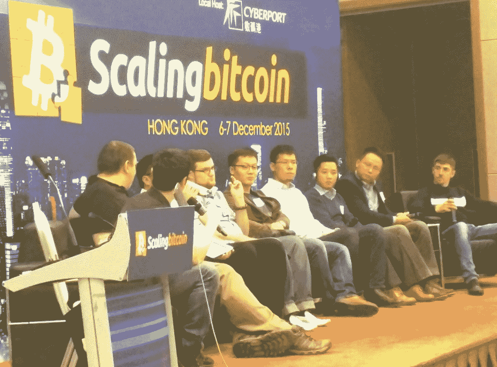
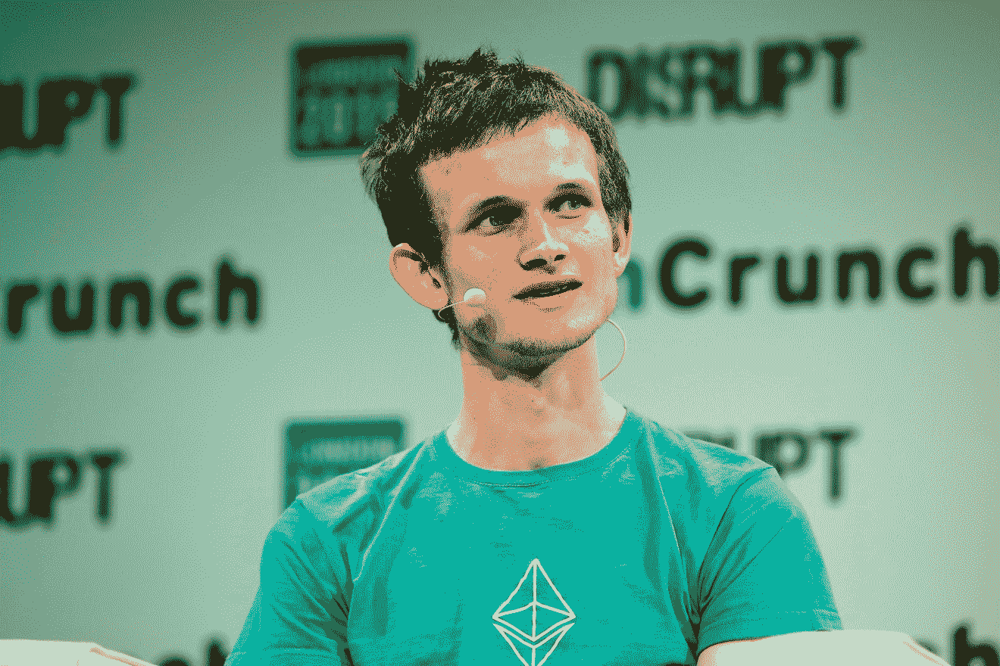
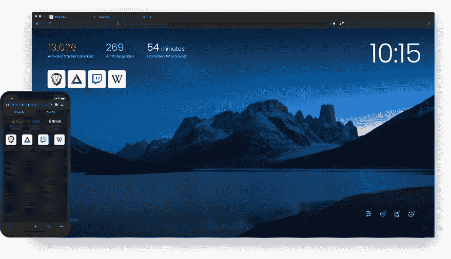
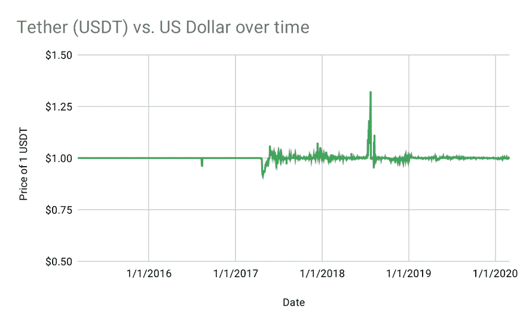
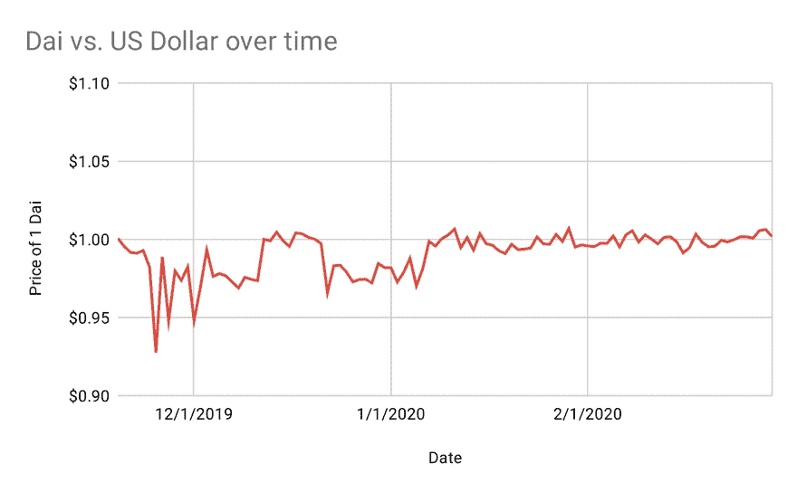
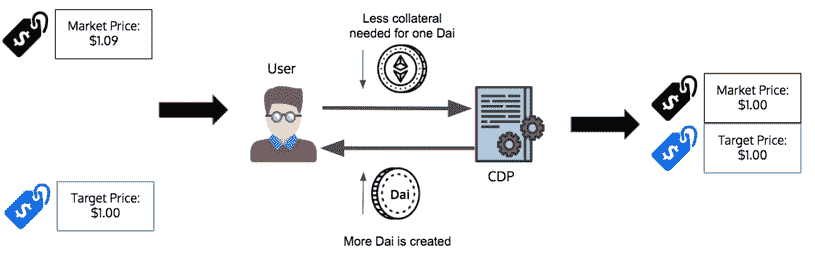
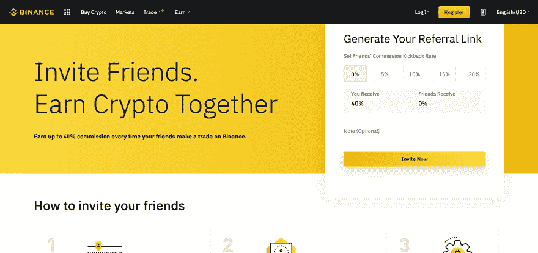

 

# 四、山寨币

虽然(加密货币)可能会带来与执法和监管事务相关的风险，但它们也可能在一些领域拥有长期前景，特别是如果这些创新能够促进更快、更安全和更高效的支付系统。

—本·伯南克，前美联储主席[【409】](part0040.xhtml#a427)

 

比特币并不是唯一的加密货币。有 2000 多种相互竞争的加密货币，被称为替代货币、[【410】](part0040.xhtml#a4FP)，每种都有自己的功能、挖掘算法和(在某些情况下)区块链。一些专门用于特定类型的支付，另一些旨在建立一个应用平台，还有一些只是寻求改善比特币的缺陷。随着时间的推移，替代币变得越来越大——比特币在 2015 年控制了加密货币市场的 90%，但在撰写本文时仅超过 60%。[【411】](part0040.xhtml#a4FR)

比特币的分叉

2016 年，早期比特币开发者、前谷歌工程师迈克·赫恩(Mike Hearn)称比特币是一次失败的实验，列举了它的许多缺陷:[【412】](part0040.xhtml#a504)

*   低容量:大约每秒 3 个事务。

*   高度不可预测的费用和等待时间，尤其是在高需求时期。

*   少数矿商(主要是中国矿商)手中的显著集中，在赫恩看来，他们拒绝做出让比特币更受欢迎的改变，因为这会侵蚀他们的采矿利润。

*   社区无法在任何事情上达成一致——包括增加块大小或块中可以容纳的交易数量的流行修正案。这将让比特币每秒处理更多支付，费用更低，等待时间更短。

*   比特币社区中关于块大小增加修正案的“内战”，导致官方比特币子编辑、论坛和网站上反对观点的广泛审查。

赫恩沉思道，“你会关心一个有(这些缺陷)的支付网络吗？我大胆猜测一下，答案是否定的

为了展示比特币已经变得多么集中，赫恩分享了一个令人难忘的故事:在一次比特币会议上，坐在舞台上的这一小撮人控制了全球 90%的比特币散列功率。[【414】](part0040.xhtml#a5WT)来源:詹姆逊·洛普[【415】](part0040.xhtml#a5WU)

比特币现金

赫恩认为，这些缺陷无法修复，因为社区的功能障碍和强大的少数人对货币的未来持有的咽喉。因此，他决定选择核选项，并在 2017 年创建比特币的硬分叉，将货币一分为二。[【416】](part0040.xhtml#a6JC)

硬分叉一种加密货币就像决定你不喜欢最后三部哈利波特，并编写自己的版本。你的哈利波特系列和 J. K .罗琳的官方系列将共享相同的前四本书，所以它们将有相同的背景故事、主要人物和情节要点。但是在第四本书之后，这两个系列会出现分歧，在剩下的三本书里，每个系列都介绍自己的角色和故事情节。

当赫恩硬分叉比特币时，他做了一些非常类似的事情。他的新加密货币名为比特币现金，共享比特币 2017 年前的区块链，因此过去所有的比特币交易——包括 Satoshi 的 genesis block 和 Hanyecz 的披萨购买——也是比特币现金官方历史的一部分。但拆分后挖掘的所有比特币块都不会成为比特币现金区块链的一部分，拆分后挖掘的所有比特币现金块都不会成为主比特币区块链的一部分。[【417】](part0040.xhtml#a6VC)

由于赫恩对比特币无法扩展感到沮丧，比特币现金将块大小增加了八倍，并可以选择随着时间的推移进一步增加。因此，比特币现金的较大块将被主要的比特币软件拒绝，而比特币现金将拒绝较小的比特币块，从而使两个区块链不兼容。[【418】](part0040.xhtml#a672)(像这样向后不兼容的变更被称为硬分叉，而向后兼容的变更被称为软分叉。[【419】](part0040.xhtml#a673))

不过，比特币的许多关键部分在比特币现金中保持不变。例如，这两种货币都有缓慢递减的区块奖励[【420】](part0040.xhtml#a4KX)，这将导致不超过 2100 万枚货币被开采。[【421】](part0040.xhtml#a4KY)赫恩保留了他认为有用的特征，扔掉了他不喜欢的；这种灵活性使得 hard forks 对有强烈意见的密码领导人很有吸引力。

分裂发生后，所有比特币用户都拥有同等数量的比特币(简称 BTC)和比特币现金币(简称 BCH)。任何钱包软件支持比特币现金的人都可以免费将他们的货币翻一番，[【422】](part0040.xhtml#a6EP)，尽管(也许是因为这个原因)每个 BCH 的价值只有 0.03 到 0.25 BTC。[【423】](part0040.xhtml#a6ER)

因此，比特币“内战”的结果是比特币的分裂，渴望变革的人去了 BCH，而喜欢现状的人留在了 BTC。比特币和比特币现金的区块链、软件、社区、开发者和路线图现在都不一样了。

谁“赢”了？你可以说 BCH 赢了，因为它赢得了“独立”，剥离了一些比特币支持者。但是在撰写本文时，BCH 的市值(流通中所有货币的总价值，也是衡量加密货币成功与否的一个流行指标)只有 BTC 的 5%。[【424】](part0040.xhtml#a4N1)

叉子上的叉子

有趣的是，在 2018 年，比特币现金本身是很难分叉的。由有争议的人物克雷格·赖特(他自称是 Satoshi[【mm】](part0040.xhtml#a4H8))领导的一小群开发者，艰难地用比特币现金创造了比特币 SV(代表“Satoshi 的愿景”)。Wright 认为比特币现金与 Satoshi 最初对比特币的设想相差太远，因此使比特币 SV 更接近 Satoshi 在其开创性的白皮书中宣布比特币的货币。[【425】](part0040.xhtml#a4H9)

很少有矿工放弃比特币现金(也称为比特币 ABC，有点混乱)，也很少有交易所开始提供比特币 SV 出售。[【426】](part0040.xhtml#a79T)因此，比特币 SV 被普遍认为是迷你战争的输家，[【427】](part0040.xhtml#a79U)但加密货币世界的美妙之处在于，任何货币，无论多么不受欢迎，都可以仍然存在。

2020 年 2 月，当比特币 SV 难以实现名为 Genesis 的升级时，情节进一步恶化，纯粹主义者表示，这将使比特币 SV 更接近 Satoshi 在他的论文中提出的内容。对比特币 SV 来说幸运的是，几乎所有的矿工都参与了这次升级，所以没有人将旧版本的比特币 SV 变成新货币。[【428】](part0040.xhtml#a5FS)

结论是，加密货币空间是混乱的、动态的、充满良性竞争的。在我们看来，“可分叉性”是加密货币的最佳特性之一，也是加密货币开发在公开场合进行的好处的证明，代码和辩论都是公开进行的。与此同时，没有办法剥离像亚马逊或优步这样受欢迎的产品，保留部分代码，但抛弃你不喜欢的功能。你甚至看不到它们背后的代码。

以太坊

然而，世界上最著名的 altcoin 与比特币或其相关的内战没有什么关系。它被称为以太坊，它认为加密货币不仅仅是简单的支付工具或投资工具。

以太坊最初是由俄裔加拿大计算机科学家 Vitalik Buterin 在 2013 年的白皮书中描述的，当时他只有 19 岁。布特林的伟大想法是，区块链不仅仅可以记录交易:他们可以运行代码，托管应用程序，存储数据，真的可以做任何类型的计算。[【432】](part0040.xhtml#a45D)

以太坊的发明者维塔利克·布特林。来源:TechCrunch via Flickr[【433】](part0040.xhtml#a45R)

智能合约

以太坊因此在加密货币中加入了智能合约的概念，或生活在区块链上的迷你应用程序。智能合约可以遵循规则，相应地转移资金、数据和其他资产。他们像人一样有地址，你可以给他们发送命令(收取少量费用)让他们行动。[【435】](part0040.xhtml#a5DK)这样，他们就有点像区块链上的自动售货机:把钱放进去，得到一个可预测的商品。

以赌博为例。想象一下，如果许多赌徒在超级碗周日的前一天向智能合约的地址发送 20 美元的以太币(以太币中使用的货币，也称为 ETH)，并附带一条消息，说明他们认为哪支球队会赢。超级碗结束后，智能合约将检查 ESPN，看看哪个队赢了；[【nn】](part0040.xhtml#a7DN)支持赢队的赌徒会赚到一定的钱，输的人什么也得不到，聪明的合约会为自己保留几美元作为它的创造者的利润。

或者想象一个保险智能合约。佛罗里达州的一个柑橘农可能会与保险代理人达成协议，如果那年冬天出现霜冻，代理人将向农民支付 1000 美元，如果没有，农民将向代理人支付 100 美元。农场主会给合约寄去 100 美元，代理人会寄去 1000 美元。

整个冬天，智能合约都会查看天气频道的天气预报。如果它检测到温度低于 32 华氏度，它会把金库里所有的 1100 美元(可能减去一小笔费用)寄给农民。如果冬天过去了，从来没有低于冰点的温度，智能合约会将所有 1100 美元(减去任何费用)发送给保险代理人。

使用智能合约的方式还有很多:拍卖、投票、众筹等等。像这样的智能合约的非凡之处在于，它们总是会按照预期运行——一旦启动，人类就无法干预它们的行为。此外，许多智能合约都是开源的，这意味着任何人都可以看到他们运行的代码。那么，智能合约就像透明的自动售货机:你不仅知道你会得到什么，还知道机器如何分配。

如果你使用智能合约，你不必相信任何人或机构，比如臭名昭著的黑幕赌博公司[【438】](part0040.xhtml#a4KP)他们接受赌注，或者经常贪婪的保险公司有令人困惑的政策。[【439】](part0040.xhtml#a4KR)这让比特币“省去中间人”的想法更进了一步。[【440】](part0040.xhtml#a4KS)

更广泛地说，不必信任公司或机构可能是一种解放。想象一下，如果你在一个从未听说过的电子商务网站上发现了一双很棒的鞋子。你可能会犹豫是否向网站付款，因为你不能确定网站是否会给你发货。但是想象一下，如果这个网站运行智能合约:你把钱放进一个罐子里，只有当联邦快递或 UPS 报告包裹到达你家时，钱才会支付给商店。使用这个网站，或者任何其他新的电子商务网站，你都不会害怕。(你仍然必须信任联邦快递或 UPS，所以这种去中心化有一个漏洞，但这比信任有问题的网站要好。)

这并不是说智能合约完美无缺。正如一位评论家所说，他们既不聪明也不合约。也就是说，“聪明”的东西能够适应突发情况。智能合约是自动运行的，只能处理写入代码的东西，适应性不强。[【441】](part0040.xhtml#a5R3)如果超级碗因为某种原因延期了怎么办？如果有可信的作弊指控，拉斯维加斯决定取消所有投注怎么办？我们的智能合约无法处理这些或所有其他可能出现的问题。

而“合约”是有法律约束力的；如果合约有争议或者有人违约，你可以把某人告上法庭。但在我们的 orange 保险案例中，如果智能合约显示温度为 31°F，但保险公司的数据显示温度为 33°F，该怎么办？换句话说，如果智能合约决定支付索赔，但保险公司不希望它这样做，那该怎么办？将没有办法解决争端；智能合约会做任何它被编程去做的事情。[【442】](part0040.xhtml#a4YM)

因此，尽管智能合约不会像许多以太坊支持者所希望的那样，摆脱律师或法院(或者，很遗憾，甚至是博彩公司)，但它们是一种有趣的新计算模式，可以在法律或金钱不那么紧张的应用中发挥作用。

DApps

你可以将智能合约捆绑在一起，制作更复杂的基于以太坊的应用，称为分散应用，或 DApps(与“地图”押韵)。[【444】](part0040.xhtml#a4BF)

想象一下，如果你制作了一个 DApp 版的 YouTube。你可以有一个智能合约，从广告商那里收集资金并将广告位拍卖给出价最高的人，一个智能合约，根据收视率支付视频创作者，一个智能合约，标记违反版权的视频，等等。

因为这个 DApp 只是一堆相互交流的自主智能合约，它会像时钟一样运行，没有人为干预。把它想象成一个巨大的自动售货机。你可以重现 YouTube 的大部分功能——但没有 YouTube 公司。通过砍掉 YouTube，这个 DApp 可以消除频繁的政策变化，这些政策变化经常让小创作者感到困惑，并有可能毁掉他们的业务。[【445】](part0040.xhtml#a4YN)

类似地，你可以建立一个分散的应用商店，通过智能合约来跟踪评论和评级，让开发者上传一个新的应用，从广告商那里收取费用，并将他们的应用放在排名的顶部，让用户向开发者支付应用费用。这个应用商店也将自动运行。它会将通常运营应用商店的公司排除在外，这些公司经常推出对用户和开发者不利的新政策，例如苹果禁止某些广告拦截器进入应用商店[【446】](part0040.xhtml#a5RS)或开始从所有应用内购买中抽取 30%的费用，许多开发者谴责这是不公平的。[【447】](part0040.xhtml#a5RT)

当然，省去中间人并不总是一件好事。像 YouTube、脸书、Twitter 和其他平台在阻止假新闻方面做得很好。[【448】](part0040.xhtml#a4JX)[【449】](part0040.xhtml#a4JY)亚马逊打击价格欺诈和欺诈产品。YouTube 上成千上万的人类版主阻止一些真正可怕的内容出现在平台上，比如暴力、残忍和儿童色情图片。尽管苹果公司对其处理应用商店的方式颇有微词，但它还是屏蔽了那些宣扬跟踪、T21 和青春的应用程序。

更何况，算法可以和人一样残忍；如果你曾经在优步或 Lyft 上遇到过残酷的价格飙升，你就会明白我们的意思。而且，没有人看，算法会做一些不公平的事情。

例如，当 2020 年 1 月西雅图市中心发生枪击事件时，公共交通被关闭，随着人们试图逃离该地区，优步和 Lyft 的价格自动开始飙升。有报道称，离开市中心要花 100 美元。这些公司因为这种做法受到了广泛的批评，这是理所当然的，但他们很快就给那些高价乘车的司机退款。如果优步或 Lyft 以 DApps 的身份运营，就没有办法纠正这个错误——算法的冰冷逻辑将继续前进。

就像金钱一样，中间商带来成本和收益。摆脱他们并不总是一件好事，但有了 DApps，至少在摆脱他们有意义的情况下，有一个替代中间人的选择。

应用生态系统

事实上，有一些有趣的基于以太坊的 DApps。Storj 允许企业向用户付费，将文件存储在他们笔记本电脑上未使用的空间。[【458】](part0040.xhtml#a71R)假人让科学家和艺术家从普通人的笔记本电脑上众包计算能力，以处理巨大的数据集，为电影渲染计算机图形，等等。[【459】](part0040.xhtml#a71S)August 是一个去中心化(即无庄家)的预测市场，它让人们对未来事件的结果进行赌博，[【460】](part0040.xhtml#a71T)比如即将到来的选举的获胜者或者一个国家今年的 GDP 会增长多少。[【461】](part0040.xhtml#a71U)

这些 DApps 背后的所有创业公司都从他们平台上发生的交易中提成，但除此之外，他们不会(在许多情况下也不能)干预平台上发生的事情。对于我们提到的应用程序来说，这种活动是无害的，所以缺少中间人不是大问题。

隐猫

我们忽略了第一个成为头条新闻的以太坊 DApp，以及可能是有史以来最受欢迎的 DApp:一个名为 CryptoKitties 的虚拟养猫游戏。[【463】](part0040.xhtml#a56W)

在 CryptoKitties 上，你可以用乙醚买卖猫，你可以让你的两只猫繁殖出一只继承了父母双方某些特征的小猫。[【464】](part0040.xhtml#a6FR)CryptoKitties 在 2017 年变得异常流行；一度，15%的以太坊交易是为 CryptoKitties 的智能合约进行的。这个游戏变得如此受欢迎，事实上，它堵塞了以太坊网络，减缓了其他支付。[【466】](part0040.xhtml#a6FT)一度有 3 万笔以太坊交易因为 CryptoKitties 而滞留等待处理。[【467】](part0040.xhtml#a6FU)

待售的小猫咪。在这个截图的时候，0.01 乙醚大约值 2.50 美元，所以这些猫每只的价格在 15 美元到 100 美元之间。来源:格雷格·麦克马伦[【468】](part0040.xhtml#a4BM)

CryptoKitties 也有一个强大的经济，粉丝们写了各种各样的指南来解释如何优化你的育种，赚最多的钱。[【469】](part0040.xhtml#a6MK)(显然，策略是得到一只原始一代的猫和 hodl，[【470】](part0040.xhtml#a6MM)就像你可能得到一张老式棒球卡一样。一只猫卖了 113，000 美元，这使得媒体将这种时尚称为“数字豆豆娃”[【472】](part0040.xhtml#a6MP)

创世纪，第一只隐猫。2017 年售价 11.3 万美元。[【473】](part0040.xhtml#a634)来源:推特上的 crypto kitties[【474】](part0040.xhtml#a635)

尽管 CryptoKitties 的繁殖算法和经济错综复杂，但真正有趣的是它的所有权模式。在像《堡垒之夜》这样的普通游戏中，游戏的主人会追踪你在他们的服务器上拥有的物品。如果那个游戏关闭了，或者主人出于某种原因决定拿走你的物品，你所有的虚拟物品都将不复存在。[【475】](part0040.xhtml#a4CD)

但对于 CryptoKitties，你的所有权存储在区块链上，所以只要以太坊区块链还活着(也就是说，只要有人在某个地方运行以太坊软件)，你就会“拥有”这只猫。CryptoKitties 的主人不能把你的猫从你身边带走，更重要的是，如果有人要叉 CryptoKitties，你可以把你所有的旧猫导入这个新应用程序。你不能在今天的游戏中做到这一点——你不能把你的财产输入到堡垒之夜的复制品中。

这些特性让艺术评论家们欢呼区块链是艺术和文化的潜在未来:终于有一种方法可以证明你，而且只有你，拥有一件数字艺术作品

刀

然而以太坊并不全是有趣和猫；它也有自己的争议。这场争论围绕着 DAO(它代表分散的自治组织[【PP】](part0040.xhtml#a6YP))展开，DAO 是 2016 年 4 月推出的一种分散的风险投资基金。潜在投资者将向 DAO 汇款(以乙醚的形式),作为交换，他们将获得投票代币。[【477】](part0040.xhtml#a6YR)

以太坊令牌是任何智能合约(或 DApp)都可以制作并分发给用户的虚拟小饰品；用户可以交易代币，在某些情况下，还可以用智能合约“赎回”代币。这些投票代币就是一个很好的例子；CryptoKitties 中的猫也被表示为令牌。这些令牌是按照 ERC-20 技术标准实现的，因此通常被称为 ERC-20 令牌。[【480】](part0040.xhtml#a58B)

无论如何，投资者会用他们的投票令牌对他们想要投资的创业公司进行投票，获胜的创业公司将自动获得融资蛋糕的一部分。这是一种全新的风险资本主义模式:合伙人和等级制度已经过时，民主决策开始流行。[【481】](part0040.xhtml#a4B7)

DAO 很快变得非常成功，在 28 天内从 11，000 名投资者那里筹集了 1.5 亿美元。[【482】](part0040.xhtml#a4VS)但“道”背后的智能合约充满了漏洞和安全漏洞，2016 年 6 月，一名未知黑客利用一个未知的漏洞[【483】](part0040.xhtml#a4VT)从“道”的金库中窃取了 360 万乙醚，当时价值约 5000 万美元。这是一笔巨款:大约是当时开采的所有以太币的 14%。[【485】](part0040.xhtml#a4VV)

通常情况下，你不能改变区块链上跟踪的过去的交易是一件好事。但在这种情况下，它是严重的，因为没有简单的方法来取消刀的裂缝。解除黑客攻击的唯一方法是硬分叉以太坊，创造一个新的区块链，从而创造一种新的货币，这就解除了黑客攻击。[【486】](part0040.xhtml#a4K7)

这导致了反叉子和支持叉子的活动家之间的大规模哲学辩论。反 fork 活动人士认为“代码就是法律”，这是密码圈内的一句俗语。换句话说，智能合约的编程很糟糕，但它确实做了它被编程要做的事情。即使我们可能不喜欢智能合约所做的事情，但它遵循了所有的规则，所以我们不应该声称它是错误的。区块链过去的交易不会被改变。简而言之:我们以某种方式设计了这个系统，我们不应该仅仅因为它有一个我们不喜欢的结果就推翻它。[【487】](part0040.xhtml#a4HH)

另一方是支持分叉的积极分子，他们认为区块链必须为人民服务，而不是相反。他们认为盗窃是不道德的，以太坊社区必须收回这一行为，以表明这种行为是不可容忍的。正如我们可以在过去的法律不再满足我们的需求时修改它们一样，当以太坊的规则导致不好的结果时，我们也应该能够修改它们。[【488】](part0040.xhtml#a55Y)

2016 年 7 月，支持分叉的活动人士厌倦了这场辩论，决定将以太坊区块链硬分叉，创造一种新版本的货币，将偷来的钱返还给投资者。令人困惑的是，这个新版本保留了原来的名字以太坊。反叉子团体继续承认原来的，没有改变的区块链是官方的；这种货币被命名为以太坊经典。[【489】](part0040.xhtml#a4U7)[【QQ】](part0040.xhtml#a4U8)

虽然争论很激烈，但至少有一种和平的、建设性的方式来解决它。再次，硬叉区块链的能力在这里非常有用。

勇敢&蝙蝠

以太坊的 ERC-20 代币[【RR】](part0040.xhtml#a62T)相当厉害。事实上，你可以用这些代币创造一种全新的加密货币:你只需要一份智能合约，向用户分发有限数量的代币。然后，只要有人愿意把你的代币换成乙醚(或美元)，反之亦然，你就拥有了一种可以交易的稀缺资产，并且可以转换成其他形式的货币。换句话说，你有一种货币！[【490】](part0040.xhtml#a62U)

这些代币加密货币的行为很像普通的加密货币(它们有自己的区块链)，只是代币不能被开采；它们通常由其他机构或算法分发。[【491】](part0040.xhtml#a6XD)

最著名的代币加密货币之一是基本注意力代币，简称 BAT。BAT 是由 Mozilla(流行的 Firefox 浏览器背后的非营利组织)的联合创始人布伦丹·艾希(Brendan Eich)在 2017 年创建的。它与艾希在 2015 年创建的专注于隐私的勇敢网络浏览器齐头并进。[【492】](part0040.xhtml#a70F)

Brave 是一款注重隐私的网络浏览器，为用户提供免费观看广告的 BAT(即金钱)。来源:勇者[【493】](part0040.xhtml#a4BS)

艾希创建了 BAT，因为他对在线广告的现状感到不满:不间断的广告消耗了用户的电池和移动数据，用户在浏览时被一大群追踪者跟踪，谷歌和脸书拥有绝大部分市场，广告定位技术仍然很差。他指责中间人——谷歌和脸书的广告交易所——造成了这种不幸的局面。[【494】](part0040.xhtml#a61J)

艾希的想法是省去中间商，让广告商直接向出版商(展示广告的网站，如《纽约时报》)和用户付费。因为主流网络浏览器不支持内置的加密货币支付，Eich 决定将该功能内置到 Brave 中。[【495】](part0040.xhtml#a4EM)

付费的基础是关注度。勇敢的用户根据他们对广告的关注程度获得奖励，出版商根据勇敢的用户对其平台上的广告的关注程度获得奖励。[【496】](part0040.xhtml#a59X)(注意不能采蝙蝠；你依靠勇敢把它们给你。)

如你所料，这个支付系统是建立在智能合约之上的。当广告商创建一个广告时，它向智能合约发送 BAT 中的几美分。当一个勇敢的用户浏览那个广告时，智能合约被“解锁”,里面的钱被支付出去:一些给用户，一些给托管广告的出版商，一些给勇敢者。Eich 和他的公司认为，这个系统减少了欺诈，改善了给广告商和出版商的数据，比当前的广告系统更好地保护了用户隐私。[【498】](part0040.xhtml#a5K7)

BAT 是否会大规模流行还有待观察，但它对网络新商业模式的愿景很有意义。

目前，所有的激励都是错位的:广告商被激励让广告尽可能地侵扰和恼人，出版商被激励在页面上塞进越来越多的广告，消费者被激励安装广告拦截器，因为他们从广告中除了痛苦什么也没得到。

你只需要看看荒谬的广告拦截军备竞赛就知道这个系统有多糟糕:首先是广告拦截器，然后网站开始安装工具来隐藏网页，不让使用广告拦截器的人看到，[【499】](part0040.xhtml#a444)现在有广告拦截器的插件来阻止网站使用这种策略。[【500】](part0040.xhtml#a445)先是广告拦截器，再是广告拦截器杀手，再是广告拦截器杀手杀手。[【ss】](part0040.xhtml#a446)

但英美烟草似乎能够恰当地调整激励机制:当用户浏览广告时，所有人都受益，而当广告使网站体验变差时，所有人都遭受损失。在这种理论下，用户不会想安装广告拦截器(谁会放弃免费的钱？)，广告商将制作人们实际上喜欢的广告，[【TT】](part0040.xhtml#a5MR)出版商不会制作广告充斥到用户离开的网站。可能会有用。

稳定的货币

比特币旨在成为一种投资工具，以太坊旨在成为一个应用平台，而另一类加密货币 stablecoins 旨在成为一个经典的支付系统。

求稳定

正如我们之前看到的，阻碍比特币成为可行支付系统的三个主要因素是费用、等待时间和波动性。前两个问题可以通过各种技术升级很容易地解决——还记得 SegWit 和 Lightning 吗——或者只是通过改变采矿规则。比特币现金旨在通过增加区块大小来实现这一目标。另一个名为 Litecoin (LTC)的 altcoin 提供了与比特币非常相似的功能，但交易速度更快(挖掘区块需要 2.5 分钟，而不是 10 分钟)，交易费用更低(在撰写本文时大约低 20 倍[【501】](part0040.xhtml#a437)[【502】](part0040.xhtml#a438))。所以费用和等待时间是可以解决的问题。

比特币的波动性是更根本的问题:[【503】](part0040.xhtml#a453)稳定性和增长之间存在权衡，只要加密货币专注于增长，它们就不会有稳定性。如果没有稳定性，你将会经历疯狂的价格波动——还记得比特币的价格如何在一天之内暴涨 10%或暴跌 10%吗？有了这样的波动，人们会犹豫用这些货币支付还是得到支付；如果你花了 100 美元买了一样东西，但后来意识到你可以等一等，得到 110 美元，你会感觉很糟糕；如果你赚了 100 美元，但看到它的价值在一天内蒸发了 10%，你会感觉更糟。

衣夹

与此同时，stablecoins 明确关注稳定性。这些货币与美元或欧元等法定货币保持固定汇率。最著名的稳定币叫做系绳币:每枚系绳币(USDT，代表美元系绳币)的交易价格总是 1 美元。[【507】](part0040.xhtml#a6H1)日元、欧元、人民币也有系绳版。[【508】](part0040.xhtml#a6H2)

在经济学术语中，像这样保持固定汇率被称为钉住汇率。许多政府为了寻求经济稳定，将本国货币与更大、更成熟的货币挂钩，维持本国货币与更大货币之间的恒定汇率。例如，0.709 约旦第纳尔总是值 1 美元，1.6 尼泊尔卢比总是值 1 印度卢比。[【509】](part0040.xhtml#a6ST)

钉住汇率制是通过提供一个简单的交易来实现的:一家中央银行(或者说是一个纽带)创造了一个货币局，一种任何人都可以以预定的汇率兑换货币的银行柜台。例如，尼泊尔有一个货币发行局，任何人都可以用 1.6 尼泊尔卢比买卖 1 印度卢比。在泰瑟的例子中，任何人都可以在任何时候用 1 USDT 兑换 1 美元。

提供这种交易可以确保市场汇率保持固定。如果一枚 USDT 的市场价格涨到 1.01 美元，人们就会从 Tether 的货币发行局以每枚 1 美元的价格购买成吨的 USDT，并在市场上以每枚 1 美元的价格出售，直到市场价格在抛售的打压下回落到 1 美元。如果 USDT 的市场价格跌至 0.99 美元，人们会从市场上购买成吨的 USDT，并以每枚货币 1 美元的价格卖给 Tether 的货币发行局，直到市场价格在所有需求的推动下上涨至 1 美元。[【511】](part0040.xhtml#a66A)

除了 2018 年的一次反常事件，Tether 的价格一直非常稳定。数据来源:coin gecko[【512】](part0040.xhtml#a5P6)

钉住汇率制的挑战在于，提供钉住汇率制的货币局必须有足够多的较大国家的货币，即所谓的参考货币。尼泊尔的银行里必须有大量的印度卢比，以确保人们总是能够将尼泊尔卢比兑换成印度卢比；如果银行用完了印度卢比，挂钩将会崩溃。同样，Tether 必须有足够的美元储备。

多年来，泰瑟承诺为流通中的每一枚 USDT 保留 1 美元储备。[【513】](part0040.xhtml#a6MZ)通过这种被称为 100%支持货币挂钩的方法，[【514】](part0040.xhtml#a6N0)Tether 确保了它总能兑现其承诺的汇率——即使每一个 USDT 持有者都试图将他们所有的货币卖回美元。(当然，这种情况发生的可能性很小，但如果联系汇率崩溃，对 USDT 持有者来说将是毁灭性的。)

大约在 2018 年，分析师开始怀疑 Tether 并不是真正 100%的货币支持，这意味着该公司可能并没有真正拥有流通中的每 USDT 1 美元。(首先，这是一项艰巨的任务:在撰写本文时，有 45 亿美元在流通，因此，泰瑟银行必须有 45 亿美元才能获得 100%的货币支持。那一年，泰瑟试图通过宣布一家外部律师事务所已经证实泰瑟是 100%美元支持的来减轻这些担忧。[【517】](part0040.xhtml#a3YP)

但在 2019 年，Tether 承认了许多人长期以来的怀疑:它不是 100%的货币支持。那年 3 月，它悄悄地改变了自己的网站，称美元债券 100%由现金、现金等价物(短期、流动性债券)和定义模糊的“储备”支持。该公司的律师表示，Tether 的美元和现金等价物只有流通中美元的 74%，这意味着另外 26%来自那些不透明的“储备”

再说一次，依赖“储备”(我们认为包括贷款和股票)本身并不会降低 Tether 的稳定性。让人们慌乱的是泰瑟悄悄食言。

这指出了系绳的一个更基本的问题:货币的稳定性是由一家私人控股公司的行为决定的——可以说是一个中间人。没有系链公司，系链货币将会崩溃。这与区块链和加密货币的精神背道而驰:技术应该能够在没有人类干预的情况下运行，它们的未来应该由民主决定，它们不应该依赖于一小撮人的可信度。[【520】](part0040.xhtml#a5MU)

奶妈

然而，有一种分散的替代系绳的方法:戴，一种由一个叫做 MakerDAO 的组织制造的稳定币。[【521】](part0040.xhtml#a46Y)[【uu】](part0040.xhtml#a46Z)傣币(技术上来说是 20 代币[【522】](part0040.xhtml#a470))盯住 1 美元一枚，但与泰瑟不同的是，马克尔道没有任何储备，也没有自己的货币发行局。取而代之的是，MakerDAO 建立了一个聪明的经济系统，自动保持戴货币的交易价格在 1 美元左右。[【523】](part0040.xhtml#a471)

戴[【vv】](part0040.xhtml#a5SS)已经和系绳差不多稳定了，但是没有极端的尖峰。数据来源:coin gecko[【524】](part0040.xhtml#a5ST)

你可以通过创建债务抵押头寸(CDP)的智能合约获得戴货币。[【525】](part0040.xhtml#a78W)你给智能合约送一些以太币(还是叫以太)，然后就可以借一些戴币了。要拿回你的乙醚，你需要将货币和少量利息返还给智能合约。[【526】](part0040.xhtml#a78X)换句话说，你用你的以太做抵押，借戴币；这笔贷款是 CDP。

为了将 1 Dai 的价值保持在 1 美元，这个系统——被称为目标利率反馈机制——在阿呆价格过高时减少你需要的抵押品数量，在价格过低时增加你需要的数量。因此，如果阿呆的价格涨到 1.05 美元，人们就会廉价制造一堆 Dais，让 Dais 充斥市场，这将迫使价格回落。如果阿呆的价格下跌到 0.95 美元，人们将赎回他们的 Dai 以获得利润，从而减少 Dai 的供应，这将迫使价格回升。[【528】](part0040.xhtml#a5G4)

解释 Dai 目标利率反馈机制的图表，旨在自动稳定 Dai 的价格。来源:Sid shek har[【529】](part0040.xhtml#a5BE)

因此，戴的钉住汇率制度在很大程度上类似于货币局:如果汇率过高或过低，套利者会赚钱，但在这样做的过程中，他们会将汇率推回到钉住汇率。但由于挂钩是通过智能合约而不是公司来维持的，所以它是分散的。

傣币只是这个系统的一部分；MakerDAO 经营另一种货币，与戴一样，是作为 20 代币使用的。[【530】](part0040.xhtml#a59A)MKR 的价值是自由浮动的(不稳定)，你只能支付你在 MKR 的贷款(CDP)的利息费用。所以，理论上来说，戴用得越多，对的需求就会越大，而的价格就会越高。因此，投资 MKR 意味着押注戴的知名度将会提高。

币安

中国加密货币交易所币安成立于 2017 年，已迅速成为全球最受欢迎的交易所之一，[【532】](part0040.xhtml#a5WB)每天支持 12 亿笔交易。它的增长是由一个强大的推荐程序推动的，该程序为用户邀请到平台上的人所做的每一笔交易提供高额佣金，以及提供利基但新兴的加密货币(由用户投票)的趋势。[【534】](part0040.xhtml#a5WD)

币安的推荐项目为用户提供高达 40%的佣金，这些佣金来自他们带到平台上的人所做的所有交易。来源:币安[【535】](part0040.xhtml#a43H)

币安还发行了一种叫做 BNB 的货币；如果你用 BNB 支付，币安会给你交易费的折扣。[【537】](part0040.xhtml#a6UE)因此，投资 BNB 就是押注币安会越来越受欢迎。(注意这里的一个趋势？许多加密初创公司提供加密货币，其价值直接或间接与他们产品的成功挂钩。它们和股票对普通公司的作用是一样的:从投资者那里筹集资金，奖励员工。)

世界是不够的

币安并不满足于运营一个广受欢迎的加密货币交易所。它还经营着一家名为 Launchpad 的风险投资公司，该公司允许加密初创公司通过向币安用户出售其独特的加密货币来筹集资金；BNB 是唯一被接受的付款方式。[【538】](part0040.xhtml#a5NT)这些秘密筹资的时刻被称为首次公开募股，或 ICOs[【539】](part0040.xhtml#a5NU)——当初创公司开始在股票市场上出售股票时，首次公开募股或 IPO 的加密版本。

在币安的 Launchpad 上寻求资金的众多加密初创公司中的几个。其中包括一个印度加密交易所，一个“跨区块链”金融平台和一个区块链赌博平台。资料来源:币安[【540】](part0040.xhtml#a5F8)

币安还运营着自己的区块链平台，名为币安链，让加密初创公司创建和发行他们的加密货币。[【542】](part0040.xhtml#a579)币安链是币安 DEX 的基础，这是一个分散的加密货币交易所(与币安公司运营的币安定期集中交易所相反[【543】](part0040.xhtml#a57A))。猜猜你能用哪种流行的加密货币在 DEX 上购买更小的加密货币？你猜对了:BNB。[【544】](part0040.xhtml#a57B)

币安还经营一家慈善机构，为自然灾害的受害者和非洲饥饿的儿童捐款。[【546】](part0040.xhtml#a744)现在你可以猜到了，这笔钱是以 BNB 的形式捐赠的。[【547】](part0040.xhtml#a745)[【ww】](part0040.xhtml#a746)

事实证明，币安非常擅长建立一个秘密生态系统，并利用 BNB 将这一切联系在一起。难怪在撰写本文时，BNB 在所有加密货币中的市值排名第九。[【548】](part0040.xhtml#a62V)

莫内罗

正如我们提到的，比特币并不是真正的匿名。每一笔支付都被公开并永久地存储在区块链上，因此任何人都可以看到人们有多富有，谁和谁做生意，以及钱流向了哪里。如果你能把一个人和他的地址匹配起来，你就能看到他所有的付款记录。这样，对隐私来说比信用卡更糟糕，因为使用信用卡，至少你的信息不会被在网上窥探的普通人看到。

普通人可能无法将你与你的地址匹配，但你使用的加密货币交易所肯定可以，因此任何能够控制交易所的政府也可以。2017 年，美国国税局(IRS)迫使比特币基地交出购买或出售大量比特币的人的姓名和比特币地址。有了这些信息，国税局就能识别并追踪逃税者。(在这种情况下，这可能是一件好事，但令人担忧的是，政府可以如此容易地打破“匿名”——你可以想象一个充满敌意的政府可以利用这种权力来打击公民自由。)

比特币生态系统已经建立了一些隐私保护措施，比如鼓励人们使用新地址进行每笔交易[【551】](part0040.xhtml#a4UP)，并提供比特币酒杯，将你的货币与其他人的混合，并随机返还货币，因此不可能知道你的货币来自哪里。尽管如此，这些都是可选的快速解决方案，隐私并没有融入比特币的设计中，因此批评者称这些努力为“刺伤后的创可贴”[【553】](part0040.xhtml#a4US)

隐私货币

进入 Monero，一个寻求隐私和匿名的另类货币。Monero 通常被称为隐私货币，它使用一种叫做 CryptoNote 的技术来掩盖每笔交易的发送者和接收者的身份。[【554】](part0040.xhtml#a59T)

CryptoNote 通过两种主要技术来实现这一点。首先，多个人被列为每笔交易的潜在发送者。这种被称为环签名的技术掩盖了真实的发送者身份。其次，通过使用秘密地址，收件人的身份变得模糊不清:每个收件人都会自动获得每笔交易的一次性地址，只有拥有秘密地址的人才能首先看到交易的发生。[【555】](part0040.xhtml#a5RW)

因此，虽然所有 Monero 支付确实存储在区块链上，但公众无法看到任何交易的发送者或接收者是谁。也没有办法把交易联系起来，所以如果你把钱寄给某人，你不知道他们是否或者何时花掉这笔钱。[【556】](part0040.xhtml#a751)(这两件事在比特币中都是可能的。)

当然，完全匿名也有不好的一面——它帮助罪犯比以前更有效地逃避审查。勒索软件分销商开始要求受害者用 Monero 而不是比特币支付，这并不奇怪，而且控制超级计算机的黑客往往更喜欢使用这些机器来挖掘 Monero 而不是比特币。[【559】](part0040.xhtml#a5ES)

密码劫持

也许 Monero 最著名也是最阴险的用途是浏览器内挖掘。你可以让你的网络浏览器运行一段 JavaScript 代码——与 Spotify 和 Google Docs 等网站的互动代码相同——来挖掘 Monero 货币。[【560】](part0040.xhtml#a7A7)

这是可能的，因为 Monero 的挖掘算法是抗 ASIC 的。虽然比特币的挖掘算法只关心一个挖掘钻机每秒可以做多少万亿次哈希，但 Monero 的算法要求计算机在挖掘时使用大量内存(RAM)。这个想法是，ASICs 擅长反复运行一个简单的计算，它们缺乏日常计算机用来同时运行多个应用程序、标签和游戏的 RAM。[【561】](part0040.xhtml#a4YB)

因此，一台拥有像样的 CPU 和 GPU 的普通计算机应该能够很好地挖掘 Monero，而 ASICs 实际上应该表现得相当糟糕。[【562】](part0040.xhtml#a4XS)(这是一个脆弱的系统——矿业公司曾经发明了 ASIC 来破解 Monero 的采矿算法，迫使 Monero 对其算法进行紧急调整，从而掀起了一场军备竞赛——但至少 Monero 比比特币更抗 ASIC。[【563】](part0040.xhtml#a4XT)

由 Nvidia 的 GeForce GTX GPU 驱动的强大游戏电脑。这些计算机将很难挖掘比特币，但它们非常擅长挖掘像 Monero 这样的抗 ASIC 加密货币。[【564】](part0040.xhtml#a56X)来源:维基媒体[【565】](part0040.xhtml#a56Y)

由于 Monero 的挖掘算法非常容易在普通计算机上运行，即使是网络浏览器也可以挖掘 Monero 货币，即 XMR。所以，在 2017 年，一家名为 CoinHive 的初创公司开始让网站所有者在他们的网站上嵌入一小段 Monero 挖掘代码(用 JavaScript 编写)。访客的浏览器挖掘 XMR，流向网站所有者。[【566】](part0040.xhtml#a4GG)

这在理论上是一个有趣的想法:网站所有者现在可以从他们的网站中获利，而不必依赖烦人的侵入性广告。游戏也可以通过提供虚拟商品找到新的收入来源，比如额外的生命或金币，给那些让他们的浏览器挖掘几分钟的用户。

问题是 CoinHive 没有被用来为网络创造创新的商业模式。相反，它被寻求不道德赚钱的阴暗人物所利用。2017 年，流行的 torrenting 或数字盗版网站海盗湾开始在游客的浏览器上运行 CoinHive，而不让他们知道或给他们任何回报。这也不是一个无害的恶作剧，因为所有的采矿活动都会加热游客的电脑，让他们的风扇高速运转，耗尽他们的电池。[【569】](part0040.xhtml#a5WR)

这种劫持访问者的浏览器来为可疑的运营商挖掘货币的策略被称为密码劫持，它迅速成为互联网上的一个祸害。这也是非常有利可图的:据估计，一个网站运营商通过对他们的访问者进行加密劫持，一个月可以赚到 30 多万美元。[【571】](part0040.xhtml#a64C)

黑客也利用了密码劫持。2017 年，攻击者入侵了热门的 Showtime 网站，并悄悄安装了一个密码黑客，[【572】](part0040.xhtml#a4BA)，从而为 Showtime 的数百万访客中的每一个人赢得了攻击者的 XMR。2018 年，黑客对《洛杉矶时报》的网站发动了类似的攻击。黑客攻击变得如此普遍，以至于网络安全分析师开始将密码劫持称为他们追踪的头号恶意软件威胁。[【574】](part0040.xhtml#a4BC)

你可以看到为什么密码窃贼喜欢 Monero:在浏览器上挖掘它很容易，而且由于它完全是匿名的，骗子不会留下任何指纹。这说明了加密货币的一个基本矛盾:任何旨在促进隐私和匿名的东西——这通常是好事——最终都比其他任何人都更有利于犯罪分子。