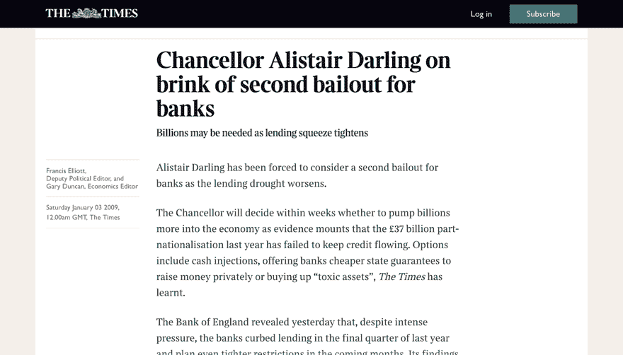
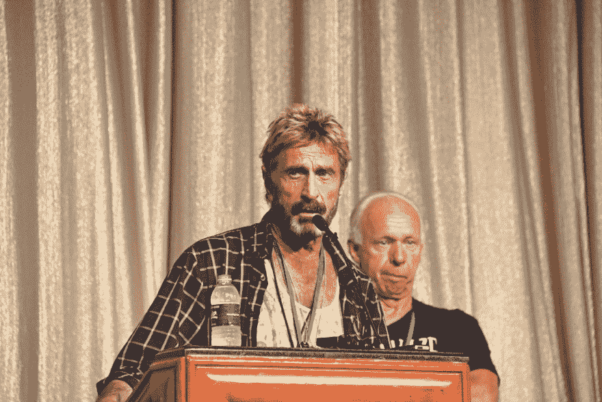

 

# 十四、附录 C：谁是中本聪？

比特币的化名创造者中本聪从未公开宣布过他(或她，或他们的，等等。)真实身份。没人知道聪是谁。事实上，我们甚至不知道 Satoshi 是一个人还是一群人。[【1023】](part0040.xhtml#a5E0)[【1024】](part0040.xhtml#a5E1)

我们从 Satoshi(他通常被称为他的名字)那里得到的只是几百条论坛帖子、[【1025】](part0040.xhtml#a72M)几封公开列表上的电子邮件、[【1026】](part0040.xhtml#a72N)以及一些与其他早期比特币开发者的私人通信。但这并没有阻止比特币爱好者试图了解他的生活，他的政治和哲学倾向，当然，还有他到底是谁。

时间线

Satoshi 第一次出现在 2008 年的万圣节，当时他在一个专注于密码学的公共邮件列表上发布了比特币白皮书[【1028】](part0040.xhtml#a53H)[【hhh】](part0040.xhtml#a53J)。整个 2008 年，他都在讨论和完善他在这份清单上的想法，并于 2009 年 1 月发布了比特币软件的第一个版本。第二个月，他开始在 P2P 论坛上发布关于比特币的帖子，这个论坛是去中心化技术支持者的天堂。[【1032】](part0040.xhtml#a53P)

Satoshi 在 2009 年和 2010 年一直致力于比特币，发布了该软件的新版本，并经常在论坛和邮件列表上与人们接触。[【1033】](part0040.xhtml#a6NX)

他最后一次公开交流是在 2010 年 12 月，简单而乏味:他宣布了比特币软件的一个小更新，增加了对拒绝服务(DoS)攻击的一些保护，攻击者可以用垃圾短信淹没系统，使其无法为合法用户工作。[【1034】](part0040.xhtml#a7A4)

公众再也没有听到 Satoshi 的消息，但显然 Satoshi 又与其他比特币开发者保持了一年的联系。迈克·赫恩公布了 Satoshi 写给他的最后一封邮件，日期是 2011 年 4 月 23 日:

我已经转移到其他事情上了。Gavin(另一位早期比特币开发者 Andresen)和所有人都很好地处理了这件事。[【1035】](part0040.xhtml#a5AK)

据我们所知，Satoshi 最后一次与人通信是在 2011 年 4 月 26 日，当时他给 Andresen 写道:

我希望你不要一直说我是一个神秘的影子，媒体只是把它变成一个海盗货币的角度。也许相反，它是关于开源项目，给你的开发贡献者更多的信任；这有助于激励他们。[【1036】](part0040.xhtml#a597)

安德烈森回复邮件说，中本聪曾被邀请在中情局主办的一次活动上发言，但他从未回信。一些阴谋论者认为，Satoshi 被中情局的消息吓到了，显然是为了避免与他们接触而逃跑。

加文·安德森(Gavin Andresen)，早期的比特币开发者，也是已知的最后一个与 Satoshi 交谈过的人。来源:网络峰会[【1039】](part0040.xhtml#a6HT)

2015 年，在 Satoshi 最后一次通信的四年后，有人使用他的电子邮件地址发布了比特币世界正在发生的一场围绕比特币 XT 的纠纷，[【1040】](part0040.xhtml#a6Y4)比特币 XT 是运行在绝大多数比特币全节点上的比特币核心客户端软件的竞争对手。[【1041】](part0040.xhtml#a6Y5)

这个自称是 Satoshi 的人说，他退休是为了警告世界这个“非常危险的分叉”和“这个伪装者——比特币”的开发者。[【1042】](part0040.xhtml#a68E)比特币 XT 由迈克·赫恩(Mike Hearn)创建，[【1043】](part0040.xhtml#a68F)与 Satoshi 有过最后一次通信的同一位比特币开发者，也是比特币社区中一个有争议的人物。[【1044】](part0040.xhtml#a68G)

大多数专家认为，这封 2015 年的电子邮件不是由 Satoshi 发送的，而是由入侵 Satoshi 账户的人发送的。[【1045】](part0040.xhtml#a544)为什么这位比特币的创造者会低调了这么多年，只是为了重新加入这场最终成为比特币社区中一场小争论的辩论——然后又迅速消失？为什么一个在沟通中相当圆滑的人，即使是对他最严厉的批评者，[【1046】](part0040.xhtml#a545)会如此粗暴地攻击他的前盟友？

聪的哲学

所以很明显，Satoshi 在 2011 年后消失了。但从那以后，比特币的支持者一直在阅读他的每一篇文章，以了解他的政治和哲学观点，要么是为了证明他们对比特币未来的提议，要么只是为了了解他们如此热爱的技术的起源。甚至还有一本名为《智之书》的书，将他所有已知的作品编入目录。[【1047】](part0040.xhtml#a5HZ)(这有点让人想起一场试图理解他们先知心态的宗教运动。)

对 Satoshi 的政治观点和他创造比特币的原因的任何研究都必须从他在有史以来添加到区块链的第一个比特币区块(被称为“创世纪区块”)中编码的加密信息开始。信息是:

泰晤士报 03/1/2009 财政大臣处于第二次银行救助的边缘。[【1048】](part0040.xhtml#a575)

这条消息引用了英国报纸《泰晤士报》的一篇文章，其中提到财政大臣(英国财政部的负责人)正在考虑在 2008 年金融危机最严重的时候将纳税人的钱注入破产的英国银行。

Satoshi 在《第一个比特币区块》中引用了英国《泰晤士报》这篇现在已经很有名的文章，这篇文章可能会给出他为什么创造比特币的线索。[【1051】](part0040.xhtml#a41X)

比特币分析师将此解读为，Satoshi 不信任银行系统，并对公民为银行的错误买单感到愤怒。因此，人们认为，Satoshi 创造了一种任何银行或政府都无法控制的货币——没有税收，没有银行倒闭，没有救助。[【1052】](part0040.xhtml#a5YY)

2009 年，Satoshi 在 P2P 论坛上介绍比特币时，他对银行的蔑视更加明显:

传统货币的根本问题是它运转所需的所有信任。必须相信央行不会让货币贬值，但法定货币的历史充满了对这种信任的违背。必须信任银行持有我们的钱，并以电子方式转移，但他们在信贷泡沫的浪潮中贷出这些钱，储备几乎没有一部分。我们必须相信他们会保护我们的隐私，相信他们不会让身份窃贼盗取我们的账户。[【1053】](part0040.xhtml#a4Y6)

纵观 Satoshi 的著作，这种对金融机构的不信任是最一致的主题。似乎这就是他创造比特币的主要原因。

Satoshi 的一些其他作品表明他有一种模糊的自由主义心态。在他的帖子中，他表达了对政府权威的怀疑，并表示他寻求用比特币“获得一个新的自由领域”。[【1054】](part0040.xhtml#a5S9)

但是 Satoshi 可能不是一个空想家；更有可能的是，他只是创造了一项他热爱的技术，并且很高兴看到一个特定的社区被他的创造所吸引。想想他的这句话:

如果我们能恰当地解释它，这对自由意志论者来说是非常有吸引力的。不过，比起文字，我更擅长代码。[【1055】](part0040.xhtml#a48Y)

聪的身份

最终的问题是:到底谁是(或曾经是)聪？

一个主要的理论是，Satoshi 是戴伟[【1056】](part0040.xhtml#a6TJ)或尼克·萨伯[【1057】](part0040.xhtml#a6TK)的别名，他们是制造原始加密货币(分别是 B-Money[【1058】](part0040.xhtml#a6TM)和 Bit Gold[【1059】](part0040.xhtml#a6TN))的计算机科学家，这些货币早于比特币，但从未起飞。支持萨博的证据相对有力:

*   一位语言学研究者发现 Szabo 和 Satoshi 的写作风格有惊人的相似之处，声称“只有 0.1%的密码学研究者能写出这种写作风格。”两位作者都经常使用相对罕见的短语，如“可信的第三方”、“出于我们的目的”和“应该注意到”。[【1061】](part0040.xhtml#a4UA)

*   在 Satoshi 宣布比特币之前不久，Szabo 一直在寻找 Bit Gold 上的合作者；声明发布后，Szabo 不再写关于 Bit Gold 的文章。[【1062】](part0040.xhtml#a69B)

*   Satoshi 引用了 Bit Gold 的许多想法，包括工作证明、时间戳事务以及删除可信第三方的需要，[【1063】](part0040.xhtml#a5VS)但他从未引用 Szabo 的工作。[【1064】](part0040.xhtml#a5VT)

我们问了比特币历史书《数字黄金》的作者纳撒尼尔·波普(Nathaniel Popper)，他说他认为萨伯是聪。但所有这些证据都只是旁证，Szabo 一再否认自己是 Satoshi。[【1065】](part0040.xhtml#a58F)

英国假说

在我们看来，一个更可信的理论是，Satoshi 实际上是英国人，而不是人们普遍认为的日本人。首先，他的作品全是完美的英文。[【1066】](part0040.xhtml#a4N9)他最初的比特币论文充满了英式拼法(比如“favor”而不是“favor”[【1067】](part0040.xhtml#a4NA))，他的论坛帖子也充满了英式主义(“血腥硬”[【1068】](part0040.xhtml#a4NB))。他很少在格林威治时间午夜到早上 6 点之间在论坛上发帖，这在日本是中午，但在英国是晚上。最后，他在创世纪板块引用了英国报纸《泰晤士报》。这确实是间接证据，但伪造自己的睡眠时间表和本地方言并不容易。

这个英国的证据将推翻 Szabo 是 Satoshi 的理论，因为 Szabo 是美国人。戴[【1070】](part0040.xhtml#a59E)也是美国人，哈尔·芬尼[【1071】](part0040.xhtml#a59F)也是美国人，他是一名计算机科学家，从聪那里接受了第一笔比特币交易，外界普遍传言他本人就是聪。唯一与 Satoshi 关系密切的著名英国人是 Adam Back，他是 Hashcash 的发明者，Hashcash 是比特币使用的工作验证算法。Back 说他是第一个被 Satoshi 告知比特币的人，但他否认自己是 Satoshi。[【1074】](part0040.xhtml#a59J)

另一个普遍但广受质疑的说法是，澳大利亚计算机科学家兼商人克雷格·赖特是聪。[【1075】](part0040.xhtml#a4M6)在一篇中等帖子中，赖特写道:

比特币是因为我的想法而开始的。这是我的设计，也是我的创造。确保它不被犯罪分子所颠覆是我的职责，也将继续是我的职责。我是聪。[【1076】](part0040.xhtml#a4ZU)

许多媒体起初相信他，但是很快就有证据表明赖特是个骗子。他用来证明自己是 Satoshi 的加密密钥是伪造的，他的一些证书(包括他的博士学位)是伪造的，关于他的公司的细节也是伪造的。甚至在白皮书发布几天后，他写的一些关于比特币的博文也是假的；赖特在 2013 年后编辑了它们，添加了比特币声明。莱特拒绝提供任何进一步的“证据”来证明他就是聪。[【1079】](part0040.xhtml#a46X)

陌生人索赔

但是，尽管有这些理论，没有人最终证明他们是 Satoshi。关于 Satoshi 身份的不明确导致了一些关于他的真正奇怪的说法。古怪的网络安全企业家约翰·迈克菲(迈克菲反病毒软件的发明者)声称他见过聪，并威胁要揭露他，但很快取消了计划；大多数人认为迈克菲只是在虚张声势。[【1080】](part0040.xhtml#a4PG)

(很难夸大 McAfee 有多怪异:他说他在流亡伯利兹期间伪装成一个喝醉的德国人和危地马拉街头小贩，[【1081】](part0040.xhtml#a674)计划雇佣数百人戴上他的面具，为他的 2020 年总统竞选活动造势，因为他在躲避美国国税局，[【1082】](part0040.xhtml#a675)并声称他甚至在洗澡时都把枪拿在手中。[【1083】](part0040.xhtml#a676))

古怪的百万富翁约翰·麦卡菲，声称他可以揭开聪的面具。来源:维基媒体[【1084】](part0040.xhtml#a5GP)

一个更奇怪的说法来自一个自称是 Satoshi 的巴基斯坦人。[【1085】](part0040.xhtml#a4AG)他说比特币这个名字来自“国际信贷商业银行”，[【1086】](part0040.xhtml#a4AH)一家巴基斯坦银行，时代杂志曾称其为“骗子和间谍的金融超市”，并戏称其为有史以来最肮脏的银行。在这一类别中，竞争相当激烈。)

我们可以继续，但你明白了。只要有比特币，就会有一个迷人的山寨产业，其中有自称是聪的科学家(和疯子)，还有一大群试图证明他们对错的数字侦探。有一件事是肯定的:不管 Satoshi 是谁，他的小白皮书的影响可能比他想象的还要大。