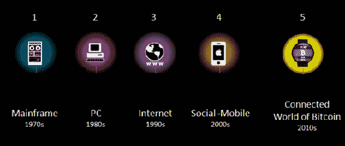

# 前言

> 我们应该把区块链想象成另一类像互联网一样的东西——一种全面的信息技术，具有分层的技术水平和多种类型的应用，适用于任何形式的资产登记、库存和交易，包括金融、经济和货币的每个领域；硬资产(有形财产、房屋、汽车)；以及无形资产(选票、想法、信誉、意向、健康数据、信息等。).但是区块链概念更多；这是一种新的组织范式，用于发现、评估和转移任何事物的所有量子(离散单元)，并有可能在比以前更大的规模上协调所有人类活动。

我们可能正处于一场新革命的开端。这场革命始于互联网上的一种新的边缘经济，一种被称为比特币的替代货币，它不是由中央权威机构发行和支持的，而是由联网用户自动达成共识的。然而，它真正的独特之处在于它不要求用户相互信任。通过算法自我监管，任何欺骗系统的恶意企图都将被拒绝。在一个精确的技术定义中，比特币是通过互联网在一个分散的无信任系统中交易的数字现金，该系统使用一个名为*区块链*的公共账本。是一种将 BitTorrent 点对点文件共享 ^([1](../Text/afterword01.html#bib1)) 与公钥密码技术相结合的新型货币形式。自 2009 年推出以来，比特币已经催生了一批模仿者——使用相同的通用方法，但进行了不同的优化和调整的替代货币。更重要的是，区块链技术可以成为网络从未有过的无缝嵌入式经济层，作为支付、分散式交换、代币收入和支出、数字资产调用和转移以及智能合同发布和执行的技术基础。比特币和区块链技术作为一种去中心化模式，可能成为下一个重大的颠覆性技术和全球计算范式(继大型机、PC、互联网和社交网络/手机之后)，有可能像网络一样普遍地重新配置所有人类活动。

# 金融市场之外的货币、合同和应用

区块链的潜在利益不仅仅是经济利益——它们延伸到政治、人道主义、社会和科学领域——区块链的技术能力已经被特定团体用来解决现实世界的问题。例如，为了对抗压制性的政治政权，区块链技术可以用于在分散的云中执行以前需要由受司法管辖的组织管理的功能。这显然对维基解密(在敏感的爱德华·斯诺登事件中，各国政府阻止信用卡处理者接受捐赠)等组织以及互联网标准组织 ICANN 和 DNS services 等跨国范围、政治观点中立的组织非常有用。除了公共利益必须超越政府权力结构的这些情况之外，其他行业部门和阶层可以从扭曲的监管和许可计划中解放出来，受制于等级权力结构和得到强有力支持的特殊利益集团对政府的影响，从而实现新的非中介化商业模式。尽管机构游说团体推动的监管实际上削弱了消费者基因组服务，但 Airbnb 和优步等较新的共享经济模式在来自现有企业的法律攻击中一直表现强劲。 ^([4](../Text/afterword01.html#bib4))

除了经济和政治利益之外，使用区块链技术的交易的协调、记录保存和不可撤销性是与大宪章或罗塞塔石碑一样对社会进步至关重要的特征。在这种情况下，区块链可以作为整个社会的公共记录库，包括所有文件、事件、身份和资产的登记处。在这个系统中，所有的财产都可以成为*智能财产*；这是用唯一的标识符对区块链的每一项资产进行编码的概念，以便可以在区块链上跟踪、控制和交换(购买或出售)资产。这意味着所有形式的有形资产(房屋、汽车)和数字资产都可以在区块链上注册和交易。

举个例子(我们将在本书中看到更多)，我们可以看到区块链在注册和保护知识产权(IP)方面改变世界的潜力。新兴的数字艺术产业为私人注册任何数字资产(任何文件、图像、健康记录、软件等)的确切内容提供服务。)到区块链。区块链可以取代或补充所有现有的知识产权管理系统。它的工作原理是对一个文件(任何文件)运行一个标准算法，将它压缩成一个短的 64 个字符的代码(称为*散列*)，该代码对该文件是唯一的。 ^([5](../Text/afterword01.html#bib5)) 无论文件有多大(例如，一个 9gb 的基因组文件)，它都被压缩成一个 64 字符的安全散列，不能反向计算。散列然后被包括在区块链交易中，该交易添加了时间戳——该数字资产在该时刻存在的证明。可以从底层文件(私人存储在所有者的计算机上，而不是在区块链上)重新计算散列，从而确认原始内容没有改变。合同法等标准化机制是社会的革命性进步，随着越来越多的经济活动由创意驱动，区块链知识产权(数字艺术)可能正是大规模社会更顺畅协调的拐点之一。

# 区块链 1.0、2.0 和 3.0

比特币和区块链技术的经济、政治、人道主义和法律体系优势开始表明，这可能是一项极具破坏性的技术，有能力重新配置社会及其运作的所有方面。为了组织和方便起见，区块链革命中不同种类的现有和潜在活动被分为三类:区块链 1.0、2.0 和 3.0。区块链 1.0 是*货币*，加密货币在与现金相关的应用中的部署，如货币转账、汇款、数字支付系统等。区块链 2.0 是*合同*，使用区块链的整个经济、市场和金融应用，比简单的现金交易更广泛:股票、债券、期货、贷款、抵押贷款、所有权、智能财产和智能合同。区块链 3.0 是货币、金融和市场之外的区块链应用，尤其是在政府、卫生、科学、文化、艺术等领域

# 比特币是什么？

比特币是数字现金。它是一个数字货币和在线支付系统，使用加密技术来管理货币单位的生成和验证资金转移，独立于中央银行运行。这个术语可能会令人困惑，因为单词*比特币*和*区块链*可能被用来指代这个概念的任何三个部分:底层区块链*技术*、完成交易的*协议*和*客户端*，以及实际的*加密货币*(货币)；或者更广泛地指加密货币的整个概念。这就好像贝宝把互联网称为“贝宝”，贝宝协议在互联网上运行，以转移贝宝货币。区块链行业有时会交替使用这些术语，因为它仍处于将自己塑造成可能成为技术堆栈中既定层的过程中。

比特币于 2009 年由一个不知名的人或实体使用中本聪的名字创建(发布于 2009 年 1 月 9 日 ^([6](../Text/afterword01.html#bib6)) )。概念和操作细节在简明易读的白皮书《比特币:点对点电子现金系统》中有所描述。 ^([7](../Text/afterword01.html#bib7)) 使用去中心化虚拟货币的支付被记录在公共账本中，该账本存储在许多——可能是所有——比特币用户的电脑上，并可在互联网上连续查看。比特币是第一种也是最大的去中心化加密货币。还有数百种其他“替代货币”(altcoin)加密货币，如莱特币和 Dogecoin，但比特币占所有加密货币市值的 90%，是事实上的标准。从公钥地址(27–32 个字母数字字符串；功能类似于电子邮件地址)用于发送和接收比特币并记录交易，而不是个人身份信息。

比特币是作为对计算处理工作的奖励而创造的，被称为*挖掘*，用户提供他们的计算能力来验证和记录支付到公共账本中。个人或公司从事挖矿，换取交易费和新创造的比特币。除了采矿，比特币和任何货币一样，可以通过兑换法定货币、产品和服务来获得。用户可以在个人电脑、移动设备或网络应用程序上使用*钱包软件*以电子方式发送和接收比特币，并收取可选的交易费。

# 区块链是什么？

区块链是所有已执行的比特币交易的公共账本。随着采矿者向其添加新的块(每 10 分钟一次)以记录最近的交易，该数据库不断增长。这些块按线性时间顺序添加到区块链中。每个完整节点(即，使用执行验证和中继交易任务的客户端连接到比特币网络的每台计算机)都有区块链的副本，当矿工加入比特币网络时，会自动下载该副本。区块链拥有关于从起源块(有史以来执行的第一个事务)到最近完成的块的地址和余额的完整信息。作为公共账本的区块链意味着可以很容易地查询任何块浏览器(如[*https://blockchain.info/*](https://blockchain.info/))与特定比特币地址相关的交易——例如，你可以查找自己的钱包地址，以查看你收到第一个比特币的交易。

区块链被视为比特币的主要技术创新，因为它是网络上所有交易的“不可信”证明机制。用户可以信任由“矿工-会计师”维护的存储在世界各地许多不同分散节点上的公共分类账系统，而不是必须与交易对手(另一个人)或第三方中介(如银行)建立和保持信任。区块链作为新的*去中心化无信任交易*系统的架构是关键的创新。区块链允许在全球范围内实现各方之间任何类型的所有交易的非中介化和去中心化。

区块链就像是运行在现有互联网协议堆栈上的另一个应用层，为互联网添加了一个全新的层，以实现经济交易，既包括即时的数字货币支付(使用通用的加密货币)，也包括更长期、更复杂的金融合同。任何货币、金融合同或硬资产或软资产都可以通过类似区块链的系统进行交易。此外，区块链不仅可用于交易，还可作为记录、跟踪、监控和交易所有资产的登记和库存系统。区块链实际上就像一个巨大的电子表格，用于登记所有资产，以及在全球范围内进行交易的会计系统，可以包括全球各方持有的所有形式的资产。因此，区块链可以用于任何形式的资产登记、库存和交易，包括金融、经济和货币的每个领域；硬资产(有形财产)；以及无形资产(选票、想法、信誉、意向、健康数据等。).

# 互联世界和区块链:第五种颠覆性计算范式

理解现代世界的一种模式是通过计算范式，每十年出现一个新的范式([图 P-1](#disruptive_computing_paradigms_mainframe) )。首先，有大型机和 PC(个人电脑)范式，然后互联网彻底改变了一切。移动和社交网络是最新的范例。当前这十年的新兴范例可能是依靠区块链密码术的*互联计算世界*。互联世界可以有效地将区块链技术作为经济覆盖层纳入日益成为无缝连接的多设备计算世界，包括可穿戴计算、物联网(IoT)传感器、智能手机、平板电脑、笔记本电脑、量化的自我跟踪设备(即 Fitbit)、智能家居、智能汽车和智能城市。然而，区块链促成的经济不仅仅是货币的流动；在人类和企业规模的经济中，金钱促成了信息的传递和资源的有效配置。

鉴于当前广泛的全球互联网和蜂窝连接的网络效应，区块链技术具有与互联网相当的革命潜力，其部署和采用速度可能会比互联网快得多。

正如范式 4 的社交移动功能已经成为技术属性的预期特征，移动应用无所不包，社交成为网站属性(喜欢、评论、交友、论坛参与)，范式 5 的区块链也可以带来价值交换功能的普遍预期。Paradigm 5 功能可以是一个持续连接、无缝、物理世界、多设备计算层的体验，具有区块链支付技术覆盖层——不仅仅是基本支付，还包括小额支付、分散式交换、代币收入和支出、数字资产调用和转移以及智能合同发行和执行——作为网络从未有过的经济层。世界已经为更普遍的互联网货币做好了准备:Apple Pay(苹果基于令牌的电子钱包移动应用)及其竞争对手可能是迈向成熟的加密货币世界的关键中间步骤，在这个世界中，区块链将成为网络的无缝经济层。

###### 图 P-1 颠覆性计算范式:大型机、PC、互联网、社交移动、区块链 ^([8](../Text/afterword01.html#bib8))

## M2M/物联网比特币支付网络实现机器经济

Blockchain 是人类世界,“个人互联网”的革命性范例，也可能是机器经济的授权货币。高德纳估计，到 2020 年，物联网将由 260 亿台设备和 1.9 万亿美元的经济组成。 ^([9](../Text/afterword01.html#bib9)) 需要相应的“货币互联网”密码货币来管理这些设备之间的交易、 ^([10](../Text/afterword01.html#bib10)) 以及连接设备之间的小额支付可能会发展成为一个新的经济层。 ^([11](../Text/afterword01.html#bib11)) 思科估计，M2M(机器对机器)连接的增长速度超过了任何其他类别(84%)，不仅全球 IP 流量预计从 2012 年到 2018 年将增长三倍，而且流量构成正在向有利于移动、WiFi 和 M2M 的方向转变。 ^([12](../Text/afterword01.html#bib12)) 正如货币经济允许在人力规模上更好、更快、更有效地配置资源一样，机器经济也可以提供一个稳健且分散的系统，在机器规模上处理这些相同的问题。

设备间小额支付的一些例子可以是连接的汽车在匆忙的情况下自动通过高速公路，以更宽松的时间表向道路同行提供小额补偿。协调个人空运无人机是设备对设备微支付网络的另一个潜在使用案例，在这种网络中，个人优先级可以得到平衡。农业传感器是另一种类型的系统的示例，其可以使用经济原理来过滤掉例行的不相关数据，但是当部署的群中足够大的传感器组已经满足环境阈值条件(例如，对于湿度)时，将优先级数据升级。

Blockchain 技术的无信任对等交易的分散模式在其最基本的层面上意味着无中介的交易。然而，对每一种互动和交易(人与人、人与机器、机器与机器)而言，在大规模全球基础上向分散的无信任交易的潜在转变，可能意味着一个社会的结构和运作方式发生巨大的变化，这种变化目前还无法预见，但在这种情况下，现有的权力关系和等级制度很容易失去效用。

# 主流采用:信任、可用性、易用性

因为比特币和区块链技术背后的许多想法和概念都是新的，在技术上也很复杂，所以有人抱怨加密货币可能太复杂了，不适合主流采用。然而，互联网也是如此，更普遍的是，在任何新技术时代的开始，大众观众都对“它是什么”和“它如何工作”的技术细节感兴趣。这不是真正的障碍；发送电子邮件不需要知道 TCP/IP 是如何工作的，只要开发出适当的、可用的、可信任的前端应用程序，新技术应用程序就可以进入公共使用，而无需进一步考虑技术细节。例如，并非所有用户都需要看到(更不用说手动输入)32 个字符的字母数字公共地址的血淋淋的细节。Circle Internet Financial 和 Xapo 等“主流钱包”公司正在开发专门针对比特币主流应用的前端应用程序(目标是在前端可用性和市场份额方面成为“比特币的 Gmail”)。由于比特币和电子钱包与金钱相关，服务需要建立的最终用户应用程序和消费者信任中存在明显的额外敏感性。有许多加密货币安全问题需要解决，以产生具有可用客户钱包的懂密码的公众，包括如何备份您的钱，如果您丢失了您的私钥该怎么办，以及如果您在交易中收到了被禁止的(即，先前被盗的)货币并且现在无法摆脱它该怎么办。然而，区块链行业正在解决这些问题，替代货币可以利用金融技术(fintech)持续发展的另一个节点，包括自动取款机、在线银行和现在的 Apple Pay。

使用可信可用的前端可以直接采用货币应用程序，但是成功地主流采用非货币区块链应用程序可能比较微妙。例如，虚拟公证服务对于简单、低成本、安全、永久、可查找的知识产权、合同、遗嘱和类似文件的注册来说似乎是显而易见的。毫无疑问，人们更喜欢在某些问题上与律师互动的社会原因仍然存在(也许是律师提供的基于人的建议、心理分析或验证功能)，出于这些原因，完全基于效率论点的技术采用可能会动摇。然而，总体而言，如果比特币和区块链行业要走向成熟，最有可能是分阶段的，类似于互联网的采用模式，即明确的价值主张引起不同潜在受众的共鸣，然后他们带着新技术上线。最初，互联网解决了一个子群体的合作研究问题:学术研究人员和军队。然后，游戏玩家和狂热的娱乐用户开始上网，最终，每个人。就比特币而言，到目前为止，早期采用者是关注金钱和意识形态的亚文化群体，随着区块链技术为其他大群体解决实际问题，下一步可能会被广泛采用，例如，区块链技术为一些主要群体解决了一个重大问题，包括那些在压制性政治政权中受到互联网审查影响的人，在那里，分散的区块链 DNS(域名系统)服务可以发挥很大作用。同样，在知识产权市场，区块链技术可以用来注册专利的发明链，并在资产保管、访问、和归属领域彻底改革知识产权诉讼。

## 比特币文化:比特币电影节

衡量新技术是否被主流采用的一个标准是它在流行文化中的接受程度。加密货币行业可能开始进入全球社会心理的早期迹象是[比特币电影节](http://bitfilm.com/festival.html)，该电影节以比特币相关内容的电影为特色。影片展示了比特币的普遍而独特的文化诠释和影响。该电影节始于 2013 年，将于 2014 年底/2015 年初在柏林(T4 比特电影的总部)、首尔、布宜诺斯艾利斯、阿姆斯特丹、里约和开普敦举行。巧合的是，Bitfilm 允许观众用比特币为自己喜欢的电影投票。Bitfilm 制作电影节，并在另一条业务线上为区块链产业制作宣传视频。

###### 图 p2。Bitfilm 宣传视频

# 本书的意图、方法和结构

区块链行业刚刚起步，目前(2014 年末)正处于一个充满活力和创新的阶段。概念、术语、标准、主要参与者、规范以及行业对某些项目的态度都在快速变化。甚至在一年后，我们回头看时，也可能会看到比特币和区块链技术在当前的实例中已经失效、被取代，或者成为过去的产物。例如，一个发生重大变化的领域是消费者电子钱包的适当安全概念——鉴于黑客袭击可能困扰加密货币行业，这不是一个无足轻重的问题。目前的电子钱包安全标准现在被广泛认为是 *multisig* (使用多个密钥签名来批准交易)，但大多数用户(仍是早期采用者，不是主流)还没有升级到这个安全级别。

这本书旨在探索比特币和区块链技术的更广泛的概念、特征和功能，以及它们未来的可能性和影响；它不支持、倡导或提供任何关于行业生存能力的建议或预测。此外，本文旨在介绍和讨论高级概念，因为还有许多其他“区块链 101”资源可用。区块链产业正处于新生和不成熟的阶段，仍在发展中，面临着许多风险。鉴于这种动态，尽管我们尽了最大努力，但该文本的具体细节可能有错误，而即使几天后信息也可能过时；这里的目的是描述区块链工业的总体范围和现状及其可能性。现在是学习底层技术的时候了；它们的潜在用途、危险和风险；也许更重要的是，概念和它们的可扩展性。本文旨在全面概述加密货币行业的性质、范围和活动类型，并展望其广泛的潜在应用。这种描述必然是不完整的，容易出现技术错误(尽管专家已经对其技术准确性进行了审查)，并且随着本文描述的不同项目的失败或成功，这种描述可能很快就会过时。或者，目前设想的整个比特币和区块链科技行业可能会过时，或者被其他模式取代。

这项工作的潜在来源是与比特币及其发展有关的各种信息资源。主要来源是开发者论坛、Reddit 子群、GitHub 白皮书、播客、新闻媒体、YouTube、博客和 Twitter。具体的在线资源包括 YouTube 和 Slideshare 上的比特币行业会议论文集，播客(我们来谈谈比特币，考虑一下这个！、震中比特币)、以太网(Ethereum)、比特币相关新闻网点( *CoinDesk* 、*比特币杂志*、*加密币新闻*、*币电*)、论坛(比特币 StackExchange、Quora)。其他来源包括与业内从业者的电子邮件交流和对话，以及我参加会议、比特币研讨会、Satoshi Square 交易会议和开发者聚会的经历。

这项工作旨在讨论比特币和区块链技术的概念化开始形成的三个不同层次:区块链 1.0、2.0 和 3.0。首先，我涵盖了比特币和区块链技术的基本定义和概念，以及作为核心区块链 1.0 应用的货币和支付。第二，我描述区块链 2.0——货币之外的市场和金融应用，比如合约。然后，我设想区块链 3.0，这意味着超越货币、金融和市场的区块链应用。在这一大类中有司法应用，如区块链治理、提升组织(如维基解密、ICANN 和 DNS 服务)远离压制性管辖制度到分散式云、知识产权保护以及数字身份验证和认证。第四，我考虑了货币、金融和市场之外的另一类区块链 3.0 应用，区块链模型在科学、基因组学、健康、学习、学术出版、发展、援助和文化领域提供了规模、效率、组织和协调优势。最后，我提出了滞期费(货币)等先进概念，并在区块链技术大规模部署的大背景下考虑它们。

# Safari 在线图书

[*Safari Books Online*](http://safaribooksonline.com)是一个按需数字图书馆，以图书和视频的形式提供世界领先的技术和商业作者的专业内容。

技术专业人员、软件开发人员、web 设计人员以及商业和创意专业人员使用 Safari 联机丛书作为他们进行研究、解决问题、学习和认证培训的主要资源。

Safari 在线图书为[企业](https://www.safaribooksonline.com/enterprise/)、[政府](https://www.safaribooksonline.com/government/)、[教育](https://www.safaribooksonline.com/academic-public-library/)和个人提供了一系列[计划和定价](https://www.safaribooksonline.com/pricing/)。

会员可以在一个完全可搜索的数据库中访问数以千计的书籍、培训视频和出版前的手稿，这些出版商包括 O'Reilly Media、Prentice Hall Professional、Addison-Wesley Professional、Microsoft Press、Sams、Que、Peachpit Press、Focal Press、Cisco Press、John Wiley & Sons、Syngress、Morgan Kaufmann、IBM Redbooks、Packt、Adobe Press、ft Press、Apress、Manning、New Riders、McGraw-Hill、Jones & Bartlett、Course Technology 以及数百家出版社。有关 Safari 在线图书的更多信息，请访问我们的在线。

# 如何联系我们

请向出版商提出有关本书的意见和问题:

*   奥赖利媒体公司。
*   格雷文斯坦高速公路北 1005 号
*   加利福尼亚州塞瓦斯托波尔，邮编:95472
*   800-998-9938(在美国或加拿大)
*   707-829-0515(国际或当地)
*   707-829-0104(传真)

我们有这本书的网页，在那里我们列出了勘误表、例子和任何附加信息。您可以在[*http://bit.ly/blockchain_1e*](http://bit.ly/blockchain_1e)访问此页面。

要对这本书发表评论或提出技术问题，请发送电子邮件至[bookquestions@oreilly.com](mailto:bookquestions@oreilly.com)。

更多关于我们的书籍、课程、会议和新闻的信息，请访问我们的网站:http://www.oreilly.com。

在 http://facebook.com/oreilly 找到我们:

 *在 Twitter 上关注我们:[*http://twitter.com/oreillymedia*](http://twitter.com/oreillymedia)

在 YouTube 上观看我们:[*http://www.youtube.com/oreillymedia*](http://www.youtube.com/oreillymedia)*  *# 感谢

我要感谢 Andreas M. Antonopoulos、Trent McConaghy、Steve Omohundro、Piotr Piasecki、Justin Sher、Chris Tse 和 Stephan Tual。*