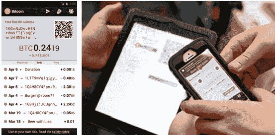

<title>Blockchain 1.0: Currency</title>  <link href="../../stylesheet.css" rel="stylesheet" type="text/css"> <link href="../../page_styles.css" rel="stylesheet" type="text/css">

# 第一章。区块链 1.0:货币

# 技术栈:区块链、协议、货币

比特币术语可能会令人困惑，因为*比特币*这个词被用来同时表示三种不同的东西。首先，比特币指的是底层的区块链技术平台。其次，比特币被用来指运行在底层区块链技术之上的协议，描述资产如何在区块链上转移。第三，比特币表示一种数字货币，比特币，第一种也是最大的加密货币。

[表 1-1](#layers_in_the_technology_stack_of_the_bi) 展示了区分不同用途的有用方法。第一层是底层技术，即区块链。区块链是一个分散的透明分类账，包含交易记录——该数据库由所有网络节点共享，由矿工更新，由所有人监控，不归任何人所有和控制。它就像一个巨大的交互式电子表格，每个人都可以访问和更新，并确认转移资金的数字交易是独特的。

协议栈的中间层是协议——通过区块链分类账转移资金的软件系统。然后，最顶层是货币本身，比特币，在交易或交易所交易时被表示为 *BTC* 或 *Btc* 。加密货币有几百种，其中比特币是第一种，也是最大的一种。其他还有 Litecoin、Dogecoin、Ripple、NXT、Peercoin 在[*http://coinmarketcap.com/*](http://coinmarketcap.com/)可以跟踪主要替代货币。

Table 1-1\. Layers in the technology stack of the Bitcoin blockchain

| 加密货币:比特币(BTC)、莱特币、Dogecoin |
| 比特币协议和客户端:进行交易的软件程序 |
| 比特币区块链:底层分散分类账 |

关键是这三层是任何现代加密货币的一般结构:区块链、协议和货币。每枚硬币通常既是一种货币，也是一种协议，它可能有自己的区块链，也可能在比特币区块链上运行。例如，莱特币货币运行在莱特币协议上，该协议运行在莱特币区块链上。(莱特币对比特币进行了细微的改编，在几个功能上进行了改进。)单独的区块链意味着硬币有自己的分散式账本(与比特币区块链账本的结构和格式相同)。其他协议，如 Counterparty，有自己的货币(XCP)并在比特币区块链上运行(即他们的交易在比特币区块链总账中注册)。这里维护了一个电子表格，描述了 Crypto 2.0 项目之间的一些差异:[【http://bit.ly/crypto_2_0_comp】](http://bit.ly/crypto_2_0_comp)*。*

 *# 双重花费和拜占庭将军的计算问题

即使不考虑比特币和区块链技术的许多可能用途，比特币在最基本的层面上也是计算机科学的一项核心突破，它是建立在全球数千名研究人员对加密货币 20 年的研究和 40 年的密码学研究基础上的。 ^([13](../Text/afterword01.html#bib13)) 比特币是数字现金长期存在的问题的解决方案:双重消费问题*。在区块链加密技术出现之前，数字现金和其他数字资产一样，是可以无限复制的(就像我们可以将电子邮件附件保存任意次一样)，而且如果没有中央中间人，就没有办法确认某一批数字现金是否已经被消费。交易中必须有一个可信任的第三方(无论是银行还是类似 PayPal 的准银行),它保留一个分类账，确认每一部分数字现金只被消费一次；这就是双重花费的问题。一个相关的计算挑战是拜占庭将军问题，这意味着战场上的多方(将军)不信任彼此，但需要有某种协调的通信机制。 ^([14](../Text/afterword01.html#bib14))*

 *区块链通过将 BitTorrent 点对点文件共享技术与公钥加密技术相结合来制造一种新形式的数字货币，从而解决了重复花费问题。硬币所有权记录在公共分类账中，并由加密协议和采矿团体确认。区块链是无信任的，因为用户不需要信任交易中的另一方或中央中介，但需要信任系统:区块链协议软件系统。链中的“块”是按顺序过账到分类账的交易组，即添加到“链”中的交易组区块链账本可以用*区块探索者*，互联网站(如 [*www。比特币区块链的 Blockchain.info*](http://www.Blockchain.info) )在这里，你可以通过输入区块链地址(一个用户的公钥地址，比如*1 dpzhxi 5 be jnn 6 sriukjh 6 we 4 hwpfbpvfx*)来查看交易流。*  *# 加密货币的工作原理

比特币是货币，数字现金，一种在互联网上买卖东西的方式。比特币价值链由几个不同的选区组成:软件开发商、矿商、交易所、商家处理服务、网络钱包公司和用户/消费者。从个人用户的角度来看，交易 coin(我在这里使用“coin”的一般含义)的重要元素是地址、私钥和钱包软件。地址是别人给你发比特币的地方，私钥是你给别人发比特币的密码秘密。钱包软件是你在自己的电脑上运行的管理你的比特币的软件(见[图 1-1](#bitcoin_ewallet_app_and_transferring_bit) )。没有一个集中的“帐户”你需要注册另一家公司；如果你有一个地址的私钥，你可以用这个私钥从任何一台联网的电脑(当然包括智能手机)上获取与这个地址相关的硬币。钱包软件还可以保留一份区块链——该货币中发生的所有交易的记录——作为验证硬币交易的分散计划的一部分。[附录 A](../Text/app01.html#appendixa) 更详细地介绍了维护备用硬币钱包的实用性。

###### 图 1-1。比特币电子钱包应用和转移比特币(图片来源:比特币电子钱包开发者和 InterAksyon)

## 电子钱包服务和个人密码安全

作为负责任的消费者，我们不习惯区块链技术和个人密码安全的许多新方面；例如，必须备份我们的资金。以私钥形式安全存储在您的电子钱包中的分散自治意味着没有客户服务号码来呼叫密码恢复或私钥备份。如果你的私钥没了，你的比特币也没了。这可能表明区块链技术还不够成熟，不足以被主流采用；这是 Circle Internet Financial 和 Xapo 等面向消费者的比特币初创公司试图解决的问题。电子钱包备份存在某种标准化应用或服务的机会(例如，针对丢失、被盗、被盗或升级的智能手机或基于笔记本电脑/平板电脑的钱包)，用户可以通过这些应用或服务确切确认备份服务中他们的私钥发生了什么，无论他们是自行管理还是依赖外部供应商。个人密码安全是消费者知识的一个重要新领域，因为确保个人金融资产和交易在这个新的数字现金在线场所得到保护的风险非常高。许多专家推荐的另一个个人加密安全元素是*硬币混合*，使用暗币、暗钱包和 BitMixer 等服务，将你的硬币与其他交易集中在一起，以便它们更加匿名。 ^([15](../Text/afterword01.html#bib15)) 随着替代货币市场的增长，对统一电子钱包的需求可能会上升，因为大多数与区块链相关的服务都需要安装一个新的单独的钱包，而且很容易有 20 个不同的电子钱包塞满你的智能手机。

尽管加密货币目前在实现上很笨拙，但它在个人加密安全方面提供了许多巨大的好处。一个很大的优势是，区块链是一种*推送技术*(用户发起并将相关信息推送到网络，仅用于该交易)，而不是一种*拉取技术*(就像信用卡或银行一样，用户的个人信息被存档，可以在任何时候被授权拉取)。信用卡技术的发展并不像区块链模型现在发展的那样在互联网上是安全的。拉技术要求拥有客户个人信息的数据存储库，这些数据存储库本质上是集中的蜜罐，越来越容易受到黑客身份盗窃攻击(Target、Chase 和 Dairy Queen 只是最近大规模身份盗窃供应商数据库袭击的几个例子)。截至 2014 年 10 月，在接受比特币的 30，000 家供应商中的任何一家使用比特币支付(例如，Overstock、新蛋和戴尔电脑；参见[*【https://bitpay.com/directory#/*](https://bitpay.com/directory#/))意味着不必将您的个人财务信息委托给集中的供应商数据库。这也可能需要更低的交易费用(比特币交易费用比商家信用卡处理费用低得多)。

## 商家接受比特币

在撰写本报告时，供应商接受比特币的主要比特币商户处理解决方案是美国的 [BitPay](http://www.bitpay.com) 和[比特币基地](https://www.coinbase.com/)以及欧洲的[Cointify](http://www.coinify.com)。 ^([16](../Text/afterword01.html#bib16)) 然而，像当地咖啡馆这样的供应商很难运行两个独立的支付系统(传统的和比特币的)，所以更便捷的未来解决方案是将比特币支付整合到现有的供应商支付网络中。通过手机进行快速的比特币销售点购买(例如，一杯咖啡)也需要移动支付功能。 [CoinBeyond](http://www.coinbeyond.com/) 等公司特别专注于移动比特币支付，比特币支付和 CoinBase 都有针对移动支付的[解决方案](https://bitpay.com/bitcoin-for-retail)。向前迈出的显著一步是，Intuit 面向小企业的 QuickBooks 会计软件使供应商能够通过其 [PayByCoin 模块](http://bit.ly/paybycoin) 接受来自 CoinBase 和 BitPay 的比特币付款。 ^([17](../Text/afterword01.html#bib17))

# 总结:Blockchain 1.0 在实际应用中

区块链已经是互联网的现金，一个数字支付系统，它可能会成为“货币互联网”，以物联网(IoT)连接机器的方式连接金融。货币和支付构成了第一个也是最明显的应用。仅从经济角度来看，替代货币是有意义的:将全球信用卡商户支付费用从 3%降至 1%以下，对经济有明显的好处，尤其是在 5140 亿美元的国际汇款市场，交易费用可达 7%至 30%。 ^([18](../Text/afterword01.html#bib18)) 此外，用户可以立即在电子钱包中收到资金，而不是等待几天才能转账。比特币及其模仿者可能会为货币、贸易和商业铺平道路，因为我们知道它将被完全重新定义。更广泛地说，比特币不仅仅是 Visa 的更好版本，它还可以让我们做一些我们甚至想都没想过的事情。货币和支付只是第一个应用。 ^([19](../Text/afterword01.html#bib19)) 区块链货币的核心功能是任何交易都可以在两个人之间通过互联网直接发起和完成。有了 altcoins，你可以以一种完全去中心化、分布式和全球化的方式在个人之间分配和交易资源。有了这种能力，加密货币可以成为一个可编程的开放网络，用于所有资源的分散交易，远远超出货币和支付。因此，用于货币和支付的区块链 1.0 已经被扩展到区块链 2.0，以利用比特币作为可编程货币的更强大功能。

## 与法定货币的关系

考虑到比特币作为范式和最广泛采用的案例，截至 2014 年 11 月 12 日，比特币的价格为 399.40 美元。价格波动很大(如图 1,242】图 1-2 所示)，从 2013 年初的 12 美元到 2013 年 11 月 29 日的每枚硬币 1242 美元的高点(当天交易价格高于黄金——每盎司 1240 美元)。那个峰值是几个因素的顶点:例如，塞浦路斯银行危机(2013 年 3 月)推动了大量需求。价格也被中国的大量交易推高，直到 2013 年 12 月 5 日，中国政府禁止机构(但不是个人)处理比特币，之后价格下跌。^([21](../Text/afterword01.html#bib21))2014 年，价格从 800 美元逐渐下降到 2014 年 12 月的现值约 350 美元。一个经常被报道但有争议的指标是，70%的比特币交易是由人民币构成的。很难评估这个数字中有多少是有意义的经济活动，因为中国的交易所不收取交易费用，因此人们可以自由地来回交易任何数量的人民币，从而创造了虚假的交易量。此外，大部分以人民币计价的交易肯定是投机行为(比特币的整体交易也是如此)，因为很少有现实世界的卖家接受比特币，也很少有消费者将比特币用于商品和服务的广泛消费。

###### 图 1-2。2009 年至 2014 年 11 月的比特币价格(来源:[*http://coinmarketcap.com/currencies/bitcoin/#charts*](http://coinmarketcap.com/currencies/bitcoin/#charts))

一些人认为波动性和价格变化是加密货币广泛采用的障碍，一些波动平滑业务已经推出来解决这一问题: [Bitreserve](https://bitreserve.org) ，以固定汇率锁定比特币存款；^([23](../Text/afterword01.html#bib23))[real coin](http://realcoin.com)的加密货币，与美元(USD)挂钩； ^([24](../Text/afterword01.html#bib24)) 和 Coinapult 的[锁定](https://coinapult.com/locks/info)，允许购买者将比特币与黄金、白银、美元、英镑或欧元的价格挂钩。 ^([25](../Text/afterword01.html#bib25)) 首批盯住美元的比特币加密货币之一是 Ripple 的[XRP/美元 BitStamp](https://www.ripplecharts.com/) ，还有 BitShares 的 [BitUSD](http://wiki.bitshares.org/index.php/BitShares/Market_Peg) 。其他人指出，比特币的波动性小于一些法定货币的波动性和通胀(使比特币成为更好的相对价值选择)，比特币的许多操作都是在其他货币中的即时转移，对这些货币来说，波动性在这些即期汇率(即即时)交易中并不重要。

比特币截至 2014 年 11 月的市值为 53 亿美元(见[*http://coinmarketcap.com/*](http://coinmarketcap.com/))，以当前价格(399.40 美元)乘以可用供应量(1349.2 万比特币)计算。这已经相当于一个小国的 GDP(比特币在 200 个经济体中排名第 150 位)。与政府可以印刷更多货币的法定货币不同，比特币的货币供应量以预定(且有上限)的速度增长。新货币(以块为单位)正以常规和已知的速度发行，目前发行约 1350 万单位，到 2040 年增长到 2100 万单位的上限。比特币的价格约为每美元 400 美元，直接用于日常购买是不可行的，实际使用的价格和交易通常以*毫比特币*的子单位计价(一个比特币的千分之一；1 mBTC = ~ 0.40 美元)和 *Satoshis* (一个比特币的百万分之一；1 Satoshi = ~$0.000004)。

## 监管状态

政府监管可能是区块链产业能否发展成为成熟的金融服务业的最重要因素之一。截至 2013 年 10 月，少数国家已经完全禁止比特币:孟加拉国、玻利维亚、厄瓜多尔、冰岛(可能与使用极光币有关)、吉尔吉斯斯坦和越南。如上所述，中国自 2013 年 12 月起禁止金融机构从事虚拟货币交易，尽管人民币交易量仍然存在。德国、法国、韩国和泰国都不看好比特币。 ^([27](../Text/afterword01.html#bib27)) 欧洲银行管理局、瑞士、波兰、加拿大和美国继续审议不同的比特币相关问题。 ^([28](../Text/afterword01.html#bib28)) 各国试图将比特币(以及数字货币的概念)与它们现有的监管结构相匹配，往往发现加密货币不太合适，并最终得出结论，加密货币差异很大，可能需要新的立法。目前，一些国家，如英国，已经将比特币归类为一种货币(因此无需缴纳增值税)，而其他国家，如澳大利亚，由于有关国有化发行的法律，无法将比特币归类为一种货币(因此比特币需要缴纳增值税或商品及服务税)。 ^([29](../Text/afterword01.html#bib29))

在美国，美国国税局(Internal Revenue Service)将比特币视为财产(像股票一样)，而不是货币，这意味着比特币的用户需要缴纳交易的资本利得税。 ^([30](../Text/afterword01.html#bib30)) 对于税收来说，虚拟货币是财产，不是货币。然而，几乎所有其他美国政府机构——包括 FinCEN(金融犯罪执法网络)、银行监管机构以及 CFPB、SEC、CFTC 和 DOJ——都将比特币作为一种货币进行监管。**