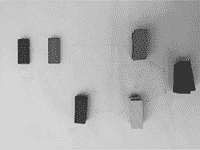
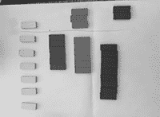
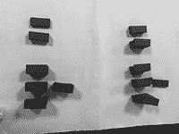

# [第六章
灯泡混凝土](content.xhtml#bck_Ch06)

布朗温·帕特里克森

## 介绍

术语无信任交易(Swan 2015Kiviat 2015)提到的概念是，区块链技术在通常不存在信任的地方实现了信任，因此即使是陌生人也可以放心地在线交易，而不需要昂贵而繁琐的第三方认证。但是，当旨在自动化陌生人之间“信任”的技术应用于同事之间的创造性合作时，会发生什么？通过实现由一组合作但独立的实体访问的分布式但链接的分类账之间的数据共享，区块链技术越来越多地被设计为协作商业模式的工具(德勤 2018)。

这项研究在游戏产业的背景下探索这种潜力。游戏开发涉及艺术家、动画师、设计师和程序员的跨学科团队。这种创造性的团队合作可以建立高度的信任。同时，由于计算机游戏开发是一种高度中介化的工艺，大部分工作都是由同时使其成为可能的数字软件程序来跟踪的。团队成员在电脑上工作，共享屏幕，还经常通过视听游戏频道相互交流。例如，关于花费的时间、使用的平台和使用的工具的数据可能会被共享，以便为游戏行业建立一个集体情报资源。特别是对于初创团队，这种丰富的知识库可以为最佳实践提供有价值的指导(Chen、Chiang 和 Storey 2012)。

游戏开发过程的中介也引入了映射和自动化复杂的小额支付的潜力。例如，多个不同贡献者的自动支付已经在 Musi-coin 平台上成功试用，这种自动化水平很可能会提高。在像 Github 这样的协作性开源编码库中看到的自动跟踪代码变更的能力在这方面有帮助吗？随着社会变得越来越系统化(Zimmerman 2015 年)以及随后越来越被跟踪(Van Dijck 2014 年)，自动化贡献记录是否可能与未来许可协议相关联的问题变得越来越重要。

尽管有这些诱人的可能性，但仍然不清楚由不可信技术授权的数字合作对相关人员意味着什么。例如，对与区块链技术和共享经济中的信任 ^([1](Ch06.xhtml#fn6_1)) 相关的文献的回顾表明，“信任的概念化在(两个)上下文之间有很大不同”(Hawlitschek，Notheisen 和 Teubner 2018: 50)。“信任机器”，或区块链系统“工业化的信任”(伯格，戴维森和 Potts 2017: 2)，通过管理自我利益向合作目标，创造积极的期望，因为他们的系统能力承受人类干预，而更多方面的信任概念在共享经济背景下更有可能与人类干预合作，因此往往是基于人际能力，仁慈和诚信的判断(葛粉和施特劳布 2004；陆、赵和王(2010)，与系统设计合作(Keymolen 2013)。在这种情况下，可信度通过一系列手段来表示，包括验证、评级和审查、保险和支持、网页设计和用户表现(Teubner 和 Hawlitschek，2018 年)。这些多层次的判断可以是基于认知或情感的(Yang，Lee，Lee，Chung 和 Koo 2016)，也涉及权力关系(Castelfranchi 和 Falcone 2010)。

这两个信任概念之间的差异反映了限制，以及自动信任的具体能力，或基础智能合同的'(a)算法权威'(卢斯蒂格和纳尔迪 2015 年)，来自于合同的感知清晰度和长期完整性，以及抵抗后续操纵的能力(Frö wis 和 hme 2017 年)。它还表明，当一个通常用来描述“基于积极预期接受脆弱性的意图”的术语(Rousseau、Sitkin、Burt 和 Camerer 1998: 395)在不同的上下文中互换使用时，可能会产生混淆。

考虑到这种差异，此次探索的主要案例研究涉及年轻的初创游戏开发团队，这些团队被选为英国游戏基金 Tranzfuser 计划的一部分，旨在帮助新的英国游戏制作毕业生从大学学习过渡到专业制作职业。5000 Tranzfuser 赠款用于赞助游戏演示的制作，新兴的开发团队可以将其推向市场。作为他们支持的一部分，英国游戏基金会一直在试验一种总部设在区块链的知识产权管理工具，名为全球 Tal 注册表。这个实验性的知识产权管理工具旨在帮助团队开发灵活的收入份额作为项目证明，直到他们准备好处理更正式和潜在昂贵的公司成立法律程序(Durrant 和 Hogarth 2016)。在创意开发的早期阶段，团队经常是流动的和可变的。Tal Registry 的设计是为了响应创造性的变化，同时提供足够的结构性支持，使开发团队有信心在他们信任的圈子之外工作。

本章接下来的部分解释了在开发过程中展开的各种创造性合作被询问的方式，以及出现的结果。本章最后一节讨论了这些结果对未来自动化许可和知识交流策略的意义，并结合 Tim-Berners Lee 的语义数据网络愿景，讨论了新兴 Web 3.0 技术所带来的潜在机遇

(其中计算机)变得能够分析网络上的所有数据——内容、链接以及人与计算机之间的交易。一个“语义网”，它使日常的贸易机制、官僚主义和我们的日常生活能够由机器与机器对话来处理。

(伯纳斯-李和菲谢蒂 2001: [第十二章](Ch12.xhtml))

在 Steve Whittaker 2002 年关于“中介沟通的理论和方法”的综述中，他认为，为了有效地映射任何中介技术的可提供性，首先需要对交互、上下文和表达性的定义进行丰富而细致的考虑。考虑到这一点，在开始实证研究之前，我现在将依次回顾这三个考虑因素。

## 互动

互动是一个松散的术语，既可以包含共识，也可以包含协作。游戏作家克里斯·克劳福德(Chris Crawford)将交互定义为“两个或更多活跃主体之间的循环过程，其中每个主体交替倾听、思考和说话(这些术语是隐喻性的)”(Crawford 2012: 159)。这种对话图像暗示了一种反馈循环或制定的对话，它强调了一种意义形成的共享过程，并包括隐喻对话，如舞蹈。

区块链技术还创造了一种对话:一种算法，集体相遇，产生一个证明的记录。Reijers 和 Coeckelbergh (2018)认为，这些组织技术以一种使交易越来越僵化的方式配置交易，就像情节一样。事实上，通过捕捉数字身份的易变性，并将其冻结在一个经过认证的时刻，区块链技术公司已经形成了一种前所未有的数字珍品。Reijers 和 Coeckelbergh (2018)还认为，当自动化代码调解集体身份时，它配置了一个叙事(例如，关于金钱或安全)，以交易的形式重新构建社会互动。减少无价之宝(艺术、友谊、爱情)对交易的潜在影响令人担忧。同时，量化或计数可以为那些工作传统上得不到回报的人提供价值认可，如家政工人和护理人员(Waring and Steinem 1988)。换句话说，以前不存在的正式承认具有潜在的转化性，但并不总是还原性的。也许量化本身并不是问题，而是它为网络自我的一个方面(例如流动性、分数主义)引入的排斥其他方面(形式)的潜力，以及作为这一过程的结果而受到挑战的价值判断。作为编码的程序性参与的规则，区块链技术还创造了新的程序性可能性，如与其他可变条件(如标记或认证供应链内特定行为的决定)协作的财务和社会价值重新配置。通过优先考虑更具协作性的部门方法，公共区块链技术可能因此需要实质性的商业模式转变。尽管这种中断带来了挑战，但通过数据共享技术打破数据孤岛和支持联盟行动的能力所带来的效率正在推动这些努力(伊尼斯、乌巴赫特和让桑，2017)。

## 语境

具有讽刺意味的是，区块链技术公司在自身利益和竞争的基础上创造了共识。例如，比特币仍然是所有加密货币中最安全的，因为在经济回报的承诺的驱动下，它需要一个昂贵且耗能的工作证明认证过程(O'Dwyer 和 Malone，2014)。矿工们竞相成为第一个解决复杂密码难题的人，以赢得分配的比特币现金奖励(交易费)。他们解决问题的努力就像一个事实上的时间戳，证明这些交易在这个时间段记录在这个块上。新的块被给予一个包括前一个块的散列的加密散列数 ID，这样，链中的每个块被授权并依次链接到前一个块。随着时间的推移，这些密码难题变得越来越难，需要更多的计算能力来解决。换句话说，区块链技术可以成功地协调利益共享，但它们本质上不是公共服务，因此需要相应地设计。

自动化是一个有价值的工具。它可以节省时间，并提供额外的计算增强，如 GPS 导航，以及工作证明。挑战在于如何在数字媒介的创作环境中最好地整合自动化和人文主义。游戏产业是商业化和高度中介化的，但也受到合作和创新目标的推动，因此它提供了一个有益的案例，研究正式、非正式、独立、相互依赖、机器和人可能共存的方式。

虽然区块链是巧妙的，因为它协调了自利的利润动机，但是，正如英国游戏基金的团队在他们的“Tal Stories”白皮书中指出的那样(Durrant 和 Hogarth，2016 年)，巧妙并不等同于精明。到目前为止，还没有任何级别的自动化可以在一开始取代基本的团队协议。团队仍然需要讨论和决定之前工作的责任，以及个人和集体愿景之间的一致性和/或差异，“因此，如果一个真正的‘智能合同’能够自动完成这一初始步骤，它将需要阅读思想”(Durrant 和 Hogarth 2016: 3)。

## 表达性

在这种背景下，表现性既是个人也是群体的关注点。正如数字环境调节“影响形式或内容”的参与水平(Nakevska、van der Sanden、Funk、Hu 和 Rauterberg 2017: 97)，手头的任务、合作完成该任务的团队以及用于开展合作的工具都将告知并影响该过程。

自动化的工作环境就像装配空间。例如，可以使用游戏开发软件工具套件(如 Unity，一种自称的“游戏引擎”)制作的游戏类型受到 Unity 软件设计的限制(UnrealForum 2018)。在这些限制下，游戏开发者仍然可以开发和个性化看似无穷无尽的二维和三维游戏。因此，系统的限制可以被体验为创造性的帮助，也可以被体验为挫折，这取决于制作者的目的和经验。

就表达性互动而言，在该情境中，那些中介的行为或选择越有意义，用户就越喜欢“代理”(Murray 2001: 394)。但是，在自动化协作中存在什么样的有意义的代理，“以其核心能力是算法协调这一事实为特征”(Roio 和 Jelincic 2017)，如数据共享和工作证明？对一些人来说，只有当个人对数据有某种控制时，代理才是可能。例如，量化的自我运动包括个人数据监测实践，如行为监测、位置跟踪、医疗自我诊断和个人基因组测序，作为一种自我知识的形式(Wolf 2010 天鹅 2013)。对其他人来说，代理等同于机会或挑战，来操纵系统，让数字为个人利益服务。例如，大数据对企业优势的吸引力可以归类为发现隐藏的法律或模式并做出相应响应的吸引力。在设计任何数据共享应用程序时，都需要考虑这两个方面。

### 这项研究

在这项研究中，全球 Tal 注册工具在 EGX Games Expo 期间进行了测试。EGX 被称为“英国最大的游戏活动”(EGX 2018)，是一个视频游戏交易会，在正式发布之前，消费者有机会玩 200 多种游戏，并吸引了 80，000 多名参与者(Batchelor 2017)。在 2018 年 EGX 活动期间，18 个有希望的 Tranzfuser 团队聚集在一起，向潜在的发行商和游戏爱好者展示了一款演示游戏，同时还争夺进一步的开发资金，每个团队都由四个或更多崭露头角的游戏制造商组成。

英国游戏基金会创造了术语 Tal，它参考了单词 talent 的双重含义，首先是指谁在做工作，同时也参考了古老的人才货币。就像公司的股份一样，Tals 是创造性知识产权中更简单的股份分配。Tal 系统分为提供投票权的股份(银 Tals)或仅收入股份(铜 Tals)，或两者兼而有之。还有一个没有收入权利的外部争议解决机制(gold Tal，英国游戏基金目前持有的一个机制)。

为了探索这种应用的更广泛的含义和逻辑，选择了一种基于访谈的定性方法。这允许对参与者的回答进行深入分析，并给予参与者更多自由来表达他们独特的观点。结合对 Tal 分配会议的观察和由选定的四个团队进行的实践社交网络分析，本研究提供了与自动化认证前景相关的中介协作参与体验的见解。

在 9 月 20 日至 23 日在伯明翰 NEC 体育场举行的为期四天的 2018 EGX 活动期间，对 36 名年轻游戏制造商(在 Tranzfuser 展台现场，可以与研究人员交谈并熟悉全球 Tal 注册系统的人)进行了一系列采访，了解他们的知识产权管理方法和数据共享实践。这些基于意见的样本随后由深入的社交网络分析研究进行补充，该研究由四个精选的 Tranzfuser 团队的四名成员进行。这四个团队是根据地点(其中两个位于本研究的发源地苏格兰)和背景选择的:其中两个团队在比赛前已经成立了一家有限公司。此外，其中至少有两支球队在比赛前经历了富有挑战性的阵容变化。

除了他们团队的其他成员之外，每个样本团队的四名成员被单独采访，并被要求使用由 Schiffer 和 Hauck (Schiffer 和 Hauck，2010 年)开发的称为网络映射的社交网络分析的实践方法，从贡献和交流流两个方面描述演示开发过程。网络图通常包括可视化和明确化那些可以帮助团队或个人实现目标的网络、人和事物。该过程还测量该影响的感知范围。在访谈期间，参与者首先确定有影响力的相关行为者，然后确定他们如何影响以及影响谁(例如，通过资金、佣金、反馈、灵感、社会接受度等)。)然后是他们影响力的值或强度(以代表性影响力塔的高度来表述)。在这项研究中，调整了网络映射技术，以展示团队成员对特定演示开发的贡献，而不是关注外部网络的影响。为了完成这一过程，对目标和冲突进行了战略性的比较和讨论，并绘制了沟通流程图。

为了这项研究的目的，网络图方法提供了一个理想的方法来帮助阐明团队工作的贡献。这项研究关注的新兴技术应用的一个关键方面是正式和非正式工作方法之间的潜在紧张关系。因此，这种方法被有意地选择来帮助以一种易于使用且有形的视觉和动觉形式来表达那些潜在的细微差别。

在这项任务中，每个团队成员都被要求在一张屠夫的纸上放置一叠像多米诺骨牌一样的彩色积木，这样每一叠积木就代表一个不同的团队成员。每位成员还被要求通过改变堆栈的高度来代表其团队成员的相对贡献水平。除了这两个方向，每位受访者都被邀请自由选择页面上每个区块的颜色和位置。当他们这样做的时候，每个参与者都被鼓励解释他们的选择。参与者还被要求通过在堆栈之间画线来完成表示，以显示不同团队成员之间的通信线路。

虽然本文中分享了这些团队工作发展图的照片，但出于隐私考虑，采访笔录是保密的，在没有获得相关个人的相关许可的情况下，研究员没有与团队的其他成员分享这些照片。这种主观记录不能作为事件的“镜子”，但是这些个人“选择性解释”(McCarthy 和 Wright 2004: 119)的比较，其中一些细节可以保留，这取决于参与者认为什么是相关的，或者他们如何在群体动态中构建他们个人角色的视角，也可以帮助建立团队体验的多维视角。

由于游戏行业以男性为主导的性质(Gray、Buyukozturk 和 Hill，2017 年)，参与者人口统计数据中的偏见难以避免，而且在 Tranzfuser 竞赛中，重点是最近的毕业生。参与者的年龄一般在 20 到 30 岁之间，大多数人都有本科教育的经历，尽管一些团队成员也作为承包商参与这些项目。接受采访的 16 名核心团队成员中只有一名女性，而在 Tranzfuser 展台现场接受采访的两名参与者也是女性。

除了深入的个人网络映射访谈之外，36 名一般特兰兹福瑟队列成员被问及一系列较短的三个问题:

1.  关于您使用全球 Tal 注册中心的体验，您能告诉我些什么？
2.  你知道这是一个区块链注册系统吗？区块链注册会改变你再次使用它的决定吗？
3.  对于使用这些安全的自动化技术与更广泛的游戏社区共享(匿名)关于工作流程、平台、工作过程和时间的信息，你有什么想法？

### 调查结果:塔尔再分配会议

团队 1 在开发阶段修改了他们的 Tal 分配，主要是因为项目领导减少了他的白银 Tal 份额，更愿意承认新兴团队身份的重要性。进行了调整以平衡这些分配(以前是 190，000 个领导/170，000 个团队成员，现在是 175，000 个领导/165，000 个团队成员)，同时确保创始人保留最终决定权。额外的铜币也奖励给了一位签约艺术家，他正在远程工作，忙于其他项目，但他的建议对团队视觉设计方法的发展产生了影响。

### 简短调查

1.  关于您使用全球 Tal 注册中心的体验，您能告诉我些什么？对于那些不熟悉商业实践的人来说，这种简化的权利管理系统是一种普遍的积极体验。可感知的好处包括流程的简单性，以及将其用作测试平台团队管理结构的能力。已经注册为有限公司的团队发现 Tal 注册管理机构的非正式系统对他们的目的不太有用。
2.  你知道这是一个区块链注册系统吗？区块链注册会改变你再次使用它的决定吗？
    只有两个对区块链科技足够熟悉的人试图回答这个问题。一个人说他们喜欢安全和匿名的想法。另一个人认为区块链被用于犯罪交易，他们不明白为什么它与创造性知识产权注册相关。
3.  对于使用这些安全的自动化技术与更广泛的游戏社区共享(匿名)关于工作流程、平台、工作过程和时间的信息，你有什么想法？
    也许是游戏行业开源传统的反映，36 名受访者中除了 3 人之外，都认为原则上这是个好主意。感知到的好处包括能够获得关于最佳实践的总体观点，以及在实际工作时间和紧迫时间需求方面让行业承担更多责任的潜力。保留意见侧重于竞争优势的风险或对失去个人控制的恐惧以及比较批评的风险，这强调了合作拥有数据的潜在重要性，但也可能反映出对这种方法不熟悉。

### 网络绘图练习

由于 Tranzfuser 游戏开发挑战的强度，在 EGX，团队信任水平在所有出席者中被评为很高。然而，至少有两个团队经历过工作管理问题，因此这种信任也取决于其他团队成员的投资表现。

团队 1:团队合作优先

这个团队的核心成员在大学相遇，但计划继续作为一家公司，从事自由职业来资助他们的努力。虽然一名成员提出了最初的想法，但游戏演示的概念基本上是由小组整体开发的。因此，该团队主张相对平等的知识产权分配，并享有普遍积极的关系。过程中改进的合作策略包括一些规则，比如任何人都可以参加特殊兴趣会议，并有权发表意见。

团队 2:价值构成

Team 2: value compositions

这个团队有成为苏格兰顶级 VR 游戏制作人的野心。成员们通过企业孵化项目相识，据创始人称，这些项目为他们的专业方法提供了信息。这个团队已经成立，而且已经有了一个复杂的股份结构，Tal 分配就不那么重要了。工作追踪记录有助于裁决过去的纠纷。然而，有人指出，任务时间仍然只是衡量贡献的一个尺度。

团队 3:贡献与影响

Team 3: contribution vs influence

这个团队跨两个业务部门工作，因此团队沟通的主要渠道是创意经理，而不是编码员，这导致了关于贡献和影响之间区别的讨论(见两个不同的蓝色传播)。团队目标集中在为他们的演示游戏获得一个发行商，并建立长期的扁平团队结构。

团队 4:开发日志的重要性

Team 4: the Importance of dev logs

该大学团队使用 basecamp 软件保持每日开发人员(dev)日志。根据开发日志结果，该团队根据基于时间和结果的贡献来决定收入份额。dev 日志也有助于在一个成员没有尽到他们的职责时裁定一个困难的团队纠纷。该队的野心集中在赢得特兰兹福瑟。

讨论

## 在这项研究中使用社会网络分析的原因之一是检查这些交流流是否影响 Tals 的分布。从这些结果来看，它们似乎具有重大影响。例如，远程工作的承包商通常不太融入团队结构，这反映在向承包商分配铜 Tals(货币奖励)而不是银 Tals(货币奖励结合投票权)的趋势中。此外，虽然项目领导往往比团队的其他人投入更多的时间，但所有四位受访的创始人都意识到了新兴团队身份的价值。观察到的 Tal 再分配会议表明了项目过程中的这种转变。扁平管理结构的激励价值和共同价值认可也被普遍认为是一个重要的考虑因素。这些文化价值很可能反映了合作游戏开发工作的紧密依赖性。

需要进一步研究，以确定新兴群体身份的哪些方面也可能反映在社交网络数据流中。例如，团队 3 的经验表明，开发贡献并不总是等同于创造性影响。这对于个人影响和新兴团队特征或身份的更短暂的影响都是如此。即使社交网络数据流可以记录团队交流活动中的变化，它们仍然不太可能捕捉到新兴群体身份的全部特征及其对创造性决策的影响。

因此，尽管自动化工作跟踪系统是跟踪贡献的非常方便和有用的方式，但它们并不能捕捉到一切。例如，纯粹根据时间来衡量贡献可能会忽略重要的社会因素，还会招致系统博弈。基于时间的测量可以鼓励长时间的工作，但也可能降低工作时间的效率。同样，正如一位受访者所指出的，一次简短的会面可能是团队成功的关键——但这种价值可能只有几个月后才会显现出来。

另一位与会者敏锐地提出，任何基于产出奖励与会者的尝试都需要考虑以下四个关键因素:

任务难度，因为有些角色比其他角色更难。

*   时间有限，因为有些人只能兼职或远程工作。
*   产出的质量，因为时间并不总是等于能力。
*   先验知识，因为在团队成员承担多个角色的情况下，他们通常既是这些组合任务的新手，也是大师。
*   虽然区分个人贡献的价值可能是一个有用的考虑，但它也冒着团队工作关系的风险，这种关系强调等级贡献度量。另一个要考虑的问题是，产出是否总是衡量时间效率的最佳指标。甚至花在白日梦上的时间也会变得很重要，只要它与工作计划和广泛的发展轨迹相联系。这表明了随着时间的推移以及跨多个团队对工作流进行更广泛的部门分析的价值，以便更好地了解这些生产力高峰和低谷对整个开发轨迹的性质和/或重要性。

在开放和支持性管理风格的辅助下，自动化工作跟踪系统在工作贡献管理方面最为有用。虽然他们不一定会激励努力工作(因为创意团队通常是由创意目标而不是生产力结果来激励的(Malik 和 Butt 2017))，而且如果被观察的人感到不安全，缺乏主人翁感或在该过程中缺乏尊重，他们确实可能会挫伤员工的积极性(D'Urso 2006)，但当问题确实出现时，他们提供了有用的证据，因为他们可以在远程团队中出现。受访的每个团队都更喜欢面对面团队合作的透明度和友谊(这也可以降低系统游戏的风险)，但也重视远程员工的可用性和技能。

任何通过自动化系统减轻管理负担的能力都受到普遍欢迎。使用手动开发日志的团队认为它们是无价的工作管理资源，是他们实践的重要方面，但是也很耗时并且容易忘记，所以它们需要不断的提醒和价值重申。然而，在这样做时，需要注意确保他们不会过度形式化创造性开发过程，并引入 Reijers 和 Coeckelbergh (2018)提到的那种硬性规定。

因此，通过在直接团队之外共享这些记录，可以获得很多好处，以便建立集体知识，使整个行业能够为自己定价和安排时间，并可能分担机器学习分析的成本，以支持更聪明而不是更努力地工作。理想情况下，这些记录要么是匿名的，要么在某种程度上是私人的，这样，在没有得到员工同意的情况下，员工个人不会被公开比较，也不会因为这些比较而受到惩罚(至少有一名年轻的开发人员表达了这种担忧)。同样重要的是，个人贡献者有权共享该数据的所有权，以便他们可以选择增选自己的工作记录，并在自动更新的个人资料提要中同时提供给潜在的招聘人员(一些开发人员感兴趣地讨论了另一种可能性)。

创意知识产权的区块链注册目前还不清楚。尽管知识共享许可已经在欧洲法院得到认可(CreativeCommons 2018)，但区块链注册的法律地位仍然相当抽象。例如，像 Ascribe 这样的区块链注册系统更有可能授予所有权感，而不是有保证的法律追索权(Christies 2018)。还值得铭记的是，公司注册条例很可能因为某种原因而变得复杂，例如为了确保公司遵守公平贸易原则。如果没有某种机制来促进合乎道德的商业做法，区块链的商业注册就有可能成为规避合规的一种策略。然而，对于初创企业来说，组建有限公司的过程可能看起来极其复杂，成本高得令人望而却步(一位与会者想知道这是否是为了获得高额罚款)，因此探索更简单、更精简的测试平台结构是有价值的。未来应对立法步伐与数字破坏快速变化的挑战的解决方案可能是将类似全球 tal 注册管理机构这样的机构与更灵活、反应更迅速的伦理审查委员会系统合作。一位与会者表示，这些半正式的替代方案可能对粉丝创建网络也特别有用，这种网络往往可以持续多年，随着时间的推移拥有众多贡献者。

雇佣(Reijers and Coeckelbergh 2018)或形式化的价值正是为了让约定的交互在没有后续人类干预的情况下进行，并且“代码就是法律”(Lessig 1999)。然而，正如计算科学理论家基兰·奥哈拉所说，假设代码因此可以与法律互换是一个“危险的谬误”(奥哈拉 2017: 100)。法律是民主制定的，可以受到质疑(例如，当欺诈、胁迫或受损能力被证明时)，也可以被破坏，而软件开发是一个更加不透明的过程(O'hara 2017)。尽管如此，编码智能合同的各方仍然有代理；他们可以协商初始条款，并可以选择参与或不参与。当问题确实出现时，如果有机制支持，这些协议也是可以谈判的。同样，虽然智能合同可能缺乏社会背景(O'hara 2017)，但这也可能是它们的优势。例如，智能合同可以相对容易地执行跨辖区的明确协议，并可能通过提供透明、共享的数据来支持交易(Eenmaa-Dimitrieva 和 Schmidt-Kessen，2017)。它们还能以前所未有的规模实现分布式治理，在某些情况下效率更高，并能降低利益冲突或欺诈的风险(De Filippi，2018)。

结论

## 这项研究探讨了自动化信托和区块链技术为简化游戏制作许可、知识交流和企业注册提供了什么。为了更好地理解这些问题，我们采访了英国游戏基金会 Tranzfuser 计划的参与者，询问他们的协作体验以及他们对英国游戏基金会全球 Tal 注册管理机构知识产权管理工具的使用情况。

这项关于年轻游戏开发团队协作经验的实证研究表明，潜在的未来 Web 3.0 创意企业工具，如区块链商业注册和数据共享框架，可以加速创意协作实践，即使不完全适合所有环境，也有潜在的增强作用。自动化工作记录是一种有价值的工具，有助于简化许可和创意开发流程，但它们最好与人类洞察力合作。这些改进的总体价值很可能取决于参与者的代理。

虽然新兴的语义网(Hendler 2009 年)已经能够提供对人类行为本质的解除武装的见解，但仍有许多没有捕捉到，例如只有通过人类主观与系统数据流的心理、情感甚至能量相互作用才能出现的无定形和潜在的转化见解。就创造性的生产过程而言，人工数据智能仍然需要与社会智能相结合。

需要进行进一步的研究，以探究公司秘密(由于竞争性业务关系的传统，这些秘密可能受到严密保护)和集体智慧的价值之间的紧张关系，但原则上，数据共享技术可用于汇集算法知识网络的前景为初创游戏公司提供了巨大的潜在价值。在未来，通过利用增强的集体洞察力，这类合作情报池可能会越来越多地扰乱他们更具竞争力、更隐秘的祖先。

确认

## 感谢咖啡盒子游戏，油炸游戏，暗房互动，开箱游戏和英国游戏基金。

## 注

注意

## 詹姆斯·巴彻勒。2017."创纪录的出席率为十周年 EGX，2018 年日期透露."gamesindustry.biz .访问了 3.9.18。[www . games industry . biz/articles/2017-09-25-record-出勤-十周年-egx-2018-dates-discovered](http://www.gamesindustry.biz)。

伯格、克里斯、辛克莱·戴维森和杰森·波茨。2017.“区块链工业信托”已访问 18.6.18。https://ssrn.com/abstract=3074070 或 http://dx.doi.org/10.2139/ssrn.3074070 的 SSRN[。](https://ssrn.com)

伯纳斯-李、蒂姆和马克·费雪蒂。2001.万维网发明者的最初设计和最终命运。美国宾夕法尼亚州科林代尔黛安出版公司。

卡斯特尔弗兰奇，克里斯蒂安诺和里诺·法尔科内。2010.一个社会认知和计算模型。第 18 卷。美国新泽西州霍博肯约翰·威利父子公司。

陈，新春，蒋海龙，和韦达 c .斯托里。2012."商业智能和分析:从大数据到大影响."MIS 季刊:1165–1188。

克里斯蒂斯。2018.“艺术+科技峰会:探索区块链——艺术界准备好达成共识了吗？”YouTube。已访问 15.8.18。www.youtube.com/watch?v=KT-gPtK5uHY&t = 25689s

克劳福德，克里斯。2012.克里斯·克劳福德谈互动讲故事。美国加州斯坦福:新骑手。

CreativeCommons。2018.“判例法。”2018 年 9 月 24 日访问。https://wiki.creativecommons.org/wiki/Case_Law[。](https://wiki.creativecommons.org)

菲利普，菲利普的春天。2018.区块链与法律:代码规则。麻省剑桥:哈佛大学出版社。

德勤。2018.“打破区块链开放:德勤 2018 年全球区块链调查。”德勤。已访问 28.8.18。[www2 . Deloitte . com/content/dam/Deloitte/cz/Documents/financial-services/cz-2018-德勤全球区块链调查. pdf](http://www2.deloitte.com) 。

达兰特、保罗和马克·霍加斯。2016." TalTM Stories:创意团队分享项目所有权和收益的新概念."已访问 4.4.18。www.talregistry.com/about.html.

斯科特·德乌尔索，2006 年。“谁在看我们工作？走向组织中电子监控和监视的结构感知模型。”沟通理论 16(3):281–303。

伊恩马-迪米特里耶娃、海伦和玛丽亚·何塞·施密特-凯森。2017."通过代码进行监管，作为在不信任环境中实现智能合约的保障."已访问 30 . 9 . 2018[http://CAD mus . eui . eu/bitstream/handle/1814/47545/LAW _ 2017 _ 13 . pdf？sequence=1 & isAllowed=y](http://cadmus.eui.eu)

EGX。2018.“EGX 家。”EGX。访问 3.9.18。[www.egx.net/egx](http://www.egx.net)。

弗罗伊斯、迈克尔和莱纳·勃姆。2017.“在我们信任的代码中？”在数据隐私管理，加密货币和区块链技术，357–372。柏林:施普林格。

葛粉、大卫和德特马·施特劳布。2004."消费者对 B2C 电子商务的信任和社交存在的重要性:电子产品和电子服务的实验."欧米伽 32(6):407–424。

Gray、Kishonna L、Bertan Buyukozturk 和 Zachary G. Hill。2017.“模糊界限:使用 Gamergate 检查当代游戏文化中对女性的‘真实’和象征性暴力。”社会学罗盘 11(3): e12458。

Hawlitschek，Florian，Benedikt Notheisen 和 Timm Teubner。2018.“无信任系统的限制:共享经济中区块链技术和信任的文献综述。”电子商务研究与应用 29:50–63。

亨德勒吉姆。2009.“Web 3.0 的出现。”计算机 42(1)。

埃丝特.凯莫伦。2013.“合作消费中的信任和技术。为什么这不仅仅是你和我的事。”技术和监管的桥梁距离:135-150。

特雷弗·基维亚特，2015 年。“超越比特币:规范区块链交易的问题。”杜克 LJ 65: 569。

劳伦斯·莱西格。1999.“法典就是法律。”行业标准 18。

劳伦斯·莱西格。2008.混合:让艺术和商业在混合经济中繁荣。伦敦:企鹅。

鲁、、和。2010.“从虚拟社区成员到 C2C 电子商务买家:对虚拟社区的信任及其对消费者购买意愿的影响”。“电子商务研究与应用 9(4):346–360。

卢斯蒂格凯特琳和邦妮·纳尔迪。2015."算法权威:比特币的案例."2015 年第 48 届夏威夷系统科学国际会议(HICSS)。

Malik，Muhammad Abdur Rahman 和 Arif N. Butt。2017."奖励和创造力:过去、现在和未来."应用心理学 66(2):290–325。

麦卡锡、约翰和彼得·赖特。2004.“技术即体验。”互动 11(5):42–43。

默里珍妮特。2001."代理处，全息甲板上的哈姆雷特"多媒体:从瓦格纳到虚拟现实，第 1 版。，第 380-397 页，第 394 页纽约:诺顿出版社。

纳克夫斯卡、玛丽雅、夏嫣·范德桑登、马蒂亚斯·芬克、胡君和马蒂亚斯·劳特伯格。2017."混合现实环境中的交互式讲故事:交互性对用户体验的影响."娱乐计算 21:97–104。

奥德怀尔，卡尔 j 和大卫马龙。2014.“比特币采矿及其能源足迹。”爱尔兰国立大学梅诺斯汉密尔顿学院，[http://karlodwyer . com/publications/pdf/bit coin _ KJOD _ 2014 . pdf](http://karlodwyer.com)

奥哈拉，凯龙。2017."智能合同-愚蠢的想法。"IEEE 互联网计算 21(2):97–101。

伊娜斯、斯维恩、朱莉恩·乌巴赫特和玛丽恩·让桑。2017.政府中的区块链:分布式账本技术对信息共享的益处和影响。政府信息季刊，第 34 卷，第 3 期，第 355-364 页。

赖杰斯、韦塞尔和马克·科克尔伯格。2018."作为叙事技术的区块链:调查加密货币的社会本体论和规范配置."哲学与技术 31(1):103–130。

罗伊、丹尼斯和伊万·杰林西奇。2017." DECODE:关于公共协作经济的多学科框架."访问 3.3.18。[https://files . dyne . org/decode/d 3.3 _ Data _ Privacy _ and _ Smart _ Language _ requirements . pdf](https://files.dyne.org)。

卢梭、丹尼斯 m、西姆 b .西特金、罗纳德 s .伯特和科林卡默勒。1998."没什么不同:信任的跨学科观点."管理学院评论 23(3):393–404。

希弗，伊娃和詹妮弗·豪克。2010."网络地图:通过参与式影响网络地图收集社会网络数据并促进网络学习."野外方法 22(3):231–249。

斯旺，梅勒妮。2013."量化的自我:大数据科学和生物学发现中的基本颠覆."大数据 1(2):85–99。

斯旺，梅勒妮。2015.区块链:新经济的蓝图。美国马萨诸塞州牛顿市:奥赖利媒体公司。

Teubner，Timm 和 Florian Hawlitschek。2018."点对点在线分享的经济学."《共享经济的兴起:探索合作消费的挑战和机遇》，第 129-156 页。美国加利福尼亚州圣巴巴拉。ABC-CLIO。

非现实论坛。2018.“你能给我一个虚幻 4 优于 Unity 的详细理由吗？”不真实。18.11.18 访问。[https://forums . unrealenengine . com/community/general-discussion/1434198-can-you-give-me-detailed-reasons-why-unreal-4-is-better-unity](https://forums.unrealengine.com)。

何塞·范·迪杰克。2014."数据化、数据主义和数据监督:科学范式和意识形态之间的大数据."监督与社会 12(2):197–208。

韦林、玛丽莲和格洛丽亚·斯泰纳姆。1988.如果女性算在内:新女性主义经济学。旧金山:哈珀街。

沃夫，加里。2010.“数据驱动的生活。”《纽约时报》，2010 年 4 月 28 日。

杨，宋秉，李京民，李汉南，钟南昊和古楚默。2016.“共享经济中的信任突破:对 Airbnb1 的实证研究”帕西斯。https://aisel.aisnet.org/pacis2016/131/

埃里克·齐默尔曼。2015."路德世纪的宣言"游戏世界:方法，问题，应用:19–22。

Zimmerman, Eric. 2015\. “Manifesto for a Ludic Century.” The Gameful World: Approaches, Issues, Applications: 19–22\.