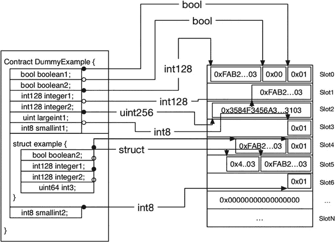
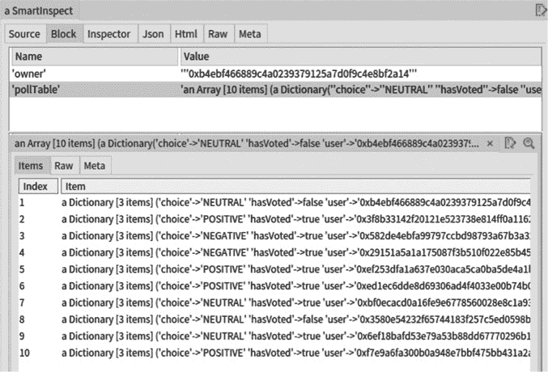
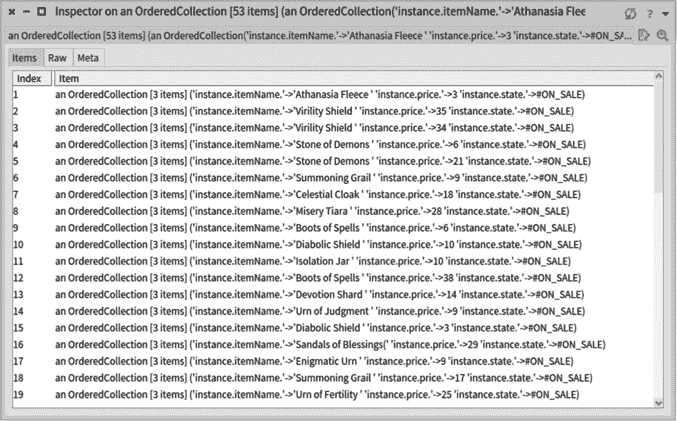

# [第十三章
智能铁砧](content.xhtml#bck_Ch13)

[用于智能合约分析的开源工具套件](content.xhtml#bck_Ch13)

斯特凡·迪卡斯、恩里克·罗查、圣地亚哥·布拉加诺洛、马库斯·登克和克莱门特·弗朗科姆

## 相关性:支持工具构建的需要

Solidity 的智能合约是具有特殊属性的新计算单元[Eth18c]:它们充当具有方面关注的类；它们作为远程对象响应消息调用；它们的记忆结构比单纯的物体更复杂；它们是模糊的，因为一旦它们被部署，就很难访问它们的内部状态；并且它们驻留在仅附加链中。

智能合约可以从[DMO+18]中受益的分析范围很广。有些已经在文献中提出，有些还没有。以下是一个不完整的列表:攻击分析[LCO+16，ABC17]，通用指标[TDMO18]和专用智能合约指标分析，天然气消耗优化[CLLZ17]，天然气成本预测，仪表板[Few06]或合约可视化[ABC+13]，仅举几例。

有必要支持开发新一代工具来帮助开发者[DMO+18]。考虑到智能合约的特殊性，这种支持应解决几个重要方面的问题:(1)合约的一般结构和语义，(2)已发布合约的对象性质，以及(3)由块和交易组成的整个链。有几种分析工具，如 Oyente [LCO+16]、BlockSci [KGC+17]和其他工具[BLPB17、BDLF+16、Eth18b]，但据我们所知，它们专注于智能合约的一个方面，要么是静态分析，要么是收集纯粹的数据。

在这一章中，我们将介绍 SmartAnvil，这是一个围绕智能合约的各个方面构建软件分析工具的开放平台。我们说明了通用组件，并重点关注三个重要方面:对 Solidity 智能合约的静态分析的支持，部署的智能合约二进制分析，以及区块链导航和查询。SmartAnvil 是开源的，支持到 Moose 数据和软件分析平台的桥梁。

本文的贡献是对组成 SmartAnvil 开源平台的几个组件的描述。文章的大纲如下:首先，我们描述了平台的总体架构和组件。下一节描述静态分析的底层组件，然后描述交互和分析已部署合约的底层组件。接下来，我们描述区块链导航和查询支持。倒数第二节讨论了该平台的未来扩展，并介绍了区块链分析平台的相关工作。最后，我们做出最后的评论和结论。

## SmartAnvil:开放平台架构

SmartAnvil 开放平台围绕几个组件构建，涵盖智能合约分析的不同方面。[图 13.1](Ch13.xhtml#fig13_1) 显示了我们在下文中描述的关键要素。虽然 SmartAnvil 可以独立工作，但它可以与 Moose 数据和软件分析平台[NA05]交互。

### 坚固结构部件

*   解析器/AST (SmaccSol)。静态分析的第一个基本但重要的组件是解析器/AST。组件 SmaccSol 为可靠性提供了完整的解析器和 AST 模型。它基于 Smacc 编译器-编译器框架[LBGD18，BGLD17]。这个解析器纠正了 Solidity 语言[RDDL17]的早期语法错误。
*   图表(SmartGraph)。在 SmaccSol 的基础上，SmartGraph 组件构建了一个语义树，在该树中，它实施了无法在语法级别定义的规则。它还定义了作用域，允许人们轻松地查找具体化的组件，如方法、类型、参数、自变量、合约等。通过在树上使用简单的查询，它支持强大的分析和类似图形的导航。该组件允许用户轻松地进行静态注释或构建调用图。
*   软件度量(SmartMetrics)。该组件混合了由先前组件提供的信息和由支持已部署合约分析的 Fog 组件提供的信息，以提供表征可靠性代码和已部署合约的一大组度量。

图 13.1 智能砧部件

### 部署的合约组件

另一组组件提供了对已部署的合约进行反向工程的库。

*   驱动因素和获取合约(FogComm)。该组件支持对 GETH- RPC API 的访问，实现了用于访问已部署的合约、事务、块等的原语和相关类型封送处理[BRDD18b]。
*   区块链元素具体化(FogLive)。该组件通过为块、交易和外部/内部帐户添加第一公民表示来扩展 FogComm。它还提供了合约镜像和合约代理——通过逆向工程和 SmaccSol 的 AST 分析技术构建——允许与已部署的合约建立强大的连接。它还提供了会话的概念，允许与区块链进行缓存和未缓存的交互。
*   智能检查。该组件利用 FogLive 中合约和镜像的实现来收集信息。它以不同的格式公开一个合约的数据，让程序员可以访问关于给定的已部署合约的变量值的细粒度信息。它允许开发人员检查已部署合约的所有方面[BRDD18b]。
*   字节码逆向工程(福格 EVM 字节码)。该组件提取并解释已部署合约中存储的十六进制代码，构建指令的表示形式和相对内存布局。它还允许人们对指令进行流式处理，并将内容分成更小的部分，如查找、方法、分支点等。它补充了 SmartGraph 和 SmaccSol AST。这种低级别信息对于细粒度的低级别分析很有意义，例如，气体消耗分析。

### 交易导航

*   查询和导航(尤克里里)。该组件提供了一种查询语言来导航和访问事务以及部署的合约。为此，它基于 map reduce 技术实现了不同的索引策略，并利用了 FogLive 中开发的镜像。它有一个小的 IDE 来操作已识别的实体[BRDD18a]。

## 智能合约静态分析的基础

Solidity [Eth18c]是一种编程语言，用于指定区块链平台上的智能合约，特别是以太坊[Eth14]。Solidity 最初被设计成以太坊的主要智能合约语言。即使已经为以太坊创造了其他合约语言(例如，蛇，LLL)，坚固性仍然是主要语言之一。此外，Solidity 还可以用于其他区块链平台，如 Tendermint、Hyperledger Burrow 和 Counterparty。可能是因为它的流行，大量的智能合约研究涉及可靠性。因此，任何提议的处理智能合约的工具都应该支持可靠性，这样才会受到欢迎。

通常，静态分析被用来检查编程语言工件。由于 Solidity 是一种编程语言，智能合约是它的工件，我们使用静态分析技术来实现合约理解和分析的工具[CCI90]。在他们的基础上，大多数静态分析基础技术依赖于 ASTs(抽象语法树)。例如，在 AST 上创建代码检查工具要比依赖合约的纯文本内容容易得多。因此，为了构建可靠性合约的静态分析，我们需要一种创建 ast 的方法。因此，我们需要一个解析器来读取 Solidity 源代码并输出相关的 AST 表示。

此外，我们需要一个独立于 Solidity 编译器的基础设施，原因如下:

1.  由于解析器和 AST 代表了一个强大的分析工具的基础部分，我们需要完全控制解析器及其产生，以避免在使用产生的 AST 进行分析时出现不必要的副作用。
2.  由于生成的 ASTM 的形状会严重影响建立在其上的分析的复杂性，我们需要控制我们的 ASTM。

使用 Solidity 编译器生成的 JSON AST 不符合上述要求。此外，我们希望与 Moose(一个数据和软件分析平台)集成，因为它提供了一套丰富和通用的工具[NA05]和一个大型生态系统[Ber16，LKG07]。因此，开发一个 Solidity 解析器提高了对 Solidity [RDDL17]中更好的代码分析的支持。为了实现这一点，我们使用 SmaCC(small talk Compiler-Compiler)[blgd 17]，依赖于 Solidity 语言的改编语法规范。

### 挑战

为可靠性设计解析器的主要挑战是文档之间的不一致性。例如，在文档的一部分中，说明了字符串文字用单引号或双引号括起来(部分“深度的可靠性”-“类型”-“字符串文字”)。然而，在另一部分(部分“杂项”-“语言语法”)中，只支持双引号来定义字符串文字。另一方面，官方解析器可以识别单引号和双引号字符串文字。这只是我们发现的几个不一致的例子之一[RDDL17]。我们决定遵循官方解析器，也就是说，如果某些东西在官方解析器中是可解析的，那么我们的解析器也应该理解它。尽管如此，文档中的不一致性使得解析器的创建更加困难，因为我们缺少一个可靠的规范来遵循。

创建解析器的另一个挑战是 Solidity 语言的变化频率。语言规范不稳定，增加或更改了语法规则以支持新版本的 Solidity。例如，在版本 0.4.21(以及更低版本)中，没有处理构造函数的语法规则；它们只是一个与合约同名的函数定义。但这在 0.4.22 版(及更高版本)中发生了变化，其中构造函数具有不同于函数的独特语法(通过使用构造函数关键字)。因此，任何用于 Solidity 的解析器都需要适应语法的变化，因为语言仍在发展中。

在为 Pharo 设计和开发 Solidity 解析器时，我们考虑到了这些挑战。

### 方法:SmaCC-Solidity

创建一个解析器可能是一项困难且耗时的工作。解析器生成器提供了一种更简单的方法来解决这个问题[IM15]。基本上，我们使用正式语法编写语法规范，生成器自动构建解析器。例如，现在有许多可用的解析器生成工具，如 YACC [Mer93]、ANTLR [Mil05]和 SmaCC [BLGD17]。

通常，我们可以将解析器分为自顶向下和自底向上两种。自顶向下的解析器从语法的根元素开始产生结果，一路向下直到底部的叶子。自底向上的解析器则相反，从树叶开始，一直到根。此外，这两种类型的解析器通常都处理语法的子类。最常见的子类是自顶向下的 LL(k)和自底向上的 LR(k)[alsu 06]。

当我们考虑 Pharo Smalltalk 环境时，有两个突出的解析器生成工具:PetitParser [BCDL13]和 SmaCC [BLGD17]。因此，我们有两个选项来创建我们的解析器。我们也可以自己编写解析器，而不依赖于生成器。我们选择使用 SmaCC 来开发我们的解析器，原因如下:(1) SmaCC 需要一个文本上下文无关的语法作为输入，它类似于为可靠性提供的语法；(2) SmaCC 生成的语法分析器能更容易地适应未来的可靠性语法的变化；(3) SmaCC 产生了一个 LR 解析器，与其他类型的解析器相比，它有一些有趣的优点[ALSU06]。此外，PetitParser 和手工编写的解析器都比 SmaCC 更难适应和维护。因此，我们认为 SmaCC 是创建解析器的更好选择。

SmaCC-Solidity 解析器在 GitHub([github.com/smartanvil/SmaCC-Solidity](http://github.com))中公开提供。

### 说明性示例

通常，当有人需要对源代码进行静态分析时，他/她会使用解析器。让我们假设一个开发人员想要创建一个令牌合约。粗略地说，代币是加密货币的一种定制形式，由合约管理。代币可以代表忠诚度积分、债券、游戏项目等。在这种情况下，开发人员希望在编写自己的代码之前先了解一个常用的 to-ken。在本例中，开发人员获得了 GolemNetworkToken(地址:0xa 74476443119 a 942 de 498590 Fe 1 f 2454d 7d 4 AC 0d)合约代码，并决定构建它的可视化表示。通过使用我们的解析器和 Roassal 包[Ber16]中的一些类，只需要几行代码(清单 13.1)就可以构建一个简单的可视化。

#### 清单 13.1 使用 SmaCC-Solidity 的可视化

`1 ast:= SolidityParser parse: sourcecode.
 2 b:= RTMondrian new.
 3 b nodes: (ast sourceunits) forEach: [:contract |
 4   (contract className = ’SolContractDefinitionNode’)
 5    ifTrue: [b shape box color: Color black.
 6      b nodes: (contract statements select:
 7       [:stt | stt className = ’SolStateVariableDefinition’]).
 8      b shape box color: Color gray; size: [:f | f source lines size * 3].
 9      b nodes: (contract statements select:
10       [:stt | stt className = ’SolFunctionDefinitionNode’]).
11      b layout flow]].
12 b.` 

在清单 13.1 中，首先我们通过解析源代码获得 AST(第 1 行)。然后，我们创建一个新的 Roassal 可视化[ABC+13]，其中每个合约都是一个大的灰色框(第 2-4 行)。在每个合约框中，我们获得状态变量定义(即，合约属性)并创建代表它的黑盒(第 5–7 行)。而且，对于每个函数，我们还在合约内部创建了一个灰框，函数的大小与其代码行数有关(第 8–10 行)。最后，我们为可视化定义一个标准布局(第 11 行)并“返回”可视化对象用于显示(第 12 行)。最终的可视化结果在一个大盒子上显示每个合约，里面的小盒子代表属性(黑色)和功能([图 13.2](Ch13.xhtml#fig13_2) )。

### 估价

为了比较，我们验证了我们的解析器是否能够识别与官方解析器相同的可靠性合约。假设官方解析器是正确的实现是合理的。所以官方解析的任何合约，也应该是我们实现支持的。我们使用 Etherscan 来访问 Solidity 合约，这些合约及其源代码是公开的。所有这样的合约都被官方解析器正确识别。因此，我们的评估是验证我们的实现是否也能解析它们。

图 13.2 使用 SmaCC-Solidity 的合约功能

在实验时(2017 年 8 月)，Etherscan 的数据库中有大约 2700 份经过验证的合约(2018 年 8 月，合约数量超过 40000 份)。从这 2，700 份合约中，我们只选择了 Solidity 0.4 . x 版的唯一合约，总共有 1，175 份合约。我们的实现成功解析了所有 1，175 个合约。因此，我们可以说我们的解析器识别了与官方相同的语言工件。

### 相关著作

我们从两个主题中选择了相关的工作:解析冲突和解析器生成器。

Isradisaikul 和 Myers [IM15]描述了用 LALR 解析器生成器解决语法冲突的困难。他们提出了一种算法，可以为 LALR 解析器生成更好的反例。一个反例展示了在 LR 方法中导致歧义冲突的解析场景。这种场景有助于开发人员诊断冲突的来源，并识别语法规范中的问题。作者用 Java 实现了他们的算法，作为对 CUP 解析器生成器的扩展，他们还用 20 种语法和最先进的歧义检测器评估了他们的方法。他们的算法通常比比较技术在更短的时间内找到更多的反例。

Passos 等人[PBB07]提出了一种解决 LALR 解析方法中冲突的方法。作者描述了在不改变已定义语言的情况下处理冲突的挑战。他们使用 YACC 为 Notus 语言生成一个解析器，以说明解决 LALR(1)冲突的困难。作者基于他们的方法创建了一个名为 SAIDE 的工具，这是对 LALR 解析器中处理冲突的常规方法的改进。

我们将简要分析一些著名的解析器生成工具。SmaCC [BLGD17]是我们为这项研究选择的解析器生成工具。SmaCC 可以生成 LR(1)或 LALR(1)自底向上的解析器。YACC [Mer93]也是一个自底向上的 LALR(1)解析器生成器。最初的 YACC 是用 C 为 Unix 系统开发的，但是现在我们已经用其他几种语言实现了它。ANTLR [Mil05]与之前的工具不同，因为它是一个自顶向下的解析器生成器。ANTLR 创建了预测性 LL(k)解析器，与 LR(1)和 LL(1)解析器相比，它对语法不规则性不太敏感。对于 Java、C++、C#、JavaScript、Python 等语言，都有 ANTLR 的实现。遗憾的是，据我们所知，还没有针对 Pharo 的 ANTLR 实现。最后，PetitParser [BCDL13]是一个依赖于解析表达式语法的无扫描解析器生成器。PetitParser 与 Moose 集成在一起，方便了它在 Pharo 上的使用。PetitParser 的主要问题是它不读取语法规范，我们必须使用 PetitParser 语言编写语法表达式。

## 已部署智能合约分析:检查

不透明是分析合约数据的主要问题[BRDD18b]。智能合约是不透明的，因为一旦它们被部署在块链中，就很难在运行时验证它们的内部状态(即，储存在合约中由其内部属性定义的状态)。相比之下，现在任何编程语言都提供了更简单的方法来检查对象数据。开发人员在开发或维护活动中使用这种检查来访问运行时数据。类似地，开发人员可以从智能合约运行时检查中受益，以验证当前存储的数据。此外，从商业角度来看，公司可以使用合约检查来帮助客户验证和理解实际存储在合约中的信息。

检查合约数据的困难并不是一个广为人知的问题[BRDD18b]。目前，我们几乎没有检查合约信息的工具。或者，开发人员求助于其他方法来获取合约的内部状态，比如创建 getter 函数来访问数据。因此，能够开发用于检查内部属性的工具是非常重要的。此外，普遍关注的是，开发人员应该能够看到存储在自己的合约中的值。

因此，在这种情况下，对于使用智能合约的开发人员来说，检查合约属性不仅重要，而且是必要的。

### 挑战

穿透不透明性问题并揭示合约信息面临许多挑战。

*   二进制和不完整的规范。从技术方面来说，我们只有以太坊 API 来访问合约的二进制表示。我们面临的第一个挑战是由 Solidity 编译器执行的合约编码的不完整规范。
*   哈希计算的规范不一致。与规范相关的另一个挑战是动态类型的哈希计算。静态类型使用文本作为哈希计算的输入。然而，动态类型遵循不同的标准，这在文档中没有明确说明。对于动态类型，有必要使用专门为每种类型打包的二进制数据。例如，要访问一个数组，必须将索引号和数组位置(偏移量)打包成二进制表示，以获得正确的散列。其他动态类型需要不同的输入来获得它的散列。
*   打包有序的数据。我们还强调了解码类型的挑战，因为编译器将尽可能多的数据打包到连续的内存中。因此，我们需要以正确的顺序了解具体的类型，以获取合约数据，当我们有一个不完整的规范时，这不是一件容易的事情。

我们承认在以太坊区块链数据库中分析我们自己的合约存在挑战和困难。为了解决这个问题，我们提出了一个检查器，允许用户感知实例数据属性的清晰表示。这种检查器是使用平台的几个组件构建的:FogComm、FogLive。

### 方法:智能检查

SmartInspect [BRDD18a]是一个基于可插拔镜像反射系统的内部状态检查器，用于检查可靠性合约。该工具的目标是允许根据源代码检查已知的合约实例。使用从源代码构建的内存布局具体化来反编译已部署合约的二进制结构。因此，只有有权访问源代码及其部署的二进制表示的人才能检查其内部属性。此外，SmartInspect 方法可以自省智能合约实例的当前状态，而无需重新部署它或开发额外的解码代码。SmartInspect 在 Pharo 中实现，并作为 SmartAnvil 工具套件的一部分在 GitHub 中公开提供([github.com/RMODINRIA-Blockchain/SmartShackle](http://github.com))。

智能检查器的总体思想是反编译以太坊 API 编码的存储布局。通过使用合约源代码作为参考，可以知道属性值在编码的二进制结构中存储在哪里([图 13.3](Ch13.xhtml#fig13_3) )。对内存布局进行反编译是一个挑战，因为 Solidity 文档[Eth18c]关于某些类型如何编码是不完整的。因此，我们必须对编译器自己执行的一些编码进行逆向工程。

图 13.3 内存布局示意图

在我们解码了内存布局之后，我们仍然需要将我们的解决方案应用到任何一个通用的可重用解决方案的合约中。我们采用基于镜像的架构[BU04],它模拟任何合约的结构，以便我们访问我们可以解码的内存布局。镜像就像一个独立的元编程层，它将对反射功能的关注分割到一个镜像对象中。首先，我们需要合约源代码作为输入来开始构建镜像。然后我们解析源代码(使用前面描述的 Solidity 解析器)来创建 AST(抽象语法树)。通过解释 AST，我们能够以正确的顺序发现合约中声明的每个类型。我们需要这些信息来解码内存布局和访问合约数据。针对一个通用的解决方案，我们建模了可配置的镜像对象，这些镜像对象允许我们与相同配置的已部署合约实例(通常指在区块链部署的相同合约)进行交互。

图 13.4 SmartInspect 构建流程

[图 13.4](Ch13.xhtml#fig13_4) 显示了检查一个合约的整个过程的示意图；可插拔反射架构通过使用 AST 为给定合约的源代码生成镜像。然后，我们使用这个镜像从部署在区块链中的远程合约实例中提取信息(编码为二进制内存布局)。我们收集的合约数据以四种不同的格式公开:(1)数据代理对象(REST)，(2) Pharo 小部件用户界面，(3) JSON，以及(4) HTML。

这种方法允许我们以结构化的方式访问远程无结构信息。我们的解决方案满足了对远程检查非常重要的大多数理想特性，即交互性和分布性[PBD+15]。

### 说明性示例

我们现在展示一个用 Solidity 和 SmartInspect 编写的智能合约的例子，它检查它的内容。让我们假设一个场景，主管管理一个投票，用户只允许投票一次。投票被编码到智能合约中，因为它用于依赖于信息的真实性和不变性的管理决策。只有合约主管可以修改选民名单。下面的清单(清单 13.2)突出了这个合约最重要的代码部分:

#### 清单 13.2 Solidity 轮询合约示例

`1 pragma solidity ^0.4.24;
2 /** @title Poll Contract Example
3   * @author RMoD-Blockchain Team
4   */
5 contract RmodPoll {
6   /* Type Definition */
7   enum Choice {POSITIVE, NEGATIVE, NEUTRAL}
8   struct PollEntry {address user; Choice choice; bool hasVoted;}
9
10   /* Attributes/Internal State */
11   PollEntry[] pollTable;
12   address private supervisor;
13
14   /* Constructor */
15    constructor() public {supervisor = msg.sender;}
16
17   /* Functions */
18   //Add the account as a voter in this poll
19   function addVoter(address account) public returns (uint) {…}
20   //Verifies if the account is already registered in this poll
21   function isRegistered(address account) public view returns (bool) {…}
22   //Returns the Voter’s index in the pollTable
23   function voterIndex(address voterAccount) private view returns (int) {…}
24   //Function called by the voter to assert his vote
25   function vote(Choice myChoice) public {…}
26   //Verifies if everyone registered for this poll have voted
27   function everyoneHaveVoted() public view returns (bool) {…}
28   //Return the amount of votes for Positive, Negative, and Neutral
29   function countVotes() public view returns (uint, uint, uint) {…}
30 }` 

该合约定义了两种定制类型:Choice(第 5 行)和 PollEntry(第 6 行)。选择对投票的答案进行建模(无论投票是积极的、消极的还是中立的)。PollEntry 是代表投票的记录，即投票用户、所选选项以及他/她是否投票。注意，为了引用投票者，我们需要一个帐户地址(使用原始类型地址)来引用一个以太坊帐户。该合约在内部存储了一个投票表(一个花粉尝试数组，第 9 行)和一个投票管理帐户的地址(第 10 行)。投票表是一个空数组，主管最终将在其中存储投票信息(即，该数组将为每个被允许投票的用户保留一个条目)。监督者的地址用于安全检查，即，确保只有监督者可以调用一些特定的功能(例如，addVoter 功能)。没有必要为这个说明性的例子定义和解释剩余的功能。

图 13.5 SmartInspect Pharo 用户界面截图

让我们假设投票即将结束，但并不是每个人都投了票。因此，投票主管需要向尚未投票的用户发送提醒。但是，该协定的属性没有被定义为 public。此外，在部署合约之前，我们没有创建任何函数来检查该信息。因为我们不能更新已部署的合约实例的源代码，所以检查其内部状态是了解没有投票的帐户的唯一方法。因为主管可以访问合约的源代码及其部署的实例，所以他/她可以执行 SmartInspect 来查看合约的数据([图 13.5](Ch13.xhtml#fig13_5) )。最后，主管可以看到哪些用户没有为当前的投票实例投票。

### 估价

我们调查 SmartInspect 与其他检查器相比，是否实现了必要和理想的功能。我们确定了区块链远程检查员的六个重要特征:私密性、可扩展性、可插拔性、一致性、可重用性和工具性。我们将特征详述如下:

*   隐私:检查不应通过将数据暴露给未经授权的用户而违反或损害数据隐私。当考虑智能合约时，缺乏隐私是危险的，因为它可能被恶意用户利用来获取非法优势和资源。
*   可扩展性:检查员可以扩展到其他技术。理想情况下，调试器或检查员应该依赖于可扩展的中间件。对于智能合约，检查器应该可以扩展到不同的智能合约语言和区块链技术。
*   可插入性:inspector 可以用在现有的对象上，而不需要重新实例化对象或系统。对于合约，这意味着我们可以检查现有的已部署合约，而不依赖于合约方，也不需要重新部署合约。不可拔方法的缺点是需要重新部署合约，这会产生不小的交易成本。
*   一致性:检查员使用的表示必须以一致的方式揭示信息，也就是说，检查必须反映已部署合约的当前状态。
*   可重用性:检查员可以在不同的合约中重用。缺乏可重用性将需要开发人员花费时间来重新定义每个单独合约的检查。
*   检测:检查员可以改变进程的语义来帮助调试。基本上，这是暂停流程并在该点进行检查的机制(例如，断点和观察点)。这种特性在区块链平台上是不可能的，因为我们不能修改已部署的合约代码来中止正在区块链执行的功能。

我们根据检查员的上述特征分析了 SmartInspect 和其他两个检查员(Remix 和 Ether-scan)。我们还比较了访问合约数据的两种方法:专用解码器和 getter 方法([表 13.1](Ch13.xhtml#table13_1) )。

表 13.1 相关技术对比

从[表 13.1](Ch13.xhtml#table13_1) 中我们可以看到，SmartInspect 唯一的特征缺陷与用于远程调试的仪器有关。然而，这是以太坊区块链技术强加的限制，而不是我们方法中的设计缺陷。

Remix [Eth18b]是以太坊基金会为 Solidity 开发者设计的一套工具。Remix IDE 可能是其套件中使用最多的工具。在 Remix 工具套件中，有一个完整的事务调试器，具有检查功能。Remix inspector 只是在可扩展性和仪器方面有所欠缺。它是专门为 Solidity 和 Ethereum 设计的，因此，它不能扩展到其他平台。正如我们之前解释的，由于以太坊平台的特性，仪器是不可能的。

以太扫描是以太坊的分析平台。它提供来自以太坊的关于区块、交易、合约等的实时信息。如果开发人员在 Etherscan 上发布他/她的合约源代码，那么就有可能检查合约数据。然而，通过这样做，开发人员将向任何人公开他的合约源代码和内部数据，以一种非常容易的方式访问它们。这就是 Etherscan inspection 缺乏隐私的原因(不像 SmartInspect 和 Remix，它们只能将数据暴露给开发人员)。Etherscan 提供了一个 API 来访问它的服务，但是它是不可扩展的。就像 SmartInspect 和 Remix 一样，Etherscan 的 inspector 也不能支持插装。

专用解码器使用内存插槽上的以太坊 API 来手动获取数据。这是一项复杂的任务，因为它需要深入理解开发人员计划检查的每个合约的内存布局。它还要求开发人员知道每个属性的类型，并相应地对专用解码器进行编码。它的优点是允许访问数据而不丢失隐私，并且不需要重新部署合约。事实上，SmartInspect 将解码内存布局的概念作为其检查过程的一部分。

Getter 方法是一个简单的解决方案，因为它们实现起来很便宜，并且易于测试。开发人员不需要知道合约的内存布局就可以创建 getter 方法。但是，如果开发人员忘记为给定的属性创建一个 getter，他/她将需要重新部署合约，并且最常见的情况是，丢失来自先前实例的数据。Solidity 不支持在其函数上返回许多复杂类型(例如，结构、映射)。因此，开发人员可能需要修改他/她的数据或函数，以提供对复杂类型的访问。此外，对数据的轻松访问可能会导致隐私的丧失，因为 getter 方法是合约二进制编码的公共部分。

### 相关著作

Chis 等人[CNSG15]进行了一项探索性研究，以更好地了解开发人员对对象检查器的期望，并基于该反馈，他们提出了一种新的检查器模型。作者采访了 16 名开发人员进行定性研究，定量研究进行了在线调查，有 62 人做出了回应。这两项研究都被用来确定一名检查员所需的四项要求。然后，他们提出了可塑检查员，这表明了一种新的模式，以解决多种类型的检查需求。在创建 SmartInspect 时，我们遵循了可塑检查员所学的课程。我们认为多视图方面值得注意，因为 SmartInspect 可以在四个不同的视图(REST、Pharo U.I .、JSON 和 HTML)中呈现其检查的数据。

Papoulias [PBD+15]对远程调试进行了深入的分析。正如作者所讨论的，远程调试对于不支持本地开发工具的设备尤其重要。作者指出了远程调试的四个重要特征:交互性、工具性、分布性和安全性。基于确定的属性，Papoulias 提出了一个名为 Mercury 的远程调试模型。Mercury 采用了基于镜像的方法和适应性强的中间件。我们利用 Papoulias 的研究作为灵感，创造了 SmartInspect，特别是依靠镜子进行远程检查。

Salvaneschi 和 Mezini [SM16]提出了一种方法，称为 RP 调试，以更有效地调试反应式程序。作者讨论了反应式编程比它的替代方案——观察者设计模式——更容易定制和理解的观点。作者还提出了调试反应式程序的主要问题和挑战，以及创建他们的方法时的主要设计决策。尽管我们的检查员来自不同的应用领域，但是 RP 调试设计为我们规划自己的检查方法提供了灵感。

Srinivasan 和 Reps [SR14]开发了一个逆向工程工具，用于从二进制程序文件中恢复类的层次结构信息。他们的工具还提取组合关系。它们使用动态分析来获得对象踪迹，然后在这些踪迹上识别类之间的继承和组合信息。作者的实验表明，根据他们的度量，他们恢复的信息是准确的。作者的工具与 SmartInspect 形成对比，因为我们使用静态分析，而他们使用动态分析。

## 链式导航和查询语言

以太坊和其他区块链存储了大量异构数据。2017 年初，以太坊估计有大约 300GB 的数据[BLPB17]。从如此大量的数据中检索信息并不是一件容易的事情。此外，以太坊平台只允许直接访问其一级数据元素，包括块、交易、账户和合约[Eth14]。因此，如果我们在一个数据元素中搜索一条特定的信息，我们将需要一个惟一的标识符(即数字或它的散列)来访问包含这种信息的块。另一种选择是直接访问一个块，然后顺序访问其父块来搜索数据。此外，当我们访问以太坊平台的块时，该平台返回的信息被编码成类似 JSON 的结构，我们需要解释该结构以获得特定的项目。因此，以太坊平台既没有提供一种语义方式来搜索信息，也没有提供一种简单的形式来呈现这些信息。

在传统的数据库中，当我们需要搜索一条特定的信息时，我们通常编写一个查询来获取、呈现、过滤和格式化这样的信息。像 SQL 这样的数据库查询语言提供了丰富的语法来描述我们想要从数据库中获取的数据。由于区块链可以被认为是一个数据库，如果我们可以使用类似的方法来获取块内的信息，那就更好了。在这种情况下，用户可以从一种查询语言中受益，这种语言提供了一种更简单的方式来获取、格式化和呈现从区块链平台提取的信息。

### 挑战

在本节中，我们将更详细地描述尝试从区块链获取数据时面临的挑战。虽然我们的研究集中在以太坊，但这样的问题在其他区块链平台上也存在。

*   海量数据。区块链数据库已经拥有海量数据。2017 年 12 月，以太坊平均每天处理 87.6 万笔交易[BRDD18c]。由于区块链中的数据无法删除，记录的交易数量只会随着时间的推移而增加。因此，旧的信息可能会被新的事务淹没，并“在时间中丢失”。
*   异构数据。区块链不仅存储大量数据，还管理一系列一流元素，如交易、区块、账户和智能合约。所有的一级元素都是不同的，但是通过散列相互关联。即使以太坊允许访问其任何一级元素，元素的异构性(每个元素都有不同的含义和高级表示)也使信息的获取变得复杂。
*   数据不透明。出于灵活性的原因，以太坊使用一种通用的表示来存储它的信息。因此，存储的数据是不透明的，因为没有描述信息的元数据，也没有简单的方法来知道记录了什么。从以太坊的角度来看，这种不透明性是有用的，甚至是必要的，因为它允许存储任意的结构和行为。另一方面，这种不透明性使信息搜索变得过于复杂，因为用户需要在不知道其内容的情况下访问通用表示。
*   直接访问。一般来说，区块链只允许通过使用唯一标识符直接访问它的元素。该标识符是为存储在区块链[位 18]中的每个第一类元素生成的散列数。尤其是以太坊平台，还可以使用一个唯一的数字(与元素的顺序相关)来访问块和事务[Eth18a]。直接访问使用户查找信息的任务变得复杂，因为他需要(1)存储标识符以备后用，或者(2)执行顺序访问以收集数据。

为了应对这些挑战，我们提出了一种查询语言，使其用户能够更容易地获取信息。我们强调使用查询语言从区块链获取信息的以下好处:(1)描述查询信息的结构和语义过滤器；(2)重新格式化和转换采集的数据；(3)对查询结果进行排序；以及(4)限制返回结果的数量。

### 方法:尤克里里

在本节中，我们将介绍尤克里里 0.9 版，这是一种用于从区块链获取信息的查询语言。尤克里里是我们之前工作的改进，叫做以太坊查询语言(EQL) [BRDD18c]。作为 SmartAnvil 套件([https://github.com/smartanvil/UQLL](https://github.com))的一部分，尤克里里可以在 GitHub 上公开获得。尤克里里语法基于 SQL 语言。这个想法是允许用户编写尽可能接近 SQL 的查询，以促进尤克里里的采用，因为 SQL 是一种非常流行的语言[SKS11，EN10]。

清单 13.3 显示了尤克里里语法的主要元素。使用 EBNF(扩展的巴克斯-诺尔形式)描述语法；我们没有用双引号将终端标识符和编号格式化，以强调它们不是文字。为了不使规范混乱，我们省略了表达式规则，但是它遵循类似的 SQL 表达式结构。

#### 清单 13.3 EBNF 格式的尤克里里语法

`1 <SelectStatement>::= <SelectClause> <FromClause>
2   [<WhereClause>] [<OrderByClause>] [<LimitClause>]
3 <SelectClause>::= “select” <Expression> {“,” <Expression>}
4 <FromClause>::= “from” <SourceBind> {“,” <SourceBind>}
5 <WhereClause>::= “where” <Expression>
6 <OrderByClause>::= “order” “by” <Expression> [“asc” | “desc”]
7 <LimitClause>::= “limit” number
8 <SourceBind>::= identifier “as” identifier
9 <Expression>::=…` 

正如我们在清单 13.3 中看到的，尤克里里查询的语法非常类似于 SQL 语言中的“Select”语句。尤克里里的“select”语句由以下子句组成:Select、from、where、order by 和 limit。只有 select 和 from 子句是必需的；其他都是可选条款。我们还想强调，与 SQL 类似，尤克里里也是不区分大小写的。与 SQL 不同，尤克里里“Select”语句没有 group by 子句。尽管我们计划将来支持 group by 子句，但当前版本不允许使用这样的子句。

在尤克里里的 from 子句中，我们需要使用一个集合。在尤克里里，集合是查询数据的语义表示。尤克里里语言有四个预定义的集合:以太坊. blocks、以太坊. transactions、以太坊。accounts 和 ethereum.contracts。这些集合中的每一个都表示来自特定类型(块、交易、帐户或合约)的所有一级元素。我们可以用“eth”作为“以太坊”的别名。通过创建类似于 SQL(清单 13.4)的“视图”，可以从另一个集合的子集创建定制集合。就像 SQL 一样，在 from 子句中可以用视图代替表，尤克里里也使用视图和集合。

#### 清单 13.4 EBNF 格式的尤克里里视图语法

`1 <View>::= “create” (“view” | “collection”) identifier “as”
2 “(“<SelectStatement> “)”` 

尤克里里已经有了一个预定义的对象结构来充当集合项的容器。例如，当我们从一个块集合中检索信息时，结果将以块对象的形式呈现。因此，每个对象类型都具有与其存储结构相关的属性(即，块对象将具有与事务对象不同的属性)。每种对象类型的可用属性如下:

*   Block: number，hash，parentHash，parentHash，parent，nonce，timestamp，size，miner，difference，totalDifficulty，gasLimit，gasUsed，extraData，transactionsRoot，transactionsHashes，transactions，amountOfTransactions，uncleHashes，叔伯。
*   Transaction: hash，nonce，blockHash，blockNumber，block，transactionIndex，fromAddress，from，toAddress，to，value，gasPrice，gas，input，timestamp。
*   账户:地址，姓名，余额。
*   合约:描述、实例。
*   合约。实例:地址、名称、余额、二进制哈希、字节码。

有关每个属性的更详细描述，请参见我们关于 EQL 的第一篇文章[BRDD18c]。尤克里里对 EQL 的一个主要改进是处理合约。例如，我们可以在尤克里里查询中使用合约的内部属性或功能。此外，我们可以处理合约的一般结构(通过使用合约对象)或已部署的实例(合约对象的实例属性)。

在内部，我们的尤克里里实现依赖于索引来提高查询数据时的性能。由于每次访问区块链以获取数据都是一次远程调用，因此任何形式的优化都可以缩短获取和呈现数据所需的时间。索引是存储在结构中的数据的汇总，这种结构可以提高检索操作的性能。基本思想是允许更有效地搜索数据库。在我们的特殊情况下，我们用相关的散列来索引区块链数据(例如，块、事务)以加速获取数据。

对于尤克里里，我们实现了一个二叉查找树(BST)作为索引结构。BST 使用一个二维数组，其中每个条目的第一维用于存储属性值，第二维用于存储对应于该特定值的元素的一组散列。我们选择这个实现是因为它在任何比较操作中选择索引间隔的简单性，比如“大于”、“小于”。我们承认 BST 有很高的存储要求。然而，我们需要一个简单快速的解决方案来实现我们的第一个尤克里里。此外，尤克里里自动构建这些内部索引，无需用户交互。另一方面，尤克里里也支持用户创建自己的自定义索引来加快查询速度。创建定制索引的语法类似于 SQL(清单 13.5)。

清单 13.5 EBNF 格式的尤克里里自定义索引语法

#### 说明性示例

`1 <Index>::= “create” [“unique”] “index” identifier “on” identifier “(“identifier “)”`

### 对于这个例子，我们将展示尤克里里的一些新特性(例如，合约查询)。让我们假设一个处理产品销售的智能合约。下面的清单(清单 13.6)展示了产品合约的基本代码部分。

清单 13.6 Solidity 产品合约示例

#### 正如我们所看到的，合约(清单 13.6)可以用来销售任何产品。在我们的示例中，用户只想查询这些产品合约。因此，他/她为这个任务创建了一个视图(清单 13.7)。实例的“binaryHash”属性是协定的二进制结构的 MD5 散列。因此，通过使用该属性，某人可以获得具有相同内部结构的所有合约。在这种情况下，视图查询(清单 13.7)只获得 Rmod-Product 合约(清单 13.6)。

`31 pragma solidity ^0.4.24;
32 /** @title Product Contract Example
33 * @author RMoD-Blockchain Team
34 */
35 contract RmodProduct {
36 /* Type Definition */
37 enum State {ON_SALE, WAITING_SEND, RECEIVED, FINISH}
38
39 /* Attributes */
40 State private state = State.ON_SALE;
41 address private owner;
42 address private buyer;
43 uint private price;
44 string private itemName;
45
46 /* Constructor */
47 constructor(string_name, uint_price) public {
48 owner = msg.sender; itemName =_name; price =_price;
49 }
50
51 /* Functions */
52 //Returns the this product information (name, price)
53 function getInfo() public view returns (string, uint) {…}
54 //Buys this product
55 function buy() payable public {…}
56 //Inform the seller/owner the product was properly received
57 function received() public {…}
58 //Completes the sale, the owner terminate the con tract and get the money
59 function terminate() public {…}
60 }` 

清单 13.7 尤克里里创建视图示例

#### 现在，用户可以使用该视图更容易地只查询产品合约。在这个例子中(清单 13.8)，用户想要仍然待售的廉价产品。

`1 CREATE VIEW RmodProductContracts (
2 SELECT instance
3 FROM eth.contract.instances AS instance
4 WHERE instance.binaryHash = ’4d3c0777436de51258c7ba6c235a2e52’
5);` 

清单 13.8 尤克里里合约查询示例

#### [图 13.6](Ch13.xhtml#fig13_6) 显示了这个查询的结果(清单 13.8)。

`1 SELECT instance.itemName, instance.price, instance.state
2 FROM RmodProductContracts AS instance
3 WHERE instance.price < 40 AND instance.state = ’ON_SALE’;` 

尤克里里也可以执行合约功能。除了使用函数来查询值之外，该特性还可以用于执行一个函数来批量更改合约状态。例如，让我们假设一个用户想要收集他的产品的销售额。如果没有尤克里里，用户将不得不手动执行每个合约的“终止”功能，一次只能执行一个。使用尤克里里，同一个用户可以编写一个简单的查询(清单 13.9)。

图 13.6 尤克里里合约查询示例结果

清单 13.9 尤克里里块查询示例

#### 估价

`1 SELECT instance.itemName, instance.terminate()
2 FROM RmodProductContracts AS instance
3 WHERE instance.owner = ’0xca35b7d915458ef540ade6068dfe2f44e8fa733c’
4 AND instance.state = ’RECEIVED’;` 

### 我们将尤克里里与 Presto 和 Web3 进行了比较，比较了为在区块链采集数据而设计的支持功能。我们分析的特征如下:

查询语言:该实现提供了一种查询语言来指定您想要获取的数据。缺少查询语言会使获取复杂信息变得更加困难。

*   组函数:该实现支持使用聚合(group by)函数。缺少组功能限制了数据的转换和可能获得的数据。
*   联接数据:检查它是否允许联接不同的数据源。理想情况下，它还应该允许合并来自不同平台的数据(例如，区块链和 NoSQL)。
*   视图:指明实现是否支持视图的定义或一些类似的特性。视图允许用户保存他的查询数据以备后用。
*   工具支持:查看是否有工具支持指定、检查和显示获取的数据以及用于获取这些数据的命令。缺乏工具支持会阻碍实现的采用。
*   数据源:检查实现是否可以获取存储在区块链中的任何类型的一级元素。
*   Web3 是用 Javascript 编码的官方以太坊 API，实现了远程过程调用(RPC)协议[Eth18a]的接口。Web3 不是查询语言；所有数据都是通过使用其 API 接口收集的。尽管 Web3 可以访问存储在以太坊中的任何数据，但它只能通过直接和顺序访问来获取。因此，用户必须在收集的数据中手动搜索信息。尽管不是一个非常完美的收集数据的解决方案，但 Web3 及其底层协议是访问以太坊数据的基础。尤克里里和 Presto 都使用 Web3(或另一个相关的 API)来访问区块链平台并执行其搜索([表 13.2](Ch13.xhtml#table13_2) )。

Presto 是一个在其他平台上运行 SQL 的查询引擎，包括以太坊区块链。此外，Presto 支持完整的 SQL 查询语法，如连接、组函数等。但是，它不支持其他辅助语法，如视图。没有工具支持编辑查询或查看结果。Presto 的另一个缺陷是只能获取与区块和交易相关的以太坊数据。因此，Presto 不能显示合约或账户的信息。

表 13.2 相关技术对比

尤克里里是一种查询语言，用于自动搜索以太坊中的信息。正如我们前面提到的，尤克里里仍在开发中，当前版本不支持组功能。此外，当前版本的尤克里里能够从以太坊加入多个数据源，但无法将这些数据与不同平台(如 NoSQL)合并。没有对尤克里里的工具支持，尽管目前正在开发中。尤克里里相对于 Presto 的主要优势在于，尤克里里可以从以太坊一级元素(块、交易、合约和账户)中获取任何数据。

相关著作

在这一节中，我们讨论一些有关区块链研究的相关工作，重点是搜索和导航。不是由研究产生的工具和实现(例如 Presto)不在这里介绍。

### Morishima 和 Matsutani [MM18]提出了一种使用 GPU 搜索块链信息的新方法。他们认为，如果搜索性能没有改善，区块链满节点可能会成为平台的瓶颈。作者针对现有实践和其他方法评估了他们的方法的性能，并得出结论，他们的提议吞吐量比第二高的方法高 3.4 倍。虽然森岛和松谷的工作是关于搜索区块链的数据，但它与尤克里里有着不同的目的。尤克里里旨在帮助用户搜索复杂的数据。另一方面，Morishima 和 Matsutani 设计了他们的方法来提高在区块链节点中搜索数据的性能。相似之处在于，这两项研究都涉及区块链的内部结构，并在该平台上搜索数据。

芸香属等人[RSI+17]讨论了一个新的语义增强层，用于关注供应链应用领域的区块链平台。他们提出了一个在线对象发现的框架，以在 Hyperledger 区块链上实现他们的层。他们的方法采用了查询和对象之间的语义匹配，这使得用户可以更容易地找到供应链信息。与尤克里里不同，这里没有查询语言。然而，它确实使用语义信息来获取区块链信息。尤克里里为查询信息提供了丰富的语法，但是它没有使用语义增强的对象和信息来改进搜索。

讨论和相关工作

在本节中，我们将讨论未来的研究和工具，然后介绍区块链分析平台和工具套件的相关工作。

## 未来的研究和工具开发

作为一个平台，SmartAnvil 应该支持大范围的分析。我们关注工具的基础。我们认为以下主题是 SmartAnvil 的下一个组成部分。

### 度量标准。不可能控制你不度量的东西，这句话是我们为什么需要使用度量的基本智慧[Hev97]。度量对于评估软件的内部质量以及开发团队的生产力是非常有用的。自 90 年代以来，已经有过多的软件度量标准被提出[LH93，CK94，LK94，HM95，BMB96，Hev97，TNM08]。之所以有这么多不同的度量标准，是因为特定的领域或特征需要为其特定需求量身定制的度量标准。通常，将为一个领域设计的指标应用到另一个领域会导致不匹配或不兼容。例如，领域不匹配导致面向对象范例的过程化编程度量的“适应”。

由于智能合约使用的快速增长，在这种新的软件范例中，测量代码质量变得像在链外软件开发中一样重要。然而，传统的软件度量不能捕捉智能合约的具体方面。因此，我们需要为智能合约设计的指标。

气体估计。在以太坊平台中，任何改变合约内部状态的交易都被收取一种叫做 Gas [Eth18c]的特殊资源。这个名字的灵感来自于这样一种观点，即这种资源是运行合约的燃料[Eth16]。因此，Gas 单元对应于计算指令的执行。这个想法是为了避免无限循环(和停顿问题)，鼓励高效的代码，并让用户为他们使用的计算资源付费。

尽管未使用的天然气会返还给用户，但优化这一资源是快速批准交易的关键。由于矿工获得了使用过的气体成本，他/她将更喜欢挖掘使他/她的收益最优化的交易。在这种情况下，用户对气体的更好估计可以鼓励矿工处理这样的用户交易。

估计一个合约函数需要多少气体单位并不是一件简单的事情。如果函数不包含循环或外部调用，Remix IDE 会给出一个估计值。因此，Remix 在任何函数上估计气体都是不可靠的。因此，我们需要更好的评估工具来评估气体消耗量。

安全建议。智能合约的数量正在快速增长，而开发人员还不习惯这种新环境中的代码。智能合约中糟糕的编程实践可能会变成可怕的安全缺陷[DMO+18]。例如，臭名昭著的“DAO 攻击”是由合约上不安全的编码实践引起的，该实践允许攻击者消耗大约 5000 万美元的加密货币[LCO+16，TVI+18]。作为类比，我们可以想到有 SQL 注入缺陷的 web 应用程序，如果开发人员设计并采用更安全的编码实践，这种缺陷很容易避免。

智能合约中的大多数安全缺陷都可以追溯到糟糕的编码，如果开发人员对环境和编程语言有更多的专业知识，这些缺陷是可以避免的。向开发人员提供这种专业知识的一种简单而优雅的方式是创建一个推荐系统，警告开发人员有问题的代码，并建议一种更好的方法来完成相同的程序。在这种情况下，我们认为为合约开发者提供安全建议是很重要的。

仪表板。为了使未来工具收集的所有信息在实践中有用，必须注意创建面向开发人员甚至其他利益相关者(如管理层和客户)的演示。我们计划探索仪表板如何支持查看数据和定义在出现问题时自动通知开发人员的条件[Few06]。

相关著作

在本节中，我们将讨论区块链分析平台和工具的相关工作。

### Porru 等人[PPMT17]承认需要为面向区块链的软件(BOS)开发专门的工具和技术。作者将术语 BOS 定义为与区块链交互的软件。作者从软件工程的角度描述了与区块链合作时面临的问题和挑战。他们还使用区块链分析了 1，184 个 GitHub 项目，并提出了新的想法和实践来提高 BOS 的技术水平。作者提出了非常有趣的研究可能性，激发了 SmartAnvil 平台上的几个组件。

Bartoletti 等人[BLPB17]提出了一个编码为 Scala 库的区块链分析框架。他们的框架在以太坊和比特币平台上都可以工作，它采用了一个通用的抽象层来促进重用。作者框架的一个很大的特点是能够整合来自区块链以外的其他来源的数据，如 NoSQL 数据库。作者将他们的框架特性与其他五种工具进行了对比，但是他们没有进行性能比较。这项工作很有趣，因为作者将区块链数据与二级数据库相结合。与 Smart-Anvil 不同，他们的框架不支持合约的查询或分析，只支持块和事务。此外，查询语言是基于 Scala API 的特定语法，它不像基于 SQL 的查询那样流行。最后，他们的框架只专注于收集数据，不支持其他工具，如检查或静态分析。

Kalodner 等人[KGC+17]实现了一个名为 BlockSci 的开源区块链分析平台。他们通过使用内存中的数据库和实际指针而不是散列链接来设计他们的平台，特别关注性能。例如，作者声称它比其他工具快 15 到 600 倍。他们支持以下区块链:比特币、莱特币、Namecoin 和 Zcash。作者将他们的分析集中在金融交易上。因此，他们的分析没有很好地针对块进行打磨，并且它明确地不支持智能合约。这与 SmartAnvil 平台形成对比，后者旨在帮助智能合约开发人员，并为其他一流元素(如交易和区块)提供工具。

ether scan([https://ether scan . io](https://etherscan.io))也是一个连接到以太坊平台的分析平台，提供关于账户、合约、交易、区块等的即时区块链信息。与 SmartAnvil 类似，Etherscan 也有一个检查器和其他工具来与以太坊进行交互。Etherscan 没有查询语言，但是它支持对区块链元素的简单搜索。虽然 Etherscan 可以免费使用，但它不是开源的。因此，不可能扩展任何 Etherscan 功能或组件，这与 SmartAnvil 不同，smart anvil 是开源的，旨在鼓励开发人员为改进我们的工具做出贡献。

Remix [Eth18b]是以太坊基金会开发的一套开源工具。虽然 Remix 最受认可的是它的 IDE 组件，但它确实提供了许多其他工具，如检查、事务调试器、gas 估计等。既然是以太坊基金会开发的，Remix 总是会集成最新的以太坊 API。Remix 是用 JavaScript 编码的，它是在 MIT 开源许可下的。SmartAnvil 与 Remix 共享一些类似的工具(例如，inspector、parser)。然而，这两个套件都有另一个套件所没有的独特工具。例如，SmartAnvil 有一个查询语言，一个智能图形，并与 Moose 集成。另一方面，Remix 有一个事务调试器和一个完整的 IDE。

有一些旨在提高智能合约安全性的工具。Oyente [LCO+16]是一个标记智能合约潜在安全缺陷的工具。Oyente 使用对合约二进制代码的静态分析来提出安全建议。SmartCheck [TVI+18]是另一个使用静态分析的工具，它可以识别合约源代码上的不安全模式，并警告用户有更好的做法。Bhargavan 等人[BDLF+16]提出了一个未命名的框架，将智能合约转换为他们自己的函数式语言 F*，旨在更好地验证智能合约的正确性和安全性。虽然 SmartAnvil 不支持智能合约的安全验证或推荐，但这对智能合约开发者来说很重要，我们计划在未来为这类任务添加一个工具。

结论

在本章中，我们展示了一套分析工具，展示了我们的 SmartAnvil 平台，涵盖了智能合约分析的不同方面。对于每个工具，我们都展示了每个工具的重要性以及开发它们时面临的主要挑战。

## 首先，我们介绍了支持 Solidity 智能合约的静态代码表示的基本工具，我们的解析器 SmaCC-Solidity。完全控制我们的解析器和它的表示允许我们避免 Solidity 语言未来变化的任何问题(这是不稳定的)。该解析器用于其他 SmartAnvil 工具，如 SmartInspect 和 SmartMetrics。开发人员可以使用这个解析器通过实现更多的工具支持来增加 Solidity 和 Pharo 之间的集成，或者在生成的 AST 上构建他们自己的静态分析工具。

其次，我们展示了 SmartInspect，这是我们针对 Solidity 智能合约的内部状态检查器。正如我们所解释的，合约是不透明的，因为一旦它们被部署，就很难看到它们的运行时状态，这是由它们的内部属性定义的。SmartInspect 可以穿透不透明性，向开发人员显示他们自己的合约的实时状态，同时确保其他工具很少支持的隐私级别。检查员可以查看给定源代码的任何合约实例的内容，而无需重新部署或开发任何特定代码来获取信息。合约检查可以帮助开发人员更好地理解他们的合约，甚至更容易发现 bug。

第三，我们介绍了尤克里里，这是一种查询语言，允许用户通过编写类似 SQL 的查询从区块链中检索信息。该工具自动执行顺序搜索一般不透明结构的任务，并提供了一种更简单的方法来指定我们想要在更高抽象级别获取的信息。尤克里里的与众不同之处在于它能够搜索所有一流的元素，如块、交易、账户和合约。其他工具通常不能搜索合约实例，留下了潜在的有用信息。另一方面，尤克里里甚至能够在其查询中调用合约函数。

对于未来的工作，我们计划用更多的工具来扩展该平台，例如:(1)改进的度量套件(我们当前的 SmartMetrics 工具仍需要改进)；(2)合约功能的气体估算；(3)建议安全编程实践的推荐系统；(4)便于与区块链和智能合约的使用和交互的仪表板。

文献学

[ABC+13]凡妮莎·培尼亚·阿拉亚、亚历山大·贝尔热尔、达米安·卡苏、斯特凡·迪卡斯和扬尼克·拉瓦尔。Roassal 的敏捷可视化。《深入法老》第 209-239 页。Square Bracket Associates，2013 年 9 月。

## [ABC17] Nicola Atzei、Massimo Bartoletti 和 Tiziana Cimoli。以太坊智能合约攻击综述。安全与信任原则国际会议论文集，第 10204 卷，第 164-186 页。斯普林格，2017。

阿尔弗雷德·v·阿霍，莫妮卡·s·拉姆，拉维·塞西和杰弗里·d·乌尔曼。编译器:原理、技术和工具，第 2 版。爱迪生韦斯利朗曼出版公司，波士顿，马萨诸塞州，2006 年。

[BCDL13]亚历山大·贝热尔、达米安·卡苏、斯特凡·迪卡斯和扬尼克·拉瓦尔。Petit-parser:构建模块化解析器。《深入法老》第 18 章第 377-411 页。方括号协会，2013 年。

[BDLF+16] Karthikeyan Bhargavan、Antoine Delignat-Lavaud、Cédric Fournet、Anitha Gollamudi、Georges Gonthier、纳迪姆·科贝西、Natalia Kulatova、Aseem Rastogi、Thomas Sibut- Pinote、Nikhil Swamy 和 Santiago Zanella-BéguelIn。智能合约的形式验证:短文。2016 年 ACM 编程语言和安全性分析研讨会，PLAS 2016 年，第 91–96 页。纽约 ACM 出版社，纽约，2016 年。

亚历山大·贝格尔。敏捷可视化。露露出版社，2016。

BitCoin.org。比特币开发者参考。比特币核心 API，2018。比特币项目 2009–2018。

约翰·布兰特、杰森·勒瑟夫、蒂埃里·古比尔和斯特凡·迪卡斯。Smacc，Smalltalk 编译器-编译器，2017。www.refactory.com/Software/SmaCC/[。](http://www.refactory.com)

马西莫·巴托莱蒂、斯特凡诺·兰德、利维奥·蓬皮亚努和安德烈·布拉恰利。区块链分析的通用框架。在关于分布式分类账的可扩展和弹性基础设施的第一次研讨会上，17 年系列，第 7:1–7:6 页。纽约 ACM 出版社，纽约，2017 年。

莱昂内尔·c·布里安德，桑德罗·莫拉斯卡和维克多·巴西利。基于属性的软件工程度量。软件工程汇刊，22(1):68–86，1996。

圣地亚哥·布拉加尼奥洛、恩里克·罗查、马库斯·登克和斯特凡·迪卡斯。以太坊查询语言。第一届区块链软件工程新兴趋势国际研讨会(WETSEB)，第 1-8 页，2018 年 5 月。

圣地亚哥·布拉加尼奥洛、恩里克·罗查、马库斯·登克和斯特凡·迪卡斯。SmartInspect: Solidity 智能合约检查员。2018 年面向区块链的软件工程国际研讨会(IWBOSE)，第 9-18 页，2018 年 3 月。电子 ISBN: 978-1-5386-5986-1。

圣地亚哥·布拉加尼奥洛、恩里克·罗查、马库斯·登克和斯特凡·迪卡斯。以太坊查询语言。2018 年 IEEE/ACM 第一届区块链软件工程新兴趋势国际研讨会(WETSEB)，第 1–8 页，2018 年 5 月。

吉拉德·布拉查和大卫·恩加尔。镜像:面向对象编程语言的元级工具的设计原则。《面向对象编程、系统、语言和应用国际会议论文集》(OOP- SLA'04)，ACM SIGPLAN 通知，第 331–344 页。纽约 ACM 出版社，纽约，2004 年。

埃利奥特·奇科夫斯基和詹姆斯·克罗斯二世。逆向工程和设计恢复:分类学。IEEE 软件，7(1):13–17，1990 年 1 月。

[CK94]希亚姆·r·奇丹巴和克里斯·f·凯梅勒面向对象设计的度量套件。IEEE 软件工程汇刊，20(6):476–493，1994 年 6 月。

[CLLZ17]，，李，夏浦罗，。优化不足的智能合约会吞噬你的钱。《桑纳论文集》，第 442-446 页。IEEE，2017。

[CNSG15] Andrei Chis、Oscar Nierstrasz、Aliaksei Syrel 和 Tudor Gî rba。可塑检查员。在 2015 年 ACM 关于编程和软件的新思想、新范例和反思的国际研讨会上(前进！)，前进！，第 44–60 页。纽约州纽约市 ACM 出版社，2015 年。

[DMO+18]朱塞佩·德斯特法尼斯、米歇尔·马切西、马尔科·奥图、罗伯托·托内利、安德里亚·布拉恰利和罗伯特·希龙斯。智能合约漏洞:呼吁区块链软件工程？2018 面向区块链的软件工程国际研讨会，IWBOSE@SANER 2018，意大利坎波巴索，2018 年 3 月 20 日，第 19–25 页，2018。

[EN10]拉米兹·埃尔马斯里和沙姆坎特·纳瓦特尔。数据库系统基础，第 6 版。艾迪森-韦斯利出版公司，美国，2010 年。

[Eth14]以太坊基金会。以太坊的白皮书，2014。

【Eth16】以太坊社区。以太坊家园文档，2016。

[Eth18a]以太坊基金会。Json RPC，2018。

[Eth18b]以太坊基金会。Remix 文档版本 1，2018。[https://remix.readthedocs.io/en/latest](https://remix.readthedocs.io)。

[Eth18c]以太坊基金会。Solidity 文档版本 0.4.24，2018。

很少。信息仪表板设计。奥雷利，2006 年。

A. R .海夫纳。软件质量改进的阶段包含度量。信息和软件技术，39(13):867–877，1997。

[HM95]伊茨和蒙塔泽里。测量面向对象系统中的耦合和内聚。应用公司计算国际研讨会会议录(ISAAC '95)，1995 年 10 月。

[IM15] Chinawat Isradisaikul 和 Andrew C. Myers 从解析冲突中寻找反例。在第 36 届 ACM SIGPLAN 编程语言设计和实现会议上，PLDI 15，555–564 页。纽约州纽约市 ACM 出版社，2015 年。

[KGC+17] H .卡洛德纳、s .戈德费德、a .查托尔、m .莫塞尔和 a .纳拉亚南。区块链分析平台的设计和应用。ArXiv 电子版，2017 年 9 月。

杰森·勒瑟夫，约翰·布兰特，蒂埃里·古比尔和斯特凡·迪卡斯。代码转换中句法模式匹配的自反和自动化方法。参加 2018 年 9 月在西班牙马德里举行的 IEEE 软件维护与进化国际会议(ICSME’18)。

[LCO+16] Loi Luu，Duc-Hiep Chu，Hrishi Olickel，Prateek Saxena 和 Aquinas Hobor。让智能合约更智能。在 CCS'2016 (ACM 计算机与通信安全会议)中，2016。

[LH93]李和亨利。预测可维护性的面向对象度量。系统软件杂志，23(2):111–122，1993。

[LK94]马克·洛伦茨和杰夫·基德。面向对象的软件度量:实用指南。普伦蒂斯霍尔出版社，1994 年。

艾德里安·林哈德，艾德里安·库恩和奥拉·格里维。使用蒙德里安的可视化快速原型。IEEE 可视化软件理解国际研讨会论文集，Vissoft'07，第 67-70 页。IEEE 计算机学会，洛斯阿拉米斯，加州，2007 年 6 月。

加里·梅里尔。用 Yacc 解析非 lr(k)文法。软件实践和经验，2(8):829–850，1993。

阿什利·米尔斯。Antlr 教程，2005 年。

[MM18] S. Morishima 和 H. Matsutani 使用 GPU 加速全节点的区块链搜索。在第 26 届 Euromicro 并行、分布式和基于网络的处理(PDP)国际会议上，第 244–248 页，2018 年 3 月。

奥斯卡·涅斯特拉斯兹和弗朗兹·阿彻曼。用一流的名字分离关注点。在 Robert E. Filman，Tzilla Elrad，Siobhán Clarke 和 Mehmet Aksit 编辑的《面向方面的软件开发》,第 243–259 页。艾迪森-韦斯利，2005 年。

Leonardo Teixeira Passos、Mariza A. S. Bigonha 和 Roberto S. Bigonha。一种消除 Lalr(k)冲突的方法。通用计算机科学杂志，13(6):737–752，2007 年 6 月。

[PBD+15]尼克·帕普利亚斯、n .布拉卡迪、马库斯·登克、斯特凡·迪卡斯和吕克·法布里斯。Mercury:使用反射的远程调试解决方案的属性和设计。物体技术杂志，2015。

S. Porru、A. Pinna、m .马切西和 R. Tonelli。面向区块链的软件工程:挑战和新方向。《第 39 届国际软件工程会议论文集》第 169-171 页，2017 年。

恩里克·罗查、斯特凡·迪卡斯、马库斯·登克和杰森·勒瑟夫。使用 Smacc 的可靠性分析:挑战和不规则性。Smalltalk 技术国际研讨会第 12 版会议录，IWST，2017 年，第 2:1–2:9 页。纽约 ACM 出版社，纽约，2017 年。

米歇尔·芸香属、弗洛里亚诺·西奥西亚、萨维里奥·耶瓦、乔万娜·卡普索和尤金尼奥·迪·西奥。语义增强区块链的供应链对象发现。第 15 届 ACM 嵌入式网络传感器系统会议论文集，SenSys '17，第 60:1–60:2 页。纽约 ACM 出版社，纽约，2017 年。

亚伯拉罕·西尔伯沙茨、亨利·科斯和苏达山。数据库系统概念，第 6 版。纽约州纽约市麦格劳-希尔公司，2011 年。

圭多·萨尔瓦内斯基和米拉·梅齐尼。用反应式检查器调试反应式编程。《第 38 届软件工程伙伴国际会议论文集》，ICSE，2016 年，第 728-730 页。纽约 ACM 出版社，纽约，2016 年。

[SR14] Venkatesh Srinivasan 和 Thomas Reps .从机器代码中恢复类层次结构和组合关系，第 61–84 页。施普林格柏林海德堡，柏林，海德堡，2014。

[TDMO18]托内利、德斯特法尼斯、马切西和奥图智能合约软件度量:初步研究。ArXiv 电子版，2018 年 2 月。

伊万·坦佩罗，詹姆斯·诺伯和海登·梅尔顿。Java 程序如何使用继承？Java 软件继承的实证研究。ECOOP '08:第 22 届欧洲面向对象编程会议论文集，667-691 页。柏林施普林格出版社，海德堡，2008。

[TVI+18] S. Tikhomirov、E. Voskresenskaya、I. Ivanitskiy、R. Takhaviev、E. Marchenko 和 Y. Alexandrov。智能检查:以太坊智能合约的静态分析。2018 年 IEEE/ACM 第一届区块链软件工程新兴趋势国际研讨会(WETSEB)，第 9-16 页，2018 年 5 月。

[TNM08] Ewan Tempero, James Noble, and Hayden Melton. How Do Java Programs Use Inheritance? An Empirical Study of Inheritance in Java Software. In ECOOP ’08: Proceedings of the 22nd European conference on Object-Oriented Programming, pages 667–691\. Springer-Verlag, Berlin, Heidelberg, 2008\.

[TVI+18] S. Tikhomirov, E. Voskresenskaya, I. Ivanitskiy, R. Takhaviev, E. Marchenko, and Y. Alexandrov. Smartcheck: Static Analysis of Ethereum Smart Contracts. In 2018 IEEE/ACM 1st International Workshop on Emerging Trends in Software Engineering for Blockchain (WETSEB), pages 9–16, May 2018\.