# [第十五章
隐私与以太坊智能合约](content.xhtml#bck_Ch15)

杜尔·泰·特莱什和伊莎贝尔·阿泽维多

## 介绍

在过去的几十年里，数据隐私一直是一个重要的问题。几家大公司因错误处理和滥用从个人收集的数据而闻名。必须确保软件应用程序中的用户隐私，这一点通过批准欧洲联盟的《一般数据保护条例》得到了加强。遵守 GDPR 是强制性的:罚款从最低 1000 万欧元或年营业额的 2%(以较高者为准)到 2000 万欧元或年营业额的 4%(以较高者为准)(欧盟，2016 年)。

1996 年，计算机科学家和密码学家 Nick Szabo 首次提出了智能合同的概念(Szabo，1996)。一般来说，这些都是自我执行的协议(像现实世界的合同一样)，虽然是用计算机代码表达的，但在执行时，这些代码规定了合同的条款和条件，没有任何一方当事人相互信任。目前，它们可以存储在区块链上；因此，它们继承了块链的特性:不可变、公共和去中心化。智能合约一旦创建和部署，就不能被进一步更改或篡改。创建它们的整个过程必须包括仔细的设计、测试和执行，否则在将来的某个时候，攻击者可能会发现多个无法修补的错误。比如去中心化自治组织(DAO) (Falkon，2017)和奇偶校验黑客(Parity Technologies，2017；Petrov，2017)导致数百万美元资金被盗。

最知名的两个区块链是比特币(比特币项目，2018)和以太坊(以太坊基金会，2018)。前者是由一个化名为中本聪的不知名的人创造的，他开创了通过加密来实现数字货币的概念，目的是解决双重支出问题。后者是目前支持智能合约的最大块链，它是用智能合约的扩展执行模型专门设计和创建的(以太坊基金会，2014)。以太坊还支持分散式应用程序(DApps)的开发，这些应用程序包含了它的智能合约和属性。

根据 GDPR(欧洲联盟，2016 年)，个人享有两项主要权利:“擦除权”和“纠正权”。在这种情况下，既然两个区块链都是不可改变的，他们怎么能遵守这两个个人权利呢？此外，即使承认这个问题，DApps 的开发是否符合 GDPR 协议？

在这一章中，作者首先讨论 GDPR 的基本概念。然后将介绍在参加 GDPR 时开发 DApps 的多种方法，尽管有些方法可能无法完全符合规定。此外，还为任何对开发 DApps 感兴趣的人提供了一系列通用步骤，以便能够完全遵守法规。最后，考虑一个案例研究:DFiles，这是一个使用以太坊、其智能合同和星际文件系统(IPFS)等分散技术开发的开源 DApp(Protocol Labs，2018)，同时遵循区块链软件工程的原则(Destefanis 等人，2018)。在此，我们试图回答以下问题:

*   DApps 能完全符合 GDPR 吗？
*   在以太坊(家园)通过加密来保护用户数据可行吗？

第一个问题的简短答案是 DApps 实际上可以符合 GDPR，尽管有严重的限制。确保其合规性的一种可能方法是数据加密，这导致了第二个问题:人们发现，截至 2018 年底，通过加密来保护个人数据是不可行的，这将在本章稍后进行探讨。以太坊和 IPFS 必须迅速改进，以允许其他隐私场景，或者至少确保加密实际上对于中到大文件大小是可能的。

## 通用数据保护条例

在 GDPR 之前，大公司可以不受限制地收集、处理和存储用户数据。然而，欧盟起草了一项新的法律，以进一步确保用户的重要数据是私有的，并防止组织的数据处理不当和可能的数据泄露。2016 年 5 月，这项庞大的立法获得通过，并可强制执行(欧洲数据保护监管机构，2018 年)，尽管处罚仅在近两年后的 2018 年 5 月 25 日适用。理解整个法规可能需要几个月到一两年的时间。出于篇幅的考虑，只涉及其最重要的方面。

该条例引入了一些新概念:

*   数据主体(或个人):“其个人数据正在被收集、持有或处理的任何人”(欧盟 GDPR 合规，2018)。
*   个人数据:任何“与已识别或可识别的自然人(“数据主体”)相关的信息”；可识别的自然人是指可以直接或间接识别的人，特别是通过参考身份识别信息，如姓名、身份证号、位置数据、在线身份识别信息，或者参考该自然人的身体、生理、遗传、精神、经济、文化或社会身份所特有的一个或多个因素"(欧洲联盟，2016 年)。
*   处理:"对个人数据或个人数据集进行的任何操作或一组操作，无论是否采用自动化手段，如收集、记录、组织、构建、存储、改编或修改、检索、咨询、使用、通过传输、传播或其他方式披露、调整或组合、限制、擦除或销毁"(欧洲联盟，2016 年)。

### 法律依据和权利

在处理来自数据主体的数据时，必须有合法的依据。这些与数据主体的权利相互关联；如[表 15.1](Ch15.xhtml#table15_1) 所示，有些人在特定的合法基础上不适用，而有些人可能适用于几乎所有情况。

有几个合法的基础可供选择——同意、法律义务、公共任务和合法利益——其中同意是传统软件应用中最广泛使用的。它是指为特定目的处理个人个人数据的权限。必须以清晰、简洁和明确的语言提出请求，并且不使用预先打勾的方框或其他默认同意方法(欧洲联盟，2016 年)。

对 GDPR 来说，有多种新的个人权利。

它们都同样重要，因为它们可以申请一些合法的处理依据，但不能申请其他依据([表 15.1](Ch15.xhtml#table15_1) )。这些权利包括知情权、访问权、更正权、擦除权和数据可移植性。

表 15.1 擦除权和数据可移植性之间的区别

以太坊和其他区块链一般遵守这些权利的大部分。然而，这里的主要问题是擦除权，因为它干扰了区块链中存在的不变性。根据(ICO，2018 年)，这项权利虽然并不总是适用，但规定数据主体可以要求删除其个人数据，而不会无故拖延。区块链教不可改变的性质与这一权利相矛盾，因为数据不能被删除。

### 以太坊 DApps 中的一般数据保护法规合规性

DApps 开发面临的最大挑战之一是遵守一般数据保护法规，这主要是因为区块链的一些特征不允许记录被删除或更改，如前所述。然而，大多数区块链完全遵守访问和数据可移植性的权利，因为他们已经内置了分布式账本技术。本节介绍了使用以太坊区块链及其智能合约实现 GDPR 合规性的三种不同方法。这些是:

1.  采用完全分散技术的 dapp:在完全分散的应用中，在撰写本文时，实现完全 GDPR 合规性是不可能的，因为大多数 dapp 使用同意作为其合法的处理基础。个人的擦除权是罪魁祸首，因为以太坊区块链中不可变的数据不能被删除。然而，有两个小的特例，当纯粹分散的应用程序实际上可能符合规定。当处理个人数据的合法依据符合公共利益或法律义务时，就会出现这种情况。在这些罕见的情况下，擦除权不适用，因此可以实现 GDPR 合规性。
2.  混合使用集中和分散技术的 dapp:同时使用集中和分散技术的 dapp(如作者的案例研究)可以完全符合 GDPR 标准。要实现这一点，解决方案是双重的:首先，必须进行彻底的分析，以确定整个系统的哪些部分包含可变数据，如用户信息(电子邮件、家庭地址或电话号码)。然后，将使用数据和存储在一个或多个数据库中的匹配散列的集中式解决方案来开发该数据库。其次，以太坊智能合约可以照常开发，除了作为它们之间的链接的集中式系统的相同散列之外，其他数据也存储在其中。这样，在集中式系统中数据被删除的情况下，链接两个系统(使用 smart contracts 的集中式和分散式)的散列被破坏。因此，这些数据不能直接与特定的个人联系起来，这超出了 GDPR 的范围，如图[图 15.1](Ch15.xhtml#fig15_1) 所示。
3.  Standard centralized applications with smart contracts: Centralized software applications may not need to fully convert to decentralization. They sometimes may need to adopt only the distributed ledger technology in the Ethereum blockchain to record, for example, user transactions. GDPR compliance, in this case, is straightforward: these software applications record the Ethereum address of their users in a centralized database. They then can link transactions to users. In the event users request their accounts to be deleted, the transactions are still openly available, albeit not tied to any specific individual and therefore outside of the scope of the GDPR.

    

    图 15.1 GDPR 正确擦除；DApps 的一般合规性

### 以太坊 DApps 的 GDPR 合规指南

如前所述，GDPR 合规性给分散式应用带来了巨大的挑战。不遵从的罚款高得惊人，这确保了组织致力于遵守它。在本节中，作者提供了一个简单的指南，以尽可能最好的方式遵守该法规，尽管区块链(包括以太坊)的设计存在一些关键问题，如不变性:

1.  确定处理个人数据的合法依据。其中大部分赋予个人删除的权利，这与区块链教不可改变的本质是不相容的。然而，如前所述，如果合法依据只是为了遵守法律义务或公共任务，则这项权利不适用。
2.  如果同意是合法的基础，分析软件应用程序中包含可变数据的部分，并确保其存储在集中式系统中；将其他所有内容存储在一个或多个智能合约中。
3.  在一个或多个智能合约中，存储一个将集中部分与分散组件(如以太坊)链接起来的哈希。换句话说，今天的大多数 DApps 应该有一个集中的组件(如传统数据库)来存储可变数据，并结合以太坊及其智能合约等分散技术的力量来存储不可变数据。
4.  如果用户调用被遗忘的权利，删除他在集中式系统中的可变数据。这样，集中式系统和分散式系统之间的链接(哈希)被断开，后者中的数据仍然可以被访问，尽管它不能被链接到 GDPR 范围之外的特定个人，如图[图 15.1](Ch15.xhtml#fig15_1) 所示。
5.  在某些情况下，个人身份信息存储在一个或多个智能合同中。为了遵守 GDPR，一种可能的方法是加密这些个人数据。作者的案例研究旨在了解这是否可行。

## 案例研究:Dfiles

在本章的前半部分，除了任何 DApp 可能符合该法规的一般步骤之外，还简要讨论了 GDPR。

在本节中，作者介绍了一个案例研究——DFiles，旨在回答两个重要问题:

*   DApps 能完全符合 GDPR 吗？
*   在以太坊(家园)通过加密来保护用户数据可行吗？

DFiles 是一个开源的分散式应用程序 ^([1](Ch15.xhtml#fn15_1)) ，它是用分散式技术开发的，比如 IPFS 和以太坊智能合约，加上一个用于用户认证的集中组件。此外，DFiles 还旨在通过经历每个软件开发阶段来坚持块链软件工程:

*   需求收集和分析；
*   设计；
*   实施；和
*   测试。

此外，本节还深入讨论了 DFiles 背后的核心引擎，即以太坊智能合约，从代码本身，到采用的设计模式，再到安全性和测试。

作者还简要演示了与 DFiles 相关的核心功能，其中执行了统计分析，以比较同一 DApp 的两个版本:一个版本中用户上传的文件被加密，另一个版本中未被加密。目标是通过比较每个版本中相同文件的总交易成本和上传时间来了解加密是否可行(从而实现用户数据保护和隐私)。此分析对于全面了解上述(尽管是通用的)dapp GDPR 合规计划是否可行至关重要，并特别关注擦除权。

最后，给出了本案例研究的结论。

### 区块链软件工程

在标准的集中式软件应用程序中，正确开发软件应用程序有几个阶段:软件开发生命周期。然而，在分散式应用中，必须特别注意开发安全的智能合约，并特别强调测试。

第一个主要阶段是需求收集和分析，通常是起草系统的功能需求。数据文件中最重要的是:

1.  DApp 必须能够通过用户的 MetaMask (Consensys，2018 b) Google Chrome/Firefox 扩展与以太坊区块链通信；
2.  在将用户文件上传到 IPFS 之前对其进行加密；
3.  将用户文件上传到 files
4.  在以太坊交易(智能合约)中注册每个用户上传的 IPFS 文件哈希；
5.  列出所有用户上传到 IPFS 的文件；
6.  下载并解密用户上传的所有文件。

第二阶段是设计阶段，在这个阶段定义了整个系统架构。DFiles 系统架构如图[图 15.2](Ch15.xhtml#fig15_2) 所示。

DApp 文件有两个主要部分:

*   前端:负责用 Web3JS 向用户展示数据。
*   Back end: Interacts with the front end to fetch business logic from multiple sources:
    *   使用集中式系统(NodeJS/Express)和数据库进行用户认证。这里，生成一对私有/公共密钥来加密用户的文件。
    *   用于分散文件存储的 IPFS。
    *   存储用户上传文件哈希的以太坊智能合约。
*   全栈:松露框架^(T3 2T5 用 Web3JS API 作为前端和后端的桥梁。 ^([3](Ch15.xhtml#fn15_3)))

DApp 连接到本地 IPFS 节点，该节点模拟到 IPFS 网络的连接。同样，DFiles 也附加到一个 MetaMask 私有以太坊节点，该节点连接到以太坊区块链的私有版本(通过 MetaMask 的谷歌 Chrome/Firefox 扩展)，在那里可以部署智能合约，开发应用程序和运行测试:Ganache (Consensys，2018 a)。

图 15.2 DFiles 系统架构

最后两个阶段是实现和测试，在实现阶段进行实际的编码。当详细说明 DFiles 核心智能合同时，所有这些阶段都将变得清晰，并特别关注后者。还有部署，这将在“局限性和未来工作”一节中讨论。

### 核心智能合同

开发以太坊智能合约需要大量的设计和测试，以确保它们没有错误，因为它们一旦部署就无法更改。在 DFiles 中，核心智能合约 Files.sol 是使用流行的以太坊编程语言 Solidity 和 Web3JS 开发的，用于在前端与之交互。

代码提取 15.1 Files.sol 智能合约数据结构

由于开发的智能合同的简单性，从多个容易获得的可靠性设计模式中，只选择了自己的一个。它的实现由 OpenZeppelin 提供。 ^([4](Ch15.xhtml#fn15_4)) 该代码继承自 Files.sol 智能合约。然后决定了要使用的整体数据结构——对于用户文件，是将用户的以太坊地址链接到文件结构 user files 的映射。此结构存储关于文件的数据-代码提取 15.1。

然后开发了一个函数来将文件添加到 userFiles 映射中，如代码摘录 15.2 所示。

最后，创建了两个只读函数来返回给定文件的索引和映射的长度。通过在前端使用 Web3JS 迭代映射，可以节省大量的时间。

Files.sol 源代码的完整代码可从 Bitbucket 获得。 ^([5](Ch15.xhtml#fn15_5))

BOSE 的最后一个阶段是测试，尤其是在智能合约方面。truffle 框架为单元测试提供了一个很好的套件。 ^([6](Ch15.xhtml#fn15_6)) 进行了以下测试:

*   创建一个与智能合同结构具有相同属性的新文件对象，将其插入测试区块链，获取插入的数据，然后将其与原始文件对象进行比较。如果相同，则测试通过。否则，它会失败。
*   创建一个新的文件对象，将其插入到测试区块链中，并尝试遍历一个无效的文件索引(不存在的文件)。如果循环失败，则该索引处没有文件，因此测试通过。

### 简短演示

本节将介绍 DApp 文件系统的核心功能。此外，还解释了文件的加密和解密是如何工作的。

首先，用户注册一个帐户并登录(这是通过 NodeJS/Express 集中式服务器处理的)。然后他们被带到上传文件页面选择要上传的文件，如图[图 15.3](Ch15.xhtml#fig15_3) 所示。

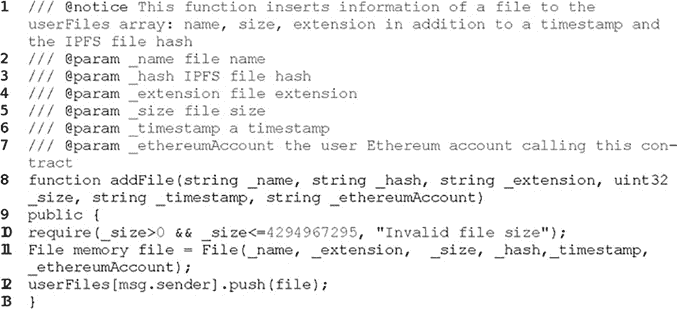

代码摘录 15.2 在 Files.sol 智能合约中添加文件信息

图 15.3 DFiles 文件上传示例

点击“上传文件”按钮后，文件将使用 crypto-js API、 ^([7](Ch15.xhtml#fn15_7)) 进行加密，用户的私钥将存储在中央服务器中。然后，用户必须接受使用智能合约的交易，并在本地以太坊区块链(Ganache)中存储有关文件的几个细节，如图[图 15.4](Ch15.xhtml#fig15_4) 所示。

天然气费用和总交易成本取决于天然气价格(在 GWEI)和预定义的天然气限额(这对评估部分很重要)。然后，该文件被发送到本地集中式 IPFS 节点，该节点返回包含加密文件的散列。之后，用户会看到一条成功获取其 URL 的消息，如图[图 15.5](Ch15.xhtml#fig15_5) 所示。

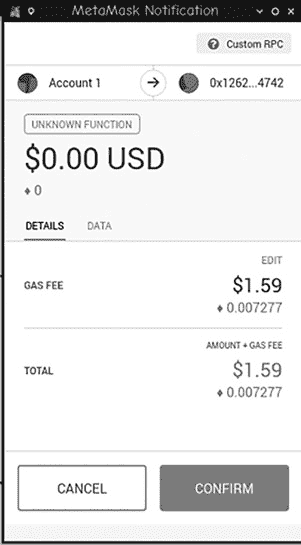

图 15.4 以太坊 MetaMask 交易提示

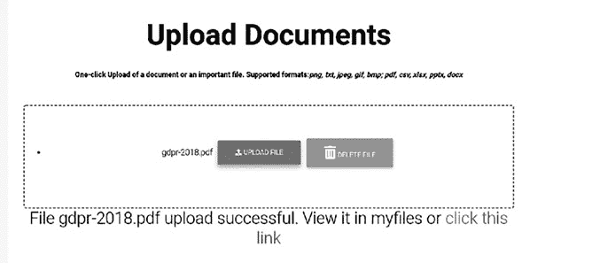

图 15.5 文档上传成功消息

点击链接后，用户会看到该文件，但是是以加密的形式出现的([图 15.6](Ch15.xhtml#fig15_6) )。

最后，可以浏览他的文件的详细信息，尽管这些信息没有加密([图 15.7](Ch15.xhtml#fig15_7) )。

图 15.6 文件加密示例

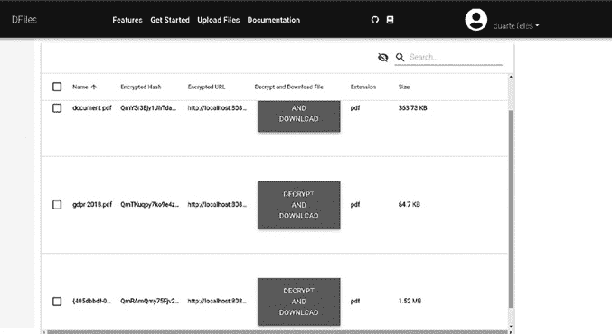

图 15.7 用户上传文件列表

一旦用户按下“解密和下载”，选定的文件被解密和下载。当用户调用 GDPR 擦除权限时，他的所有详细信息，包括用于加密文件的私钥，都将被删除。尽管进行了加密，但这些文件基本上仍在 IPFS 节点中。由于它们是不可访问的，因此可以认为它们与被删除是一样的。这样，不变性的问题就解决了。在下一节中，将进行统计分析，以了解这种方法是否可行。

### 估价

如前所述，GDPR 对确保 DApps 遵守它提出了重大挑战，主要是因为被遗忘的权利。在这一部分中，将执行统计分析，以了解在将个人数据(或文件)发送到 IPFS 节点之前对其进行加密是否可行。这样，只要节点为加密文件提供服务，加密文件就会一直存在，但第三方仍然无法访问其内容，这与文件删除是一样的。

在以太坊，有“气”的概念:

交易发送者需要为以太坊区块链上的每一个操作支付的执行费用。“天然气”这个名字的灵感来自于这样一种观点，即这种费用相当于一种加密燃料，推动着智能合约的发展。天然气是从执行代码的矿工那里购买的乙醚。

(以太坊基金会，2016 年)

与气体相关的有四个重要方面:

*   气限:一笔交易要支付的最大气价；
*   交易使用的天然气:交易消耗的天然气总量；
*   天然气价格:交易中规定的一单位天然气的价格(以乙醚计);和
*   总交易成本:用气量*气价。

开发了两个版本的数据文件 DApp:一个没有用户验证和文件加密，另一个同时具有用户验证和文件加密/解密。所有即将到来的统计数据都可以在 Bitbucket 上获得。 ^([8](Ch15.xhtml#fn15_8))

首先，我们随机选择了 100 个具有不同扩展名的文件:。pdf，。docx，。xlsx 和。pptx，尽管由于硬件限制不可能全部使用。然后，它们被分成四个不同的组:小型(1kb–1mb)、中型(1mb–20mb)、大型(20mb–200 MB)和超大(200 MB–2gb)。除此之外，对于相同的文件和两个版本的数据文件，从用户点击“上传文件”按钮、文件被发送到本地 IPFS 节点(加密的或未加密的)以及用户点击接受事务的按钮所经过的时间被测量，除了以太网中的总事务成本(由 MetaMask 提供；视气限和气价而定)。附录 A 显示了收集的部分数据。

但是，由于文件加密的硬件限制，下面的统计分析只考虑了最大 14.2 MB 的文件。仍然记录总的事务成本和上传耗时，以便在加密和未加密的文件之间进行总体比较。

#### 小文件

表 15.2 小文件描述性统计和比较测试

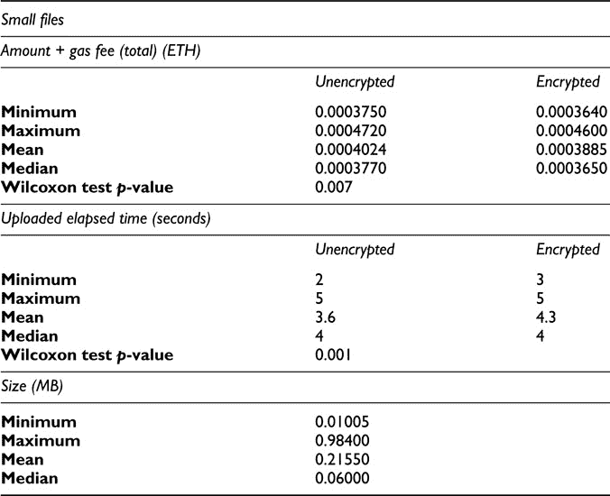

[表 15.2](Ch15.xhtml#table15_2) 显示了小型未加密和加密文件的描述性统计汇总，以及对它们进行比较的测试结果。完整的数据表见附录 C 。

*   金额+汽油费(总计):未加密和加密文件的分布都是右偏的，即大多数文件呈现小值(两个文件组中的 Fisher 偏态系数都是正的)。未加密和加密文件的平均数量分别为 0.0004024 ETH 和 0.0003885 ETH。最小值分别为 0.0003750 ETH 和 0.0003640 ETH 第一个四分位数分别为 0.0003760 ETH 和 0.0003640 ETH 中位数分别为 0.0003770 ETH 和 0.0003650 ETH 第三四分位数分别为 0.0004380 ETH 和 0.0004260 ETH 最大值分别为 0.0004720 ETH 和 0.0004600 ETH。因此，可以得出结论，在这两个组中，具有小值的文件占优势。这种浓度导致非常小的可变性，如变异系数所示(分别为 8.4%和 8.5%)。

为了比较两组的分布，首先用夏皮罗-维尔克检验对两个样本进行正态性检验(5%的显著性水平)。两组都强烈反对正态性(p 值< 0.001). Therefore, a comparison of both samples was based on the Wilcoxon test (paired samples) whose p-value is 0.007\. Therefore, the average amount + gas cost is larger for unencrypted files. [图 15.8](Ch15.xhtml#fig15_8) 清楚地显示了这一结论)。

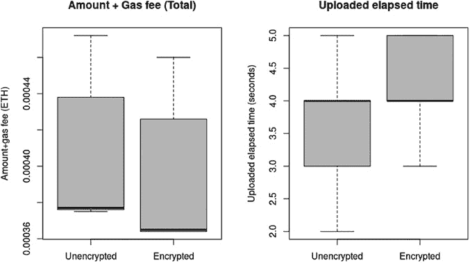

图 15.8 小文件盒图

*   上传的运行时间:未加密文件和加密文件的分布都稍微偏左，也就是说，大多数文件表现出中等和大的时间(两个文件组中的 Fisher 偏态系数都是负的)。未加密和加密文件的平均时间分别为 3.6 秒和 4.3 秒。最小值分别为 2 秒和 3 秒，第一个四分位数分别为 3 秒和 4 秒，中间值为两组的 4 秒，第三个四分位数分别为 4 秒和 5 秒，最大值为两组的 5 秒。因此，可以得出结论，在两组中，中等时间和大时间的文件占优势。如变异系数所示(分别为 25.7%和 15.8%)，这种浓度导致了较小的可变性。
*   夏皮罗-维尔克检验的结果显示，两组都强烈拒绝正态性(p 值分别为 0.003 和 0.0001)。Wilcoxon 测试的 p 值为 0.001，可以得出加密文件的时间更长的结论。[图 15.8](Ch15.xhtml#fig15_8) 清楚地表明了这个结论。

#### 中型文件

[表 15.3](Ch15.xhtml#table15_3) 显示了介质未加密和加密文件的描述性统计汇总，以及它们比较的测试结果。完整的数据表可在附录 D 中找到。

表 15.3 中等文件描述性统计和比较试验

*   金额+油费(合计):大多数未加密和加密的文件不是大就是小。未加密和加密文件的平均数量分别为 0.0004087 ETH 和 0.0003938 ETH。最小值分别为 0.0003750 ETH 和 0.0003630 ETH 第一个四分位数分别为 0.0003753 ETH 和 0.0003640 ETH 中位数分别为 0.0004225 ETH 和 0.0003805 ETH 第三个四分位数分别为 0.0004380 ETH 和 0.0004268 ETH 最大值分别为 0.0004400 ETH 和 0.0004280 ETH。如变异系数所示，可变性非常小(分别为 7.7%和 7.9%)。
*   夏皮罗-维尔克检验的结果表明，两组都强烈反对正态性(p 值< 0.001). The Wilcoxon test has a p-value of 0.0002 and it can be concluded that the average amount is larger for unencrypted files. [)图 15.9](Ch15.xhtml#fig15_9) 显示了该结论。
*   Uploaded elapsed time: The distributions are right-skewed for both unencrypted and encrypted files, i.e., most files exhibit small and moderate times (Fisher’s skewness coefficient is positive in both file groups). The average time is 6.3 seconds and 29.6 seconds for unencrypted and encrypted files, respectively. The minimum value is 5 seconds and 6 seconds, respectively; the first quartile is 6 seconds and 10 seconds, respectively; the median is 6 seconds and 19 seconds, respectively; the third quartile is 7 seconds and 50 seconds, respectively; and the maximum is 9 seconds and 69 seconds, respectively. Therefore, it can be concluded that files with small and moderate times are predominant in both groups. However, variability is small for unencrypted files and is large for encrypted files, as shown by the coefficient of variation (18.8 percent and 82.2 percent, respectively).

    

    图 15.9 中等文件的箱线图

*   夏皮罗-维尔克检验的结果显示，两组都强烈拒绝正态性(p 值分别为 0.019 和 0.002)。Wilcoxon 测试的 p 值为 0.0002，我们认为加密文件的平均时间更长。[图 15.9](Ch15.xhtml#fig15_9) 清楚地表明了这个结论。
*   大小:这种分布是右偏的，也就是说，大多数文件显示出较小和中等的大小(Fisher 的偏度系数为正)。平均大小为 6.5 MB。最小大小为 1.2 MB，第一个四分位数为 3 MB，中间值为 5 MB，第三个四分位数为 12 MB，最大值为 14.2 MB。因此，可以得出结论，小型和中型文件占主导地位，但一些文件的大小要大得多，这导致了很高的可变性，如变异系数所示(72.3%)。

### 评估结论

对大小不超过 14.2 MB 的中小型文件执行的统计分析显示，未加密文件的平均总事务成本略高。然而，正如所料，加密文件的平均上传时间更长。对于中型文件，未加密文件的平均总事务成本也略高，加密文件的平均上传时间更长。

除此之外，如果比较附录 A 和 B 中所有类别(小、中、大和特大)的加密和未加密值的最后记录值，可以清楚地看出，800 MB 以下文件的最后两次文件加密时间小于 14.2 MB 以下加密文件的上传耗时。

结论是，对文件进行加密以遵守擦除权，对于 14.2 MB 以下的中小型文件来说是一个很有价值的选择。在不考虑硬件加密限制的情况下，上传时间会呈指数级增长。由于这个原因，从 2018 年底开始，加密中型到超大文件是不可行的。

但是，请注意，加密数据文件中的所有文件可能没有必要，因为有些文件只包含无法与特定个人联系起来的数据，因此不被视为个人数据。用户可以选择是否加密他的文件，无论它们是否包含个人数据。这样做的问题是，用户并不总是诚实的，这样他们可能会上传敏感文件——包含某人个人数据的文件——这些文件可以在 GDPR 范围内公开获取。他们还可能诉诸敲诈——因为 DFiles 中的数据是不可变的——通过故意上传某人的个人数据，然后索要金钱，以换取他们在告诉负责为 GDPR 违规申请罚款的当局时保持沉默。因此，尽管文件加密在 IPFS 和以太坊中耗时且有限，但对于防止这些情况和避免将可能的数据泄露传达给适当的 GDPR 当局是必要的。

正如已经讨论过的，区块链技术通常有一个非常独特和重要的特征:不变性。这确保了它对几家大公司打击欺诈和拥有不可修改的交易记录的吸引力。

因此，以太坊和 IPFS 必须前进，以允许更好的隐私技术，除非欧盟起草并通过法律，豁免 DApps 遵守 GDPR 中非常难以遵守的部分，如擦除权。

## 局限性和未来工作

以太坊显然是一项激动人心且不断发展的技术。然而，有几个限制对作者的工作产生了重大影响。例如，与环路签订智能合同的高额天然气成本阻碍了其在 DFiles 核心智能合同中的采用。此外，缺少对 JSON 对象的支持也是需要考虑的一个主要方面，因为如果不使用结构，而是使用标准的 JSON 对象，Solidity 中的智能合约可能会更有效。最重要的是，IPFS 要让 DApps 成为主流显然还有很长的路要走。首先，它有一个越来越大的存储非常大的文件的问题，如 DFiles 所示。如果需要加密，那么最大文件大小可能要小得多。事实证明，由于硬件限制以及以太坊和 IPFS 的当前状态，加密只能用于中小型文件。以太坊、IPFS 和数据保护技术将在未来显著发展，这将在理论上允许更好的加密技术或其他隐私技术，从而为未来需要数据隐私和保护的 DApps 带来光明。

如前所述，DFiles 旨在证明通过加密个人数据，是否可以实现 GDPR 合规性。然而，这种方法还存在其他问题，例如以前被证明高度安全的弱加密算法。这些例子包括 MD5 和 SHA1(开放网络应用安全项目(OWASP)，2018)。出于这个原因，在被另一种更安全的算法取代之前，最受欢迎的区块链中使用的算法有一点可能在短时间内过时——在这种情况下，数据很容易被解密。

除此之外，量子计算可能很快成为现实，并且在相当长的一段时间内，在大多数区块链(如以太坊)中加密的所有数据以及通过 DApp 文件存储在 IPFS 中的所有加密文件都可以很容易地被解密。在作者看来，这是区块链科技在不久的将来面临的最大威胁。

至于将来在数据文件中的工作，可以使用 Infura ^([9](Ch15.xhtml#fn15_9)) 节点，而不是使用本地 IPFS 节点。这带来了几个优点，因为硬件限制被最小化，但是它带来了一系列新的问题，例如，存储在 Infura IPFS 节点中的文件没有被长期保存的动机。

另一个需要改进的方面是将 DFiles 智能合约部署到 Rinkeby 等测试网络，并更新 DFiles DApp 以使用这个部署的智能合约，而不是本地的 Ganache 私有以太坊区块链。早期部署已经完成，但还需要进一步的测试。智能合约可在 Rinkeby 测试网络中获得。^([10](Ch15.xhtml#fn15_10))

简而言之，在这一节中，讨论了 IPFS 和以太坊的局限性，包括 DFiles 未来的工作。然而，可以得出一些一般性结论:

*   IPFS 文件加密正处于起步阶段；因此，存在严重的硬件和技术限制，阻碍了它的大规模采用。
*   以太坊是一个公共账本，因此它几乎不提供隐私。唯一可能的方法是使用其他分散技术(如 IPFS)加密数据。以太坊也有很大的局限性——比如没有 JSON 支持，以及由于总交易成本高，不鼓励一些计算循环指令(例如 for，while)——这影响了它在世界范围内的应用。
*   出于遵守 GDPR 法规的目的对个人数据进行加密会受到严重限制，甚至不被鼓励。IPFS 和以太坊都应被视为 GDPR 的特例，以避免数据加密问题。

## 结论

在这一章中，首先介绍了最重要的 GDPR 概念，以及处理个人数据的若干法律依据和若干个人权利。它的擦除权干涉了区块链的不变性。除此之外，我们还讨论了这一权利能否得到遵守的三种情况，随后是以太坊 DApps 的 GDPR 合规指南。

为了测试这个指南，开发了一个案例研究:DFiles。这是一个以太坊 DApp，混合了集中和分散的技术，如以太坊和 IPFS。它的主要目标是了解以太坊(家园)DApps 是否能够遵守这一规定，以及通过加密来保护个人数据是否可行。

DFiles 还遵循区块链软件工程的原则，遵循软件开发生命周期，尽管是为 DApps 而调整的。除了简要介绍其核心特性之外，还解释了其核心智能合约，从实现的设计模式到主要的数据结构和功能。简而言之，DFiles 允许用户上传和查看他提交的文件。

然后进行了统计分析，以确定符合擦除权的加密的可行性，尽管由于硬件限制，只对一些文件进行了分析。DApp 有两种变体:一种有文件加密，另一种没有。上传的文件分为四类:小(1kb–1mb)、中(1mb–20mb)、大(20mb–200 MB)和超大(200 MB–2gb)。

然后在两个版本中测量 Ether 中的总交易成本加上用户点击上传按钮和上传之间的总运行时间。然后介绍其结论。简而言之，遵守 GDPR 及其擦除权仅适用于 14.2 MB 以下的加密文件。

最后，说明了案例研究的局限性及其今后的工作。

## 备注

## 参考

比特币项目。(2018).比特币——开源 p2p 货币。从 https://bitcoin.org/en/[取回](https://bitcoin.org)

康塞斯。(2018a)。加纳切。从 https://truffleframework.com/docs/ganache/overview[取回](https://truffleframework.com)

康塞斯。(2018 年 b)。元掩码。从 http://metamask.io/[取回](http://metamask.io)

德斯特法尼斯，g .，马切西，m .，奥图，m .，托内利，r .，布拉恰利，a .，希龙，r .，2018。智能合同漏洞:区块链软件工程的呼唤？面向区块链的软件工程(IWBOSE)，国际研讨会。坎波巴索:IEEE。

以太坊基金会。(2014).面向合约的编程语言。从 https://github.com/ethereum/solidity[取回](https://github.com)

以太坊基金会。(2016).账户类型、天然气和交易。检索自[www . eth docs . org/en/latest/contracts-and-transactions/account-types-gas-and-transactions . html](http://www.ethdocs.org)以太坊基金会。(2018).以太坊区块链应用平台。从 www.ethereum.org/[取回](http://www.ethereum.org)

符合欧盟 GDPR 标准。(2018).什么是数据主题？从 https://eugdprcompliant.com/what-is-data-subject/[取回](https://eugdprcompliant.com)

欧洲数据保护主管。(2018).通用数据保护条例的历史。检索自[https://edps . Europa . eu/data-protection/data-protection/legislation/history-general-data-protection-regulation _ en](https://edps.europa.eu)

欧洲联盟。(2016).欧洲议会和理事会 2016 年 4 月 27 日关于在处理个人数据和此类数据自由流动方面保护自然人的第(EU) 2016/679 号条例。欧盟官方杂志，1–88。

s . Falk on(2017 年 12 月 24 日)。道的故事-它的历史和后果。检索自[https://medium . com/swlh/the-story of-the-the-story of-the-Dao-history-and-results-71e 6a 8 a 551 ee](https://medium.com)

ICO。(2018 年 8 月 2 日)。通用数据保护条例指南(GDPR)。检索自[https://ico . org . uk/media/for-organizations/guide-to-the-general-data-protection-regulation-gdpr-1-0 . pdf](https://ico.org.uk)

奇偶校验技术。(2017 年 7 月 20 日)。多重签名黑客:事后分析。从 https://paritytech.io/the-multi-sig-hack-a-postmortem/[取回](https://paritytech.io)

彼得罗夫，S. (2017 年 11 月 7 日)。另一个平价钱包黑客解释说。检索自[https://medium . com/@ pr 0 ger/another-parity-wallet-hack-explained-847 ca 46 a2 E1 c](https://medium.com)

协议实验室。(2018).IPFS 是分布式网络。从 https://ipfs.io/[取回](https://ipfs.io)

萨博，N. (1996 年)。智能合约:数字市场的基石。检索自[www . fon . hum . UVA . nl/rob/Courses/information inspeech/CDROM/Literature/lot winter school 2006/Szabo . best . vwh . net/smart _ contracts _ 2 . html](http://www.fon.hum.uva.nl)

## 附录 A
DFiles 加密上传文件统计数据

表 15.4 小文件(1kb–1mb)

表 15.5 中等文件(1mb–20mb)

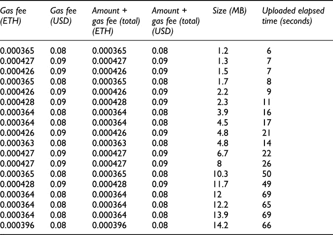

## 附录 B
DFiles 未加密上传文件统计数据

表 15.6 小文件(1kb–1mb)

表 15.7 中等文件(1mb–20MB)

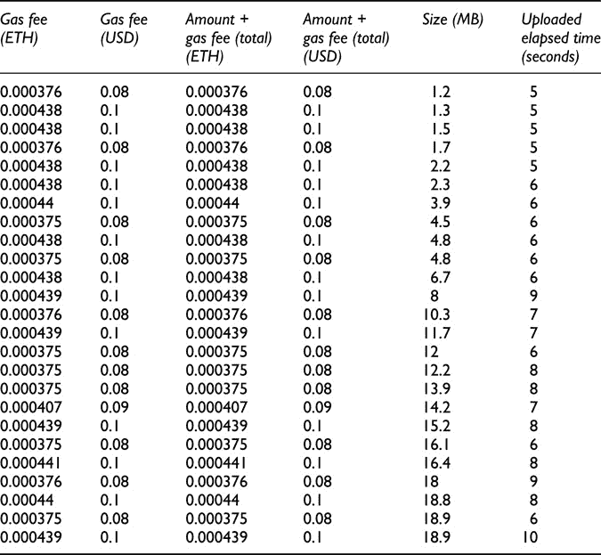

表 15.8 大文件(20MB–200 MB)

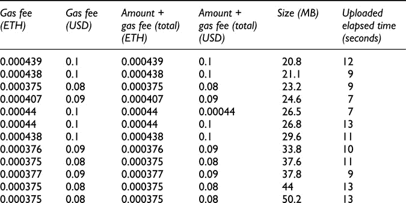

表 15.9 超大文件(200 MB–2gb)

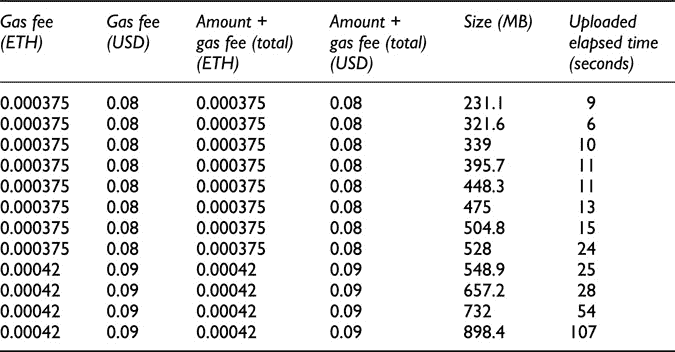

## 附录 C
描述性分析和比较小文件

表 15.10 金额+燃气费(合计)(ETH)

表 15.11 上传运行时间(秒)

表 15.12 大小(MB)

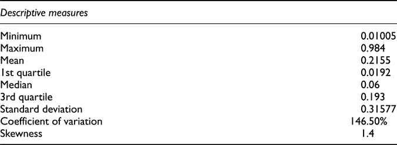

## 附录 D
描述性分析和比较介质文件

表 15.13 金额+燃气费(合计)(ETH)

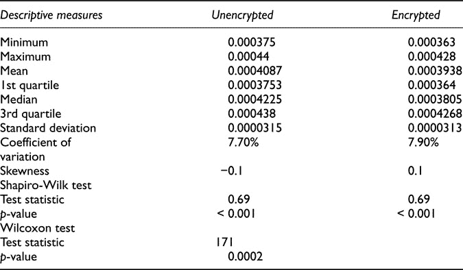

表 15.14 上传运行时间(秒)

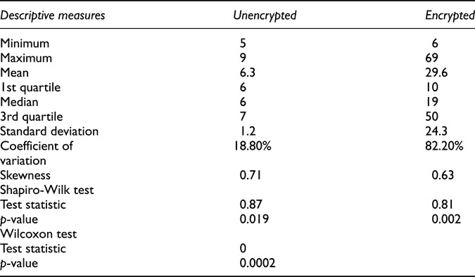

表 15.15 大小(MB)

