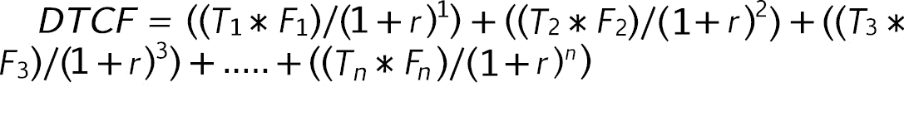
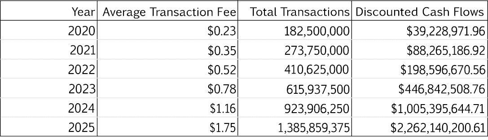

## 十一、定量模型&度量——投影误差

*“关注体重、高尔夫分数和燃料账单的人似乎回避对他们的投资管理技能进行量化评估，尽管这涉及到世界上最重要的客户——他们自己。”*

—沃伦·巴菲特

数字可能很吓人。

冷。

计算出来的。

没有感情。

“事实不在乎你的感受”，定量分析也不在乎。幸运的是，我们有*选项。没有完美的模型。每个模型都有缺陷。关键是找到一个与现实相当吻合的模型，这样当当前的现实与我们知道的真实情况脱节时，我们就可以把它说出来。 [233](CarterLeeWoetzel_019_ebook-14.xhtml#footnote-247) 下注。直视市场，说“你高估了这项投资”或“你没有考虑这条信息。”*

这一章的目标是检查那些重要的数字。定量测量让我们能够将区块链相互比较，并对未来做出预测和规划。虽然其中一些部分似乎是数学密集型的，但所有这些模型都可以通过在网上搜索“CarterLWoetzel GitHub”公开获得——你不必从头开始制作这些模型。本章每一节的目的有两个:解释每一个模型的底层逻辑，并给出每一个模型的简单实例。这将取决于你利用我的 GitHub 上提供的资源，以及寻找其他存在于野外的模型。

在我看来，有两种模式:传统模式和弱模式。传统模型根据股票或债券等资产所有者获得的股息生成目标价格。弱模型用于估计不产生股息的投资的价值。在加密货币领域，股息并不常见。随着许多区块链转向“利益证明”共识模式，这种情况正在发生变化，这种模式为那些“赌”自己的密码以确保网络安全的人提供了红利。 [235](CarterLeeWoetzel_019_ebook-14.xhtml#footnote-245) 目前，弱模型对于加密货币价格预测来说更常见、更容易获得。无论如何，我们将提出各种各样的模型——其中许多被人瞧不起，而其他的则被广泛接受。

#### **比较指标**

您正在比较两种区块链，试图找出哪种加密货币更有价值。你如何从数量上判断哪个区块链更有价值？

**图 16:比较指标**

如前所述，Coinmetrics 和区块链图表公开了所有这些数据。营销和公关都躲不过这些不同加密货币之间的量化对比。节点数量尤其重要，因为网络越分散，网络就越安全，不会受到 51%的攻击、审查和网络停机。如果一个区块链网络在所有这些指标上都做得更好，但价值低于另一个区块链，这是一个强烈的信号，表明它被低估了。[第 236 章](CarterLeeWoetzel_019_ebook-14.xhtml#footnote-244)

#### **净值市值模型**

Daniel Sangyoon Kim 创建的“净值市值模型”是基于这样一种假设，即在不久的将来，加密将成为每个美国富人投资组合的一部分。 [237](CarterLeeWoetzel_019_ebook-14.xhtml#footnote-243) 这个弱模型不是基于股息，而是基于加密货币作为资产类别的相关性的定性预测。

**图 17:网络资本化模型**

下面是一个使用比特币的简单例子:

预计 0.025%的美国投资组合(收入最高的 1%)将投资于加密货币

前 1%的 130 万个家庭拥有 11 万亿美元

比特币占加密货币总市值的 50%

2100 万比特币在流通

比特币的当前价格为 5200 美元

预计比特币市值= 11 万亿美元* 0.025% 50% = 1375 亿美元

预计比特币价格= 1375 亿美元/2100 万比特币= 6547 美元

预计比特币价格 6547 美元>当前比特币价格 5200 美元

因为预计价值大于当前价格，所以这个定量模型给你的目标销售价格是 6，547 美元(21%的投资回报率)。Multicoin Capital 的凯尔·萨马尼(Kyle Samani)提出了一个预测的 50-100 万亿美元净资产投资案例，这些案例基于比特币的使用案例，如数字黄金、比特币降低各种资产的货币溢价、比特币作为离岸银行账户的替代品、比特币作为保护世界资产的手段以及比特币网络上促进的新经济活动。 [238](CarterLeeWoetzel_019_ebook-14.xhtml#footnote-242)

我希望这种模型的预测误差是明显的。然而，这个模型有一定的道理:未来一定数量的人会将一定数量的资本投资于加密货币这一资产类别。每种加密货币都拥有一定数量的加密领域市场份额，因此，根据投入该资产类别的总资本，每种加密货币的价格将基于其各自的市场份额。如果你能大致准确地预测这些数字在未来会是什么样子，你现在就可以定量地做出决定——虽然很容易出错，但还是有点帮助的。

#### **行业偷梁换柱模式**

我创建的一个弱模型建立在这样一个想法上，即基于区块链支持的用例，区块链及其相应的加密货币将吞噬一定数量的市场份额。这种模式的好处在于，它创造了一个合理的估值上限或下限。

以加密货币 NEO 为例，它的目标是成为一种点对点数字货币，旨在实现低廉的费用和比以太坊更好的智能合约设计。 [239](CarterLeeWoetzel_019_ebook-14.xhtml#footnote-241) 因为新区块链很大程度上专注于交易便利化，我们可以公平地将其与 PayPal 等公司进行比较。

NEO 每天大约有 18000 次交易。相比之下，贝宝每天有 500 万笔交易。 [241](CarterLeeWoetzel_019_ebook-14.xhtml#footnote-239) 我们将根据 NEO 的交易额与 PayPal 的交易额之比，即 18，000/5，000，000 = 0.36%，来计算 NEO 对 PayPal 市值的“窃取”。假设 NEO 用(被盗市值* m)/ƈ取 PayPal 市值(cap)的 0.36%，其中 m 等于 PayPal 的市值(1820.2 亿美元)，ƈ是 NEO 的流通量，我们得出以下价格:

**预计新币价格=(0.0036 * 182，010，000，000 美元(PayPal 市值)/(100，000，000 新币发行量)= $6.55**

与 NEO 目前 9.55 美元的价格相比，这个模型突然开始给我们一些像样的清晰度。也许市场份额用例而不是交易便利化解释了这种差异。在未来，如果 NEO 以 20 美元的价格出售，但每天仍然只能产生 18000 笔交易，我们可以肯定地说，我们有定量证据表明市场已经偏离了现实。如果市场对 NEO 的估值大幅增加，而采用率(日常交易)没有任何增加，那么我们假设没有新的定性信息来证明价格上涨，对当前 NEO 价格进行对冲。

PayPal 更可靠的估值可以作为一面朦胧的镜子，用来评估主要专注于交易的不同加密货币。同样的过程可以应用于区块链，通过创建一个基于可靠的公开交易股票的量化指标来影响其他特定行业。

请注意，同样的模型可用于进行预测——如果未来的采用将使 NEO 的总交易量增加到每天 8 万笔，那么基础估值突然需要反映采用量的增加。虽然传统模型基于许多未来现金流的增长，但加密货币的弱模型将交易作为基本构建模块。

#### **可比代币模型**

安永在 2019 年发布了“加密资产的估值”。 [242](CarterLeeWoetzel_019_ebook-14.xhtml#footnote-238) 在本初级读本中，描述了可比代币模型:

*“考虑最近可比较 ico 中实现的代币市值，作为已发行主题代币总价值的代表，类似于早期公司融资风险投资融资轮估值中采用的基准方法。”* [243](CarterLeeWoetzel_019_ebook-14.xhtml#footnote-237)

本质上，你需要了解你正在研究的主题加密货币的市值([coinmarketcap.com](http://coinmarketcap.com)是一个很好的网站)，与另一种加密货币进行市值比较，并提出以下问题:“根据我的定性风险分析和这两种区块链的定量指标，主题令牌相对于另一种类似的加密资产的定价是否恰当？”

对于区块链，可比令牌模型似乎是最有吸引力的模型之一，因为它比其他模型更重视你的定性研究。因此，尽管这和模型一样主观，但还是比什么都没有好。下面是使用这种策略的一个例子:

**图 18:可比令牌模型示例**

使用一个额外的简化记分卡，它应该包括前面列出的比较指标，但在本例中没有，我们检查定性风险分数。根据这个(虚构的)定性记分卡，由于风险的差异，TRON 的市值应该增加 10.64%，尽管市场目前没有以这种方式为相应的加密货币定价。虽然这是一个非常荒谬的定价模型，但令人惊讶的是，在估值的最早期阶段，有多少风险资本家(正如安永所提到的)在运作。

#### **贴现交易现金流模型**

区块链的投资价值是交易产生的总收入，分配给那些通过押注或开采所述区块链的加密货币来保护网络的人。收入被创造出来，并给予那些保证网络安全的人，每笔交易都附加到区块链账本上。每笔交易都由用户定价，但只有在矿商或利益相关者认为收取的费用与其成本(运营一个节点的电费、风险和目标回报率)相比是值得的情况下，才会执行。如果建议的用户费用是值得的，挖掘者/赌注者将交易添加到交易块，如果找到加密解决方案，该交易块将被附加到分类帐。

因此，赌注者(那些将他们的加密货币锁定在智能合约中以使用利益一致模型的证据来保护网络的人)或矿工(那些使用 PoW 模型花费电力来追加交易的人)是决定任何给定加密货币的基线价值的人。请注意，市场买家和卖家继续以特定价格交易，但因为矿工和赌注者是产生和接收加密货币以维持区块链的人，所以从长远来看，他们对任何加密货币的估值都比交易员**具有更大的影响力。**

采用区块链的人越多，执行的交易就越多。由于越来越多的人争取让他们的交易成为要追加到分类账的最新块的一部分，交易费用就越大。这是因为矿商和利益相关者可以达成更高的价格。所有这些都是经典的供求关系。

我的模型假设平均费用的增长与每年交易总量的增长成正比。这往往低估了平均费用的增长，因为需求的激增可能会非常不稳定，从而严重影响平均费用价格。随着时间的推移，总交易量和平均价格很可能会分离，因为区块链技术的创新旨在降低费用，这将增加区块链的总交易量，因为区块链的设计改进使交易和使用变得更便宜。

此外，**流通中的活跃货币**是用于其预期目的(智能合约和交易)的一组密码。矿商和利益相关者只关心给他们带来收入的活动的总体水平，因此很大程度上会忽略闲置的货币。对于较小的加密货币，流通中的活跃货币可能很难找到，因此，如果使用流通中的总货币，请注意对该模型的重大影响。

对于那些不熟悉传统贴现现金流模型的人来说，对未来现金流的现值做一些基础研究可能是值得的。我将暂时忽略这些基础知识，因为它们在各种课程和教科书中都有教授。我提出的贴现交易现金流模型(DTCF)如下:

**图 19:贴现交易现金流模型**

T =年度总交易数 *n*

F =年平均交易费 *n*

r =采矿者/打桩者目标回报率

每年，每年的总交易量和每年的平均交易费将以预计的总交易增长率增长。在对 *n 个预计时间段进行求和后，*总贴现现金流除以流通中的总活跃货币，得出预计目标价。请注意，该公式与贴现现金流模型相同，只是结构略有不同，以反映来自交易的收入以及矿工和股东的区块链费用。

**图 20、21: DTCF 模型数据**

7%的目标回报率是以太坊网络的既定目标，也是矿商在当前 PoW 共识模型下的大致回报率。从 2016 年到 2017 年，区块链以太坊的总交易量增长了 2500%。 [246](CarterLeeWoetzel_019_ebook-14.xhtml#footnote-234) 从 2018 年到 2019 年，这一增长率放缓至 65%。 [247](CarterLeeWoetzel_019_ebook-14.xhtml#footnote-233) 因此，我认为这个特殊的以太坊价格估值应该低估了每年仅 50%的增长率，以给出未来五年的现实图景。根据这个增长率，以太坊的价值可能会有很大的波动。总交易量每年 70%的增长率使得以太坊的每股“份额”价值为 732 美元，而目前的价格为 203 美元(撰写本文时)。此外，2020 年 0.23 美元的起始平均交易费也显著影响估值。

创建了这个模型之后，我可以自信地说它有很多错误。与所有投资模型一样，我们的目标是根据量化指标和未来增长预测，使用公开可用的信息来匹配资产的价值。

我希望你现在可以看到定量建模的艺术是多么的脆弱和混乱。随着区块链继续成熟，我希望我们会看到更好的模式出现。加密货币是货币、价值储存和数字燃料的奇怪混合体。它将为未来提供动力，这一点我很确定。

我们如何准确衡量它的价值？

这仍然是一个令人沮丧的复杂谜团，随着机构和散户投资者越来越多地采用加密货币，这个谜团将继续被打破。

* * *

[233](CarterLeeWoetzel_019_ebook-14.xhtml#footnote-247-backlink) “定量分析——定义、技术和应用”，*公司金融研究所*，2020 年 2 月 19 日。

[234](CarterLeeWoetzel_019_ebook-14.xhtml#footnote-246-backlink) 卡特·李·沃策尔，“卡特·沃策尔/建立对区块链的信心——下一步”，GitHub，2020 年 6 月 6 日。

[235](CarterLeeWoetzel_019_ebook-14.xhtml#footnote-245-backlink) 币安学院，“股权证明解释”，币安学院，2020 年 1 月 19 日。

[236](CarterLeeWoetzel_019_ebook-14.xhtml#footnote-244-backlink)Jeff Fawkes，“8 个最重要的加密货币指标”，Bitsonline，2019 年 2 月 1 日。

[237](CarterLeeWoetzel_019_ebook-14.xhtml#footnote-243-backlink)Daniel sang Yoon Kim，“比特币的基本价值为 45000 美元/ BTC”，Hacker Noon，2020 年 5 月 4 日。

[238](CarterLeeWoetzel_019_ebook-14.xhtml#footnote-242-backlink)lbid。

[239](CarterLeeWoetzel_019_ebook-14.xhtml#footnote-241-backlink)Shobhit Seth，“为什么 NEO 可以做其他加密货币做不到的事情”， *Investopedia* ，2020 年 1 月 29 日。

[240](CarterLeeWoetzel_019_ebook-14.xhtml#footnote-240-backlink) “图表”，货币指标，2020 年 6 月 4 日获取。

[241](CarterLeeWoetzel_019_ebook-14.xhtml#footnote-239-backlink)Leena Rao，“PayPal 现在每天处理 3.15 亿美元的付款”， *TechCrunch* ，2011 年 9 月 25 日。

[242](CarterLeeWoetzel_019_ebook-14.xhtml#footnote-238-backlink) 安永&扬，《加密资产的估值》，2019 年。

243lbid。

[244](CarterLeeWoetzel_019_ebook-14.xhtml#footnote-236-backlink) 《贴现现金流 DCF 公式——如何计算 NPV 指南》，*公司金融研究所，*2019 年 10 月 22 日。

[245](CarterLeeWoetzel_019_ebook-14.xhtml#footnote-235-backlink) 尼古拉·库兹涅佐夫，《以太坊 2.0 跑马圈地，解释说》，Cointelegraph (Cointelegraph，2020 年 5 月 25 日)。

[246](CarterLeeWoetzel_019_ebook-14.xhtml#footnote-234-backlink) “以太坊每日交易量:”YCharts，2020 年 6 月 4 日访问。

247lbid。

Sheba Karamat，“加密价格是如何确定的？——加密货币指南，《货币铆钉》，2019 年 3 月 23 日。